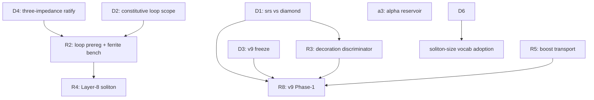

# Orchestration branch plan — post genesis mega-session (2026-06-11)

**Status:** ACTIVE plan doc (orchestration lane). **Main @ `0b4b9d5c`.** 0 open PRs.
**Companion:** [`index.md`](index.md) §2026-06-11 reconciliation · [`2026-06-11_session-handoff.md`](2026-06-11_session-handoff.md) · [`research/2026-06-11_next-step-fundamentality-plan.md`](../research/2026-06-11_next-step-fundamentality-plan.md).

> Every row below lands on its own `analysis/<date>-<slug>` branch + reviewed PR. No direct-to-main.

---

## Tier 0 — This orchestration session (in flight)

| Branch | PR target | Deliverable | Owner |
|---|---|---|---|
| `analysis/2026-06-11-index-reconciliation` | orch | Index §2026-06-11 reconciliation + this plan doc | Orchestrator (this session) |

**Merge gate:** Grant review (orchestration corpus only; no physics claims).

---

## Tier 1 — Grant adjudication (no branch until decided)

These are **calls**, not implementor sessions. Outcomes get recorded on an orch branch or in-session.

| ID | Decision | Unblocks | Recommended |
|---|---|---|---|
| **D1** | srs vs diamond lattice identity | R8 / v9 Phase-1 | Framing B first: decoration discriminator on Cosserat-decorated diamond |
| **D2** | Constitutive-loop scope for v10 | R2 framing | σ + rate-gated thixotropic snap |
| **D3** | v9 Phase-1 freeze (helicity amendments) | R8 prereg freeze | Ratify #195 §FREEZE-AMENDMENT-QUEUE |
| **D4** | Three-impedance law normative | All downstream sim language | Ratify #198 registry §3.11 |
| **D5** | χ_shock at snap onset | Sonic-horizon modeling | Pin engine line; standing convention |
| **D6** | Proton body A vs B (sub-node vs supra-node) | §43 STL + soliton-size canon | Grant physics call |
| **D7** | screened-winding-probe | — | Re-run coupled regime vs land-demoted |

---

## Tier 2 — Next implementor branches (spawn after Tier 1 where gated)

Ordered by fundamentality plan + dependency graph.

### R2 — Constitutive loop (highest leverage, cheap)

| Branch (proposed) | Entry doc | Deliverable | Gate |
|---|---|---|---|
| `analysis/2026-06-12-constitutive-loop-prereg` | fundamentality plan §0b | Ferrite B-H bench prereg + thixotropic kernel framing doc | **D2** (scope) |

**Does not need sim.** First deliverable is prereg + EE analogue, not engine code.

### R3 — Lattice decoration discriminator (cheap, high stakes)

| Branch (proposed) | Entry doc | Deliverable | Gate |
|---|---|---|---|
| `analysis/2026-06-12-lattice-decoration-discriminator` | lattice-net resolution + #195 Phase-0 smokes | Run writhe/enantiomorph discriminator; adjudication memo | **D1** (framing A vs B) |

**Spawn only after D1 framing picked** (or run as diagnostic under framing B).

### a3 — α reservoir partition (elevated risk, resumable)

| Branch | State | Deliverable | Gate |
|---|---|---|---|
| `origin/analysis/2026-06-11-alpha-a3-reservoir` | EXISTS on origin | a3 forward check; tombstone if miss | Resume workflow per handoff §1 |

**Rule:** if a3 misses → turns-ratio family **FULLY DEAD** (no a4).

### R4 — Layer-8 mₑ-free soliton

| Branch (proposed) | Deliverable | Gate |
|---|---|---|
| `analysis/2026-06-12-layer8-smallest-soliton` | Eigensolve + stability sweep without planted m_e | None (after R2/R3 if parallel pressure test clean) |

### R5 — Boost-covariant transport (expensive master-unblocker)

| Branch (proposed) | Deliverable | Gate |
|---|---|---|
| `analysis/2026-06-12-boost-covariant-transport` | Core integrator capability | Grant greenlight (multi-session, expensive) |

Unblocks: moving-defect double-slit, annihilation re-run, collision dynamics.

### R8 — v9 Phase-1 genesis

| Branch | State | Deliverable | Gate |
|---|---|---|---|
| `analysis/2026-06-11-genesis-v9-chiral-lattice` | Phase-0 landed on main; branch deleted | Phase-1 prereg freeze + genesis run | **D1 + D3** (hard) |

**Parallel-pressure-test:** do NOT spawn until D1 adjudicated.

---

## Tier 3 — Corpus hygiene branches (batchable)

| Branch (proposed) | Deliverable | Notes |
|---|---|---|
| `analysis/2026-06-12-soliton-size-vocab-adoption` | κ_share + r_env canonical leaf | Gated on Grant review of §47 14 terms |
| `analysis/2026-06-12-r-opt-kappa-share-walkback` | 14 surfaced sites from epic §42 | Pair with vocab adoption |
| `analysis/2026-06-12-alpha-comment-stale-fix` | `constants.py:205` α-comment drift | Trivial; from #198 |
| `analysis/2026-06-12-worktree-prune` | Prune stale local `analysis/*` [gone] branches | Hygiene only |

---

## Tier 4 — Experimental hardware (parallel, Grant manual)

| Workstream | Doc | Gate |
|---|---|---|
| C15 Cleave Phase 1b KiCad | [`experimental/c15-cleave-01/exp-c15-cleave-01.md`](experimental/c15-cleave-01/exp-c15-cleave-01.md) | Grant manual GUI |
| A1-HOPF Phase 0b fab | [`experimental/a1-hopf/exp-a1-hopf.md`](experimental/a1-hopf/exp-a1-hopf.md) | Grant EXEC |
| cRIO bench | `research/` prereg from #181 | Lab schedule |

---

## Tier 5 — Resumable scouts (existing branches)

| Branch | Resume | Blocker |
|---|---|---|
| `analysis/2026-06-11-fbd-v2-bubble` | Edit: column-not-bubble re-scope, then `wf_a1a5eed9-3b4` | Orchestrator edit first |
| `analysis/2026-06-11-chiral-angle-of-attack` | `wf_bcf29b1b-2bf` | — |
| `analysis/2026-06-11-screened-winding-probe` | Grant D7 | Panel refuted headline |

---

## Dependency graph

---

## Session sequencing (recommended)

**Orchestration session 1 (now):** merge index-reconciliation PR → Grant calls D1/D2/D4 in one sitting.

**Implementor session 2 (parallel-safe after D2/D4):** R2 constitutive-loop prereg.

**Implementor session 3 (after D1):** R3 discriminator OR resume a3 (Grant picks which fires first).

**Implementor session 4+:** R4/R5/R8 per fundamentality plan; never R8 before D1.

---

## Discipline reminders

- Audit-tag implementor tip **before** branch delete (`audit/2026-06-12_<slug>`).
- Spawn with `isolation: "worktree"`; `git branch --show-current` before every orch commit.
- Pure-AVE-corpus: no external-context in tracked files.
