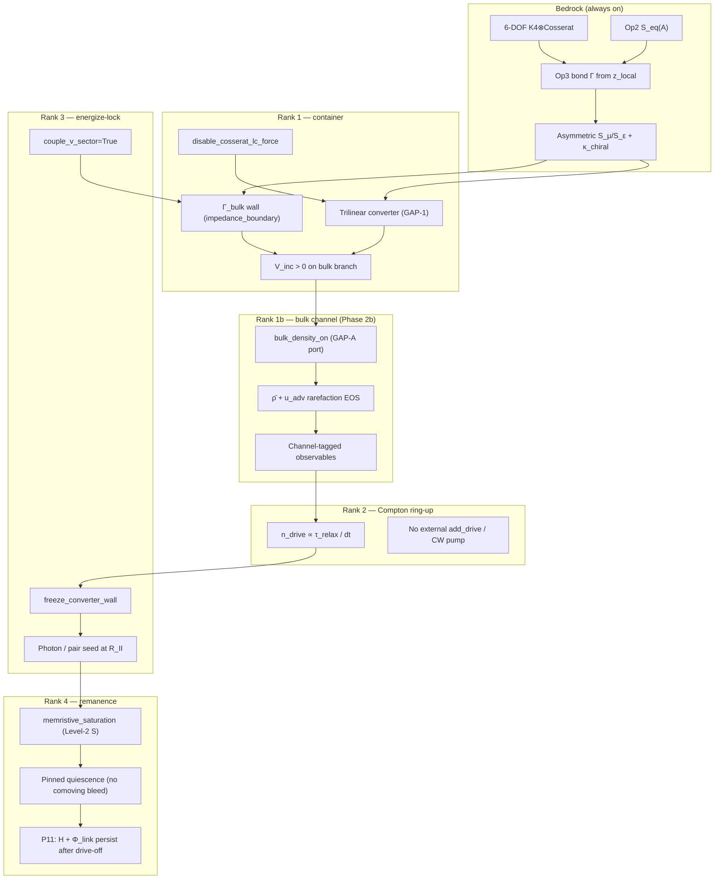

# LOOP GAP — engine capability DAG

**Status:** LIVE — **loop-gap-platform manifest** for K4⊗Cosserat electron closure (the loop-gap harness capability graph; its Platform-rule table names only CoupledK4Cosserat / VacuumEngine3D + frozen srs). The **whole-engine** manifest is [`manuscript/ave-kb/common/engine-capability-map.md`](../manuscript/ave-kb/common/engine-capability-map.md) — the N-engine home. (Two homes with the same "capability manifest" label was a drift generator; this re-scope disambiguates: DAG = loop-gap platform, map = whole engine.)  
**Physics order:** [`manuscript/ave-kb/common/loop-gap-electron-resonator-closure-doctrine.md`](../manuscript/ave-kb/common/loop-gap-electron-resonator-closure-doctrine.md) §2  
**Harness:** `src/ave/core/loop_gap_harness.py` + `src/scripts/vol_1_foundations/loop_gap_harness_genesis.py`  
**Epic log:** [`2026-06-12_loop-gap-unified-harness.md`](2026-06-12_loop-gap-unified-harness.md)

---

## Platform rule (2026-06-12 pivot)

| Platform | Status | Use |
|:---|:---|:---|
| **CoupledK4Cosserat** via **VacuumEngine3D** | **ACTIVE** | All rank-1–4 closure work |
| Discrete **srs** `chiral_lattice_v{9..17}` | **FROZEN** | Falsifiers only; no new srs engines |

**Do not** open `chiral_lattice_v19.py` or new per-version genesis engines. Advance **ranks** on the unified harness.

---

## Capability DAG (prerequisites)

---

## Rank → EngineConfig flags

Cumulative: rank *N* enables all flags for ranks ≤ *N*.

| Flag | R1 | R2 | R3 | R4 | Falsified / retired |
|:---|:---:|:---:|:---:|:---:|:---|
| `use_asymmetric_saturation` | ✓ | ✓ | ✓ | ✓ | symmetric legacy |
| `op3_bond_reflection` (K4) | ✓ | ✓ | ✓ | ✓ | — |
| `disable_cosserat_lc_force` | ✓ | ✓ | ✓ | ✓ | `use_lagrangian_emf_coupling` (runaway) |
| `use_trilinear_converter` | ✓ | ✓ | ✓ | ✓ | srs `add_drive` |
| `use_impedance_boundary` | ✓ | ✓ | ✓ | ✓ | srs Op3 stiffening on T2 |
| `couple_v_sector` | ✓ | ✓ | ✓ | ✓ | decoupled wall (ablation only) |
| `converter_freeze_wall()` post-seed | ✓ | ✓ | ✓ | ✓ | live `g_wall` during quiescence |
| Compton `n_drive_mult` sweep | — | ✓ | ✓ | ✓ | arbitrary packet length |
| `use_memristive_saturation` | — | — | — | ✓ | instant Op14 for P11 claim |
| External `Source` injectors | — | — | **✗** | **✗** | CW / pump (genesis-24 falsified) |
| `seed_mode` (`loop_gap_seeds.py`) | pair | photon_lock | photon_lock / graded_a0 | same | uniform IC without ∇A |
| `bulk_density_on` (GAP-A) | — | opt-in | opt-in | opt-in | **Default False** (KEEP-BOTH); prereg `research/2026-06-12_loop-gap-harness-bulk-channel_prereg_DRAFT.md` |
| `snap_on` / GAP-C couplings | — | **✗** | **✗** | **✗** | genesis-v5 D1 / Increment C — separate prereg |

**Seed modes:** `pair` (v15b) | `photon_lock` (genesis-23 `A_LOCK` ω precursor) | `graded_a0` (∇A₀ tanh ramp toward buffered yield). **Impedance gradient = ∇A strain, not node density.**

**Rank 1b rule:** `use_impedance_boundary` is a **Γ proxy** (CP10 boundary). `bulk_density_on` adds **dynamical** $\bar\rho$ (CP9). Rank-1 PASS with bulk enabled must cite **bulk-tagged** reads — not EM $S_{11}$ at $Z_0$ alone (doctrine §3 fool mode #4).

Impedance defaults (genesis-23): `impedance_clamp_strength=60`, `impedance_cfl_safety=0.25`, `impedance_implicit=True`.

---

## Rank → observables (do not conflate channels)

| Rank | Primary reads | Wrong read (retired) |
|:---:|:---|:---|
| **1** | `max|V_inc|`, `gamma_min`, `max_A_sq_total` | srs transverse peak / `S_11` at Z₀ |
| **1b** | `min(rho_bar)`, `min(c_bulk2)`, `max|ω|`, `max_tau_zx` + **channel tag** on PASS | proxy `gamma_min` without bulk read / EM-only promotion |
| **2** | drive duration vs `τ_relax`, `H` at drive-off | fixed 50-step srs scatter |
| **3** | `Σ|Φ_link|²`, `ρ_cross` at saturation front, `H_couple` | `e_end/e_driveoff` on transverse only |
| **4** | `H` persist, `Φ_link` persist, `S_field` Δ, P11 gate | CVR-SET under continuing drive |

Instrument via `ObservableBattery` + harness `snapshot_rank()` — not ad-hoc per-version metrics.

---

## Mandatory ablation arms (every battery)

| Arm | Knob | Isolates |
|:---|:---|:---|
| `converter_OFF` | `use_trilinear_converter=False` | GAP-1 energize path |
| `impedance_OFF` | `use_impedance_boundary=False` | Γ_bulk wall |
| `memristive_OFF` | `use_memristive_saturation=False` | Level-2 lag (rank 4) |
| `heal` | zero seed | false-positive nucleation |
| `bulk_OFF` | `bulk_density_on=False` | GAP-A $\bar\rho$ dynamics |
| `bulk_ON_impedance_OFF` | bulk on, wall off | bulk vs impedance proxy |

**Prereg (DRAFT):** [`research/2026-06-12_loop-gap-harness-bulk-channel_prereg_DRAFT.md`](../research/2026-06-12_loop-gap-harness-bulk-channel_prereg_DRAFT.md)

---

## Verdict bins (harness-level)

| Bin | Condition |
|:---|:---|
| `REMANENCE-LANDED` | P11 PASS at rank 4 profile |
| `OPERATOR-SET-ONLY` | Ranks 1–3 gates PASS; P11 FAIL |
| `GAMMA-SET-ONLY` | V_inc + partial wall; Γ gate FAIL |
| `PARTIAL` | V_inc only |
| `ENGINE-GAP` | heal ≈ on |

---

## Anti-patterns (meta-effort guards)

1. **New version file** (`chiral_lattice_v{N}`) without DAG rank advance → reject  
2. **srs platform** for ranks 3–4 → cite frozen falsifiers only  
3. **New gate ID** (P19…) without doctrine §2 rank mapping → reject  
4. **Direct CoupledK4Cosserat driver** bypassing harness → migrate to `loop_gap_harness.py`  
5. **Production JSON** without ablation block → incomplete battery
