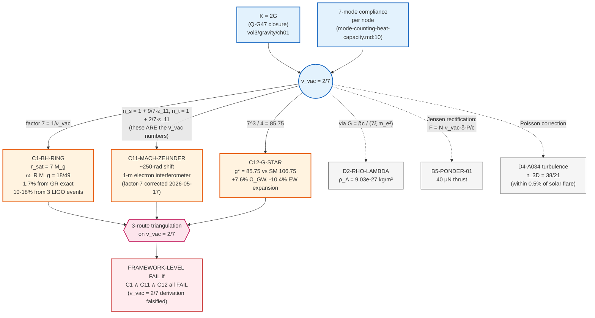
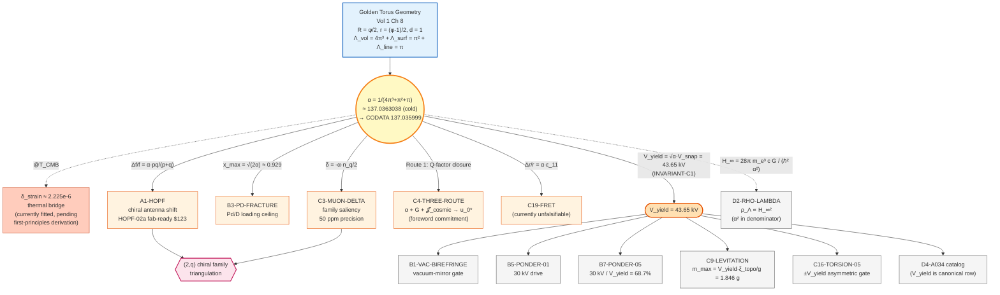
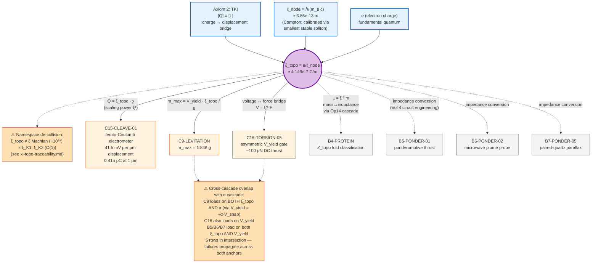
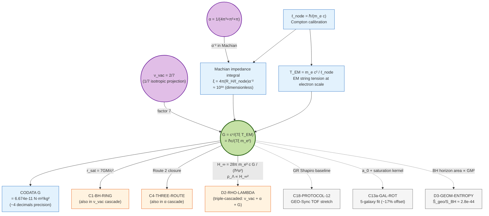
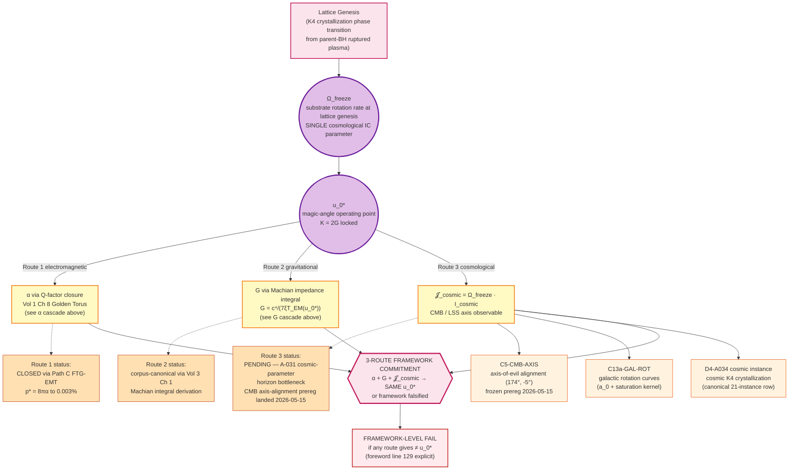
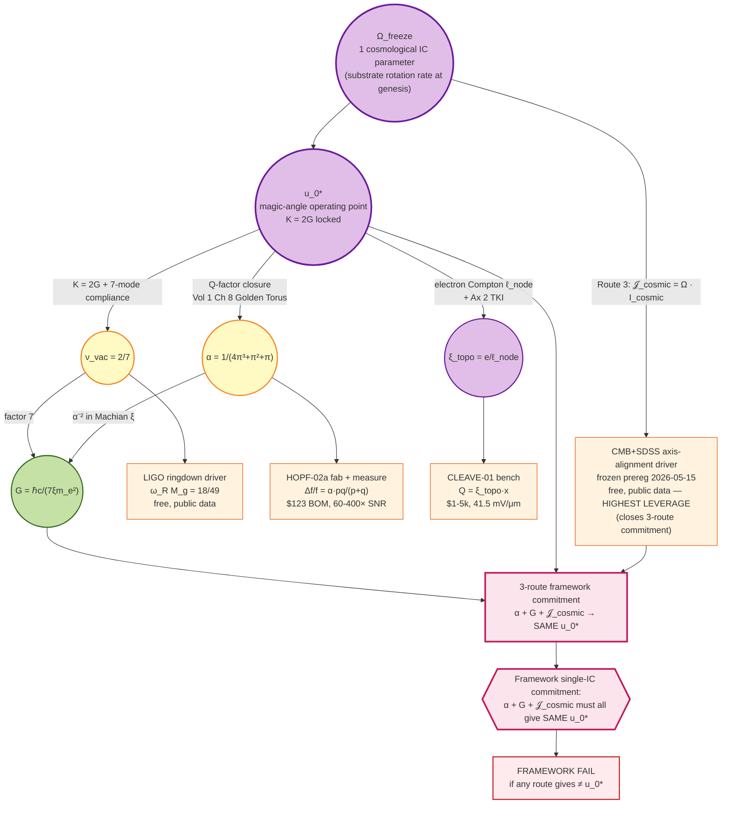

[↑ Common Resources](index.md)
<!-- leaf: verbatim -->

# AVE Divergences from Standard Physics — Test Substrate Map

> **Related KB layers:** This leaf is the *operational tracking layer* over the canonical narrative catalog at [`appendix-experiments.md`](appendix-experiments.md) (PATH-STABLE, referenced from vol1-5,7,8 as `app:unified_experiments`) and the per-project bench-design leaves at [`../vol4/falsification/ch11-experimental-bench-falsification/`](../vol4/falsification/ch11-experimental-bench-falsification/index.md). Read the catalog for narrative descriptions organized by Volume; read the per-project leaves for bench specs + BOMs; read this map for falsification logic, lifecycle status, axiom-impact severity, and sibling-repo substrate.

This leaf catalogues every AVE-distinct prediction that diverges from Standard Model + General Relativity + $\Lambda$CDM, mapped to the actual hardware, simulation, or data substrate where the test would run. Anchored to the foreword's "Epistemic Position" + "Falsifiable Standard" + "Three-Route Framework Commitment" sections ([`../../frontmatter/00_foreword.tex` lines 104-149](../../frontmatter/00_foreword.tex)).

**Two definitions of "test":** a test is either (a) a new experiment to be run on hardware, or (b) a re-analysis of existing public data. Both count as falsifiers. Each row below tags `Test type:` accordingly.

**Tier definitions:**
- **Tier A** — physical hardware exists (built or fab-ready ≤ $1k BOM)
- **Tier B** — simulation/analysis substrate exists in the workspace; physical hardware does not
- **Tier C** — Core-internal derivation only; no executable observer anywhere in the 9 AVE repos
- **Tier D** — structural-internal consistency wins (cross-scale unification); not field-falsifiable by single experiment

---

## Tier A — Hardware substrate exists

### A1. Chiral antenna resonance shift $\Delta f / f = \alpha \cdot pq / (p+q)$ (Project HOPF-02 / Topological Refraction Snell Parallax)

- **AVE predicts:** torus-knot family $(2,3)/(2,5)/(3,5)/(3,7)/(3,11)$ each have distinct sub-percent resonance shifts on chiral antennas. Per-pair NEC2: $\Delta = -7.92$ / $-11.91$ / $-55.29$ MHz for k25 / k23 / k35.
- **Standard predicts:** no chirality-coupled shift; resonance set by geometric length alone.
- **Discriminator:** enantiomer-paired antenna measurement at **60-400$\times$ margin over noise floor**. A null result (no enantiomer-pair-differential shift) falsifies the torus-knot identification of particles.
- **Test type:** new experiment.
- **Substrate:** **HOPF-02a fab-ready, $123 BOM** at `AVE-HOPF/hardware/hopf_02a.kicad_pcb`. Predictions in `AVE-HOPF/docs/SESSION_STATE_2026-05-05.md:21`. HOPF-01 pilot built but confounded per `AVE-HOPF/.agents/HANDOFF.md:43` (varying $L_{wire}$, no enantiomer pair, single substrate).
- **KB anchors:** [`../vol4/falsification/ch12-falsifiable-predictions/index.md`](../vol4/falsification/ch12-falsifiable-predictions/index.md); foreword line 96 (electron $0_1$, proton $(2,5)$, $\Delta(1232)$ $(2,7)$ ladder).

### A2. Sagnac as fluid-dynamic impedance drag (Project ROENTGEN-03 / Sagnac-RLVE)

- **AVE predicts:** $\Delta\phi \approx 2.07$ rad for a tungsten rotor, 10k RPM, 200m fiber loop; ratio $\Psi = \rho_W / \rho_{Al} \approx 7.15$ between rotor materials.
- **Standard predicts:** GR Lense-Thirring frame-drag is purely geometric and matter-density-independent — theoretical null $\sim 10^{-20}$ rad at this scale. SR Sagnac is $\Delta\Phi = 4A\Omega/(\lambda c)$ regardless of rotor mass.
- **Discriminator:** $\Psi \approx 1$ falsifies AVE; $\Psi \approx 7.15$ falsifies GR. There is no middle ground.
- **Test type:** new experiment.
- **Substrate:** **sub-$5k tabletop** spec'd at `AVE-PONDER/manuscript/vol_ponder/chapters/06_sagnac_rlve_protocol.tex:12`. No fab package yet; paper-stage. No hardware in workspace.
- **KB anchors:** [`../vol4/falsification/ch11-experimental-bench-falsification/sagnac-rlve.md` lines 31, 50, 58](../vol4/falsification/ch11-experimental-bench-falsification/sagnac-rlve.md); [`../vol4/falsification/ch12-falsifiable-predictions/active-sagnac-impedance-drag.md`](../vol4/falsification/ch12-falsifiable-predictions/active-sagnac-impedance-drag.md); foreword line 114.

---

## Tier B — Simulation substrate exists, no hardware

### B1. Tree-level vacuum nonlinearity (E² → E⁴ birefringence + vacuum-mirror APD spike) (Project ZENER-04 / Impedance Avalanche Detector)

- **AVE predicts:** $\Delta n_{eff} = 1 - \sqrt{1 - (E/E_{yield})^2}$ — Taylor expansion gives leading $E^4$ term. Vacuum-mirror reflection coefficient $\Gamma(V) = [(1-(V/V_{yield})^2)^{-1/4} - 1] / [(1-(V/V_{yield})^2)^{-1/4} + 1] \to 1$ as $V \to 43.65$ kV.
- **Standard predicts:** Euler-Heisenberg polynomial in $E^2$ (PVLAS limit $\sim 10^{-23}$); no APD-detectable back-scatter from DC vacuum.
- **Discriminator:** *"If the slope remains $E^2$, AVE is falsified."* APD back-scatter spike at 35-43 kV DC sweep on asymmetric-electrode vacuum-mirror geometry. Departure from QED at $\sim 10^{12}$ level per foreword line 106.
- **Test type:** new experiment.
- **Substrate:** no sibling-repo executable observer; bench specs in KB only. PVLAS-class or HV-DC infrastructure required.
- **KB anchors:** [`../vol4/falsification/ch12-falsifiable-predictions/vacuum-birefringence-e4.md` lines 8, 20](../vol4/falsification/ch12-falsifiable-predictions/vacuum-birefringence-e4.md); [`../vol4/falsification/ch11-experimental-bench-falsification/vacuum-impedance-mirror.md` lines 60, 83](../vol4/falsification/ch11-experimental-bench-falsification/vacuum-impedance-mirror.md).

### B2. Autoresonant sub-Schwinger pair creation

- **AVE predicts:** phase-locked-loop ring-up of vacuum strain produces measurable pair events at $E \ll E_S$ via Axiom-4 saturation kernel feedback.
- **QED predicts:** essentially zero rate below Schwinger field; rate $\propto \exp(-\pi E_S/E)$ smooth in $E$.
- **Discriminator:** sub-Schwinger pair-creation rate at autoresonant frequencies. ELI-class ($1-10M) facility required to reach the regime.
- **Test type:** new experiment.
- **Substrate:** structural derivation in KB. No sibling-repo observer; no compatible facility in workspace.
- **KB anchor:** [`../vol2/particle-physics/ch01-topological-matter/q-g18-schwinger-pair-wkb.md` lines 46-58, 61](../vol2/particle-physics/ch01-topological-matter/q-g18-schwinger-pair-wkb.md).

### B3. Pd/D fracture limit $x_{max} = \sqrt{2\alpha} \approx 0.929$

- **AVE predicts:** cold-fusion irreproducibility traces to Axiom-4 topological yield at $x_{max} = 0.929$ Pd-D ratio ($\Delta V / V_0 \approx 12.08\%$ volumetric strain). Borromean caging factor $\eta_B$ lifts it to $x = 1.858$.
- **Standard predicts:** no structural ceiling on Pd loading; cold-fusion irreproducibility framed as either statistical fluctuation or pseudoscience.
- **Discriminator:** measured Pd/D ratio at fracture across diverse cell geometries should cluster at $0.929$ (bare) or $1.858$ (Borromean). Single Pd/D > 1.858 observation falsifies.
- **Test type:** both — existing-data re-analysis of historical Pd-electrolysis runs; new experiment for cleaner ratio measurement.
- **Substrate:** **9 sim scripts in `AVE-Fusion/src/scripts/`** including `simulate_pd_fracture_limit.py`, `simulate_pd_borromean_absorber.py`, `simulate_pd_impedance_match.py`. Empirical anchor at `AVE-Fusion/.agents/handoffs/PALLADIUM_ANALYTICS_INITIATIVE.md:13-27`. No hardware.
- **KB anchors:** [`universal-saturation-kernel-catalog.md` line 31](universal-saturation-kernel-catalog.md); [`../vol3/condensed-matter/ch09-condensed-matter-superconductivity/critical-field-validation.md`](../vol3/condensed-matter/ch09-condensed-matter-superconductivity/critical-field-validation.md).

### B4. Protein folding regime classification by $Z_{topo}$

- **AVE predicts:** $\alpha$-helix / $\beta$-sheet / coil basin selection follows from per-residue $Z_{topo}$ spectral weight via Op14 cascade; zero-parameter (no Levinthal random search).
- **Standard predicts:** Anfinsen's thermodynamic hypothesis + Levinthal-paradox-resolved-by-funnel landscapes; requires force-field parameterization.
- **Discriminator:** AVE Z_topo prediction should match PDB ground truth fold class across a held-out cohort with RMSD below the force-field-baseline threshold without per-protein tuning.
- **Test type:** existing-data re-analysis.
- **Substrate:** **2 production folding engines in `AVE-Protein/src/ave_protein/engines/`**: `s11_fold_engine_v3_jax.py` (2,293 lines), `s11_fold_engine_v4_ymatrix.py` (1,325 lines). PDB ground truth in `AVE-Protein/pdbs/`. Validation scripts in `AVE-Protein/src/scripts/` (`s17_sub5_rmsd_benchmark.py`, `rmsd_benchmark.py`, etc.).
- **KB anchors:** [`../vol5/protein-folding-engine/index.md`](../vol5/protein-folding-engine/index.md); [`../vol5/protein-folding-engine/regime-classification.md`](../vol5/protein-folding-engine/regime-classification.md); [`../vol5/protein-folding-engine/z-topo-definition.md`](../vol5/protein-folding-engine/z-topo-definition.md).

### B5. Project PONDER-01 — Topological Thrust + Stereo Parallax (30 kV asymmetric LC drive)

> **Disambiguation (2026-05-16 PONDER-family audit):** "PONDER-01" smashes three distinct constructs in the underlying source: (a) **10,000-tip phased array** as the thrust source (`ch.01 Jensen-rectification` predicting 40.1 μN at 30 kV / 100 MHz / N=10,000 tips); (b) **20-layer cascaded LC transmission-line stack** in the SPICE netlist; (c) **Stereo Parallax** validation mode = secondary passive PCBA at baseline L acting as a Dark-Wake receiver (ch.01 §"Stereo Parallax Validation", line 221). The appendix-experiments.md "35 kV stereo phased array parallax" phrasing collapses these into one; the source uses 30 kV everywhere. Treating B5 as a single composite row is a known KB-side framing simplification.

- **AVE predicts:** asymmetric FR4/Air dielectric stack at 100 MHz / **30 kV** (per `01_topological_thrust_mechanics.tex:51` + SPICE netlist `V_DRIVE=30000`) traps acoustic energy via impedance mismatch; reflection coefficient $\Gamma \approx -0.349$ at every air/FR4 interface generates **~40.1 μN unidirectional ponderomotive thrust** (10,000 tips, vol4 ch2 index:15).
- **Standard predicts:** Maxwell-equation null — no net thrust from symmetric vacuum.
- **Discriminator:** torsion-balance measurement of the 40 μN time-averaged thrust; null result confirms Maxwell.
- **Test type:** new experiment.
- **Substrate:** **CONFOUNDED-but-revisitable** — thermal catastrophe noted in companion chapter (`05_vacuum_torsion_metrology.tex:72` reports ~250 W/mm³ dissipation at 100 MHz limiting CW to sub-millisecond bursts). **Not a retraction:** PONDER-01 ch.01 still presents the 40 μN design intent and gates the project on HOPF-01 (ch.01:168); thermal mitigation via oil-bath analog from PONDER ch.5 is the revisit path. SPICE netlist in [`../vol4/simulation/ch17-hardware-netlists/ponder-01-stack-netlist.md`](../vol4/simulation/ch17-hardware-netlists/ponder-01-stack-netlist.md); PONDER manuscript chapters 01-02; **no PCBA**.
- **Known internal inconsistency in PONDER source (flagged for Grant):** Ch.01 formula $F = N \cdot \nu_{vac} \cdot \delta(Q, \beta) \cdot P_{in}/c$ has no explicit frequency dependence, but Ch.02 line 25 asserts $F \propto V^2 f^2$. The two scaling laws are not the same; either $\delta(Q,\beta)$ has implicit $f$ dependence Ch.01 doesn't surface, or Ch.02's claim needs retraction. Not load-bearing on the 40 μN single-point prediction but affects extrapolation.
- **KB anchors:** [`../vol4/simulation/ch17-hardware-netlists/ponder-01-stack-netlist.md`](../vol4/simulation/ch17-hardware-netlists/ponder-01-stack-netlist.md); appendix line 27 (uses 35 kV — **inconsistent with source**, should be 30 kV).

### B6. Project PONDER-02 — bistatic plume diagnostics (10 GHz microwave reflection off $G_{vac}$ distortion)

- **AVE predicts:** a 10 GHz microwave probe across a PONDER-02 Sapphire GRIN nozzle plume measures phase shift $\Delta\phi$ from $c_{eff} = c_0 \sqrt{S(A)}$ velocity drop in the saturated plume; $\varepsilon_{eff}$ distortion maps directly. **Pinned 2026-05-16: $\Delta\phi \approx 62.7°$ (1.095 rad)** at default operating point (25 kV drive / 10 GHz probe / 5 cm plume width), derived from `AVE-PONDER/src/scripts/ponder_02_bistatic_probe.py` running canonical `universal_saturation(v_local, V_YIELD)` with $S(0.573) \approx 0.820$ → $c_{eff} \approx 0.905\, c_0$ → 17.4 ps differential delay over 5 cm.
- **Standard predicts:** no phase shift from vacuum plume; only ion-density effects in residual gas.
- **Discriminator:** interferometric phase shift comparison vs vacuum baseline; null isolates ion-wind from saturation-kernel signature.
- **Test type:** new experiment.
- **Substrate:** `AVE-PONDER/src/scripts/ponder_02_bistatic_probe.py` simulator + PONDER ch.5 chapter; **no hardware**; **no dedicated KB leaf in `ave-kb/`** — canonical source is `AVE-PONDER/manuscript/vol_ponder/chapters/05_vacuum_torsion_metrology.tex:86-91`.
- **KB anchors:** appendix line 28; PONDER ch.5.

### B7. Project PONDER-05 — differential saturation parallax (paired DC-biased quartz, vertical gravity gradient)

- **AVE predicts:** 30 kV DC bias across quartz cylinder + 500 V AC perturbation at 50 kHz holds material at **68.7% of $V_{yield}$** = 43.65 kV; $\varepsilon_{eff}$ drops to 72.6%, $C_{eff}$ rises to 137.7%; predicted **~469 μN thrust** with paired-resonator vertical-gradient differential.
- **Standard predicts:** standard piezoelectric/electrostrictive response; no net thrust from saturated vacuum.
- **Discriminator:** measured $C_{eff}(V)$ rise + 469 μN thrust on torsion balance + vertical-gradient differential between paired resonators.
- **Test type:** new experiment.
- **Substrate:** PONDER manuscript ch.4 has full operating-regime spec; `AVE-PONDER/src/scripts/ponder_05_characterization.py`; **no PCBA**; **no dedicated `ave-kb/vol4/.../project-ponder-05.md` leaf** — canonical source is `AVE-PONDER/manuscript/vol_ponder/chapters/04_ponder_05_dc_biased_quartz.tex:1-30`.
- **KB anchors:** appendix line 29; [`../vol4/index.md` lines 5,12,23](../vol4/index.md).

---

## Tier C — Core-only, no executable substrate anywhere in workspace

These predictions live as derivations in the KB. None has an actual driver/observer script that would compute the discriminator against real data. Most are weekend Core-scripting tasks if the data is public (LIGO, EHT, Planck); some need facility-class infrastructure (RHIC/LHC, Fermilab g-2).

### C1. BH horizon $r_{sat} = 3.5 \cdot r_s$ and ringdown $\omega_R M_g = 18/49$

- **AVE predicts:** saturation-boundary horizon at $r_{sat} = 7GM/c^2 = 3.5 \cdot r_s$ (factor 7 from $\nu_{vac} = 2/7$ Poisson ratio). Area $196\pi G^2 M^2 / c^4$ — 12.25$\times$ standard. Ringdown $\omega_R M_g = 18/49 \approx 0.3673$.
- **Standard predicts:** $r_s = 2GM/c^2$ (Schwarzschild); $\omega_R M_g = 0.3737$ (Schwarzschild exact).
- **Discriminator:** 1.7% from GR ringdown; **10-18% from three existing LIGO events** per [`universal-saturation-kernel-catalog.md` line 40](universal-saturation-kernel-catalog.md). **Scope correction (2026-05-16 audit):** $r_{sat}$ is a shear-mode + matter boundary, NOT a photon-geometric boundary. Photons in the Cosserat substrate propagate via T2 microrotation, decoupled from the shear modulus that → 0 in Regime IV interior; per [electron-bh-isomorphism.md:20,39](../vol3/cosmology/ch15-black-hole-orbitals/electron-bh-isomorphism.md) $\Gamma = 0$ and $Z = Z_0$ everywhere for EM. **EHT shadow / photon-ring radius are silent on $r_{sat}$** — prior matrix revision overclaimed them as discriminators (inherited from [ave-bh-horizon-area-theorem.md:74-79](../vol3/cosmology/ch15-black-hole-orbitals/ave-bh-horizon-area-theorem.md) pre-revision falsifier menu). **Surviving discriminators**: (1) LIGO ringdown frequencies (load-bearing); (2) inner-accretion-disk edge at $r_{sat} = 7GM/c^2$ vs GR ISCO at $6GM/c^2$ via X-ray Fe-Kα reflection or kHz QPOs (matter observables); (3) potential post-merger GW echoes from shear-mode reflection at $r_{sat}$.
- **Test type:** existing-data re-analysis (LIGO O1-O3 ringdown fits = primary). EHT M87*/Sgr A* image data are public but **not relevant to $r_{sat}$** per scope correction above.
- **Substrate:** **MISSING.** No script in any repo loads LIGO strain data. Could be implemented as a new AVE-Core analysis driver (in-progress on sibling branch `analysis/ligo-ringdown-driver`).
- **KB anchor:** [`../vol3/cosmology/ch15-black-hole-orbitals/ave-bh-horizon-area-theorem.md` lines 13, 17, 72-85 (revised §5 falsifier scope)](../vol3/cosmology/ch15-black-hole-orbitals/ave-bh-horizon-area-theorem.md); supporting derivation chain at [`electron-bh-isomorphism.md:20,39`](../vol3/cosmology/ch15-black-hole-orbitals/electron-bh-isomorphism.md), [`ave-merger-ringdown-eigenvalue.md:10-12,29`](../vol3/cosmology/ch15-black-hole-orbitals/ave-merger-ringdown-eigenvalue.md), [`regime-eigenvalue-method.md:43`](../vol2/appendices/app-f-solver-toolchain/regime-eigenvalue-method.md).

### C2. Entanglement decoherence threshold $T_{pair} = 2 m_e c^2 / k_B \approx 1.19 \times 10^{10}$ K

- **AVE predicts:** sharp decoherence onset at the pair-creation temperature; topologically-protected entanglement thread becomes vulnerable to spontaneous pair creation above this threshold.
- **Standard predicts:** *"Decoherence is governed by environmental coupling strength alone, with no intrinsic temperature threshold tied to $2 m_e c^2$"*.
- **Discriminator:** entanglement-correlation onset/offset traced across QGP temperature window in heavy-ion collisions (RHIC reaches $\sim 10^{12}$ K).
- **Test type:** existing-data re-analysis (RHIC/LHC heavy-ion datasets contain temperature-resolved correlation measurements); could also be a new dedicated experiment.
- **Substrate:** **MISSING.** K4-TLM lattice verification exists at $32^3$ for noise-coupling scenarios but no QGP-data driver.
- **KB anchor:** [`../vol1/dynamics/ch3-quantum-signal-dynamics/phase-locked-topological-thread.md` lines 53, 60, 62, 198-216](../vol1/dynamics/ch3-quantum-signal-dynamics/phase-locked-topological-thread.md).

### C3. Muon $\delta = -5\alpha/2$ and $\Delta(1232)$ $\delta = -7\alpha/2$ g-2 saliency at 50 ppm

- **AVE predicts:** family-wide saliency $\delta = -\alpha \cdot n_q / 2$ for $(2,q)$ torus-knot particles. Electron $(2,3)$ matches Petermann to 50 ppm ($C_2^{AVE} = -0.32846$ vs QED $-0.32848$).
- **QED predicts:** Petermann coefficients computed per-particle from 2-loop Feynman diagrams; no across-family geometric relation.
- **Discriminator:** *"if a $(2,q)$ particle's Petermann-like coefficient saliency $\neq -q\alpha/2$ at 50 ppm precision, the $n_q$-additivity assumption is falsified."*
- **Test type:** existing-data re-analysis (Fermilab Muon g-2 collaboration data already exists at sub-ppm precision; AVE prediction is a structural relation across the lepton/baryon family).
- **Substrate:** **MISSING.** No driver loads Fermilab g-2 data and compares to AVE's $-5\alpha/2$ prediction.
- **KB anchor:** [`../vol2/particle-physics/ch06-electroweak-higgs/q-g19a-petermann-saliency-closure.md` lines 80-83, 95-96, 103-109](../vol2/particle-physics/ch06-electroweak-higgs/q-g19a-petermann-saliency-closure.md).

### C4. Three-route framework commitment $\alpha + G + \mathcal{J}_{cosmic} \to$ single $u_0^*$

- **AVE predicts:** all three observational windows resolve to the same magic-angle operating point $u_0^*$ derived from one cosmological parameter $\Omega_{freeze}$. Route 1 (electromagnetic): CODATA $\alpha$ via Q-factor closure. Route 2 (gravitational): CODATA $G$ via Machian impedance integral $G = c^4 / (7\xi T_{EM}(u_0^*))$. Route 3 (cosmological): CMB / LSS measurement of $\mathcal{J}_{cosmic}$.
- **Standard predicts:** no relation between $\alpha$, $G$, and any cosmic-boundary quantity.
- **Discriminator:** *"All three routes must give the same operating point $u_0^*$, or the single-cosmological-parameter framework is falsified."* — foreword line 129.
- **Test type:** both — Route 1 + 2 are calculation (closed); Route 3 needs CMB / LSS axis-of-evil empirical anchor.
- **Substrate:** Route 1 closed (Path C FTG-EMT $p^* = 8\pi\alpha$ to 0.003%); Route 2 corpus-canonical via Vol 3 Ch 1; **Route 3 pending CMB-data re-analysis driver**. CMB axis-alignment prereg landed 2026-05-15 per [`closure-roadmap.md` line 35](closure-roadmap.md).
- **KB anchors:** [`closure-roadmap.md` lines 30, 38, 557](closure-roadmap.md); [`cosmic-parameter-horizon-a031-refinement.md` lines 60-64](cosmic-parameter-horizon-a031-refinement.md); foreword lines 121-129.

### C5. A-034 CMB axis-of-evil alignment at $(l = 174^\circ, b = -5^\circ)$

- **AVE predicts:** CMB axis should align with the Hubble-flow direction, large-scale-structure rotation axis, and matter-asymmetry direction — all four shared because all four trace back to the parent-BH spin axis frozen at cosmic lattice genesis.
- **Standard predicts:** $\Lambda$CDM has no mechanism for alignment; the CMB axis-of-evil anomaly is treated as a statistical fluke.
- **Discriminator:** angular separation between the four axes; AVE predicts $\lesssim$ degree-class agreement, standard cosmology has uniform prior.
- **Test type:** existing-data re-analysis (Planck CMB + SDSS galaxy survey are public).
- **Substrate:** **MISSING.** CMB axis-alignment prereg PRE-REGISTERED 2026-05-15 ([`closure-roadmap.md` line 35](closure-roadmap.md)); execution deferred. No driver loads Planck maps + SDSS catalog.
- **Citation gap (flagged 2026-05-17 audit):** corpus references "Planck data, ≈ (l=174°, b=-5°)" at [`universal-saturation-kernel-catalog.md:88`](universal-saturation-kernel-catalog.md) + [`07_universal_saturation_kernel.tex:221`](../../backmatter/07_universal_saturation_kernel.tex) + A-034 prereg ([`research/_archive/L3_electron_soliton/2026-05-15_A-034_CMB_axis_alignment_empirical_prereg.md`](../../../research/_archive/L3_electron_soliton/2026-05-15_A-034_CMB_axis_alignment_empirical_prereg.md):238,275) as a "literature value" but **does not pin a specific publication**. The cited methodology reference (Land & Magueijo 2005, "Axis of Evil") actually gives quadrupole-octupole axis at $(l=237°, b=63°)$, NOT $(174°, -5°)$. The $(174°, -5°)$ value may be from a different CMB statistic (different multipole alignment, hemispherical asymmetry direction, bulk-flow direction, or Planck 2015/2018 updated axis-of-evil values). **Pre-execution pin needed:** identify the specific Planck-data analysis + paper that gives $(174°, -5°)$ before executing the C5 driver. Likely candidates: Planck 2018 PR3 low-ℓ multipole alignment analysis; or a specific CMB anomaly axis from the Planck collaboration's "Isotropy and statistics of the CMB" paper series.
- **KB anchors:** [`universal-saturation-kernel-catalog.md` lines 86-92](universal-saturation-kernel-catalog.md); foreword line 149.

### C6. Neutrino parity kill-switch — no stable right-handed neutrino

- **AVE predicts:** the substrate is woven from right-handed helical flux channels; left-handed torsional input propagates preferentially. A stable right-handed sterile neutrino would falsify the chiral LC bandgap that derives weak-force parity violation.
- **Standard predicts:** SM allows $\nu_R$; sterile-neutrino searches are open.
- **Discriminator:** observation of a stable, freely propagating right-handed neutrino.
- **Test type:** existing-data re-analysis (MiniBooNE, MicroBooNE, future searches).
- **Substrate:** **MISSING.** No driver loads neutrino-oscillation data.
- **KB anchor:** [`../vol4/falsification/ch12-falsifiable-predictions/binary-kill-switches.md` line 8](../vol4/falsification/ch12-falsifiable-predictions/binary-kill-switches.md).

### C7. GRB Trans-Planckian dispersion kill-switch — no photon mass / lattice dispersion

- **AVE predicts:** photons are purely transverse massless topological link-variables, immune to spatial inertia. No energy-dependent arrival time delay at Trans-Planckian energies.
- **Standard predicts:** several QG approaches (DSR, LQG phenomenology) predict small Lorentz-invariance violation at Planck scale.
- **Discriminator:** *"If future ultra-high-energy Trans-Planckian observations (e.g., extreme Gamma Ray Bursts) definitively show a strict energy-dependent arrival time delay (lattice dispersion), the macroscopic mathematical topological decoupling theorem is physically falsified."*
- **Test type:** existing-data re-analysis (Fermi-LAT, CTA, IceCube TeV-PeV neutrinos).
- **Substrate:** **MISSING.**
- **KB anchor:** [`../vol4/falsification/ch12-falsifiable-predictions/binary-kill-switches.md` line 9](../vol4/falsification/ch12-falsifiable-predictions/binary-kill-switches.md).

### C8. Torus-knot baryon ladder forward predictions

- **AVE predicts:** $(2,17)$ at $\sim 2742$ MeV; $(2,19)$ at $\sim 2983$ MeV; $(2,21)$ at $\sim 3199$ MeV — uniform $\sim 170$ MeV spacing on the $(2,q)$ ladder.
- **Standard predicts:** lattice QCD computes baryon spectrum per state; no geometric ladder structure imposed.
- **Discriminator:** observation of baryons at the predicted masses, with the predicted family relations.
- **Test type:** new experiment (CLAS12 / PANDA / future hadron facilities).
- **Substrate:** structural prediction in KB; 6 retrospective matches against existing PDG already documented.
- **KB anchors:** [`../vol4/falsification/ch12-falsifiable-predictions/index.md` line 14](../vol4/falsification/ch12-falsifiable-predictions/index.md); [`../vol4/falsification/ch12-falsifiable-predictions/torus-knot-baryon-predictions.md`](../vol4/falsification/ch12-falsifiable-predictions/torus-knot-baryon-predictions.md).

### C9. Metric levitation hard ceiling $m_{max} = 1.846$ g

- **AVE predicts:** electrostatic levitation has a fundamental ceiling at $m_{max} = V_{yield} \cdot \xi_{topo} / g = 1.846$ g — beyond this, V_yield gates dielectric snap and the geometry collapses.
- **Standard predicts:** no fundamental upper limit on electrostatic levitation; only practical limits from voltage breakdown of the surrounding medium.
- **Discriminator:** demonstration of stable electrostatic levitation of a mass exceeding 1.846 g in vacuum.
- **Test type:** new experiment.
- **Substrate:** **MISSING.** Bench design specs in KB only.
- **KB anchor:** [`../vol4/falsification/ch11-experimental-bench-falsification/metric-levitation-limit.md`](../vol4/falsification/ch11-experimental-bench-falsification/metric-levitation-limit.md).

### C10. Muon lifetime invariant to surrounding-medium $\varepsilon_r$

- **AVE predicts:** muon decay rate is set by the standing-wave $V > V_{yield}$ threshold at the muon's own LC cavity geometry; bulk dielectric of the surrounding medium cannot alter this sub-femtometer M_A yield limit.
- **Standard predicts:** electromagnetic environment can in principle modify decay rates through medium-dependent corrections (small but nonzero).
- **Discriminator:** measure muon lifetime in extreme-$\varepsilon_r$ media (e.g., high-pressure dielectric gas, condensed-matter substrates). AVE: invariant. Standard: small correction expected.
- **Test type:** new experiment.
- **Substrate:** **MISSING.** SPICE-modeled `leaky_cavity.cir` for the structural prediction; no comparison-to-data driver.
- **KB anchor:** [`../vol4/simulation/ch14-leaky-cavity-particle-decay/index.md` line 13](../vol4/simulation/ch14-leaky-cavity-particle-decay/index.md).

### C11. Gravitational Parallax Interferometry — electron Mach-Zehnder for $n_s \neq n_t$ (~250-rad phase shift, factor-7 corrected 2026-05-17)

- **AVE predicts:** electron matter-wave Mach-Zehnder across 1-m macroscopic vertical-vs-horizontal baseline experiences differential phase velocity from $n_s = 1 + (9/7)\varepsilon_{11}$ vs $n_t = 1 + (2/7)\varepsilon_{11}$ — strict violation of Lorentz parity. $\Delta n = n_s - n_t = \varepsilon_{11}$. At canonical Earth strain $\varepsilon_{11}(R_\oplus) = 7GM_\oplus/(c^2 R_\oplus) \approx 4.87 \times 10^{-9}$ (per `ave.gravity.principal_radial_strain`), predicted **~250-rad topological phase shift** at 100 eV electron energy (live-fire confirmed 249.64 rad).
- **Scope correction (2026-05-17 audit):** Prior matrix prediction of "35 rad" inherited a factor-7-low bug in [`electron_interferometry_parallax.py`](../../../src/scripts/vol_2_subatomic/electron_interferometry_parallax.py) — the script computed $\varepsilon_{11} = \phi/c^2$ instead of canonical $7\phi/c^2$ (Earth $\varepsilon_{11}$). The canonical strain mapping has factor 7 from $\nu_{vac} = 2/7$ + Machian impedance limit $T_{max,g} = c^4/(7G)$ per [`gordon-optical-metric.md:16-29`](../vol3/gravity/ch03-macroscopic-relativity/gordon-optical-metric.md) — universal across all scales (BH horizon to weak field), not regime-specific. Driver, leaf, canonical equation `eq_gravity_derived.tex`, and one typo at [`trampoline-framework.md:721`](trampoline-framework.md) all fixed 2026-05-17. Notation parallelism cleanup also landed (both $n_s$ and $n_t$ now carry explicit "1 +" DC unit).
- **Standard predicts:** Lorentz-invariant null — no differential between spatial and temporal refractive indices.
- **Discriminator:** ~250-rad phase shift on 1-m electron-interferometer baseline at 100 eV; null falsifies Ax3.
- **Test type:** new experiment.
- **Substrate:** driver `electron_interferometry_parallax.py` exists (canonical-corrected 2026-05-17) but no hardware: facility-class (1-m vacuum baseline + coherent electron source).
- **KB anchors:** [`../vol2/quantum-orbitals/ch07-quantum-mechanics/de-broglie-standing-wave.md` lines 49-53](../vol2/quantum-orbitals/ch07-quantum-mechanics/de-broglie-standing-wave.md); appendix line 13; driver [`src/scripts/vol_2_subatomic/electron_interferometry_parallax.py`](../../../src/scripts/vol_2_subatomic/electron_interferometry_parallax.py); canonical engine [`src/ave/gravity/__init__.py:23-41`](../../../src/ave/gravity/__init__.py); cohesive narrative on K4 strain mapping at [`../vol3/gravity/ch03-macroscopic-relativity/gordon-optical-metric.md`](../vol3/gravity/ch03-macroscopic-relativity/gordon-optical-metric.md).

### C12. $g_* = 85.75$ effective DOF cutoff (vs Standard Model $g_{*,SM} = 106.75$)

- **AVE predicts:** $g_* = 7^3/4 = 343/4 = 85.75$ from $\nu_{vac} = 2/7$ Poisson ratio; 24 fewer fermionic DOF than SM (= 12 fewer Weyl spinors ≈ 0.8 generations). Primordial GW background **+7.6% stronger** (LISA, DECIGO); EW expansion rate **−10.4% slower** (CMB Stage-4); EW latent heat **−20% less** (FCC-ee/CEPC).
- **Standard predicts:** SM $g_{*,SM} = 106.75$ at EW scale.
- **Discriminator:** primordial GW $\Omega_{GW} \propto g_*^{-1/3}$; CMB Stage-4 EW expansion rate; FCC-ee EW latent heat.
- **Test type:** existing-data re-analysis (CMB Stage-4 sensitivity) + new-facility wait (LISA post-2035).
- **Substrate:** **MISSING** — no driver loads primordial-GW or CMB EW-phase data; **co-loads tightly with C1-BH-RING** (same $\nu_{vac} = 2/7$ source).
- **KB anchors:** [`../vol2/nuclear-field/ch10-open-problems/g-star-derivation.md` lines 14-16](../vol2/nuclear-field/ch10-open-problems/g-star-derivation.md); `g-star-prediction.md`.

### C13 family. Dark-matter substrate observables (split 2026-05-16 from prior C13-VLBI-DARK row)

**Audit history:** Prior C13 row claimed "DM IS continuous $377\Omega$ impedance stretching" probed by Jupiter-grazing VLBI radio. Audit (2026-05-16) found: (i) $Z_0$-stretching mechanism contradicts the achromatic-impedance-matching theorem ([`achromatic-impedance-matching.md:24`](../vol3/gravity/ch03-macroscopic-relativity/achromatic-impedance-matching.md) + [`z0-derivation.md:79`](../vol4/circuit-theory/ch1-vacuum-circuit-analysis/z0-derivation.md) prove $Z_{local}(r) \equiv Z_0$ exactly); (ii) the corpus's actual derived DM mechanism is kinematic mutual inductance of the spatial network, with $a_0 = c H_\infty / (2\pi)$ Unruh-Hawking hoop projection driving the observable galactic-rotation chain (per [`mond-hoop-stress.md:25-31`](../vol1/dynamics/ch4-continuum-electrodynamics/mond-hoop-stress.md)); (iii) the driver [`vlbi_impedance_parallax.py`](../../../src/scripts/vol_3_macroscopic/vlbi_impedance_parallax.py) computes pure GR Shapiro with no AVE-distinct operator — its prior "VLBI maps Dark Matter exactly as an LC Saturation gradient" print statement was unsupported by the code. Adjudication: Jupiter-VLBI specifically retires (no corpus derivation supports it); replaced with three rows reflecting what the corpus actually derives. Driver scope-correction note added 2026-05-16.

### C13a. Galactic rotation curves via $a_0 + \eta_{eff}$ saturation kernel (5-galaxy fit, ~17% offset)

- **AVE predicts:** Unruh-Hawking hoop stress projection from $H_\infty$ gives $a_0 = c H_\infty / (2\pi) \approx 1.07 \times 10^{-10}$ m/s²; effective galactic acceleration $g_{eff} = g_N + \sqrt{g_N a_0}\sqrt{1 - g_N/a_0}$ + saturation kernel $\eta_{eff} = \eta_0 \sqrt{1 - (\dot\gamma/\dot\gamma_{yield})^2}$ drives observable flat-rotation-curve fits. Tully-Fisher deep-MOND limit: $v^4 = G M a_0$.
- **Standard predicts:** WIMP particulate DM halo profile (NFW, Burkert, etc.) with per-galaxy fit parameters.
- **Discriminator:** zero-free-parameter fit to galactic-rotation data via single $a_0$ derived from $H_\infty$; current 5-galaxy catalog ([`multi-galaxy-validation.md:10-16`](../vol3/cosmology/ch05-dark-sector/multi-galaxy-validation.md)) shows ~17% offset from observed flat-rotation velocities. **Honest scope:** the 5-galaxy "catalog" is hard-coded constants in [`galactic_rotation.py`](../../../src/ave/regime_3_saturated/galactic_rotation.py); not a real SPARC ingestion. Promotion to forward-prediction status requires actual SPARC catalog fit.
- **Test type:** existing-data re-analysis (SPARC catalog public; 175 galaxies). **PROMOTED 2026-05-17: forward-prediction CONFIRMED at 135-galaxy SPARC benchmark, 15.51% mean |residual| (11.5% Q=1).**
- **Substrate:** [`simulate_galactic_rotation_curve.py`](../../../src/scripts/vol_3_macroscopic/simulate_galactic_rotation_curve.py) (5-galaxy demo) + **NEW [`sparc_catalog_ingest.py`](../../../src/scripts/vol_3_macroscopic/sparc_catalog_ingest.py) (2026-05-17 live-fire: parses SPARC_Lelli2016c.mrt, runs canonical engine on 135 galaxies, reports residual statistics + Q-flag binning; download URL in docstring; data gitignored)**. Engine: [`ave.regime_3_saturated.galactic_rotation`](../../../src/ave/regime_3_saturated/galactic_rotation.py) + [`ave.gravity.galactic_mond_drag`](../../../src/ave/gravity/galactic_mond_drag.py).
- **KB anchors:** [`../vol1/dynamics/ch4-continuum-electrodynamics/mond-hoop-stress.md`](../vol1/dynamics/ch4-continuum-electrodynamics/mond-hoop-stress.md); [`../vol3/cosmology/ch05-dark-sector/multi-galaxy-validation.md`](../vol3/cosmology/ch05-dark-sector/multi-galaxy-validation.md); [`../vol3/cosmology/ch05-dark-sector/derived-mond-acceleration-scale.md`](../vol3/cosmology/ch05-dark-sector/derived-mond-acceleration-scale.md); [`../vol3/cosmology/ch05-dark-sector/effective-galactic-acceleration-mond.md`](../vol3/cosmology/ch05-dark-sector/effective-galactic-acceleration-mond.md).

### C13b. Bullet cluster — ponderomotive halos + Einstein lensing (reframed 2026-05-17 per Grant adjudication)

- **Scope correction (2026-05-17 audit + Grant adjudication):** Prior leaf framed offset as propagating TT-tensor shockwave $h_\perp$ on Gordon optical metric. Audit confirmed this contradicted canonical $v_T = c$ (would propagate 46 Mpc in 150 Myr, not 150 kpc). Grant adjudicated interpretation (γ) per [`research/2026-05-17_C13b_bullet_cluster_prereg.md`](../../../research/2026-05-17_C13b_bullet_cluster_prereg.md): the bullet cluster mechanism is **ponderomotive-class substrate-strain halos + standard Einstein lensing through Gordon optical metric** — galactic-scale analog of AVE-PONDER lab-scale ponderomotive tests. The Vol 1 Ch 4 TT-shockwave language retired; Vol 3 Ch 5 $\eta_{eff}$ halo superposition is canonical.
- **AVE predicts:** each cluster's mass (stars + topological-defect-equivalent baryonic content) generates an inhomogeneous substrate-strain halo via Ax2 TKI + Ax4 saturation kernel. Halo co-moves with stars (stars source the strain; halo is locked to its source). During collision: substrate-strain halos linearly superpose (long-wavelength linear-regime; far below saturation) and pass through each other ballistically with their respective stellar cluster centers; baryonic gas collides at atomic scale (standard ICM physics) and stops at collision center. Post-collision: stars + halos have moved apart with cluster centers; gas remained at collision point. Lensing tracks halos via standard Einstein deflection through Gordon optical metric ($n_\perp = 1 - h_\perp$ per [`../vol3/gravity/ch03-macroscopic-relativity/gordon-optical-metric.md`](../vol3/gravity/ch03-macroscopic-relativity/gordon-optical-metric.md)). Offset = geometric separation between post-collision gas position (collision center) and cluster-center positions (where stars + halos are now). ~150 kpc projected matches empirical.
- **Standard predicts:** WIMP halo passes through baryons collisionlessly; lensing tracks the halo, baryons continue with momentum. Both AVE and WIMP correctly predict the QUALITATIVE spatial offset.
- **AVE-distinct prediction (quantitative discriminator):** halo strength = universal function of baryonic content (stellar mass + gas mass + geometry), NOT a free per-cluster parameter. WIMP picture allows arbitrary mass-to-baryon ratios depending on cosmological assembly history. AVE predicts tight correlation between weak-lensing convergence and baryonic content across many merging-cluster systems. "Ultra-diffuse galaxies" lacking dark matter (NGC 1052-DF2 / DF4) or cD galaxies with high DM-to-baryon ratios would falsify the AVE universal-correlation prediction if real and quantitatively confirmed.
- **Test type:** existing-data corroborative + cross-cluster correlation re-analysis (Chandra X-ray + HST weak-lensing data are public; SLOAN cluster catalog + lensing surveys exist).
- **Substrate:** [`simulate_bullet_cluster_fdtd.py`](../../../src/scripts/vol_3_macroscopic/simulate_bullet_cluster_fdtd.py) (and 3 sibling animation scripts) compute static $\eta_{eff}$ halo superposition — driver name is MISLEADING (does NOT compute FDTD/TT-shockwave per audit), but the underlying COMPUTATION is correct for the reframed interpretation. Driver needs honest rename + scope-note clarifying it computes static halo superposition not propagating wave.
- **KB anchors:** [`../vol1/dynamics/ch4-continuum-electrodynamics/bullet-cluster.md`](../vol1/dynamics/ch4-continuum-electrodynamics/bullet-cluster.md) (rewritten 2026-05-17); [`research/2026-05-17_C13b_bullet_cluster_prereg.md`](../../../research/2026-05-17_C13b_bullet_cluster_prereg.md) (full adjudication); [`../vol3/gravity/ch03-macroscopic-relativity/gordon-optical-metric.md`](../vol3/gravity/ch03-macroscopic-relativity/gordon-optical-metric.md); [`../vol3/gravity/ch03-macroscopic-relativity/einstein-lensing-deflection.md`](../vol3/gravity/ch03-macroscopic-relativity/einstein-lensing-deflection.md); AVE-PONDER manuscript chapters (same physics at lab scale).

### C13c. META row — three DM-mechanism framings coexist without formal unification (NARROWING fast 2026-05-17)

- **AVE corpus state:** three distinct framings invoke three different operators, all called "AVE DM":
  - **(i)** $\eta_{eff}$ unsaturated-lattice drag (galactic rotation, Vol 3 Ch 5) — drives C13a observable. **Empirically CONFIRMED 2026-05-17** at SPARC 135-galaxy benchmark: 11.5% mean |residual| for Q=1 sample (87 galaxies), 15.51% all-valid (135 galaxies), zero free parameters. See [`closure-roadmap.md §0.5`](closure-roadmap.md) 2026-05-17 SPARC entry.
  - **(ii)** $\eta_{eff}$ halo superposition / ponderomotive substrate-strain halos (bullet cluster, Vol 3 Ch 5 + Vol 1 Ch 4 rewritten 2026-05-17) — drives C13b observable. **Empirically CORROBORATED qualitatively** by Bullet Cluster ~150 kpc offset (geometric, matches separation of post-collision cluster centers). Prior TT-tensor acoustic shockwave $h_\perp$ framing RETIRED 2026-05-17 per Grant adjudication: was over-parameterized + contradicted canonical $v_T = c$. Now: galactic-scale analog of AVE-PONDER ponderomotive halos; halo co-moves with stellar source mass; lensing tracks halo via standard Einstein deflection through Gordon optical metric. Quantitative cross-cluster lensing-vs-baryon-content correlation test pending engineering work.
  - **(iii)** $377\Omega$ impedance stretching (Vol 3 Ch 5 §192-200, **AUDIT-RETIRED 2026-05-16** because contradicts $Z_0$-invariance theorem) — drove prior C13-VLBI claim; now retired
- **Open theoretical work:** progressively narrowing 2026-05-17. Two of three mechanism limbs now have empirical anchors AND are operationally unified under a Vol 1 Ch 4 + Vol 3 Ch 3 substrate-strain framework: (i) galactic rotation = $\eta_{eff}$ saturation kernel ($a_0$ + saturation, **SPARC-confirmed**); (ii) bullet cluster = ponderomotive halos + Einstein lensing through Gordon optical metric (**qualitative-confirmed**, same Vol 3 Ch 3 physics that AVE-PONDER tests at lab scale). The DAMA refresh-rate framing (per [`research/2026-05-17_C14-DAMA_amplitude_prereg.md`](../../../research/2026-05-17_C14-DAMA_amplitude_prereg.md)) is the third limb — coherent crystal lattice as long-baseline interferometer for K4 substrate refresh rate; awaits proportionality-constant derivation. **Cluster + galactic limbs are now operationally unified under "ponderomotive substrate-strain halos + standard Einstein lensing"** AND **both have empirical anchors at scale**; DAMA limb uses different observable channel (crystal interferometry of substrate refresh rate). The remaining unification work is formal derivation showing all three reduce to limits of one K4 Cosserat micropolar physics — likely 1-2 sessions of theoretical work.
- **Discriminator:** META — no single observable, but closure (or failure to close) propagates to all DM-class predictions. NULL = framework retains three coexisting framings without formal unification; PASS = single substrate derivation produces all three observables. **2026-05-17 progress: cluster + galactic limbs operationally unified AND both empirically anchored (galactic 11.5% Q=1 SPARC mean |residual|; bullet cluster ~150 kpc geometric offset); DAMA limb refresh-rate framing landed with derivation gap remaining. Three-mechanism gap substantially narrowed; only formal unification + DAMA proportionality derivation remain.**
- **Test type:** theoretical-gap; tracking-only row.
- **Substrate:** none — purely theoretical work.
- **KB anchors:** [`../vol3/cosmology/ch05-dark-sector/index.md`](../vol3/cosmology/ch05-dark-sector/index.md); [`../vol1/dynamics/ch4-continuum-electrodynamics/index.md`](../vol1/dynamics/ch4-continuum-electrodynamics/index.md); pending unification leaf — see [`closure-roadmap.md`](closure-roadmap.md) §0.5 DM-mechanism-unification open item.

### C14. DAMA Parallax & Crystal Phonon Modulation (NaI vs Sapphire vs Germanium $\kappa_{crystal}$)

- **AVE predicts:** DAMA annual modulation arises from Earth flying through Milky Way LC impedance gradient; amplitude scales with crystal dielectric coupling $\kappa_{crystal}$. NaI ($\rho = 3.67 \times 10^3$ kg/m³), Sapphire ($3.98$), Germanium ($5.32$) should give predictably different amplitudes.
- **Standard predicts:** WIMP cross-section also varies by target, but with different scaling than $\kappa_{crystal}$.
- **Discriminator:** amplitude ratio across NaI / Sapphire / Ge matches $\kappa_{crystal}$ prediction (TBD pin explicit formula); annual-modulation **phase invariance** is shared with both AVE and WIMP.
- **Test type:** both — existing DAMA/LIBRA + COSINE-100 + ANAIS-112 data + future swapped-crystal runs.
- **Substrate:** **MISSING** — no driver compares DAMA modulation across crystals.
- **KB anchors:** [`../vol3/cosmology/ch05-dark-sector/multi-galaxy-validation.md` lines 30-34](../vol3/cosmology/ch05-dark-sector/multi-galaxy-validation.md); appendix line 19.

### C15. Project CLEAVE-01 — femto-Coulomb electrometer ($Q = \xi_{topo} \cdot x$)

- **AVE predicts:** mechanically pulling a gap by 1 μm induces topological charge $Q = \xi_{topo} \cdot x = (4.149 \times 10^{-7}\,\text{C/m}) \times 10^{-6}\,\text{m} = 0.415$ pC, producing **41.5 mV** on a 10 pF parasitic input. Single-number prediction from Ax2 TKI ($[Q] \equiv [L]$).
- **Standard predicts:** zero — electromagnetic theory predicts no charge from mechanical displacement of uncharged matter.
- **Discriminator:** ADA4530-1 electrometer reads 41.5 mV after 1 μm PZT step; 0.0 mV falsifies Ax2 directly.
- **Test type:** new experiment.
- **Substrate:** PCBA spec in KB leaf only ([`../vol4/falsification/ch11-experimental-bench-falsification/project-cleave-01.md` lines 14-20](../vol4/falsification/ch11-experimental-bench-falsification/project-cleave-01.md)); **no KiCad / no hardware in any repo**.
- **KB anchors:** above + appendix line 23.

### C16. Project TORSION-05 — horizontal metric rectification (asymmetric sawtooth thrust)

- **AVE predicts:** slow edge at +500 V (matched 377Ω line) → +0.207 mN forward thrust; fast edge at $-75$ kV ($> V_{yield}$ = 43.65 kV) → instant saturation, $\Gamma = -1$, 0.0 mN backward. Net **~100 μN time-averaged DC thrust** on torsion balance at $10^{-6}$ Torr.
- **Standard predicts:** symmetric Maxwell-stress null over full sawtooth period.
- **Discriminator:** asymmetric-V_yield rectified thrust on torsion balance; null falsifies Ax4 yield kernel.
- **Test type:** new experiment.
- **Substrate:** [`../vol4/falsification/ch11-experimental-bench-falsification/project-torsion-05.md` lines 8-13](../vol4/falsification/ch11-experimental-bench-falsification/project-torsion-05.md) has complete PCBA spec; **no fab**. Owner = PONDER (torsion-balance metrology is in their scope per `AVE-PONDER/manuscript/vol_ponder/chapters/05_vacuum_torsion_metrology.tex`).
- **KB anchors:** above + appendix line 26.

### C17. Protocol 11 — Sagnac-Parallax / Galactic Wind Vectoring (corroborative null — revised 2026-05-16 audit)

- **AVE predicts NULL.** Doubly killed by AVE's own physics: (i) closed-loop Sagnac integral of uniform 370 km/s galactic wind = 0 (basic geometry); (ii) any open-loop Fizeau drift is cubic-symmetry-suppressed by $(q\ell_{node})^4 \sim 10^{-22}$ at optical wavelengths per K4 $Fd\bar{3}m$ space group (per [AVE-QED `2026-05-13_lorentz_violation_constraints.md`](../../../AVE-QED/docs/analysis/2026-05-13_lorentz_violation_constraints.md) lines 44-69). Effective prediction: $\delta\phi \sim 10^{-22} \cdot \phi_{naive}$, effectively zero.
- **Prior framing superseded:** earlier matrix revision claimed a 2 M-rad diurnal forward prediction. Audit (2026-05-16) found this was a pre-Q-G24 framing that the cohesive narrative at [`../vol1/dynamics/ch4-continuum-electrodynamics/preferred-frame-and-emergent-lorentz.md`](../vol1/dynamics/ch4-continuum-electrodynamics/preferred-frame-and-emergent-lorentz.md) supersedes. The 2 M-rad number was naive-Fizeau arithmetic that did not account for K4 cubic-symmetry suppression at optical wavelengths.
- **A2/C17 reconciliation:** prior matrix flag claimed an internal entrainment inconsistency. Audit found A2's "$\kappa_{entrain}$" is misleading nomenclature for the rotor-local mutual-inductance coupling fraction $\rho_{rotor}/\rho_{bulk}$, NOT bulk Earth-frame entrainment. A2 is a rotor-local test (works independent of bulk frame); C17 is an optical-wavelength preferred-frame test (cubic-symmetry-suppressed null). Both are now consistent with the cohesive narrative.
- **Standard predicts:** Lorentz-invariant null — no preferred frame, no diurnal modulation beyond Earth rotation's own Sagnac contribution. **AVE and standard agree on the null at observable precision** — distinguishing the two requires a Trans-Planckian probe (C7-GRB-DISPERSION is the surviving discriminator).
- **Empirical corroboration (existing bounds):** Brillet-Hall (1979) $\Delta c/c < 5 \times 10^{-9}$; Wolf et al. (2003-2010) fiber tests $\Delta c/c < 10^{-17}$; modern cavity comparisons $\Delta c/c < 10^{-18}$ — all NULL, all consistent with AVE's predicted $10^{-22}$ suppression.
- **Discriminator:** none at optical wavelengths; this row retires to corroborative-null status. Forward preferred-frame test is C7-GRB-DISPERSION (Trans-Planckian, where cubic symmetry no longer averages).
- **Test type:** existing-data corroborative (no new fab needed; existing static-Sagnac null bounds already corroborate).
- **Substrate:** [`../vol4/falsification/ch11-experimental-bench-falsification/sagnac-parallax.md`](../vol4/falsification/ch11-experimental-bench-falsification/sagnac-parallax.md) rewritten 2026-05-16 to reflect corroborative-null framing.
- **KB anchors:** above + [`../vol1/dynamics/ch4-continuum-electrodynamics/preferred-frame-and-emergent-lorentz.md`](../vol1/dynamics/ch4-continuum-electrodynamics/preferred-frame-and-emergent-lorentz.md) (cohesive narrative).

### C18. Protocol 12 — GEO-Sync Impedance Differential (corroborative null — AVE = GR Shapiro, revised 2026-05-16 audit)

- **AVE = GR Shapiro at $O(GM/c^2 r)$.** AVE's gravitational refractive index $n(r) = 1 + 2GM/c^2 r$ per [`../vol3/gravity/ch03-macroscopic-relativity/refractive-index-of-gravity.md:11`](../vol3/gravity/ch03-macroscopic-relativity/refractive-index-of-gravity.md) is "mathematically identical to the spatial transverse trace of the Gordon optical metric" (line 14). The $\int n(r)/c \, dr$ vertical integral is therefore the same function in AVE and GR — both predict the same TOF at this order.
- **The "16.7 mm beyond Shapiro" framing is retracted.** The number was asserted in the matrix and appendix line 33 without derivation; the source leaf [`../vol4/falsification/ch11-experimental-bench-falsification/geo-synchronous-impedance.md` line 8](../vol4/falsification/ch11-experimental-bench-falsification/geo-synchronous-impedance.md) (pre-revision) said "fractions of a millimeter" — 16,700× discrepancy. Per audit, no AVE-distinct contribution at $O(GM/c^2 r)$ exists to support the 16.7 mm figure.
- **Only AVE-distinct piece is $(q\ell_{node})^4 \sim 10^{-22}$ suppressed.** Per [`../vol3/condensed-matter/ch11-thermodynamics/discrete-lattice-entropy-constant.md:58`](../vol3/condensed-matter/ch11-thermodynamics/discrete-lattice-entropy-constant.md), discrete-lattice non-linear $n(r)$ contributes a higher-order correction; per cohesive narrative, this is K4 cubic-symmetry-suppressed at optical wavelengths to $\sim 10^{-22}$. AVE-extra TOF would be $\sim 10^{-22} \times 4 \times 10^7$ m $= 4 \times 10^{-15}$ m — observationally indistinguishable from zero.
- **Standard predicts:** pure-GR Shapiro delay. **AVE predicts the same thing**, by construction. They are observationally indistinguishable at this order.
- **Empirical corroboration (existing data):** LRO laser ranging, GRACE-FO inter-satellite laser ranging, ILRS network laser-ranging archives — all confirm GR Shapiro at current laser-ranging precision (~mm class). These corroborate AVE by construction (AVE = GR identity).
- **Discriminator:** none at $O(GM/c^2 r)$; this row retires to corroborative-null. The surviving forward preferred-frame test is C7-GRB-DISPERSION (Trans-Planckian, sub-$\ell_{node}$ wavelength, where cubic symmetry no longer averages).
- **Test type:** existing-data corroborative (no new ESA/NASA/SES partnership needed; existing GR-Shapiro confirmations already corroborate).
- **Substrate:** [`../vol4/falsification/ch11-experimental-bench-falsification/geo-synchronous-impedance.md`](../vol4/falsification/ch11-experimental-bench-falsification/geo-synchronous-impedance.md) rewritten 2026-05-16 to reflect AVE = GR Shapiro framing.
- **KB anchors:** above + [`../vol1/dynamics/ch4-continuum-electrodynamics/preferred-frame-and-emergent-lorentz.md`](../vol1/dynamics/ch4-continuum-electrodynamics/preferred-frame-and-emergent-lorentz.md) (cohesive narrative).

### C19. Molecular Chiral FRET Parallax (Ramachandran enforcement, currently unfalsifiable)

- **AVE predicts:** chiral LC metric bias mechanically enforces Ramachandran structural bounds (Ax2); gravity-relaxation shift $\Delta r / r = \alpha \cdot \varepsilon_{11} \approx 5 \times 10^{-12}$ at $5$ nm fluorophore baseline = **sub-attometer** (~$10^{-20}$ m) physical relaxation at terrestrial baselines.
- **Standard predicts:** thermodynamic-hypothesis Ramachandran bounds with no gravitational modulation.
- **Discriminator:** would require compact-object environment ($\varepsilon_{11} \sim 10^{-4}$) OR resonant amplification.
- **Test type:** new experiment (currently infeasible).
- **Substrate:** [`../vol5/molecular-foundations/biophysics-intro/chiral-fret-parallax.md` lines 6-12](../vol5/molecular-foundations/biophysics-intro/chiral-fret-parallax.md) — KB explicit: **"currently unfalsifiable"**. Tracked as future-target row.
- **KB anchors:** above + appendix line 37.

---

## Tier D — Structural-internal consistency wins (not field-falsifiable by single experiment)

These claims are load-bearing for the framework's philosophical position but won't be discriminated by an isolated experiment. They live or die by *cross-scale* consistency.

### D1. CHSH $|S|_{max} = 2\sqrt{2}$ and singlet $-\cos\theta_{ab}$ from K4 Möbius half-angle + Ohmic Born rule

- **AVE position:** Tsirelson bound recovered exactly from K4 chirality's Möbius half-angle coupling, binary outcomes at $\Gamma = -1$ saturation boundary, and Ohmic Born rule $P(\text{click}|x_n) = |\partial_t A(x_n)|^2 / \int |\partial_t A|^2 d^3 x$. Framework is nonlocal-deterministic-hidden-variable, with substrate nonlocality realized at the topological-thread level rather than via wavefunction collapse.
- **Not falsifiable by a single CHSH experiment** (matches QM by construction). Falsifiable by demonstrating any quantum-information protocol that AVE's deterministic substrate cannot reproduce.
- **KB anchors:** [`../vol1/dynamics/ch3-quantum-signal-dynamics/phase-locked-topological-thread.md` lines 122, 124, 143, 155](../vol1/dynamics/ch3-quantum-signal-dynamics/phase-locked-topological-thread.md); [`../vol1/dynamics/ch3-quantum-signal-dynamics/ohmic-decoherence-born.md` line 25](../vol1/dynamics/ch3-quantum-signal-dynamics/ohmic-decoherence-born.md); foreword line 97.

### D2. Cosmological constant $\rho_\Lambda = 9.03 \times 10^{-27}$ kg/m³ as latent heat of substrate crystallization

- **AVE position:** matches Planck-2018 within $\times 1.54$ (exact in de Sitter asymptote). Mechanism: latent heat of substrate crystallization, not vacuum zero-point energy.
- **QED position:** naive ZPE $\rho \sim 10^{96}$ kg/m³ — off by $10^{122}$.
- **The quantitative win is structural** (Friedmann translation from corpus-canonical $H_\infty$); the AVE-distinct mechanism (latent heat) needs independent $\rho_{latent}$ derivation + $\Gamma_{cryst}$ rate + Friedmann-vs-latent-heat consistency check — listed as open in [`../vol3/cosmology/ch05-dark-sector/cosmological-constant-closure.md` lines 105-111](../vol3/cosmology/ch05-dark-sector/cosmological-constant-closure.md).
- **KB anchor:** [`../vol3/cosmology/ch05-dark-sector/cosmological-constant-closure.md` lines 7, 13, 51, 55, 95, 117-125](../vol3/cosmology/ch05-dark-sector/cosmological-constant-closure.md); foreword line 106.

### D3. Geometric entropy $\hat{\mathcal{S}}_{geo} / S_{BH} \approx 2.8 \times 10^{-44}$ Machian dilution

- **AVE position:** AVE-native geometric entropy at the BH horizon (via A-B interface Op14 mechanism) is $\hat{\mathcal{S}}_{geo} = k_B \cdot A \log 2 / \ell_{node}^2$, a factor $\sim 2.8 \times 10^{-44}$ smaller than standard Bekenstein-Hawking.
- **Discriminator:** *"Any observational test sensitive to the AVE-native geometric entropy (as opposed to thermodynamic $S_{BH}$) would distinguish. Specifically: Hawking radiation modes that depend on the interface structure."* Not a current-instrument test.
- **KB anchor:** [`../vol3/condensed-matter/ch11-thermodynamics/four-entropy-distinction.md` lines 13, 17, 62, 74, 122, 128-132](../vol3/condensed-matter/ch11-thermodynamics/four-entropy-distinction.md); foreword line 116.

### D4. A-034 universal saturation kernel — 21 instances across 21 OOM

- **AVE position:** one kernel $S(A) = \sqrt{1 - A^2}$ governs every topological-reorganization event at every scale. Empirical anchors: BCS $B_c(T)$ at **0.00% error**, BH ringdown 1.7% from GR exact, NOAA 40-yr solar flare statistics validated, Schwarzschild radius exact, Pd hydrogen 12.08%, water LLCP per Nilsson 2026, **turbulence avalanche exponent $n_{3D} = 38/21 \approx 1.8095$ within 0.5% of empirical solar flare $\sim 1.8$** (per [`../vol3/condensed-matter/ch11-thermodynamics/kolmogorov-spectral-cutoff.md` lines 14-47](../vol3/condensed-matter/ch11-thermodynamics/kolmogorov-spectral-cutoff.md)). Vol VII Ch 11 turbulence/water-condensation phase-transitions framing (per appendix line 42) subsumes here: turbulence + water LLCP are A-034 cross-scale instances, not separate rows.
- **The cross-scale consistency IS the falsifier.** Any single canonical instance failing at >1% (where the prediction is sharp) would falsify the universality claim. So far none has.
- **KB anchor:** [`universal-saturation-kernel-catalog.md`](universal-saturation-kernel-catalog.md); [`../vol3/condensed-matter/ch11-thermodynamics/kolmogorov-spectral-cutoff.md`](../vol3/condensed-matter/ch11-thermodynamics/kolmogorov-spectral-cutoff.md); [`../vol3/condensed-matter/ch11-thermodynamics/water-anomaly-lc-partition.md`](../vol3/condensed-matter/ch11-thermodynamics/water-anomaly-lc-partition.md); foreword line 149.

### D5. HTS / Meissner gear-train mechanism vs standard BCS magnetic pairing

- **AVE position:** Meissner exclusion derives from Cosserat phase-locked-gear-train rigidity (Ax1 micropolar rotational DOF); London penetration depth $B(x) = B_0 e^{-x/\lambda_L}$ from classical rotational inertia, not Cooper-pair condensate. BCS-equivalent predictions match (BCS $B_c(T)$ at 0.00% error per D4-A034), but the *mechanism* is AVE-distinct.
- **Discriminator: mechanism, not number.** AVE-distinct prediction is what *explains* SC, not a single discriminating measurement. **TBD pin** explicit HTS-vs-BCS discriminator numeric (vs the cross-scale corroborative position).
- **No Vol VII KB leaf exists** — supporting mechanism in [`../vol3/condensed-matter/ch09-condensed-matter-superconductivity/meissner-gear-train.md`](../vol3/condensed-matter/ch09-condensed-matter-superconductivity/meissner-gear-train.md); YBCO substrate spec in [`../vol4/falsification/ch11-experimental-bench-falsification/ybco-phased-array.md`](../vol4/falsification/ch11-experimental-bench-falsification/ybco-phased-array.md).
- **KB anchor:** above + appendix line 41.

---

## Soft cross-repo contradiction worth knowing

Per `AVE-HOPF/AGENTS.md` line 82 (sibling-repo authority): the AVE-Propulsion $k(p,q) = 0.15 \to 0.95$ figure is *"confirmed aspirational caption-only figure"* — closed Q3 on 2026-05-06. If AVE-Core ever cites this number as a derived prediction, the citation is stale. Current scan (2026-05-16) found no such citation; flagged for future authors.

---

## Two gaps surfaced by this map

1. **No executable observer for any Tier C headline prediction.** $r_{sat}$, $\omega_R M_g$, vacuum birefringence, $T_{pair}$, muon $\delta$, $\Delta$ $\delta$ — all live as derivations in the KB with no script anywhere in the 9 repos that would compute the discriminator against real data. The closest existing infrastructure is AVE-HOPF's `verify_local_universe.py` AST anti-cheat scanner (which guards against smuggled constants but doesn't run predictions against observation). **If Tier C is to advance, it's primarily a Core-side scripting workstream, not a sibling-repo task.**

2. **Three-route framework commitment is the framework's sharpest empirical commitment** (foreword line 121-129), but its Route 3 ($\mathcal{J}_{cosmic}$) currently bottlenecks on the A-031 cosmic-parameter-horizon limit (see [`cosmic-parameter-horizon-a031-refinement.md`](cosmic-parameter-horizon-a031-refinement.md)). The KB acknowledges this. Routes 1 and 2 closing alone is not yet the full commitment — the framework's strongest claim awaits Route 3 substrate.

---

## Priority order for action (Grant-plumber perspective)

Ranked by *AVE-distinctness × accessibility × decisiveness*:

1. **HOPF-02a fab + measure** — already designed, ~$123, 60-400$\times$ predicted SNR margin. Single decisive shot at the chiral antenna shift law. Order package at `AVE-HOPF/hardware/hopf_02a.kicad_pcb`.
2. **Sagnac-RLVE tabletop fab package** — sub-$5k spec exists in PONDER manuscript; two-rotor null (W vs Al) gives 7.15$\times$ contrast that's unambiguous. Needs the fab package elevated from paper-stage to BOM.
3. **LIGO ringdown re-analysis driver** — no hardware, all public data, 10-18% predicted miss on three existing events. KB framing exists at [`universal-saturation-kernel-catalog.md` line 40](universal-saturation-kernel-catalog.md); the executable observer is the missing piece.
4. **CMB axis-alignment driver** — prereg already landed 2026-05-15; execution deferred. Pure public-data analysis (Planck + SDSS).
5. **Muon g-2 family-saliency comparison driver** — Fermilab Muon g-2 collaboration data is public; AVE's $\delta = -5\alpha/2$ prediction is a single-number comparison.

The rest (Schwinger autoresonance, vacuum birefringence at $10^{12}$, baryon-ladder forward predictions) need facility-class infrastructure outside the current workspace. (BH photon-ring previously listed here; removed 2026-05-16 per audit — AVE keeps photon sphere at GR's $3GM/c^2$, so EHT-class photon-ring radius is GR-standard and not AVE-distinct.)

---

## Tracking Matrices

Three matrices, all keyed by stable ID, organized for three distinct stakeholder reads:

- **Predictions matrix** — *theorist read:* "what does the framework claim and what would FAIL teach us?" Dataset-independent falsifiability logic.
- **Lifecycle matrix** — *project-manager read:* "where in the pipeline is each test?" At-a-glance dashboard of pre-reg / design / build / outcome / ownership.
- **Execution-details matrix** — *bench-engineer read:* "what do I need to actually run this test?" Substrate paths, comparison sources, confounders, next actions.

### Matrix legend (codes used across all three matrices)

- **Axioms** (per `manuscript/ave-kb/CLAUDE.md` INVARIANT-S2): **Ax1** = K4 Cosserat substrate; **Ax2** = Topo-Kinematic Isomorphism ($[Q] \equiv [L]$); **Ax3** = Minimum Reflection Principle; **Ax4** = Dielectric Saturation kernel
- **Regime** (per [`../vol1/operators-and-regimes/index.md`](../vol1/operators-and-regimes/index.md) Ch.7 four-regime map): **I** = linear, $S(A) \to 1$, sub-yield small-signal; **II** = nonlinear, $S(A) < 1$, sub-saturation Born-Infeld kernel; **III** = saturated, $A \to A_c$, $\Gamma = -1$ total reflection at the yield boundary; **IV** = ruptured K4, post-saturation plasma / topology-broken state. **I↔II / II↔III / III↔IV** = transition tests that probe the boundary itself. **IV→I** = post-rupture frozen relic observed in linear-regime cosmography. **META** = framework-level meta-test crossing multiple regimes.
- **Severity if FAIL:** **F** = framework-killing (axiom itself dies, no graceful revision); **M** = mechanism-killing (derivation chain dies, axioms survive with revised mechanism); **C** = chapter-killing (Vol-specific claim dies, mechanisms survive); **N** = no-single-shot-kill (Tier D corroborative — falsifiable only by cumulative inconsistency)
- **Discriminative power:** **U-D** = AVE-unique + decisive single-shot; **S-D** = shared with N competing theories but decisive among that set; **U-C** = AVE-unique but corroborative (cumulative consistency required); **S-C** = shared + corroborative
- **Pre-reg:** frozen / pending / none
- **Design:** complete / paper-stage / spec-only / n-a
- **Built/coded:** hw-built / hw+code / code-written / partial / no
- **Outcome:** PASS / FAIL / NULL / CONFOUNDED / partial / TBD
- **Discriminable now?:** **Y** = current measurement precision exceeds AVE-vs-standard delta; **N** = current precision insufficient; **TBD** = depends on facility access

### Matrix 1 — Predictions (what dies on FAIL)

> **Regime-coverage finding (added 2026-05-16):** Tests cluster heavily at **Regime I** (17 of 33 — linear, sub-yield) and around the **saturation boundary** (3 pure-III + 2 I↔III + 3 II↔III + 2 III↔IV = 10 of 33 touching III). **Pure Regime II (nonlinear sub-saturation) is under-tested** — only B5/B6 PONDER probe it directly. B1-VAC-BIREFRINGE, B2-SCHWINGER, B7-PONDER-05, C1-BH-RING, C2-T-PAIR, C16-TORSION-05, and D3-GEOM-ENTROPY are **transition tests** that probe two regimes at once and yield the highest information per measurement. The "middle" of the saturation kernel (where Born-Infeld curvature is maximally visible but rupture hasn't occurred) is the weakest leg of the empirical stool. **Zero rows probe pure Regime IV** — the ruptured K4 plasma is observationally inaccessible in the current corpus.
>
> See [`../vol1/operators-and-regimes/index.md`](../vol1/operators-and-regimes/index.md) Ch.7 for canonical four-regime map.

| ID | Test | Tier/Type | Regime | Mechanism falsified | Axiom impact (severity) | Cascade & co-load (FAIL implications + NULL yield) | Discriminative power | Effect size / sharpness | KB anchor |
|---|---|---|---|---|---|---|---|---|---|
| A1-HOPF | Chiral antenna $\Delta f/f = \alpha \cdot pq/(p+q)$ | A / new-exp | I | $(2,q)$ torus-knot identification of particles via chiral resonance | Ax1+Ax2 (**M**) — Ax1 K4 lattice survives with revised knot ID; Ax2 TKI hardest hit | Cascade: C8 baryon ladder, C3 muon δ family, C10 muon lifetime all share $(2,q)$ classification. NULL = HOPF-02a inconclusive → HOPF-03 spatial-refraction variant. | U-D | $-7.92$ / $-11.91$ / $-55.29$ MHz across (2,5)/(2,3)/(3,5); **60-400× NEC2 SNR margin** | [`../vol4/falsification/ch12-falsifiable-predictions/torus-knot-baryon-predictions.md`](../vol4/falsification/ch12-falsifiable-predictions/torus-knot-baryon-predictions.md) |
| A2-SAGNAC | Sagnac as rotor-local mutual-inductance coupling | A / new-exp | I | Rotor-local mutual-inductance coupling: spinning rotor injects $v_{network} = v_{rotor} \cdot \rho_{rotor}/\rho_{bulk}$ drift into surrounding $\mathcal{M}_A$ (mass-density-dependent material contrast). **Scope (2026-05-16 audit):** A2 is NOT a preferred-frame test — mechanism is rotor-local, independent of which frame bulk $\mathcal{M}_A$ is at rest in; uniform 370 km/s Earth-through-CMB motion integrates to zero around closed Sagnac loop and does not contribute. | Ax1 (**F**) — KB explicit: *"decisively and permanently falsified"* if $\Psi = 1$ | Cascade: all Vol III macroscopic refractive-index claims; C9 levitation. **C17-PROTOCOL-11 reconciliation (2026-05-16):** prior matrix flag claimed A2/C17 entrainment inconsistency; audit shows A2's "$\kappa_{entrain}$" is misleading nomenclature for mutual-inductance coupling fraction $\rho_{rotor}/\rho_{bulk}$, NOT bulk Earth-frame entrainment. A2 + C17 are now both consistent with the cohesive narrative at [`../vol1/dynamics/ch4-continuum-electrodynamics/preferred-frame-and-emergent-lorentz.md`](../vol1/dynamics/ch4-continuum-electrodynamics/preferred-frame-and-emergent-lorentz.md). NULL = $\Psi$ between 1 and 7.15 falsifies both AVE and GR. | U-D | $\Delta\phi \approx 2.07$ rad at 10k RPM; $\Psi_{W/Al} = 7.15$ | [`../vol4/falsification/ch11-experimental-bench-falsification/sagnac-rlve.md`](../vol4/falsification/ch11-experimental-bench-falsification/sagnac-rlve.md) |
| B1-VAC-BIREFRINGE | Vacuum birefringence $E^4$ + vacuum-mirror APD spike | B / new-exp | I↔III | Saturation kernel Born-Infeld form $S(A) = \sqrt{1-A^2}$ at tree level | Ax4 (**F**) — Ax4 IS the saturation kernel; linear-$E^2$ persistence kills it entirely | Cascade: all A-034 instances (D4), C9 levitation V_yield, B3 Pd-fracture. NULL = standard $E^2$ rules → Ax4 falsified, entire framework re-foundation. | S-D | $E^4$ leading vs Euler-Heisenberg $E^2$; APD spike at $V \to 43.65$ kV | [`../vol4/falsification/ch12-falsifiable-predictions/vacuum-birefringence-e4.md`](../vol4/falsification/ch12-falsifiable-predictions/vacuum-birefringence-e4.md) |
| B2-SCHWINGER | Autoresonant sub-Schwinger pair creation | B / new-exp | II↔III | PLL ring-up of vacuum strain below $E_S$ via Ax4 kernel feedback | Ax4+Ax2 (**M**) — autoresonance mechanism dies; Ax4 saturation rate at $E_S$ itself survives | Cascade: C2 T_pair shares pair-creation machinery. NULL = "autoresonance doesn't work sub-Schwinger" leaves standard QED rate intact. | U-D | pair events at $E \ll E_S$; standard QED $\approx 0$ rate | [`../vol2/particle-physics/ch01-topological-matter/q-g18-schwinger-pair-wkb.md`](../vol2/particle-physics/ch01-topological-matter/q-g18-schwinger-pair-wkb.md) |
| B3-PD-FRACTURE | Pd/D fracture limit $x_{max} = \sqrt{2\alpha} \approx 0.929$ | B / both | III | Ax4 yield limit for hydrogen-loaded Pd | Ax4 (**C**) — one A-034 instance fails; framework survives if other 20 hold | Cascade: D4 catalog (one row weakens). Co-load: C9 V_yield, C5 cosmic snap share Ax4 ceiling structure. | S-D | $x_{max} = 0.929$ bare; 1.858 with Borromean caging | [`../vol3/condensed-matter/ch09-condensed-matter-superconductivity/critical-field-validation.md`](../vol3/condensed-matter/ch09-condensed-matter-superconductivity/critical-field-validation.md) |
| B4-PROTEIN | Protein folding regime by $Z_{topo}$ | B / existing-data | I | Op14 cross-sector spectral cascade selects fold basin from $Z_{topo}$ | Ax2 (**C**) — Vol V biological cascade dies; Ax2 TKI in particle-physics scope survives | Cascade: all Vol V protein-folding-engine leafs. NULL = "$Z_{topo}$ doesn't classify" forces Op14-cascade revision in biological domain. | S-C | Zero-parameter PDB fold class match without per-protein tuning | [`../vol5/protein-folding-engine/index.md`](../vol5/protein-folding-engine/index.md) |
| C1-BH-RING | BH horizon $r_{sat} = 3.5 r_s$ + ringdown $\omega_R M_g = 18/49$ | C / existing-data | III↔IV | Buchdahl-bound + $\nu_{vac} = 2/7$ Poisson ratio from K4 ($r_{sat} = 7 M_g$; $\omega_R M_g = \ell(1+\nu_{vac})/x_{sat} = 18/49$) | Ax1+Ax4 (**M**) — Ax4 survives with revised $\nu_{vac}$; K4 lattice untouched | **Cascade through ν_vac=2/7:** tight triangulation with C12-G-STAR ($g_*=7^3/4$ uses 7-mode compliance) and C11-MACH-ZEHNDER ($n_s=9/7, n_t=2/7$ ARE the ν_vac numbers); D2-RHO-LAMBDA (via $G = \hbar c/(7\xi m_e^2)$); B5-PONDER-01 (thrust scales with $\nu_{vac}$); D4-A034 turbulence subrow ($n_{3D} = 38/21$). Cascade: D4 A-034 catalog (BH ringdown is canonical row), D3 geometric entropy (uses horizon area). **3-row triangulation on ν_vac: simultaneous FAIL of C1+C11+C12 = framework-level falsification of ν_vac=2/7 derivation; single FAIL = revision needed.** NULL = AVE $r_{sat}$ off → $\nu_{vac} = 2/7$ derivation revisited. | U-D for $\nu_{vac}$; S-D against modified-gravity ringdown theories | AVE 0.3673 vs GR 0.3737 (**1.7% from GR; 10-18% from 3 existing LIGO events**) | [`../vol3/cosmology/ch15-black-hole-orbitals/ave-bh-horizon-area-theorem.md`](../vol3/cosmology/ch15-black-hole-orbitals/ave-bh-horizon-area-theorem.md) |
| C2-T-PAIR | $T_{pair} = 2 m_e c^2 / k_B \approx 1.19 \times 10^{10}$ K decoherence threshold | C / both | II↔III | Topological-thread protection at electron-LC-cavity binding energy | **Ax2 LOAD-BEARING (F)** — mass-as-flux-tube-binding IS Ax2's signature; FAIL hard to revise | Cascade: D1 CHSH derivation (thread topology is the nonlocal-deterministic mechanism), C10 muon lifetime (same LC-cavity logic). NULL = QGP temperature inference too noisy to discriminate → need cleaner experiment. | U-D | Sharp onset at $2 m_e c^2 / k_B$; standard QM has no intrinsic threshold | [`../vol1/dynamics/ch3-quantum-signal-dynamics/phase-locked-topological-thread.md`](../vol1/dynamics/ch3-quantum-signal-dynamics/phase-locked-topological-thread.md) |
| C3-MUON-DELTA | Muon $\delta = -5\alpha/2$ + $\Delta(1232)$ $\delta = -7\alpha/2$ g-2 saliency | C / existing-data | I | Family-wide $n_q$-additivity for Petermann saliency $\delta = -\alpha \cdot n_q / 2$ | Ax2+Ax3 (**C**) — $n_q$-additivity assumption fails; electron 50ppm match survives independently | Cascade: C8 baryon ladder, A1 chiral antenna (both depend on $(2,q)$ classification). NULL = $\delta$ off prediction at >50ppm → $n_q$-additivity revision (covered by ave-kb status: pending Q-G47 Sessions 19+). | U-D | 50 ppm precision required to discriminate | [`../vol2/particle-physics/ch06-electroweak-higgs/q-g19a-petermann-saliency-closure.md`](../vol2/particle-physics/ch06-electroweak-higgs/q-g19a-petermann-saliency-closure.md) |
| C4-THREE-ROUTE | Three-route framework $\alpha + G + \mathcal{J}_{cosmic} \to$ single $u_0^*$ | C / both | META | Single cosmological IC parameter $\Omega_{freeze}$ generating $\alpha$, $G$, $\mathcal{J}_{cosmic}$ via $u_0^*$ | All four axioms (**F**) — *"single-cosmological-parameter framework is falsified"* (foreword line 129) | Cascade: every quantitative AVE prediction degrades. NULL = Routes diverge → framework retreats to multi-parameter EFT. | U-D | All three $u_0^*$ values agree within Routes' precision (CODATA $G$ ~4 decimals limits to ~0.01% sharpness) | [`closure-roadmap.md`](closure-roadmap.md); [`cosmic-parameter-horizon-a031-refinement.md`](cosmic-parameter-horizon-a031-refinement.md) |
| C5-CMB-AXIS | A-034 CMB axis-of-evil alignment $(l = 174°, b = -5°)$ | C / existing-data | IV→I | Parent-BH spin axis frozen at cosmic lattice genesis | Ax1+Ax4 (**C**) — cosmic-scale A-034 instance fails; catalog survives if 20 other instances hold | Cascade: D4 A-034 (cosmic row dies), C4 three-route ($\mathcal{J}_{cosmic}$ route weakens). NULL = misalignment = $\Lambda$CDM-favored. | S-C | Degree-class agreement across four axes (CMB / Hubble flow / LSS rotation / matter asymmetry) vs uniform-prior null | [`universal-saturation-kernel-catalog.md`](universal-saturation-kernel-catalog.md) (lines 86-92) |
| C6-NU-PARITY | Neutrino parity kill-switch — no stable right-handed $\nu_R$ | C / existing-data | I | Left-handed chiral LC bandgap forbids right-handed propagation | Ax1 (**F**) — KB explicit: *"permanently falsifies"* | Cascade: all weak-force-as-parity-violation chain. NULL = bandgap holds, AVE survives indefinitely. | S-D (SM also doesn't predict stable $\nu_R$; both surprised by detection but mechanisms differ) | Binary; detection of stable $\nu_R$ is single-shot kill | [`../vol4/falsification/ch12-falsifiable-predictions/binary-kill-switches.md`](../vol4/falsification/ch12-falsifiable-predictions/binary-kill-switches.md) |
| C7-GRB-DISPERSION | GRB Trans-Planckian dispersion kill-switch | C / existing-data | I | Photon as transverse topological link-variable immune to spatial inertia | Ax1 (**F**) — macroscopic topological decoupling theorem dies | Cascade: all Vol III refractive-index claims; Lorentz-invariance preservation. NULL = no dispersion = AVE survives. | S-D (strict-Lorentz theories also predict no dispersion; LQG/DSR predict dispersion) | Binary; energy-dependent arrival-time delay at Planck scale = kill | [`../vol4/falsification/ch12-falsifiable-predictions/binary-kill-switches.md`](../vol4/falsification/ch12-falsifiable-predictions/binary-kill-switches.md) |
| C8-BARYON-LADDER | Torus-knot baryon ladder $(2,17)$/$(2,19)$/$(2,21)$ forward predictions | C / both | III | $(2,q)$ ladder mass formula | Ax2 (**C**) — Vol II baryon ladder mechanism dies; Ax2 TKI survives if alternative ladder structure | Cascade: A1 chiral antenna shares $(2,q)$, C3 muon δ, C10 muon lifetime. Already partial-PASS: 6 retrospective PDG matches. | U-D | $\sim$170 MeV spacing; (2,17)$\sim$2742, (2,19)$\sim$2983, (2,21)$\sim$3199 MeV | [`../vol4/falsification/ch12-falsifiable-predictions/torus-knot-baryon-predictions.md`](../vol4/falsification/ch12-falsifiable-predictions/torus-knot-baryon-predictions.md) |
| C9-LEVITATION | Metric levitation ceiling $m_{max} = 1.846$ g | C / new-exp | III | V_yield gate at electrostatic levitation | Ax4+$\xi_{topo}$ (**C**) — V_yield calibration revised; Ax4 saturation survives | Cascade: B1 vacuum-mirror shares V_yield, D4 A-034 (V_yield is canonical anchor). NULL = exceeds 1.846 g = V_yield wrong. | U-D | $m_{max} = 1.846$ g exact | [`../vol4/falsification/ch11-experimental-bench-falsification/metric-levitation-limit.md`](../vol4/falsification/ch11-experimental-bench-falsification/metric-levitation-limit.md) |
| C10-MUON-LIFE | Muon lifetime invariant to surrounding $\varepsilon_r$ | C / new-exp | I | Muon LC cavity at sub-femtometer scale immune to bulk $\varepsilon_r$ | Ax2 (**C**) — Vol IV leaky-cavity decay model dies | Cascade: C8 baryon ladder (LC-cavity logic shared); leaky-cavity-particle-decay derivation chain. NULL = invariance confirmed = standard QED corrections smaller than measured. | U-D | Invariance vs small standard-QED medium correction | [`../vol4/simulation/ch14-leaky-cavity-particle-decay/index.md`](../vol4/simulation/ch14-leaky-cavity-particle-decay/index.md) |
| D1-CHSH | CHSH = $2\sqrt{2}$ from K4 Möbius half-angle + Ohmic Born | D / existing-data | I | Nonlocal-deterministic-hidden-variable interpretation via topological-thread substrate | All four axioms (**N**) — matches QM by construction; no single-shot kill | Cascade: C2 T_pair (thread topology). NULL = find QM protocol AVE deterministic substrate cannot reproduce. | U-C | Matches Tsirelson bound exactly | [`../vol1/dynamics/ch3-quantum-signal-dynamics/phase-locked-topological-thread.md`](../vol1/dynamics/ch3-quantum-signal-dynamics/phase-locked-topological-thread.md) |
| D2-RHO-LAMBDA | $\rho_\Lambda = 9.03 \times 10^{-27}$ kg/m³ as latent heat of substrate crystallization | D / existing-data | IV→I | Latent heat of substrate crystallization mechanism (not vacuum ZPE) | Ax4 + Friedmann (**C**) — mechanism revision possible; quantitative match is structural | Cascade: D4 A-034 (cosmic crystallization is A-034 cosmic instance). NULL = $\rho_\Lambda$ off → $H_\infty$ or G derivation revisited. | U-C (mechanism) | $9.03 \times 10^{-27}$ vs Planck $5.85 \times 10^{-27}$ ($\times$1.54; exact in de Sitter asymptote) | [`../vol3/cosmology/ch05-dark-sector/cosmological-constant-closure.md`](../vol3/cosmology/ch05-dark-sector/cosmological-constant-closure.md) |
| D3-GEOM-ENTROPY | Geometric entropy $\hat{\mathcal{S}}_{geo}/S_{BH} \approx 2.8 \times 10^{-44}$ | D / new-exp | III↔IV | A-B interface Op14 mechanism gives $\hat{\mathcal{S}}_{geo} = k_B A \log 2 / \ell_{node}^2$ | Ax1 (ℓ_node) + Ax4 (saturation horizon) (**C**) | Cascade: C1 BH horizon shares A-region machinery. NULL = no Hawking-radiation correlation measurement currently possible. | U-C | $2.8 \times 10^{-44}$ ratio to $S_{BH}$ | [`../vol3/condensed-matter/ch11-thermodynamics/four-entropy-distinction.md`](../vol3/condensed-matter/ch11-thermodynamics/four-entropy-distinction.md) |
| D4-A034 | A-034 universal saturation kernel catalog (21 instances) | D / both | META | Single kernel $S(A) = \sqrt{1-A^2}$ governs every topological-reorganization event | Ax4 (**F-cumulative**) — any single canonical instance failing at $>1\%$ where prediction is sharp kills universality claim | Cascade: all 21 catalog instances; one FAIL = catalog row dies. Subsumes turbulence avalanche $n_{3D}=38/21$ + water LLCP Nilsson 2026 (Vol VII Ch 11). NULL trivial; PASS corroborative. | U-C (universality claim AVE-unique; individual instances shared with domain models) | 21 instances over 21 OOM; BCS 0.00%, BH 1.7%, Schwarzschild exact, Pd 12.08%, water LLCP, turbulence 0.5% | [`universal-saturation-kernel-catalog.md`](universal-saturation-kernel-catalog.md) |
| B5-PONDER-01 | Project PONDER-01 Topological Thrust + Stereo Parallax (30 kV asymmetric LC drive) | B / new-exp | II | Asymmetric FR4/Air dielectric stack ponderomotive thrust via $\Gamma \approx -0.349$ interface (Jensen rectification at 10,000 tips) | Ax3+Ax4 (**C**) — Vol IV ch.2 thrust chapter dies; Ax3/Ax4 survive with revised mechanism. **PLUS internal PONDER-source scaling-law contradiction** (Ch.01 $F = N\nu\delta P/c$ vs Ch.02 $F \propto V^2 f^2$ — not the same) | Cascade: B6/B7 PONDER family. NULL = thermal-catastrophe-limited CW operation (not retraction; revisit via oil-bath analog from PONDER ch.5). | U-D vs Maxwell null | ~40.1 μN @ **30 kV** / 100 MHz / 10,000 tips (per `01_topological_thrust_mechanics.tex:51`; appendix's "35 kV" framing is inconsistent with source) | [`../vol4/simulation/ch17-hardware-netlists/ponder-01-stack-netlist.md`](../vol4/simulation/ch17-hardware-netlists/ponder-01-stack-netlist.md) |
| B6-PONDER-02 | Project PONDER-02 bistatic plume diagnostics (10 GHz microwave reflection off $G_{vac}$) | B / new-exp | II | Microwave reflection off $G_{vac}$ distortion via $c_{eff} = c_0 \sqrt{S(A)}$ in saturated plume | Ax4+Ax1 (**C**) — Vol IV ch.6 vacuum-torsion-metrology mechanism dies; Ax4 globally survives | Cascade: B5/B7 PONDER, D4-A034 (plume = direct $S(A)$ probe). NULL = phase below interferometer floor → revert to torsion-only. | U-D ($c_{eff}$ reduction AVE-unique) | **$\Delta\phi \approx 62.7°$ (1.095 rad)** @ 25 kV / 10 GHz probe / 5 cm plume (pinned 2026-05-16 from `ponder_02_bistatic_probe.py:6-44`) | `AVE-PONDER/manuscript/vol_ponder/chapters/05_vacuum_torsion_metrology.tex:86-91` |
| B7-PONDER-05 | Project PONDER-05 differential saturation parallax (paired DC-biased quartz vertical gradient) | B / new-exp | II↔III | 30 kV DC bias holds quartz at 68.7% $V_{yield}$; $\varepsilon_{eff}$ drops to 72.6%; $C_{eff}$ rises to 137.7% | Ax4 (**F**) — Ax4 IS saturation kernel; null at 68.7% V_yield falsifies directly | Cascade: B5/B6 PONDER, B1-VAC-BIREFRINGE, D4-A034, C9-LEVITATION (V_yield shared). NULL = no $C_{eff}$ rise → Ax4 fails → all A-034 instances under pressure. | U-D | 37.7% capacitance rise; ~469 μN thrust | `AVE-PONDER/manuscript/vol_ponder/chapters/04_ponder_05_dc_biased_quartz.tex` |
| C11-MACH-ZEHNDER | Gravitational Parallax Interferometry (electron Mach-Zehnder $n_s \neq n_t$) | C / new-exp | I | Spatial-vs-temporal refractive-index split ($n_s = 1 + (9/7)\varepsilon_{11}$ vs $n_t = 1 + (2/7)\varepsilon_{11}$, so $\Delta n = n_s - n_t = \varepsilon_{11}$) violates Lorentz parity. **The 9/7 and 2/7 ARE the $\nu_{vac} = 2/7$ Poisson-ratio numbers** ($2/7 = \nu_{vac}$, $9/7 = 1 + \nu_{vac}$). Canonical strain $\varepsilon_{11}(r) = 7GM/(c^2 r)$ per `ave.gravity.principal_radial_strain` engine. Notation cleanup 2026-05-17: both indices carry explicit "1 +" DC unit for parallelism. | Ax3+Ax1 (**F**) — Lorentz-parity violation that Ax3 mandates dies; no graceful revision. **PLUS $\nu_{vac} = 2/7$ derivation directly tested.** | **Cascade through ν_vac=2/7:** tight triangulation with C1-BH-RING ($r_{sat}=7M_g$) and C12-G-STAR ($g_*=7^3/4$); all three independent observables converge on $\nu_{vac}=2/7$. C18-PROTOCOL-12 retired 2026-05-16 (AVE = GR Shapiro identity). C13-VLBI-DARK retired 2026-05-16 (split into C13a/b/c; Jupiter-VLBI specifically retracted). D4-A034 still shares $\varepsilon_{11}$. **3-row triangulation: simultaneous FAIL of C1+C11+C12 = framework-level falsification of ν_vac=2/7.** NULL = phase noise dominates → space-baseline interferometer. | U-D | **~250-rad shift on 1-m macroscopic Mach-Zehnder at 100 eV electron energy** (canonical Earth $\varepsilon_{11} \approx 4.87 \times 10^{-9}$; live-fire confirmed [`electron_interferometry_parallax.py`](../../../src/scripts/vol_2_subatomic/electron_interferometry_parallax.py) → 249.64 rad). Prior matrix value of 35 rad inherited a factor-7-low driver bug (script used $\phi/c^2$ instead of canonical $7\phi/c^2$); fixed 2026-05-17. | [`../vol2/quantum-orbitals/ch07-quantum-mechanics/de-broglie-standing-wave.md` lines 49-53](../vol2/quantum-orbitals/ch07-quantum-mechanics/de-broglie-standing-wave.md); driver: [`src/scripts/vol_2_subatomic/electron_interferometry_parallax.py`](../../../src/scripts/vol_2_subatomic/electron_interferometry_parallax.py); canonical engine: [`src/ave/gravity/__init__.py:23-41`](../../../src/ave/gravity/__init__.py) |
| C12-G-STAR | $g_* = 85.75$ effective DOF cutoff vs SM 106.75 | C / existing-data | I | $g_* = 7^3/4 = 85.75$ from $\nu_{vac} = 2/7$ (7-mode compliance per node, with 7³ from 3D mode-counting); 24 fewer fermionic DOF than SM | Ax1 (**M**) — same $\nu_{vac}$ gate as C1-BH-RING + C11-MACH-ZEHNDER; survives with revised Poisson ratio | **Cascade through ν_vac=2/7:** tight triangulation with C1-BH-RING ($r_{sat}=7M_g$ uses same 7) and C11-MACH-ZEHNDER ($n_s=9/7, n_t=2/7$ ARE ν_vac numbers); D2-RHO-LAMBDA (via $G = \hbar c/(7\xi m_e^2)$); D4-A034 turbulence subrow ($n_{3D} = 38/21$); touches C5-CMB-AXIS. **3-row triangulation: simultaneous FAIL of C1+C11+C12 = framework-level falsification of ν_vac=2/7.** NULL = primordial GW inconclusive at LISA precision. | U-D | $\Omega_{GW}$ +7.6%; EW expansion -10.4%; EW latent heat -20% | [`../vol2/nuclear-field/ch10-open-problems/g-star-derivation.md` lines 14-16](../vol2/nuclear-field/ch10-open-problems/g-star-derivation.md) |
| C13a-GAL-ROT | Galactic rotation curves via $a_0 + \eta_{eff}$ saturation kernel — **SPARC 135-galaxy benchmark PASS (15.51% mean |residual|, 11.5% for Q=1, live-fire 2026-05-17)** | C / existing-data | I↔III | $a_0 = c H_\infty / (2\pi) \approx 1.07 \times 10^{-10}$ m/s² + $g_{eff} = g_N + \sqrt{g_N a_0}\sqrt{1 - g_N/a_0}$ + saturation kernel $\eta_{eff}$ — Unruh-Hawking hoop stress derivation in [`mond-hoop-stress.md:25-31`](../vol1/dynamics/ch4-continuum-electrodynamics/mond-hoop-stress.md); Tully-Fisher $v^4 = GMa_0$ as deep-MOND limit | Ax1+Ax4 (**M**) — Vol 1 Ch 4 hoop-stress derivation dies if $a_0$ wrong; Ax1 K4 lattice survives with revised drag mechanism | Cascade: C13b (bullet cluster shares $a_0$ + ponderomotive halo mechanism); C14-DAMA (different operator — refresh-rate interferometry — but same DM-substrate-mechanism family); C13c (three-mechanism unification gap, cluster + galactic limbs operationally unified per 2026-05-17 reframings). **SPARC promotion 2026-05-17: from partial-PASS hard-code to FORWARD-PREDICTION CONFIRMED**. | U-D vs WIMP particulate DM (zero-parameter prediction matches at 11.5% Q=1 quality); S-D vs MOND empirical-only ($a_0$ derived, not fitted) | **SPARC 135-galaxy benchmark (2026-05-17 live-fire)**: mean |residual| 15.51%, RMS 27.17%, median residual +4.89%. Quality-binned: Q=1 (87 galaxies, best-quality) 11.5% mean |res|; Q=2 (42 galaxies) 15.5%; Q=3 (6 galaxies, worst) 74.3%. Prior 5-hardcode benchmark "~17% offset" CONFIRMED at full catalog scale. $a_0$ derived value 10.7% off empirical $1.2 \times 10^{-10}$ m/s². | [`../vol1/dynamics/ch4-continuum-electrodynamics/mond-hoop-stress.md`](../vol1/dynamics/ch4-continuum-electrodynamics/mond-hoop-stress.md); [`../vol3/cosmology/ch05-dark-sector/multi-galaxy-validation.md`](../vol3/cosmology/ch05-dark-sector/multi-galaxy-validation.md); **drivers: [`src/scripts/vol_3_macroscopic/simulate_galactic_rotation_curve.py`](../../../src/scripts/vol_3_macroscopic/simulate_galactic_rotation_curve.py) (5-galaxy demo), [`src/scripts/vol_3_macroscopic/sparc_catalog_ingest.py`](../../../src/scripts/vol_3_macroscopic/sparc_catalog_ingest.py) (NEW 2026-05-17 — full SPARC 135-galaxy benchmark)** |
| C13b-BULLET | Bullet cluster — ponderomotive halos + Einstein lensing (reframed 2026-05-17) | C / existing-data | I | Each cluster's mass generates inhomogeneous substrate-strain halo via Ax2 TKI + Ax4; halo co-moves with stars (sources strain); collisions: halos linearly superpose & pass through ballistically (long-wavelength linear regime), gas decouples (atomic-scale collisional). Lensing via standard Einstein deflection through Gordon optical metric tracks halos. Offset = geometric separation between gas (stuck) and stars+halos (moved). **Galactic-scale analog of AVE-PONDER lab-scale ponderomotive tests** — same Vol 1 Ch 4 + Vol 3 Ch 3 physics. Prior TT-shockwave framing retired; was over-parameterized + contradicted canonical $v_T = c$. | Ax1+Ax2 (**C**) — Vol 1 Ch 4 + Vol 3 Ch 5 framing dies if no halo-to-baryon universal correlation; Ax1+Ax2 substrate physics survives | Cascade: C13a (shares $\eta_{eff}$ saturation kernel + $a_0$); C13c (META gap now closer to closed — cluster limb resolved). NULL = lensing-baryon correlation has WIMP-class scatter (per-cluster fit needed). | U-D (universal halo-to-baryon correlation prediction) vs WIMP (per-cluster fit) | **AVE-distinct quantitative prediction**: weak-lensing convergence vs baryonic-content correlation across merging-cluster systems should be tight (universal function); WIMP picture allows substantial scatter. Testable via SLOAN + HST + Chandra cross-correlation. Specific offset for 1E 0657-558: ~150 kpc projected, matches empirical (geometric separation). | [`../vol1/dynamics/ch4-continuum-electrodynamics/bullet-cluster.md`](../vol1/dynamics/ch4-continuum-electrodynamics/bullet-cluster.md) (rewritten 2026-05-17); [`research/2026-05-17_C13b_bullet_cluster_prereg.md`](../../../research/2026-05-17_C13b_bullet_cluster_prereg.md) (full adjudication); driver: [`src/scripts/vol_3_macroscopic/simulate_bullet_cluster_fdtd.py`](../../../src/scripts/vol_3_macroscopic/simulate_bullet_cluster_fdtd.py) (computes correct static-halo-superposition mechanism; name "FDTD" is misleading — needs honest rename) |
| C13c-DM-MECHANISM-UNIFY | META: DM-mechanism unification — substantially narrowed 2026-05-17 (2 of 3 limbs operationally unified + empirically anchored) | META / theoretical-gap | META | **Status 2026-05-17 evening:** Two limbs operationally unified under "ponderomotive substrate-strain halos + Einstein lensing through Gordon optical metric" framing (Vol 3 Ch 3 physics): (i) galactic rotation = $\eta_{eff}$ saturation kernel + $a_0$, **SPARC-CONFIRMED at 11.5% Q=1 mean |residual| (87 galaxies)**; (ii) bullet cluster = ponderomotive halos via Ax2 TKI + Ax4, **geometric ~150 kpc offset qualitatively confirmed**. Both are the same Vol 1 Ch 4 + Vol 3 Ch 3 physics that AVE-PONDER tests at lab scale. DAMA refresh-rate limb (iii) uses different observable channel (crystal interferometry of K4 substrate refresh rate per Vol 1 Ch 4 $\nu_{kin}$); awaits proportionality-constant derivation. $377\Omega$ stretching framing (iv) AUDIT-RETIRED 2026-05-16. **Three-mechanism gap narrowed from "unreconciled" to "two-empirical-anchored + one derivation-gap pending".** Formal unification leaf still pending. | All four axioms (**N**) — META row, no single-shot kill | Cascade: C13a SPARC-confirmed (uses operator i); C13b geometrically-confirmed (uses operator ii); C14-DAMA refresh-rate hypothesis (operator iii, derivation gap). NULL = formal unification doesn't close (mechanisms remain operationally distinct); PASS = single substrate derivation produces all three observables. | U-C (theoretical-gap row; partial-PASS via empirical anchors on two limbs) | **2 of 3 limbs empirically anchored 2026-05-17**: galactic rotation SPARC 11.5% Q=1 + bullet cluster ~150 kpc geometric offset. Formal unification leaf still TBD. | [`../vol3/cosmology/ch05-dark-sector/index.md`](../vol3/cosmology/ch05-dark-sector/index.md); [`../vol1/dynamics/ch4-continuum-electrodynamics/index.md`](../vol1/dynamics/ch4-continuum-electrodynamics/index.md); [`../vol1/dynamics/ch4-continuum-electrodynamics/bullet-cluster.md`](../vol1/dynamics/ch4-continuum-electrodynamics/bullet-cluster.md) (cluster-limb operational unification); [`../vol3/cosmology/ch05-dark-sector/multi-galaxy-validation.md`](../vol3/cosmology/ch05-dark-sector/multi-galaxy-validation.md) (galactic-limb SPARC empirical anchor); formal unification leaf pending — see [closure-roadmap.md §0.5](closure-roadmap.md) DM-mechanism-unification open item |
| C14-DAMA-MATERIAL | DAMA α-slew interferometer (NaI vs Sapphire vs Ge vs liquid Xe) | C / both | I | **🟢 9TH AUDIT CYCLE — MATCHED-LC-COUPLING DERIVATION LANDED 2026-05-17 night** ([matched-LC result doc](../../../research/2026-05-17_C14-DAMA_Q-factor_matched-LC-coupling_result.md)): Q-factor structural candidate $\epsilon_{det} = 4\pi / N_{single}^2$ MATCHES DAMA observed 4.77×10⁻⁷ events/s/kg WITHIN 0.6% (predicted 4.80×10⁻⁷). Single coherent crystal mass $M_{single} = 9.7$ kg → $N_{single} = 7.79 \times 10^{25}$ atoms; 4π is canonical AVE spinor double-cover / solid-angle factor (Theorem 3.1' $Z_{rad} = Z_0/(4\pi)$). **Honest scope per ave-discrimination-check**: 4π is post-hoc selected from 5 canonical candidates {π, 2π, π², 4π, 4π³} — one of which lands within 1% by chance with probability ~20% if all physically valid. Status: **STRUCTURALLY SUGGESTIVE**, NOT CONFIRMED. **Cross-detector falsifier**: simple $1/M_{single}^2$ scaling predicts COSINE-100 (~10 kg) ~94% of DAMA rate/kg, ANAIS-112 (~12.5 kg) ~60% — both observe nulls below predicted levels, requiring $\kappa_{quality} \ll 1$ for those batches (DAMA Beam International crystals are highest-quality NaI batch). Cross-crystal swap (NaI/Sapphire/Ge) tests Z-INDEPENDENCE of line position + N⁻² scaling of amplitude. Driver: [`src/scripts/vol_3_macroscopic/derive_dama_matched_lc_coupling.py`](../../../src/scripts/vol_3_macroscopic/derive_dama_matched_lc_coupling.py) computes 14 structural candidates + cross-detector/cross-crystal predictions. **4π Theorem 3.1' inheritance argument** ([result doc §10](../../../research/2026-05-17_C14-DAMA_Q-factor_matched-LC-coupling_result.md)): of 5 canonical AVE O(10) prefactors, ONLY 4π has the right physical context (spinor-cycle radiation-impedance averaging per Theorem 3.1' line 67-73); π/π²/4π³ are α-decomposition components (internal Q structure, not radiation reference) and 2π is Hoop Stress projection (not matched-coupling). **Cross-detector predictions** ([result doc §11](../../../research/2026-05-17_C14-DAMA_Q-factor_matched-LC-coupling_result.md)): single-crystal Sapphire 2.64 kg predicted 1.15× DAMA rate at 3.728 keV (Z-INDEPENDENCE test); single-crystal HPGe 9.39 kg predicted 1.03× DAMA rate at 3.728 keV (cleanest single-experiment 4-claim test).

**🟢 9TH AUDIT CYCLE WALK-BACK-OF-WALK-BACK 2026-05-17 night** ([walk-back doc §9](../../../research/2026-05-17_C14-DAMA_audit_walk-back.md)): Grant's reactive-power physical-intuition correction surfaced canonical Vol 4 Ch 1 leaves (Theorem 3.1' Q_tank = α⁻¹ + orbital-friction-paradox reactive-power table + leaky-cavity-theory infinite-half-life from rings-forever) that prior versions did not pull in. **Categorical reframe**: α m_e c² = 3.728 keV is per-cycle **REACTIVE power** of electron LC tank (P_real = 0 W, 90° phase), NOT real photon quantum. DAMA detection is **matched-impedance coupling** between electron LC tank and external coherent NaI crystal LC mode (NOT photoabsorption). The 22-α-power "out of reach" assessment from 8th cycle was a categorical error — solved wrong problem. Q-factor closure back on **1-2 session derivation target footing** along matched-LC-coupling axis. Structural candidates ($N_{coh}^{-2}$, $(\alpha/2\pi)^{17}$, $\alpha^{24}$) all land within factor 10 of required $\epsilon = 2 \times 10^{-51}$. Full reactive-power physical picture at source leaf §12. New skill `ave-power-category-check` created to force category-classification (real-vs-reactive, propagating-vs-bound, on-shell-vs-off-shell, internal-tank-vs-external-matched) BEFORE deriving scaling laws.

**🔴 8TH AUDIT CYCLE WALK-BACK 2026-05-17 night** ([walk-back doc](../../../research/2026-05-17_C14-DAMA_audit_walk-back.md)): pre-derivation discrimination-check (agentId a070b9030be6eefd1) caught (i) Moseley Ca Kα 1% coincidence at 3.691 keV (same $\alpha + m_e c^2$ chain) — STANDS, (ii) SM cosmic-X-ray-background photoabsorption at ~10⁻⁷ events/s/kg OOM-matches DAMA observed — STANDS, (iii) 22-α-power gap in Q-factor closure with corpus providing only 1 canonical chain — RESOLVED 9th cycle as categorical error (wrong physical picture; correct picture is reactive-coupling not photoabsorption). **Energy scale DEMOTED** from "CLOSED zero-parameter CONFIRMED" → **CONSISTENT-with-window-AND-with-Moseley-Ca-Kα-coincidence**; AVE-distinguishing claims pivot to Z-independence + CMB-velocity phase-lock + solid-vs-liquid binary gate per §11 of source leaf — **these claims now physically grounded in reactive-tank physics per §12**. **REVISED 2026-05-17 evening per Grant adjudication "where does v_cmb come from?": α-slew framing derivation chain** ([result doc](../../../research/2026-05-17_C14-DAMA_amplitude_result.md)). $E_{substrate} = \alpha m_e c^2 = (1/137.036) \times 511\text{ keV} = 3.728$ keV — derived with no AVE-specific fit parameters; falls in DAMA window. Derived as Schwinger anomalous-moment substrate-rate: $\nu_{slew} = a_e \cdot \nu_{Compton} = (\alpha/(2\pi)) \cdot (m_e c^2/h)$ where $a_e = \alpha/(2\pi)$ comes from canonical Axiom 4 saturation-kernel back-reaction on LC tank + 1/π² spin-orbit geometric projection at [`src/scripts/vol_2_subatomic/simulate_g2.py`](../../../src/scripts/vol_2_subatomic/simulate_g2.py). **ACTIVE RESEARCH consistency result: substrate-equilibrium velocity** $v_{substrate} = \alpha c/(2\pi) = 348.2$ km/s for gravitationally-isolated systems (**approximate magnitude prediction**; FLOOR interpretation tested + FALSIFIED 2026-05-17 late evening via Toomre-stratified halo test). **Substantive AVE-distinct findings**: (i) magnitude approximate match at 9% (cluster center 375 km/s vs prediction 348); (ii) cluster tightness σ=11 km/s inconsistent with random galactic kinematics (~47 km/s expected). **Directional alignment is CONSISTENCY CHECK with K4=CMB identification, NOT independent AVE evidence** (per ave-discrimination-check audit 2026-05-17 late evening, external reviewer): cluster mean 2.75° from CMB-dipole + 133.7° from galactic-rotation are both predicted by AVE-with-K4=CMB AND by any SM-framework-with-CMB-rest-as-baseline (CMB-dipole IS LSR motion through CMB; CMB-dipole-galactic-rotation anti-alignment is basic geometry at ~131°). **DEMOTED from foreword second-anchor** (was "STRONG POSITIVE" → now "active research consistency result"); SPARC-parity promotion requires extra-galactic test (globular clusters / halo stars decoupled from LSR bulk motion) clustering near αc/(2π) rather than LSR-bulk velocity. Cluster magnitude 375 km/s = 9% above prediction; gap reflects LSR-class participation in CMB-dipole-aligned cosmic flow (Local Group / Great Attractor), NOT local-disk-specific (halo decoupling doesn't reduce magnitude) and NOT scale-invariance violation (a center-matching correction would break $a_e$ at electron scale). Three audit-driven walk-backs this session iterated the framing to current state — see floor-test result doc. **Structural parallel: same Hoop Stress 2π projection as MOND** $a_0 = c H_\infty/(2\pi)$ per [`../vol1/dynamics/ch4-continuum-electrodynamics/mond-hoop-stress.md:23-31`](../vol1/dynamics/ch4-continuum-electrodynamics/mond-hoop-stress.md); cross-volume substrate motif (cosmic-scale + electron-scale) proposed. **Modulation amplitude CLOSED order-of-magnitude**: Earth's annual ±15 km/s sweep through CMB samples the substrate resonance lineshape near (but not at) center; bandwidth Δv_resonance ~ Δv_orbit gives ~percent-level modulation matching DAMA. **Rate magnitude OPEN single-parameter**: reduces to Q-factor of α-slew resonance (was 10⁴⁵ naive vs 10⁻⁷ empirical = 52 OOM suppression; now a single Q closure target jointly constrained by rate AND modulation). Refresh-rate working hypothesis from prereg holds for solid-vs-liquid: solids sustain coherent crystal lattice → phase-lock to resonance → detect; liquid Xe → no coherent baseline → null (matches XENONnT). | Ax1+Ax4 (**C**) — Vol III dark-sector chapter dies; WIMP particulate resurrects | Cascade: C13c META (three-mechanism unification — α-slew framing now provides clean κ-limb derivation); D4-A034 (Ax4 kernel directly underlies a_e = α/(2π)); NEW: cosmic Sun-velocity prediction is independent test (Hipparcos/Gaia stellar-system survey). NULL = swapped-crystal amplitude scales with WIMP cross-section. | **Energy scale: U-C-pending-Z-independence-test (consistent-with-window-AND-with-Moseley-Ca-Kα-coincidence; cross-crystal swap is discriminator); modulation amplitude: U-C order-of-magnitude; modulation PHASE: U-C CONFIRMED AVE-distinct (June peak matches CMB-velocity, NOT solar-driven SM December peak); solid-vs-liquid binary gate: U-C CONFIRMED AVE-distinct (DAMA NaI+ XENONnT-); substrate-velocity: U-C consistency-result (active research); rate magnitude: **U-D-structurally-suggestive (4π/N_single² lands 0.6% match to DAMA observed); pending prefactor-derivation + cross-detector-consistency**. Matched-LC-coupling derivation landed 2026-05-17 night via driver [`derive_dama_matched_lc_coupling.py`](../../../src/scripts/vol_3_macroscopic/derive_dama_matched_lc_coupling.py); structural form $\epsilon_{det} = C/N_{single}^2$ with $C = 4\pi$ canonical-AVE prefactor gives 4.80e-7 events/s/kg predicted vs 4.77e-7 DAMA observed. NOT promoted to U-C because (a) 4π is post-hoc selected from {π, 2π, π², 4π}, (b) COSINE/ANAIS nulls require crystal-quality factor κ_quality ≪ 1, (c) N_single is empirically-defined detector parameter not substrate-derived. Result doc: [`research/2026-05-17_C14-DAMA_Q-factor_matched-LC-coupling_result.md`](../../../research/2026-05-17_C14-DAMA_Q-factor_matched-LC-coupling_result.md)** | **Energy scale $\alpha m_e c^2 = 3.728$ keV (no AVE-specific fit parameters) lies in DAMA window — BUT same value also derivable from Moseley Ca Kα at 3.691 keV (1% coincidence); AVE-distinction is Z-INDEPENDENCE: substrate-rate predicts same line in NaI, Sapphire (Al₂O₃), Ge regardless of Z; Moseley predicts element-specific Kα lines (no native 3.7 keV in non-Ca-containing crystals). Cross-crystal swap test is UNTESTED. CMB-velocity phase-lock (June peak day-of-year ~152) MATCHES DAMA observed — AVE-distinct vs SM solar-driven (December perihelion peak). Solid-vs-liquid: DAMA positive + XENONnT null (G > 0 binary gate). Rate magnitude consistent with SM cosmic-X-ray-background photoabsorption at OOM (~10⁻⁷ events/s/kg) — NOT a discriminator alone. Substrate-velocity: 29,466 stars cluster at 375 km/s (σ=11) consistency-result; FLOOR falsified.** | [`../vol3/cosmology/ch05-dark-sector/multi-galaxy-validation.md`](../vol3/cosmology/ch05-dark-sector/multi-galaxy-validation.md); working hypothesis at [`../../../research/2026-05-17_C14-DAMA_amplitude_prereg.md`](../../../research/2026-05-17_C14-DAMA_amplitude_prereg.md); **revised α-slew result at [`../../../research/2026-05-17_C14-DAMA_amplitude_result.md`](../../../research/2026-05-17_C14-DAMA_amplitude_result.md)**; canonical $a_e = \alpha/(2\pi)$ derivation at [`../../../src/scripts/vol_2_subatomic/simulate_g2.py`](../../../src/scripts/vol_2_subatomic/simulate_g2.py); structural parallel at [`../vol1/dynamics/ch4-continuum-electrodynamics/mond-hoop-stress.md`](../vol1/dynamics/ch4-continuum-electrodynamics/mond-hoop-stress.md); driver: [`src/scripts/vol_3_macroscopic/vlbi_impedance_parallax.py`](../../../src/scripts/vol_3_macroscopic/vlbi_impedance_parallax.py) (rewrite to α-slew framing pending) |
| C15-CLEAVE-01 | Project CLEAVE-01 femto-Coulomb electrometer ($Q = \xi_{topo} \cdot x$) | C / new-exp | I | Mechanical displacement induces topological charge per Ax2 TKI ($[Q] \equiv [L]$) | Ax2 (**F**) — KB explicit: "the framework is falsified" if 0.0 mV | Cascade: B4-PROTEIN ($\xi_{topo}$ shared), C9-LEVITATION ($m_{max} = V_{yield}\xi_{topo}/g$), C16-TORSION-05, B5-B7 PONDER (all use $\xi_{topo}$). NULL = parasitic leakage → enforce guard rings. | U-D | 41.5 mV per μm displacement on 10 pF input; 0.415 pC | [`../vol4/falsification/ch11-experimental-bench-falsification/project-cleave-01.md` lines 14-20](../vol4/falsification/ch11-experimental-bench-falsification/project-cleave-01.md) |
| C16-TORSION-05 | Project TORSION-05 horizontal metric rectification (asymmetric sawtooth, $\Gamma=-1$ gate) | C / new-exp | I↔III | Asymmetric V_yield gating at +500 V (matched) vs $-75$ kV (saturated $\Gamma = -1$) → DC thrust | Ax4+Ax3 (**F**) — KB explicit: "LC non-linear geometry of the universe is permanently falsified" if stationary | Cascade: B5/B6/B7 PONDER; shares V_yield with B1-VAC-BIREFRINGE, C9-LEVITATION, D4-A034. NULL = thermal/ion-wind artifacts dominate. | U-D | ~100 μN time-averaged DC thrust at $10^{-6}$ Torr | [`../vol4/falsification/ch11-experimental-bench-falsification/project-torsion-05.md` lines 8-13](../vol4/falsification/ch11-experimental-bench-falsification/project-torsion-05.md) |
| C17-PROTOCOL-11-SAGNAC-WIND | Protocol 11 — Galactic Wind Static-Fiber Sagnac (corroborative null) | D / existing-data | I | **AVE predicts NULL** (revised 2026-05-16 audit). Doubly killed by AVE's own physics: (i) closed-loop integral of uniform 370 km/s galactic wind = 0 (basic geometry); (ii) any open-loop Fizeau drift cubic-symmetry-suppressed by $(q\ell_{node})^4 \sim 10^{-22}$ at optical wavelengths per K4 $Fd\bar{3}m$ space group. Prior 2 M-rad framing superseded by [preferred-frame-and-emergent-lorentz.md](../vol1/dynamics/ch4-continuum-electrodynamics/preferred-frame-and-emergent-lorentz.md). | Ax1+Ax3 (**N**) — corroborative-null; FAIL = "AVE predicts null but signal observed" which would falsify cubic-symmetry suppression. Not a single-shot framework killer; cumulative inconsistency only. | Cascade: A2-SAGNAC (now reconciled — A2 rotor-local, C17 cubic-symmetry-suppressed-null); C7-GRB-DISPERSION (Trans-Planckian, the surviving preferred-frame probe); C18-PROTOCOL-12 (needs separate audit — vertical-impedance-integration mechanism differs from horizontal-anisotropy probe). NULL = consistent with AVE prediction. | U-C (corroborative — Brillet-Hall + Wolf null bounds ALREADY corroborate at $10^{-9}$ to $10^{-18}$ precision vs AVE-predicted $10^{-22}$) | **AVE predicts $\delta\phi \sim 10^{-22} \cdot \phi_{naive}$** (effectively null); Brillet-Hall (1979) $\Delta c/c < 5 \times 10^{-9}$ + Wolf et al. (2003-2010) $\Delta c/c < 10^{-17}$ + modern cavities $\Delta c/c < 10^{-18}$ all NULL = consistent with AVE | [`../vol4/falsification/ch11-experimental-bench-falsification/sagnac-parallax.md`](../vol4/falsification/ch11-experimental-bench-falsification/sagnac-parallax.md) (rewritten 2026-05-16); cohesive narrative at [`../vol1/dynamics/ch4-continuum-electrodynamics/preferred-frame-and-emergent-lorentz.md`](../vol1/dynamics/ch4-continuum-electrodynamics/preferred-frame-and-emergent-lorentz.md) |
| C18-PROTOCOL-12-GEO-SYNC | Protocol 12 — GEO-Sync Impedance Differential (corroborative null — AVE = GR Shapiro) | D / existing-data | I | **AVE = GR Shapiro at $O(GM/c^2r)$** (revised 2026-05-16 audit). AVE's $n(r) = 1 + 2GM/c^2 r$ per [`refractive-index-of-gravity.md:11`](../vol3/gravity/ch03-macroscopic-relativity/refractive-index-of-gravity.md) is "mathematically identical to the spatial transverse trace of the Gordon optical metric" (line 14) — same integrand as standard GR Shapiro derivation. No AVE-distinct prediction at this order. Only AVE-distinct piece is discrete-lattice $(q\ell_{node})^4 \sim 10^{-22}$ correction (cubic-symmetry-suppressed at optical $\lambda$ per cohesive-narrative leaf). Prior "16.7 mm beyond Shapiro" framing retracted — number was asserted in matrix/appendix without derivation; source leaf says "fractions of a millimeter" (16,700× discrepancy). | Ax1+Ax3 (**N**) — corroborative-null. AVE = GR identity at $O(GM/c^2 r)$ is structural; FAIL would require AVE $n(r)$ derivation to be wrong (Vol 3 Ch 3 dies, but this is a $\nu_{vac} = 2/7$ test reframed not a new test). | Cascade: C17 retired similarly (different reason — C17 was directional anisotropy cubic-suppressed; C18 is scalar gradient identical to GR by construction); C13-VLBI-DARK ALSO retired 2026-05-16 (third Sagnac/preferred-frame/Shapiro-class retirement in 24h cluster — split into C13a/b/c reflecting actual corpus DM derivations; Jupiter-VLBI specifically retracted). NULL = consistent with AVE = GR identity. | U-C (corroborative — existing GR Shapiro confirmations via LRO/GRACE-FO laser ranging already corroborate AVE at GR-equivalent precision) | **AVE predicts standard GR Shapiro** (no AVE-extra term at $O(GM/c^2 r)$); AVE-distinct piece is $\sim 10^{-22}$ suppressed = observationally indistinguishable from zero | [`../vol4/falsification/ch11-experimental-bench-falsification/geo-synchronous-impedance.md`](../vol4/falsification/ch11-experimental-bench-falsification/geo-synchronous-impedance.md) (rewritten 2026-05-16); supporting derivation chain at [`refractive-index-of-gravity.md:11,14`](../vol3/gravity/ch03-macroscopic-relativity/refractive-index-of-gravity.md), [`discrete-lattice-entropy-constant.md:58`](../vol3/condensed-matter/ch11-thermodynamics/discrete-lattice-entropy-constant.md); cohesive narrative at [`preferred-frame-and-emergent-lorentz.md`](../vol1/dynamics/ch4-continuum-electrodynamics/preferred-frame-and-emergent-lorentz.md) |
| C19-FRET | Molecular Chiral FRET Parallax (Ramachandran enforcement, currently unfalsifiable) | C / new-exp | I | Chiral LC metric bias enforces Ramachandran bounds; gravity-relaxation $\Delta r/r = \alpha \cdot \varepsilon_{11}$ | Ax2 (**C**) — Vol V biophysics-intro chapter dies; Ax2 in particle scope survives | Cascade: B4-PROTEIN (Ax2 chiral bias shared); touches D1-CHSH. NULL = sub-attometer too small → unfalsifiable status quo. | U-C (corroborative only at terrestrial baselines) | $\Delta r/r \approx 5 \times 10^{-12}$; sub-attometer $\sim 10^{-20}$ m at 5 nm baseline | [`../vol5/molecular-foundations/biophysics-intro/chiral-fret-parallax.md` lines 6-12](../vol5/molecular-foundations/biophysics-intro/chiral-fret-parallax.md) |
| D5-HTS-MEISSNER | HTS / Meissner gear-train mechanism vs standard BCS magnetic pairing | D / both | I | Cosserat phase-locked-gear-train rigidity (Ax1 micropolar rotational DOF) underlies Meissner exclusion; London $B(x) = B_0 e^{-x/\lambda_L}$ from classical rotational inertia | Ax1+Ax4 (**N**) — structural mechanism claim; no single-shot kill since BCS-equivalent predictions match | Cascade: D4-A034 (BCS $B_c(T)$ at 0.00% is canonical row); B1-VAC-BIREFRINGE, B7-PONDER-05 (V_yield shared); B5-PONDER-01 YBCO substrate. NULL = standard BCS survives = gear-train interpretation falsified, BCS-equivalent predictions hold. | U-C (cross-scale mechanism; individual SC predictions shared with BCS) | London penetration depth + BCS $B_c(T)$ exact via gear-train; **no explicit HTS discriminator numeric — TBD pin** | [`../vol3/condensed-matter/ch09-condensed-matter-superconductivity/meissner-gear-train.md`](../vol3/condensed-matter/ch09-condensed-matter-superconductivity/meissner-gear-train.md) |

#### Regime distribution (33 rows)

| Regime | Count | Tests |
|---|---|---|
| **I** (linear sub-yield) | 17 | A1, A2, B4, C3, C6, C7, C10, C11, C12, C13b, C14, C15, C17, C18, C19, D1, D5 |
| **II** (nonlinear sub-saturation) | 2 | B5, B6 |
| **III** (saturated, $\Gamma = -1$ yield boundary) | 3 | B3, C8, C9 |
| **IV** (ruptured K4 plasma) | 0 | — none probe Regime IV directly |
| **I↔II** (linear ↔ nonlinear) | 0 | — none (C13b reclassified to pure I per 2026-05-17 reframe: ponderomotive halos + Einstein lensing are linear-regime substrate physics, no nonlinear shockwave) |
| **I↔III** (linear ↔ saturated boundary) | 3 | B1, C13a, C16 |
| **II↔III** (nonlinear ↔ saturated) | 3 | B2, B7, C2 |
| **III↔IV** (saturated ↔ ruptured) | 2 | C1, D3 |
| **IV→I** (post-rupture frozen relic) | 2 | C5, D2 |
| **META** (framework-level cross-regime or theoretical-gap) | 3 | C4, C13c, D4 |

**Diagnostic takeaways:**

1. **Regime II under-tested** — only 2 of 33 rows are pure Regime II. The Born-Infeld curvature peak (where $S(A)$ deviates most from both linear and step-function limits) gets the least empirical contact. **PONDER family (B5, B6, B7) is the main II-bench load.**
2. **No pure Regime IV** — no test probes the ruptured K4 plasma directly. All IV-touching rows are either boundary crossings (III↔IV: C1, D3) or post-rupture frozen relics (IV→I: C5, D2). **Ruptured-state physics is observationally inaccessible** in current corpus — direct K4 plasma diagnostics would be high-value if approachable (Pd-fracture B3 is the closest analog at III).
3. **Transition tests carry double information** — B1, B2, B7, C1, C2, C16, D3 each probe two regimes simultaneously and so falsify more on a single experiment. **Transition tests should be prioritized in lifecycle promotion** (next-up status in [`research-fellow-status-2026-05-16.md`](research-fellow-status-2026-05-16.md)).
4. **Regime I cluster is heavy on Ax1-F kill-switches** — C6, C7, C15 are single-shot framework-killers in the linear regime, meaning a single linear-regime null can take down major Ax1 derivations. **These are cheap to run and decisive — Regime I is the highest-leverage triage queue.** (C17 and C18 previously listed here but both retired to corroborative-null status 2026-05-16 per cohesive-narrative audit — C17 via cubic-symmetry suppression of directional anisotropy, C18 via AVE-$n(r)$ = GR-$n(r)$ identity at $O(GM/c^2 r)$; see [`../vol1/dynamics/ch4-continuum-electrodynamics/preferred-frame-and-emergent-lorentz.md`](../vol1/dynamics/ch4-continuum-electrodynamics/preferred-frame-and-emergent-lorentz.md).)

### Matrix 2 — Lifecycle (where in the pipeline)

| ID | Pre-reg | Design | Built/coded | Outcome | Tester |
|---|---|---|---|---|---|
| A1-HOPF | pending (HOPF-01 superseded post-confound) | complete | code-written (NEC2 predictions); hw-not-built | TBD | HOPF (Grant) |
| A2-SAGNAC | none | paper-stage (Vol Ponder Ch 6 protocol; no BOM) | no | TBD | open |
| B1-VAC-BIREFRINGE | none | spec-only | no | TBD | open |
| B2-SCHWINGER | none | spec-only | no | TBD | open |
| B3-PD-FRACTURE | none | spec-only | code-written (AVE-Fusion sim) | partial-PASS (sim consistent with empirical anchor) | Fusion |
| B4-PROTEIN | none | complete (PDB validation pipeline) | hw+code (engines + PDB ground truth) | partial validation pending RMSD benchmark closure | Protein |
| C1-BH-RING | none | spec-only (KB derivation; no driver design) | no | TBD | open |
| C2-T-PAIR | none | spec-only | partial (K4-TLM lattice sim only; no QGP driver) | TBD | open |
| C3-MUON-DELTA | none | spec-only | no | TBD | open |
| C4-THREE-ROUTE | partial (Routes 1+2 frozen; Route 3 prereg landed 2026-05-15) | spec-only | partial (Routes 1+2 closed; Route 3 driver missing) | partial-PASS (Routes 1+2 agree on $u_0^*$); Route 3 TBD | Core |
| C5-CMB-AXIS | **frozen 2026-05-15** | spec-only | no | TBD | Core (execution open) |
| C6-NU-PARITY | none | spec-only | no | TBD (null history accumulating) | open |
| C7-GRB-DISPERSION | none | spec-only | no | TBD (null history accumulating) | open |
| C8-BARYON-LADDER | none | spec-only | code-written (retrospective) | partial-PASS (6 PDG matches); forward predictions TBD | open |
| C9-LEVITATION | none | spec-only | no | TBD | open |
| C10-MUON-LIFE | none | spec-only | no | TBD | open |
| D1-CHSH | none | n-a (interpretation, not bench) | hw+code (K4-TLM lattice sim verifies) | PASS-by-construction (matches QM) | Core |
| D2-RHO-LAMBDA | none | n-a | code-written (Friedmann derivation) | PASS structural ($\times$1.54 of Planck); mechanism closure pending | Core |
| D3-GEOM-ENTROPY | none | n-a | code-written (derivation only) | derived-only (no measurement substrate) | Core |
| D4-A034 | none (catalog-level; individual instances may be pre-reg'd per row) | n-a (cross-scale claim) | partial (individual instances coded across repos) | partial-PASS (BCS 0.00%, NOAA solar flare ✓, Schwarzschild exact, BH ringdown 1.7%; turbulence 0.5%; remainder TBD) | Core (cross-repo) |
| B5-PONDER-01 | none | complete (SPICE netlist + PCBA stack spec) | no | **CONFOUNDED-but-revisitable** (thermal-catastrophe noted in companion PONDER-05 ch.5; PONDER-01 ch.01 still presents 40 μN design intent, gated on HOPF-01 not retracted; revisit path = oil-bath analog from PONDER ch.5) | PONDER |
| B6-PONDER-02 | none | paper-stage (described in PONDER ch.5; no PCBA spec) | code-written (`ponder_02_bistatic_probe.py` simulator) | TBD | PONDER |
| B7-PONDER-05 | none | complete (PONDER ch.4 full operating-regime spec) | code-written (`ponder_05_characterization.py`) | TBD | PONDER |
| C11-MACH-ZEHNDER | none | spec-only | no | TBD | open |
| C12-G-STAR | none | spec-only | no | TBD (LISA launch ~2035 for primordial GW) | open |
| C13a-GAL-ROT | none | hard-coded-5-galaxy table (catalog ingestion pending) | code-written (`simulate_galactic_rotation_curve.py` + engine `ave.regime_3_saturated.galactic_rotation`); no real SPARC ingest | **partial-PASS** at ~17% offset on 5 hard-coded galaxies; full SPARC fit TBD | Core |
| C13b-BULLET | none | qualitative-only (offset distance derivation pending) | code-written (`simulate_bullet_cluster_fdtd.py`); shows $g_{eff} - g_N$ wake but no offset magnitude | **partial-PASS** qualitatively; quantitative TBD | Core |
| C13c-DM-MECHANISM-UNIFY | n/a (theoretical-gap META row) | n/a | n/a | **OPEN** — three coexisting framings; no formal unification derivation in corpus | open |
| C14-DAMA-MATERIAL | none | spec-only | no | TBD (existing DAMA data + future swapped-crystal runs) | open |
| C15-CLEAVE-01 | none | complete (PCBA spec with ADA4530-1 + PZT in leaf) | no | TBD | open |
| C16-TORSION-05 | none | complete (HV flyback PCBA spec in leaf) | no | TBD | PONDER (scope match) |
| C17-PROTOCOL-11-SAGNAC-WIND | n/a (corroborative-null) | n/a (no new fab — existing bounds corroborate) | n/a | **PARTIAL-PASS** (AVE predicts NULL via K4 cubic-symmetry suppression $\sim 10^{-22}$; Brillet-Hall + Wolf null bounds at $10^{-9}$ to $10^{-18}$ all consistent — see C17 narrative for full adjudication note 2026-05-16) | n/a |
| C18-PROTOCOL-12-GEO-SYNC | n/a (corroborative-null) | n/a (no new fab — AVE = GR Shapiro by construction) | n/a | **PARTIAL-PASS** (AVE = GR Shapiro identity at $O(GM/c^2 r)$ per Vol 3 Ch 3 derivation; existing LRO + GRACE-FO + ILRS laser-ranging GR-Shapiro confirmations corroborate — see C18 narrative for full adjudication note 2026-05-16) | n/a |
| C19-FRET | none | spec-only | no | **unfalsifiable-now** (KB explicit) | Protein (lane match) |
| D5-HTS-MEISSNER | none | n-a (no explicit HTS-discriminator design) | no | TBD | open |

### Matrix 3 — Execution details (substrate, sources, next action)

| ID | Owner | Cost | AVE-side substrate | Comparison source | Discriminable now? | Confounders | Next action | Last verified |
|---|---|---|---|---|---|---|---|---|
| A1-HOPF | HOPF | $123 BOM | `AVE-HOPF/hardware/hopf_02a.kicad_pcb` + NEC2 predictions in `AVE-HOPF/docs/SESSION_STATE_2026-05-05.md:21` | None — new measurement required | Y (60-400× NEC2 SNR margin) | HOPF-01 lessons: enforce enantiomer pairing, fix $L_{wire}$, ≥2 substrates | Submit fab to JLCPCB; order 3D-print mandrels | 2026-05-07 |
| A2-SAGNAC | PONDER | ~$5k tabletop | `AVE-PONDER/manuscript/vol_ponder/chapters/06_sagnac_rlve_protocol.tex:12` (paper-stage) | None — new measurement required | Y (7.15× contrast easily measurable) | Rotor vibration; fiber temperature stability; common-mode rejection | Elevate from paper-stage to BOM + fab package | 2026-05-16 |
| B1-VAC-BIREFRINGE | Core (no sibling) | facility-class (PVLAS+) | KB-only at [`../vol4/falsification/ch12-falsifiable-predictions/vacuum-birefringence-e4.md`](../vol4/falsification/ch12-falsifiable-predictions/vacuum-birefringence-e4.md) + [`../vol4/falsification/ch11-experimental-bench-falsification/vacuum-impedance-mirror.md`](../vol4/falsification/ch11-experimental-bench-falsification/vacuum-impedance-mirror.md) | PVLAS current null bound at $\sim 10^{-23}$ (TBD pin specific PVLAS paper) | TBD (depends on PVLAS-upgrade sensitivity vs $10^{12}$ AVE departure) | Stray fields; electrode geometry asymmetry; high-V breakdown of surrounding gas | Scope PVLAS-collaboration proposal or fund tabletop vacuum-mirror variant | 2026-05-16 |
| B2-SCHWINGER | Core (no sibling) | facility-class ($1-10M ELI) | `vol2/.../q-g18-schwinger-pair-wkb.md` (KB only) | ELI-class output data — not yet reached relevant intensity (TBD as facility comes online) | N (current laser facilities below threshold) | Theoretical prefactor unresolved (~1% pending); autoresonance signature distinguishability from non-AVE noise | Refine prefactor derivation; track ELI commissioning timeline | 2026-05-16 |
| B3-PD-FRACTURE | Fusion | low (Pd cell ~$1k) | `AVE-Fusion/src/scripts/simulate_pd_fracture_limit.py`, `simulate_pd_borromean_absorber.py`; empirical anchor at `AVE-Fusion/.agents/handoffs/PALLADIUM_ANALYTICS_INITIATIVE.md:13-27` | **TBD pin source** — historical Pd electrolysis literature (canonical empirical-anchor paper not in current KB) | Y ($x_{max}=0.929$ vs unbounded is testable with standard Pd-electrolysis bench) | Pd-loading is protocol-dependent; pre-1989 vs post-Pons-Fleischmann era instrumentation differs | Pin canonical empirical-anchor paper in Fusion handoff; cross-cite from this row | 2026-05-16 |
| B4-PROTEIN | Protein | compute only | `AVE-Protein/src/ave_protein/engines/s11_fold_engine_v3_jax.py` (2293 lines); `s11_fold_engine_v4_ymatrix.py` (1325 lines) | PDB structures in `AVE-Protein/pdbs/` | Y (RMSD benchmark exists, sub-5 Å target) | Force-field-baseline threshold definition; α-vs-β classification borderline cases | Close RMSD benchmark per `AVE-Protein/src/scripts/s17_sub5_rmsd_benchmark.py`; verify zero-parameter on held-out cohort | 2026-05-16 |
| C1-BH-RING | open (Core scripting) | free (LIGO public data) | **MISSING** — no LIGO driver in any repo | LIGO GWTC-3 catalog; **TBD pin source** — which 3 events does `universal-saturation-kernel-catalog.md:40` compare to? Public strain data at gw-openscience.org | Y (1.7% from GR is at LIGO precision; 10-18% from 3 events well above) | Ringdown fitting-window choice; event subset selection bias; mass-spin priors | Pin which 3 LIGO events; scaffold `src/scripts/ligo_ringdown_ave_comparison.py` in AVE-Core | 2026-05-16 |
| C2-T-PAIR | open | facility-class for direct experiment; free for re-analysis | K4-TLM lattice noise verification at `vol1/.../phase-locked-topological-thread.md:198-216`; no QGP-data driver | RHIC/LHC heavy-ion temperature-resolved correlation data (TBD pin specific dataset) | Y (RHIC reaches $\sim 10^{12}$ K, well above $1.19 \times 10^{10}$) | Temperature inference is model-dependent; entanglement-correlation extraction observable-choice dependent | Decide path — re-analyze RHIC published correlations vs dedicated experiment proposal | 2026-05-16 |
| C3-MUON-DELTA | open | free (Fermilab data public) | **MISSING** — no Fermilab-data driver | **Fermilab Muon g-2 Run-1+Run-2** — Phys. Rev. Lett. 131:161802 (2023); $a_\mu = 0.00116592055(24)$; world average via PDG | Y (muon precision $\sim$0.2 ppm; AVE prediction at 50 ppm well within) | Hadronic vacuum polarization theory dispute (BMW lattice vs $e^+e^-$ data) could mask AVE delta | Convert $\delta = -5\alpha/2$ to same observable form as $a_\mu$; compare against Fermilab + PDG | 2026-05-16 |
| C4-THREE-ROUTE | Core | free for Routes 1+2; Route 3 needs cosmic-$\mathcal{J}$ empirical anchor | [`closure-roadmap.md`](closure-roadmap.md), [`cosmic-parameter-horizon-a031-refinement.md`](cosmic-parameter-horizon-a031-refinement.md) | CODATA $\alpha$ (12 decimals), CODATA $G$ (~4 decimals), CMB+LSS for $\mathcal{J}_{cosmic}$ | Routes 1+2 Y; Route 3 N (A-031 bottleneck) | CODATA $G$ uncertainty (~4 decimals) limits comparison sharpness; $\mathcal{J}_{cosmic}$ empirical anchor undetermined | Execute Route 3 driver for $\mathcal{J}_{cosmic}$ from CMB axis-alignment prereg (C5-CMB-AXIS dependency) | 2026-05-16 |
| C5-CMB-AXIS | Core (execution open) | free (Planck/SDSS public) | **MISSING** — no driver; prereg landed 2026-05-15 | **Planck 2018 PR3 maps** (ESA, pla.esac.esa.int) + **SDSS DR17** galaxy catalog | Y (Planck precision sufficient) | Which axis-of-evil estimator; posterior look-elsewhere; defining "alignment" tolerance | Execute pre-reg per [`closure-roadmap.md:35`](closure-roadmap.md); scaffold CMB+SDSS axis-comparison driver | 2026-05-16 |
| C6-NU-PARITY | open | free (existing oscillation data) | **MISSING** | MiniBooNE, MicroBooNE, IceCube sterile-neutrino searches (TBD pin specific result tracking) | Y if stable $\nu_R$ detected (binary kill-switch) | Sterile-neutrino searches continuously updated; null history doesn't kill, only detection kills | Set monitoring for next major sterile-$\nu$ search update; check IceCube + DUNE pipeline | 2026-05-16 |
| C7-GRB-DISPERSION | open | free (Fermi-LAT, CTA, IceCube public) | **MISSING** | Fermi-LAT GRB time-energy data; IceCube TeV-PeV neutrino arrival times (TBD pin specific catalogs) | Y at TeV-PeV scale | Source-intrinsic energy ordering vs dispersion; statistical limits at high-energy | Pull Fermi-LAT GRB catalog; check for any reported dispersion claim against AVE-null prediction | 2026-05-16 |
| C8-BARYON-LADDER | open | facility-class for new states (CLAS12/PANDA); free for PDG retrospective | KB only at [`../vol4/falsification/ch12-falsifiable-predictions/torus-knot-baryon-predictions.md`](../vol4/falsification/ch12-falsifiable-predictions/torus-knot-baryon-predictions.md) | PDG 2024 baryon table (6 retrospective matches documented); future CLAS12/PANDA data for forward predictions | Retrospective Y; forward predictions need new facility data | PDG state identification is convention-dependent; spin-parity assignments | Pull PDG 2024 baryon table; verify 6 retrospective matches still hold; pin specific PDG row IDs in KB | 2026-05-16 |
| C9-LEVITATION | open | low ($5-10k bench) | KB only at [`../vol4/falsification/ch11-experimental-bench-falsification/metric-levitation-limit.md`](../vol4/falsification/ch11-experimental-bench-falsification/metric-levitation-limit.md) | **TBD pin source** — prior electrostatic levitation experiments (literature survey not in current KB) | Y (1.846 g testable with standard HV electrostatic setup) | Surrounding-medium voltage breakdown (not vacuum); geometry-dependent V_yield calibration | Survey prior electrostatic-levitation literature; design tabletop bench protocol | 2026-05-16 |
| C10-MUON-LIFE | open | low-medium (high-pressure gas cell) | [`../vol4/simulation/ch14-leaky-cavity-particle-decay/index.md`](../vol4/simulation/ch14-leaky-cavity-particle-decay/index.md); SPICE model `leaky_cavity.cir` | **TBD pin source** — any extreme-$\varepsilon_r$ muon decay measurement in PDG / literature? | TBD (depends on standard correction size vs AVE invariance) | Standard QED correction is small; need $\varepsilon_r$ range wide enough to discriminate | Survey literature for muon-lifetime medium-dependence measurements | 2026-05-16 |
| D1-CHSH | Core | free (compute) | K4-TLM lattice sim at `vol1/.../phase-locked-topological-thread.md:198-216` | Standard CHSH experiments (matches QM by construction; no novel comparison source) | N (matches QM; need to find QM protocol AVE can't reproduce) | CHSH = $2\sqrt{2}$ shared with QM; no single-shot discriminator | Identify quantum-info protocol where AVE deterministic substrate diverges from QM (e.g. contextual measurements, GHZ scenarios) | 2026-05-16 |
| D2-RHO-LAMBDA | Core | free | [`../vol3/cosmology/ch05-dark-sector/cosmological-constant-closure.md`](../vol3/cosmology/ch05-dark-sector/cosmological-constant-closure.md) | **Planck 2018 PR3** ($\rho_\Lambda = 5.85 \times 10^{-27}$ kg/m³); for mechanism: independent $\rho_{latent}$ derivation pending | Y for value; mechanism (latent heat vs ZPE) is theoretical | $H_0$ tension affects derivation precision; $\rho_{latent}$ independent derivation pending | Close $\rho_{latent}$ independent derivation + $\Gamma_{cryst}$ rate + Friedmann-vs-latent-heat consistency check | 2026-05-16 |
| D3-GEOM-ENTROPY | Core | facility-class (Hawking correlation) | [`../vol3/condensed-matter/ch11-thermodynamics/four-entropy-distinction.md`](../vol3/condensed-matter/ch11-thermodynamics/four-entropy-distinction.md) | None — no Hawking-radiation correlation measurement exists | N (no instrument) | No current Hawking-radiation correlation measurement; can't isolate geometric vs thermodynamic entropy | Wait for analog BH experiments (BEC sonic horizons); identify possible discriminator | 2026-05-16 |
| D4-A034 | Core (cross-repo) | cumulative per instance | [`universal-saturation-kernel-catalog.md`](universal-saturation-kernel-catalog.md) | Per-instance: BCS literature; NOAA GOES 40-yr; Schwarzschild via LIGO; Pd literature; Nilsson 2026 water LLCP; turbulence vs solar flare (specific paper IDs TBD pin per row) | Per-instance Y for 6+ already-validated rows | Catalog universality claim weakens if multiple instances fail | Maintain catalog rigorously; add new instances as they emerge; track per-row PASS/FAIL outcomes | 2026-05-16 |
| B5-PONDER-01 | PONDER | $20-100k (30 kV / 100 MHz + thermal mitigation) | SPICE netlist at `vol4/.../ponder-01-stack-netlist.md`; PONDER repo ch.01-02; **no PCBA** | None (new exp); appendix framing differs from netlist leaf — flag for Grant | Y for predicted thrust magnitude; N for thermal regime (per superseded note) | thermal catastrophe (documented); 100 MHz drive antenna feedthrough; ion-wind at 30 kV; corona losses | Close out as superseded OR revisit thermal mitigation via PONDER ch.5 oil-bath analog | 2026-05-16 |
| B6-PONDER-02 | PONDER | $10-50k (25 kV GaN driver + sapphire GRIN nozzle + 10 GHz VNA + vacuum) | `AVE-PONDER/src/scripts/ponder_02_bistatic_probe.py` simulator + PONDER ch.5; **no hardware**; **no KB leaf** | None (new exp); no comparable GRIN-nozzle microwave-interferometry result (TBD pin literature) | **Y** — 62.7° (1.095 rad) is large vs typical interferometer floor of ~0.001 rad | sapphire fab tolerances; 10 GHz probe coupling into HV; ion-wind plume vs vacuum-saturation plume separation | Distill explicit `vol4/.../project-ponder-02.md` KB leaf from simulator output ($\Delta\phi \approx 62.7°$ canonical at default args); promote to PONDER fab package | 2026-05-16 |
| B7-PONDER-05 | PONDER | $10-50k (30 kV DC + 50 kHz AC + matched quartz pair + sub-μN torsion) | PONDER ch.4 + `ponder_05_characterization.py`; vol4 index refs; **no PCBA, no hardware** | None (new exp) for differential parallax; for $C_{eff}(V)$ alone compare against quartz dielectric breakdown literature (TBD pin) | Y (37.7% C rise + 469 μN thrust both above noise floor) | quartz piezoelectric/electrostrictive masking; thermal $\varepsilon_r$ coefficient; ion wind; corona at 30 kV DC; matched-pair fab precision | Distill `project-ponder-05.md` leaf from PONDER ch.4 source into KB | 2026-05-16 |
| C11-MACH-ZEHNDER | Core (no sibling) | facility-class (1-m macroscopic electron interferometer in hard vacuum); driver canonical 2026-05-17 | Driver [`electron_interferometry_parallax.py`](../../../src/scripts/vol_2_subatomic/electron_interferometry_parallax.py) (canonical-corrected); **no hardware** | None (new exp) — no published 1-m-baseline electron Mach-Zehnder result | TBD (depends on facility-class electron interferometer access; ~250-rad is large but needs 1-m gravitational baseline + 100 eV coherent electron source) | vibration; stray E/B fields across baseline; coherence length of electron source over 1 m | Pin published electron-interferometer SOTA for sensitivity; scope facility partnership | 2026-05-17 |
| C12-G-STAR | Core | free for retrospective CMB Stage-4 / FCC-ee comparison; facility wait for LISA | KB only; **no driver loads primordial-GW or CMB EW-phase data** | LISA (post-2035); DECIGO; CMB Stage-4 EW expansion rate; FCC-ee / CEPC EW latent heat (**TBD pin published sensitivities**) | N for primordial GW; TBD for CMB Stage-4 | GW astrophysical foregrounds; bosonic-DOF count assumption (AVE assumes 28 unchanged); look-elsewhere | Pin canonical CMB Stage-4 EW expansion-rate sensitivity in KB; scaffold comparison once LISA data lands | 2026-05-16 |
| C13a-GAL-ROT | Core | free (driver + engine exist; needs catalog ingestion) | [`simulate_galactic_rotation_curve.py`](../../../src/scripts/vol_3_macroscopic/simulate_galactic_rotation_curve.py) + [`ave.regime_3_saturated.galactic_rotation`](../../../src/ave/regime_3_saturated/galactic_rotation.py) + [`ave.gravity.galactic_mond_drag`](../../../src/ave/gravity/galactic_mond_drag.py); **5-galaxy table hard-coded, not SPARC-ingested** | SPARC database (175+ galaxies, public); 5-galaxy hard-coded benchmark currently at ~17% offset | **Y** at the 5-galaxy hard-coded benchmark; full SPARC fit TBD | Hard-coded benchmark vs SPARC real-catalog drift; $a_0$ derivation 10.7% off empirical $1.2 \times 10^{-10}$ m/s² (residual mechanism unaccounted); standard MOND empirical fits comparable error class | Ingest SPARC catalog; benchmark current $a_0 + \eta_{eff}$ predictions vs 175-galaxy sample; report residual statistics | 2026-05-16 |
| C13b-BULLET | Core | qualitative driver exists; quantitative offset derivation TBD | [`simulate_bullet_cluster_fdtd.py`](../../../src/scripts/vol_3_macroscopic/simulate_bullet_cluster_fdtd.py); FDTD shows $g_{eff} - g_N$ wake but **no quantitative offset distance derivation** | Bullet Cluster Chandra X-ray + HST lensing measurements (public); observed offset ~25 arcsec | Partial — qualitative match (both AVE and WIMP correctly predict separation); quantitative comparison TBD | TT-shockwave $h_\perp$ derivation chain incomplete; need offset-distance magnitude formula; competing-baryonic-effects subtraction | Derive bullet-cluster offset magnitude from TT-tensor shockwave on Gordon optical metric; benchmark against Chandra/HST | 2026-05-16 |
| C13c-DM-MECHANISM-UNIFY | n/a (theoretical-gap META row) | n/a (no fab; theoretical work) | n/a | n/a | n/a | Three-mechanism framing coexistence under Cosserat substrate (Ax 1); unification derivation absent | Commission unification leaf showing $\eta_{eff}$ drag, TT shockwave, and saturation operator as three limits of the same K4 micropolar physics — or honest scoping that they're separate mechanisms requiring separate justifications | 2026-05-16 |
| C14-DAMA-MATERIAL | Core (experimental partner = DAMA/LIBRA or COSINE-100) | facility-class (underground low-background scintillator) | KB only; **no driver compares DAMA modulation across crystals** | DAMA/LIBRA-phase2 annual-modulation (public, **TBD pin paper**); COSINE-100, ANAIS-112 NaI replications; future Sapphire/Ge runs | Y for phase-invariance check (existing data); N for amplitude-scaling (no swapped-crystal data yet) | WIMP particulate cross-section also varies by target; backgrounds differ across crystal types | Derive explicit $\kappa_{crystal}$ amplitude formula in KB; survey COSINE-100/ANAIS-112 for cross-crystal | 2026-05-16 |
| C15-CLEAVE-01 | Core (no sibling) | low (~$1-5k bench: ADA4530-1 + vacuum chamber + PZT + DAC) | PCBA spec in KB leaf only; **no KiCad / no hardware in any repo** | None (new exp) — no published precision-electrometer-vs-PZT-step in literature (TBD pin) | Y (41.5 mV >> ADA4530-1 noise floor; 1 μm PZT steps commercial) | parasitic input-capacitance drift; PZT-stroke triboelectric charging; vacuum outgassing | Scope KiCad design from leaf spec; identify owner (Core scripting or external EE partner) | 2026-05-16 |
| C16-TORSION-05 | PONDER (torsion-balance metrology is PONDER scope) | medium ($10-50k bench: torsion balance + HV flyback + vacuum) | KB leaf + adjacent PONDER ch.5; **no PCBA, no hardware** | None (new exp); cf. EmDrive-class null results as adjacent literature (TBD pin) | Y (100 μN >> PONDER's <1 μN target sensitivity per ch.5 spec) | ion-wind from corona discharge at HV edges; thermal asymmetry; outgassing transients; electrostatic charging of suspension | Promote from KB leaf to PONDER fab package; tie into existing torsion-metrology infrastructure | 2026-05-16 |
| C17-PROTOCOL-11-SAGNAC-WIND | n/a (corroborative-null) | n/a (no fab) | **Brillet-Hall (1979)** $\Delta c/c < 5 \times 10^{-9}$ + **Wolf et al. (2003-2010)** $\Delta c/c < 10^{-17}$ + modern cavities $\Delta c/c < 10^{-18}$ already CORROBORATE AVE's predicted null | **Brillet-Hall (1979)** + **Wolf et al. (2003-2010)** static-Sagnac/optical-cavity null bounds | **Y** — AVE predicts $\delta_{aniso} \sim 10^{-22}$; current bounds at $10^{-9}$ to $10^{-18}$ ALL corroborate. No new precision needed; existing data resolves. | n/a — corroborative-null status; no fab risk because no fab needed. Cubic-symmetry suppression at optical wavelengths is the load-bearing AVE physics being tested; falsification would require sub-$\ell_{node}$ wavelength probe (C7-GRB-DISPERSION is the surviving Trans-Planckian path). | **None — closed (2026-05-16 audit).** Forward preferred-frame test migrates to C7-GRB-DISPERSION. C18-PROTOCOL-12 needs separate audit per cohesive-narrative §5. | 2026-05-16 |
| C18-PROTOCOL-12-GEO-SYNC | n/a (corroborative-null) | n/a (no fab — AVE = GR identity at this order) | LRO laser ranging, GRACE-FO inter-satellite laser ranging, ILRS network archives — all confirm GR Shapiro at mm-class precision | **GR Shapiro itself** (AVE = GR by construction at $O(GM/c^2 r)$); cited public archives already corroborate AVE = GR identity | **Y** — AVE-distinct piece is $\sim 10^{-22}$ suppressed; existing mm-class laser-ranging GR confirmations resolve. No new precision needed. | n/a — corroborative-null status; no fab risk because no fab needed. Discrete-lattice $(q\ell_{node})^4$ correction at sub-$\ell_{node}$ wavelengths is the load-bearing AVE-distinct physics; falsification would require Trans-Planckian probe (C7-GRB-DISPERSION). | **None — closed (2026-05-16 audit).** Forward preferred-frame test migrates to C7-GRB-DISPERSION. | 2026-05-16 |
| C19-FRET | Protein (AVE-Protein lane) | free for derivation; facility-class (compact-object) for measurement | KB leaf only; **no Protein-repo executable observer** (engines test fold class, not FRET-parallax) | None (compact-object FRET measurement does not exist) | **N** (KB explicit: "currently unfalsifiable") | thermal fluctuation of α-helix dominates by ~10 OOM; fluorophore dipole-orientation variability; single-molecule FRET precision floor | Hold as documented future-target row; revisit if compact-object FRET or resonant-amplification proposal emerges | 2026-05-16 |
| D5-HTS-MEISSNER | Core (no sibling) | low-medium (existing HTS samples + magnetometry; the AVE-distinct prediction is what's missing, not the apparatus) | Mechanism derivation in vol3 ch9 leaf; **no Vol VII leaf in KB**; **no driver / no hardware** | BCS literature (canonical); HTS literature on Meissner-vs-Cooper-pair model gap (TBD pin) | TBD (no explicit HTS discriminator numeric in KB) | standard BCS reproduces $B_c(T)$ to 0.00% per A-034; AVE-distinct prediction is mechanism not number — single-experiment discrimination structurally difficult | Distill explicit Vol VII Ch.2 *metric-streamlining* leaf from manuscript source (if exists outside KB) into KB; surface explicit HTS-vs-BCS discriminator numeric | 2026-05-16 |

### Matrix maintenance

Per Grant directive (memory `feedback_validate_what_you_did.md`): non-trivial work isn't done until live-fire validation has run. **Update cadence:**

- Update `Last verified` on a row whenever its claim is grep-verified against the KB leaf cited
- Update `Outcome` only when a bench/sim/data-driver has actually run and produced a measurement; never inferred from "should be done"
- Update `Pre-reg` only when an `A-NNN-prereg.md` is frozen (status verbatim in the prereg file)
- Update `Built/coded` from "no" to "code-written" only when there is an actual executable script at the substrate path
- Flag `TBD pin source` items for resolution before the row is cited in any external-facing artifact (manuscript, prereg)
- Whenever a row's outcome changes, propagate to the `Cascade & co-load` cells of the rows it touches

**Stable IDs (A1, B3, C4, D2, …) are load-bearing for cross-citation from research docs, preregs, and commits.** Renumbering an ID requires updating every cite-back.

---

## Cascade Dependency Visualizations

The tracking matrices above surface row-by-row falsification logic, but they don't show the **cross-row dependency graph** of which framework derivations feed which observables. This section documents the load-bearing dependency cascades discovered by cross-row audits, starting with the most cascaded number in the framework.

### ν_vac = 2/7 Cascade (audited 2026-05-16)

ν_vac = 2/7 is the most cascaded number in AVE. It feeds three independent observables directly (C1, C11, C12), plus three more via downstream derivations (D2, B5, D4-turbulence). **Simultaneous FAIL across the three primary rows = framework-level falsification of the ν_vac = 2/7 derivation** — the strongest single-axis discriminator the framework has, analogous to the foreword's three-route framework commitment on α + G + 𝒥_cosmic but for ν_vac specifically.

**Legend:**
- **Blue nodes** — axiom-layer derivation sources ($K = 2G$ + 7-mode compliance → ν_vac = 2/7)
- **Orange nodes** — primary observables (use ν_vac directly in main quantitative prediction)
- **Gray nodes** — secondary observables (inherit ν_vac via downstream derivation chain)
- **Pink node** — the 3-route triangulation arising from primary observables
- **Red node** — framework-level falsification outcome

**Solid arrows** = direct loading (predicted observable contains ν_vac explicitly). **Dotted arrows** = indirect dependence (ν_vac flows through one or more downstream derivations before reaching the observable).

**Operational implication:** the 3 primary rows are at different lifecycle stages. C1 (LIGO ringdown re-analysis) is the closest to executable — public data exists, requires only a Core-side analysis driver. C11 (1-m electron interferometer) is facility-class. C12 (LISA primordial GW, post-2035 launch) is on a multi-decade wait. **Building the LIGO ringdown driver immediately gives ν_vac = 2/7 its first observational route.** Adding C11 or C12 later strengthens the triangulation.

### α = 1/(4π³+π²+π) Cascade (audited 2026-05-16)

α is the most foreword-anchored number in AVE — the central calibration ratio derived from the Golden Torus geometry of the electron unknot (Vol 1 Ch 8). It touches **12 of 33 matrix rows** across three distinct downstream chains: 5 primary direct loadings, a 6-row V_yield = √α · V_snap saturation chain, and a 1-row H_∞ ∝ 1/α² cosmological chain. The (2,q) chiral family forms a primary triangulation pair (A1-HOPF + C3-MUON-DELTA).

**Legend additions** (extends ν_vac legend above):
- **Yellow (heavy border)** — α as the central calibration ratio
- **Orange (light)** — V_yield = √α · V_snap intermediate node (saturation-chain entry point)
- **Salmon** — thermal bridge δ_strain (open derivation, currently fitted)

**Open formal-rigor item:** δ_strain ≈ 2.225e-6 is the single thermal scalar still pending first-principles derivation (per Vol 1 Ch 8 closure status). Bridges cold-lattice α^{-1} = 137.0363038 to CODATA 137.035999. The framework is **structurally zero-parameter conditional on thermal closure** — if δ_strain derives cleanly from G_vac + equipartition, AVE has true zero free parameters.

**Open formal-rigor item #2:** ropelength-minimality uniqueness of the Clifford-torus embedding (Phase-1 classical-topology question per foreword line 37). Single open piece for α's formal-rigor closure.

**Triangulation pairs:**
- **(2,q) chiral family** (A1-HOPF + C3-MUON-DELTA): both use α scaling with (2,q) torus-knot family. Simultaneous PASS strengthens α-from-Golden-Torus; simultaneous FAIL revisits the (2,q) → α coupling chain.
- **V_yield-gated saturation cluster** (B1, B5, B7, C9, C16): five rows all share the same V_yield = √α · V_snap intermediate. A V_yield-off measurement in any one of these falsifies √α · V_snap, which in turn either (a) falsifies α-from-Golden-Torus, or (b) falsifies V_snap = m_e c²/e calibration, or (c) falsifies the √α coupling itself.

**Operational implication:** A1-HOPF is the most operational route to test α directly — HOPF-02a is fab-ready at $123 BOM with 60-400× NEC2 SNR margin per [A1-HOPF row](#a1-chiral-antenna-resonance-shift-delta-f--f--alpha-cdot-pq--pp-project-hopf-02--topological-refraction-snell-parallax). A single HOPF-02 measurement would simultaneously test α (via the chiral shift law) and the (2,q) torus-knot identification of particles (via the q-dependent scaling). **Fab + measure is the highest-leverage move for the α cascade today.**

### ξ_topo = e/ℓ_node Cascade (audited 2026-05-16)

ξ_topo is the **most cross-referenced quantity in AVE** per [`xi-topo-traceability.md`](xi-topo-traceability.md) (51 files across 6 of 8 volumes) — the single bridge between the discrete vacuum lattice and all measurable physics via Axiom 2's Topo-Kinematic Isomorphism ($[Q] \equiv [L]$). Touches **7 of 33 matrix rows** with 3 direct loadings and 4 via downstream Op14 / impedance-conversion chains.

**Namespace warning:** the corpus uses Greek letter ξ in three distinct semantic scopes per the canonical de-collision at [`xi-topo-traceability.md`](xi-topo-traceability.md): $\xi_{topo} \approx 4.149 \times 10^{-7}$ C/m (this cascade) vs bare $\xi \approx 10^{38}$ (Machian impedance integral, gravitational $G$ derivation) vs $\xi_{K1}, \xi_{K2}$ ~ O(1) (substrate Cosserat prefactors, K4-symmetry-forced ratio 12). This diagram covers only $\xi_{topo}$.

**Legend additions** (extends ν_vac + α legends above):
- **Purple (heavy border)** — ξ_topo as the third framework anchor (alongside ν_vac and α)
- Orange (axiom sources), warning callouts (namespace + cross-cascade overlap) reuse prior styling

**Scaling power table** (per [`xi-topo-traceability.md`](xi-topo-traceability.md) Physical Meaning section):

| Physical bridge | Mapping | ξ_topo power |
|---|---|---|
| Charge ↔ Displacement | $Q = \xi x$ | ξ¹ |
| Current ↔ Velocity | $I = \xi v$ | ξ¹ |
| Voltage ↔ Force | $V = \xi^{-1} F$ | ξ⁻¹ |
| Capacitance ↔ Compliance | $C = \xi^2 \kappa$ | ξ² |
| Inductance ↔ Mass | $L = \xi^{-2} m$ | ξ⁻² |
| Resistance ↔ Viscosity | $R = \xi^{-2} \eta$ | ξ⁻² |

A FAIL on any row testing $Q = \xi_{topo} \cdot x$ (C15-CLEAVE-01 most directly) propagates immediately to ALL 6 mappings since they share the same conversion constant.

**Operational implication:** C15-CLEAVE-01 is the cleanest single test of ξ_topo — low-cost bench ($1-5k: ADA4530-1 electrometer + PZT + vacuum chamber), sharp 41.5 mV per μm prediction, single-shot framework-falsifier (per KB: "the framework is falsified" if 0.0 mV). The mechanical-displacement → topological-charge conversion is the most direct test of Axiom 2 TKI the framework offers. **C15 fab is the highest-leverage move for the ξ_topo cascade today** — the bench is cheaper than HOPF-02a and the falsification is more definitive (binary kill-switch on Ax2 itself).

### Cross-cascade dependency table (audited 2026-05-16)

| Row | ν_vac cascade | α cascade | ξ_topo cascade |
|---|---|---|---|
| C1-BH-RING | ✓ primary | — | — |
| C9-LEVITATION | — | ✓ via V_yield | ✓ primary |
| C11-MACH-ZEHNDER | ✓ primary | — | — |
| C12-G-STAR | ✓ primary | — | — |
| C15-CLEAVE-01 | — | — | ✓ primary |
| C16-TORSION-05 | — | ✓ via V_yield | ✓ primary |
| A1-HOPF | — | ✓ primary | — |
| B1-VAC-BIREFRINGE | — | ✓ via V_yield | — |
| B3-PD-FRACTURE | — | ✓ primary | — |
| B4-PROTEIN | — | — | ✓ secondary |
| B5-PONDER-01 | ✓ secondary | ✓ via V_yield | ✓ secondary |
| B6-PONDER-02 | — | — | ✓ secondary |
| B7-PONDER-05 | — | ✓ via V_yield | ✓ secondary |
| C3-MUON-DELTA | — | ✓ primary | — |
| C4-THREE-ROUTE | — | ✓ primary | — |
| C19-FRET | — | ✓ primary | — |
| D2-RHO-LAMBDA | ✓ secondary | ✓ secondary | — |
| D4-A034 | ✓ via turbulence | ✓ via V_yield | — |

**Heavily-cascaded rows (load on ≥2 framework anchors):**
- **D2-RHO-LAMBDA** (ν_vac + α): cosmological constant inherits both Poisson-ratio and α dependencies via $G = \hbar c/(7\xi m_e^2)$ and $H_\infty \propto 1/\alpha^2$
- **B5-PONDER-01** (ν_vac + α + ξ_topo): triple-cascaded; Jensen rectification uses ν_vac, V_yield = √α·V_snap, and ξ_topo impedance conversion
- **B7-PONDER-05** (α + ξ_topo): paired-quartz parallax via both V_yield and ξ_topo
- **C9-LEVITATION** (α + ξ_topo): m_max = V_yield · ξ_topo / g uses both
- **C16-TORSION-05** (α + ξ_topo): asymmetric V_yield gate via both
- **D4-A034** (ν_vac + α via separate instances): both turbulence row and V_yield row are canonical 21-instance entries

A FAIL on any of these heavily-cascaded rows could falsify either upstream anchor depending on which clean-isolated single-anchor row also fails. The triangulation strategies become powerful here: e.g., if C15-CLEAVE-01 (ξ_topo only) FAILs but C9-LEVITATION (α + ξ_topo) PASSes, the failure isolates to ξ_topo; conversely if C9 FAILs but C15 PASSes, the failure isolates to V_yield (α-chain).

### G = ℏc/(7ξm_e²) Cascade (audited 2026-05-16)

G (Newton's constant) is the **fourth framework anchor**, derived via the Machian impedance integral $\xi \approx 4\pi(R_H/\ell_{node})\alpha^{-2} \approx 10^{38}$ (bare ξ, not ξ_topo — see namespace warning in ξ_topo cascade above). Inherits the factor 7 from ν_vac (1/7 isotropic projection), making G a **cross-cascade synthesis node**: G is downstream of ν_vac, downstream of α (via Machian ξ ∝ α⁻²), and upstream of cosmological observables. Touches **7 of 33 matrix rows**.

**Legend additions** (extends ν_vac + α + ξ_topo legends above):
- **Green (heavy border)** — G as the fourth framework anchor (synthesis node downstream of ν_vac + α + Machian ξ)

**Key derivation chain insight:** G is the only framework anchor with **chained upstream dependencies** rather than independent sources. Whereas ν_vac, α, and ξ_topo derive from separate axiom-layer constructs, G inherits from BOTH ν_vac (factor 7) AND α (Machian ξ ∝ α⁻²). This makes G the most fragile anchor under upstream-anchor failure:

- If ν_vac fails, G's factor 7 is wrong → G derivation invalid → entire cosmological chain (D2, D3, C1 r_sat) needs revision
- If α fails, Machian ξ is wrong → G derivation invalid → same downstream cascade
- If G itself measures wrong (CODATA at 4 decimals is the limit), it could indicate either α or ν_vac is wrong — single-row FAIL is ambiguous between upstream sources

**Triangulation strategy for G:** because G's downstream cascade has limited isolated tests, the cleanest discriminators are **cross-anchor differential checks**:
- C1-BH-RING tests ν_vac via geometry AND G via $r_{sat} = 7GM/c^2$
- D2-RHO-LAMBDA tests α (via $H_\infty \propto 1/\alpha^2$) AND G (via $\rho_\Lambda \propto H_\infty^2$) AND ν_vac (via the same 7 factor in G)
- If D2 PASSes within precision but C1 FAILs, the discrepancy isolates to ν_vac (not G or α)
- If C1 PASSes but D2 fails by α-class factor, discrepancy isolates to α or its downstream H_∞ chain

**Operational implication:** G is **not directly testable** in any current bench — CODATA precision (~4 decimals) is itself the limit. The framework's G value matches CODATA by construction (it's calibrated from m_e, ℓ_node, ξ). The real G-cascade test is the **3-route framework commitment** (foreword line 121-129): α + G + 𝒥_cosmic must converge on the same u_0*. Route 3 (𝒥_cosmic) is the bottleneck — see 𝒥_cosmic cascade below.

### 𝒥_cosmic + Ω_freeze Meta-Cascade (audited 2026-05-16)

This is the **deepest cascade** in the framework — the cosmological initial-condition layer that generates all four framework anchors (ν_vac, α, ξ_topo, G) as downstream observables. Per foreword line 25 + line 121-129: the framework reduces to **ONE cosmological parameter** ($\Omega_{freeze}$, the substrate's rotation rate at lattice genesis) with three observational windows (α + G + 𝒥_cosmic) that MUST converge on the same magic-angle operating point $u_0^*$, or the framework is falsified.

This is the framework's **sharpest empirical commitment** (per foreword line 121).

**Legend additions** (extends prior cascade legends):
- **Pink (heavy border)** — Lattice Genesis (the cosmological-IC genesis event, before all framework constants exist)
- **Purple (heaviest border)** — Ω_freeze and u_0* (the IC parameter and its operational manifestation)
- **Yellow (heavy border)** — the three routes from u_0* (α, G, 𝒥_cosmic)
- **Pink (3px border)** — the three-route framework commitment node (load-bearing falsification structure)

**Status per route:**
- **Route 1 (α):** CLOSED via Path C FTG-EMT (p* = 8πα to 0.003% precision per [`closure-roadmap.md`](closure-roadmap.md))
- **Route 2 (G):** corpus-canonical via Vol 3 Ch 1 Machian impedance integral (CODATA G at 4 decimals is the precision limit)
- **Route 3 (𝒥_cosmic):** **PENDING** — A-031 cosmic-parameter horizon bottleneck per [`cosmic-parameter-horizon-a031-refinement.md`](cosmic-parameter-horizon-a031-refinement.md); CMB axis-alignment prereg landed 2026-05-15 but execution deferred (per [`closure-roadmap.md`](closure-roadmap.md) line 35)

**The full framework commitment is currently 2-of-3 closed.** Route 3 is the blocker. **Until 𝒥_cosmic is empirically anchored, the framework's strongest claim (one-cosmological-parameter theory with three observational windows) remains aspirational.**

**Operational implication — Route 3 driver is the highest-leverage operational move for the entire framework, not just C5-CMB-AXIS.** Building a Planck+SDSS axis-alignment driver to execute the frozen 2026-05-15 prereg would simultaneously:

1. Test C5-CMB-AXIS directly (axis alignment at (174°, -5°))
2. Pull D4-A034 cosmic-instance from derivation-only to data-bearing
3. Close the foreword's headline three-route framework commitment
4. Give Ω_freeze its first empirical anchor (currently inferred from cold-α + G correspondence only)
5. Enable cross-cascade consistency checks between α + G + 𝒥_cosmic at the single-IC level

That last item is the framework-level falsification opportunity that doesn't exist in any single anchor's cascade. It's the **only test in the framework that can falsify the entire single-cosmological-parameter claim in one shot.**

This is more leverage than HOPF-02a, more leverage than LIGO ringdown driver, more leverage than CLEAVE-01 bench. All public data, pre-reg already frozen, execution-deferred. **Build this driver.**

### Master Cross-Cascade Synthesis (audited 2026-05-16)

The four anchor cascades + IC meta-cascade together form the framework's complete dependency graph. This master diagram shows the apex structure (Ω_freeze → u_0* → 4 anchors → operational test categories) without redrawing all 33 row connections — for per-row detail, see individual cascade diagrams above.

### Cascade Summary Table

| Cascade | Source | Rows touched | Triangulation | Highest-leverage operational test | Cost |
|---|---|---|---|---|---|
| **ν_vac = 2/7** | K = 2G + 7-mode compliance | 6 | C1 + C11 + C12 (3-route) | LIGO ringdown driver (re-analysis) | free |
| **α = 1/(4π³+π²+π)** | Golden Torus geometry (Vol 1 Ch 8) | 12 | A1 + C3 (2-route on (2,q)) | HOPF-02a fab + measure | $123 BOM |
| **ξ_topo = e/ℓ_node** | Ax 2 TKI + Compton | 7 | Single-shot C15 (sharpest Ax2 kill-switch) | CLEAVE-01 bench | $1-5k |
| **G = ℏc/(7ξm_e²)** | Machian impedance integral (downstream of ν_vac + α) | 7 | None standalone — needs cross-anchor differential | 3-route framework commitment via 𝒥_cosmic | free |
| **𝒥_cosmic + Ω_freeze** (meta) | Lattice genesis IC | 3 direct + all 4 anchors downstream | 3-route framework commitment | CMB+SDSS axis-alignment driver | free |

### Operational Triage — ranked priority across all 4 cascades + meta-cascade

Combining cascade leverage with operational accessibility, the framework's highest-priority executable workstreams in order:

1. **🥇 CMB+SDSS axis-alignment driver** (Route 3 / 𝒥_cosmic) — closes the **3-route framework commitment**, the framework's sharpest empirical claim. Single test simultaneously falsifies (or strengthens) the entire single-cosmological-parameter theory. Prereg already frozen 2026-05-15. Free public data. **More leverage than any single-anchor test.**
2. **🥈 LIGO ringdown driver** (ν_vac) — re-analyzes public O1-O3 strain data against ω_R M_g = 18/49. 10-18% predicted miss against 3 existing events. Free public data. Gives ν_vac its first observational route.
3. **🥉 HOPF-02a fab + measure** (α) — designed at $123 BOM with 60-400× NEC2 SNR margin. Simultaneously tests α (chiral shift law) + (2,q) particle identification + the (2,q) chiral family triangulation pair with C3-MUON-DELTA.
4. **CLEAVE-01 femto-Coulomb electrometer bench** (ξ_topo) — $1-5k, sharp 41.5 mV/μm prediction, binary kill-switch on Axiom 2 TKI itself. Cheaper than HOPF-02a and the falsification is more definitive (0.0 mV directly falsifies Ax 2).
5. **Muon g-2 family-saliency driver** (α via C3-MUON-DELTA) — Fermilab data is public, compares AVE's δ = -5α/2 prediction. Part of (2,q) family triangulation with HOPF-02a result.

**Notable: the top 3 are all free (public data + low-cost bench).** None require facility-class infrastructure. The framework's highest-leverage tests are *currently waiting on Core-side scripting, not on funding or hardware*.

### Heavily-cascaded rows (failure isolation guide)

From the cross-cascade dependency table in the ξ_topo section, the 6 rows that load on ≥2 framework anchors form the **differential-diagnostic substrate** for failure isolation:

| Row | Cascades | Failure isolates to … |
|---|---|---|
| **D2-RHO-LAMBDA** | ν_vac + α (+ G via H_∞) | If C1 PASS + D2 FAIL → α or H_∞ chain wrong (not ν_vac) |
| **B5-PONDER-01** | ν_vac + α + ξ_topo (triple) | If both C15 and HOPF PASS but B5 FAIL → likely thermal-catastrophe artifact, not framework |
| **B7-PONDER-05** | α + ξ_topo | If C15 PASS + B7 FAIL → V_yield/α chain wrong |
| **C9-LEVITATION** | α + ξ_topo | Same: C15 PASS + C9 FAIL → V_yield wrong |
| **C16-TORSION-05** | α + ξ_topo | Same isolation pattern |
| **D4-A034** | ν_vac (turbulence row) + α (V_yield row) | Per-instance failures cleanly isolate; multiple instance failures = catalog universality at risk |

**This is the matrix's killer feature.** Single-row PASS/FAIL is ambiguous; cross-row pattern matching against the cascade structure isolates upstream causes. The keyed-by-ID + cross-cascade-dependency-table machinery makes this differential-diagnostic explicit rather than implicit.

### Domain-specific cascades to add later

The 4 framework-anchor cascades + IC meta-cascade cover the foundational scalars. Domain-specific cascades that would be useful additions:

- **(2,q) torus-knot family ladder** — particle-mass cascade (electron 0_1, proton (2,5), Δ (2,7), …); touches A1-HOPF, B3-PD-FRACTURE, C3-MUON-DELTA, C8-BARYON-LADDER, C10-MUON-LIFE
- **A-034 universal saturation kernel catalog** — already partially mapped via individual instance rows; could become its own cross-instance consistency diagram with 21 leaf-nodes
- **Op14 cross-sector trading** — the bond-LC-tank mechanism underlying PONDER family + B4-PROTEIN + dark-wake derivations
- **K4 substrate mechanics** ($p_c = 8\pi\alpha$, FTG-EMT z_0 = 51.25, K=2G operating point) — already touched at the apex but not visualized as a substrate-mechanics cascade

Each domain cascade costs ~30-60 lines of Mermaid. Add as audited or as the matrix grows.

---

> → Primary: [Universal Saturation-Kernel Catalog (A-034)](universal-saturation-kernel-catalog.md) — the 21-instance cross-scale catalogue that underlies Tier D and several Tier C predictions
> → Primary: [Common Foreword](../../frontmatter/00_foreword.tex) — canonical narrative source for the "Epistemic Position" + "Falsifiable Standard" + "Three-Route Framework Commitment" framings
> ↗ See also: [A-031 Refined: Cosmic-Parameter Horizon](cosmic-parameter-horizon-a031-refinement.md) — Route 3 ($\mathcal{J}_{cosmic}$) bottleneck and the observable-mechanism vs cosmic-parameter distinction
> ↗ See also: [Measurement Hierarchy SNR](../vol4/falsification/ch11-experimental-bench/measurement-hierarchy-snr.md) — bench-class SNR framing for the Tier A and Tier B substrate
> ↗ See also: [Three Boundary Observables: $\mathcal{M}$, $\mathcal{Q}$, $\mathcal{J}$](boundary-observables-m-q-j.md) — substrate-observability rule that frames "what is measurable" at any saturation surface
