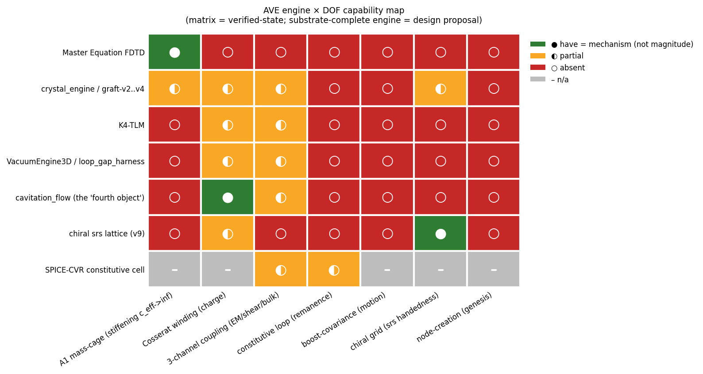

[↑ Common Resources](index.md)

<!-- kb-frontmatter
kind: leaf
no-claim: "audit-synthesis of engine DOF-coverage + a forward design proposal. The capability matrix is verified-state (every cell audit-grounded against a file:line / PR anchor); the three incompatibilities are canon-derived; the substrate-complete engine is NOT built — design-class. Generalizes two-engine-architecture-a027.md from N engines to the one-engine convergence target. Hosts no new derived numbers."
-->

# Engine capability map — the 7 DOF of a complete electron, and which engine hosts what

> **Routing + synthesis aid (no-claim).** The N-engine generalization of [`two-engine-architecture-a027.md`](two-engine-architecture-a027.md) (K4-TLM + Master-Equation). **Class split (load-bearing honesty):**
> - **§2 capability matrix = VERIFIED-STATE** — every cell grounded against a file:line / PR anchor (see [`figures/engine_capability_matrix.yaml`](figures/engine_capability_matrix.yaml)).
> - **§3 incompatibilities = CANON-DERIVED** — the firewalls *are* the spec.
> - **§4 substrate-complete engine = DESIGN PROPOSAL** — hypothesis-class, **not a built or validated engine.** Do not read §4 as describing something that exists.

---

## §1 — The seven DOF a complete electron needs simultaneously

A complete, stable, moving, charged electron requires all seven at once. No single engine carries more than one or two; that gap is the whole point of this map.

> **🔴 LOCALIZATION-MECHANISM REFRAME (2026-06-24; Rule 12 — body preserved).** The Stage-2 native-cage make-or-break ([`research/2026-06-24_engine-stage2-native-cage_result.md`](../../../research/2026-06-24_engine-stage2-native-cage_result.md)) returned energy-certified **MODE-III DISPERSE**: a seeded sech does NOT self-focus into a persistent bound core on the native K4 stencil (WITH c_eff(V)). So the **bulk-interior self-trap is a Cartesian-grid artifact (RULED OUT)** — rest-mass localization is **topological/coupling (the (2,3) winding + H_couple pin the A1 core) + the Γ=−1 boundary cavity**, NOT an autonomous bulk self-focusing well. **mass = A1 (#260) is UNTOUCHED** — only WHAT LOCALIZES the A1 core changes. Read the "$c_{\text{eff}}\to\infty$ self-creates the cage" phrasing below as the cage-as-BOUNDARY (the surviving route), not the cage-as-bulk-self-focus (the falsified route).

| DOF | Why the electron needs it |
|---|---|
| **A1 mass-cage** (stiffening $c_{\text{eff}}\to\infty$) | rest mass = the self-trapped longitudinal-bulk wall; $c_{\text{eff}}\to\infty$ at the saturated core self-creates the $\Gamma=-1$ TIR cage 🔴 *(2026-06-24: the BULK self-focus reading is the FALSIFIED route — see the reframe banner above; the Γ=−1 TIR cage as a BOUNDARY pinned by winding + H_couple is the surviving route; mass = A1 untouched)* |
| **Cosserat winding** (charge) | charge = the $(2,3)$ Beltrami micro-rotation helicity the cage must carry |
| **3-channel coupling** (EM / shear / bulk) | the electron lives across all three impedance channels; a complete engine must carry *and couple* them |
| **constitutive loop** (remanence) | mass persists at zero drive (ferrite $B_r$ analogue); the canonical kernel is anhysteretic, so this is the open R10 gap |
| **boost-covariance** (motion) | a moving electron must Lorentz-transform; transport/boost is absent from every engine |
| **chiral grid** (srs handedness) | structural parity is set by the $I4_1 32$ srs grid; a cubic grid is achiral and cannot carry it |
| **node-creation** (genesis) | pair production / lattice-node birth; no engine hosts it (cosmological front) |

---

## §2 — The capability matrix (verified-state)



> **Living tracker.** The figure renders from [`figures/engine_capability_matrix.yaml`](figures/engine_capability_matrix.yaml) via `figures/engine_capability_map.py`. Each cell carries its anchor in the YAML; a status change (e.g. a cage-test PASS, or a loop that stops being imposed) is a **one-line YAML edit + re-render**.

**What each engine uniquely provides — and the columns no engine fills:**

- **Master Equation FDTD** (`src/ave/core/master_equation_fdtd.py`) — the **only** engine with the **A1 cage**: `c_eff(V)=c0·(1−A²)^(−1/4)→∞`, v14 Mode I PASS (`:13,148-151`; `two-engine-architecture-a027.md:19,32-37`) — 🔴 *(2026-06-24: this Mode-I PASS is **Cartesian-only = continuum cross-check reference**; the **native-stencil self-trap is FALSIFIED (Mode-III)**, [`research/2026-06-24_engine-stage2-native-cage_result.md`](../../../research/2026-06-24_engine-stage2-native-cage_result.md). NOT deleted — it is the valid continuum cross-check the native run must recover, `2026-06-23_full-engine-pathway.md`. The bulk self-trap is a Cartesian artifact; mass = A1 untouched.)*. Scalar ⇒ irrotational ⇒ **no winding** (`cavitation_flow.py:12`).
- **crystal_engine / graft-v2..v4** (`src/ave/core/crystal_engine.py`) — the cage **with the transverse-shear→longitudinal-bulk conversion** + gyrotropic coupling (`:9,224`). Cage **sign** confirmed; **magnitude is apparatus/exponent-bound** — see §6.
- **cavitation_flow** (`src/ave/core/cavitation_flow.py`) — the **only** engine that hosts **circulation** (vector velocity + Kelvin-conserved circulation, `:16-17,33`). It is explicitly *a fourth object — NOT the $\Gamma=-1$ cage* (`:28`).
- **chiral srs lattice / v9** — the **only** engine with the **chiral grid** (srs $I4_1 32$). Optical-activity facts (signed / enantiomorph-odd / diamond-null / writhe-sourced / lossless reciprocal gyrator) confirmed [#195]. **Magnitude $\pm75.46°$/unit DEMOTED** (PR #374): that figure is an `ETA_ROT_PER_WRITHE=1.0` engineering decree (`chiral_lattice_vector.py:27,93`), NOT derived transport. The substrate-DERIVED bulk g₀ (writhe-aware vector-TLM) **converges to the 4₁ screw pitch** ($\mp2.21589$ rad / lattice-z-unit, signed, L-independent, diamond-null); k→0 continuum / physical-rad-m mapping PENDING (literal value ~40 OOM over the cosmic bound). Frozen; transverse-only. **Acceptance-suite status (2026-06-16/17):** the ground-up L0–L2 suite (`src/tests/engine_acceptance/`) runs on this grid and is GREEN — it proves the srs medium is a **valid medium** (lossless transverse propagation T1.1, dispersionless band T1.2, transversality T1.3, causality T1.4, lossless chiral rotation A1b/T1.5, achromatic SYM lensing T2.2, α-invariance T2.4). The chirality is now confirmed **lossless with rotation ON** (Axiom-3) after the copy-first view-aliasing fix (`chiral_lattice_vector.py:49-58`), not just structurally present. **The suite forces ZERO chords** — the chord-DOFs in §2 (`a1_cage`, `winding`, `loop`, `boost`, `node_creation`) are NOT advanced by it (they live at the unbuilt L3–L5 rungs); medium-validity is a different axis than chord-DOF coverage, so **no matrix cell flips on this arc**. A1a reports the honest carrier gap: `carried_dof==2` (transverse) vs `axiom_dof==6` (Cosserat).
- **VacuumEngine3D / loop_gap_harness** (`src/ave/topological/vacuum_engine.py`) — Cosserat ω carrier + 3-channel (incl. *softening* bulk ρ̄). Its scalar is a **projection** `v_scalar_from_v_inc(V_inc)` (def `cross_sector_coupling.py:226`, used at `k4_cosserat_coupling.py:499`) — **no independent A1 field**, so it cannot host the stiffening cage.
- **SPICE-CVR cell** — circuit-domain constitutive law; ε-varactor present, μ-inductor + bulk absent from the `.lib`; its loop is **imposed (IMPOSED-LATCH)**, not emergent (`spice_cvr_loop.py:224`; [#215] retraction `575ed12d`).
- **Empty columns (no engine):** **constitutive loop**, **boost-covariance**, **node-creation** — these are the genuine missing physics (§6).

Full per-cell status + anchors: [`figures/engine_capability_matrix.yaml`](figures/engine_capability_matrix.yaml).

---

## §3 — The three mutual-incompatibility findings (canon-derived — the firewalls ARE the spec)

The engines do not merely *happen* to split the DOF — three of the splits are **forced** by canon. The incompatibilities define what a complete engine must reconcile.

1. **Irrotational ↮ winding.** The stiffening-cage engine is a scalar potential, and `∇×∇V ≡ 0` — *irrotational, so it cannot host circulation* (`cavitation_flow.py:10-19`, verbatim). The cage engine therefore cannot carry the Cosserat winding; the winding needs a vector/rotational sector.
2. **Cubic ↮ self-trap, and cubic ↮ chirality.** The K4-TLM cubic grid implements $Z(V)$ but **not** $c_{\text{eff}}(V)$ — *"without c_eff(V) the wave cannot self-trap at A→1, which is why v14a-e all returned Mode III"* (`master_equation_fdtd.py:15-18`; `two-engine-architecture-a027.md:24`). A cubic grid is also achiral. So the cubic engines can neither self-trap the cage **nor** carry structural handedness — the winding's handedness needs the srs grid (v9). 🔴 *(2026-06-24: the "without c_eff(V) ⇒ Mode III" escape-hatch — i.e. that ADDING c_eff(V) would recover the self-trap — is **REFUTED**: the native K4 stencil **WITH** c_eff(V) STILL returned Mode-III DISPERSE, energy-certified ([`research/2026-06-24_engine-stage2-native-cage_result.md`](../../../research/2026-06-24_engine-stage2-native-cage_result.md)). So Mode-III is the **substrate's verdict, not a missing-modulation artifact** — the bulk self-trap is a Cartesian-grid artifact (RULED OUT); boundary/topological localization STANDS; mass = A1 untouched.)*
3. **Anhysteretic ↮ loop.** The canonical kernel $S(A)=\sqrt{1-A^2}$ is anhysteretic — zero enclosed loop area ⇒ **no remanence** (`loop-gap-electron-resonator-closure-doctrine.md:18`). Every attempt to get retention imposes a latch by hand (the [#215] IMPOSED-LATCH). The loop is the deepest open gap (R10).

**Underlying firewall — stiffening vs softening.** The A1 dilatation's *own* wall is the **stiffening** branch (`c_eff→∞`, the BULK-TRAP, `crystal_engine.py:18-20`). The `bulk_rarefaction_sector` / `cavitation_flow` pocket is the **softening** branch (`c_bulk→0` at ρ̄_cav) — canon flags it *"a FOURTH object — NOT Γ=−1"* (`cavitation_flow.py:28`). The electron cage is the **stiffening** wall; the softening pocket is a distinct (candidate) object. Conflating them is the firewall violation.

---

## §4 — Substrate-complete-engine spec (DESIGN PROPOSAL — hypothesis/forward class)

> **This engine does not exist.** It is the convergence target the incompatibilities define — a forward spec, not a validated result.

> **🔴 2026-06-16 STAGE-1 VERIFICATION + KEYSTONE FINDINGS (Rule 12 — §1–§5 PRESERVED; source: keystone-lane Stage-1 gate + chord/echo audit workflow `wenqg7x94` + INVARIANT-S2 Q1=B).**
> - **Bucket-2 is now EMPIRICALLY VERIFIED, not just inferred:** the Stage-1 gate measured the coupled `VacuumEngine3D` wall at the **transverse-Meissner Z≈Z₀** (the softening proxy), while the standalone `c_eff(V)` cage gives **Z_long→0.376·Z₀ and HELD** (solver adequate). So the "softening-only / cannot host the stiffening cage" finding (`:45`, `:79`) is a **measured result**, not just a structural inference. *(0.376 is the `A_cap=0.99` clamp floor — a **formed** stiffening wall vs the coupled engine's Z≈Z₀, **not** an asymptotic short toward 0; independently reconfirmed by Stage-1.5 Layer-a `Z_tank_long_formation_floor=0.376`. Do not cite 0.376 as a physical Z→0 asymptote.)*
> - **The §4 load-bearing engineering challenge is the TWO-GRID RECONCILIATION** — the continuum-scalar-FDTD grid the `c_eff(V)` cage lives on vs the K4-tetrahedral grid the Cosserat ω lives on. The "union of pieces" below is buildable; this grid-bridge is the hard part.
> - **The stiffening⊥softening firewall (`:61`) is IMPLEMENTATION, not fundamental:** per INVARIANT-S2 Q1=(B) (Grant-ratified) every real node carries BOTH the A1-stiffening (C_eff→∞, Z→0) AND the T2-softening (ε_eff→0, Z→∞) as **orthogonal reactances driven by the same S** — the engines split what the substrate unifies; coupling them is faithful, not a violation. (Firewall §3.1, ∇×∇V≡0, still holds: the scalar cage needs a SEPARATE coupled vector sector — which the Cosserat engine provides.)
> - **SUCCESS CRITERION for the §4 engine (chord/echo audit):** "it works" = it DEMONSTRATES **α-free FORM-emergence** (the (2,3) winding self-forms from generic IC, α-free, the α-free Q emerges), **NOT** a 𝓜/𝓠/𝓙 magnitude readout — m_e is a calibration input, |Q|=1 is generic-for-any-soliton, and the α=𝓜+𝓙+𝓠 decomposition is Class-B echo (`../vol1/ch8-alpha-golden-torus.md:135`; `boundary-observables-m-q-j.md:70`).
> - **R10 (anhysteretic↔loop / remanence, §3.3) stays the SEPARATE retention wall** — whether the formed electron STAYS, not whether it forms. Parked from the existence test.

A single K4-Cosserat engine that simultaneously:
- runs on the **chiral srs grid** (hosts handedness — from v9),
- carries the **`c_eff(V)` stiffening kernel** (hosts the A1 cage — from Master-Equation FDTD),
- is **rotational** (hosts the winding — the sector `cavitation_flow` proves is needed, on the srs grid),
- carries and couples the **three channels** (from the harness),
- is **hysteretic** (hosts the constitutive loop — *open*),
- is **boost-covariant** (hosts motion — *open*).

= the union of **v9 (grid) + Master-Equation (cage) + harness (Cosserat / channels) + the three open DOF (loop, boost, node)**.

This is the *correctly-specified* version of the "one platform" the LOOP-GAP harness rule reached for — that rule under-specified it as `VacuumEngine3D`, which is **softening-only and projects its scalar from the transverse readout**, so it structurally cannot host the stiffening cage. The complete engine is **one platform per firewalled branch, converging** — not one engine retrofitted.

---

## §5 — Build-order DAG (staged, not big-bang)

Per `substrate-native-check` Checkpoint 8 (seed the generative precursor, grow one layer at a time; each layer validated before the next, so a failure localizes to one DOF):

```
chiral srs grid (v9)
      │
      ▼
add c_eff(V) stiffening kernel        ← cage channel on the chiral grid
      │
      ▼
seed photon precursor → self-trap     ← cage AND winding emerge together (not planted)
      │
      ▼
add constitutive loop (remanence)     ← OPEN: must be emergent, not an imposed latch
      │
      ▼
add boost-covariance (motion)         ← OPEN
      │
      ▼
node-creation (genesis)               ← OPEN
```

Big-bang assembly is rejected: a single all-DOF engine that fails gives an ambiguous dispersal (is it the physics, the seed, or the engine?). Staged growth disambiguates — each non-emergent layer is a localized structural-capability finding, not a global failure.

---

## §6 — Open frontier (the genuine missing physics)

- **Loop, boost, node-creation are absent from *every* engine.** These are not engine-choice gaps; they are unbuilt physics. The loop (R10 remanence) is the deepest: the kernel is anhysteretic, and every "retention" so far is imposed (§3.3).
- **The cage magnitude is not yet demonstrated to reach $\Gamma=-1$.** graft-v2's `Γ_min=−0.849` is the deepest **static-seed** read on **non-binding clips** — it sits *exactly on the clip floor* in all 10 sweep cells (corr 1.0000, residual 0.0000); the deepest *dynamical* wall at the standard `A_cap=0.999` is **−0.37** (also clip-bound), exponent-corrected to ~**−0.65** (`research/2026-06-09_crystal-graft-v2_result.md:32`). **What survives: the wall SIGN (short, Γ<0) + the monotone-with-depth trend. The magnitude is apparatus/exponent-dependent, and −1 is NOT demonstrated.**
- **Exponent defect (flagged, physics-review item).** `master_equation_fdtd.py:148-151` sets `c_eff²=c0²/S`, so the physical refractive index is `n=c0/c_eff=S^0.5`, but `refractive_index()` returns `S^0.25` (`:169`; in-code defect flag at `:165-168`). Downstream `Γ=(n−1)/(n+1)` magnitudes *understate* the wall depth (they do not flip its sign). Comment-only flag in the engine per flag-don't-fix; the fix is a Grant/auditor physics-review item.

---

## Cross-references

- [`two-engine-architecture-a027.md`](two-engine-architecture-a027.md) — the K4-TLM + Master-Equation parent this generalizes
- [`loop-gap-electron-resonator-closure-doctrine.md`](loop-gap-electron-resonator-closure-doctrine.md) — the anhysteretic-loop / channel-routing doctrine
- [`../vol9/ch4-dc-electrical-characteristics/three-channel-impedances.md`](../vol9/ch4-dc-electrical-characteristics/three-channel-impedances.md) — the three-impedance law (3-channel DOF)
- `src/ave/core/master_equation_fdtd.py`, `crystal_engine.py`, `cavitation_flow.py`; `src/ave/topological/vacuum_engine.py` — the engines
- [`figures/engine_capability_matrix.yaml`](figures/engine_capability_matrix.yaml) — the matrix source-of-truth (per-cell anchors)
