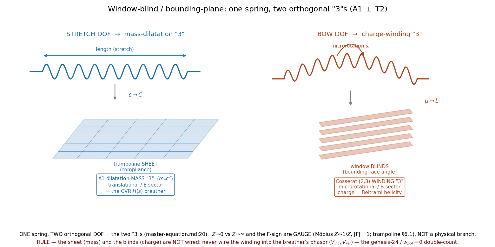

[↑ Common Resources](index.md)

<!-- kb-frontmatter
kind: leaf
no-claim: "Picture-first companion to trampoline-framework.md (consistency-vs-emergence: CONSISTENCY, not emergence). Draws the Cosserat charge-winding '3' (the microrotation / (2,3) chirality DOF, the magnetic/mu/L sector) as the 'window blind / bounding plane' — the gyroscope half the flat trampoline-sheet 'cannot depict'. Re-exposits the Grant-ratified two-'3's (master-equation.md:20) + Axiom 1; asserts no independent derivation. Structurally SEPARATE from the CVR H(s)/Smith leaf (the mass-'3') per the no-phasor-wire rule."
-->

# The Window-Blind / Bounding-Plane — the Charge-Winding "3"

The trampoline-sheet draws only the substrate's **compliance** (stretch → $\varepsilon$ → $C$) half. The **gyroscope** half — the Cosserat microrotation (spin → $\mu$ → $L$, "the medium's primary character", [trampoline-framework.md](trampoline-framework.md):25,352) — a flat sheet cannot depict. This leaf supplies that half as the **window blind / bounding plane**: the bounding-face orientation each bond aims when it bows. It completes the trampoline picture; it does not replace it.

## §1 — Scope and classification

> **[Resultbox]** *Classification — picture-first consolidation (NOT emergence)*
>
> Every element is a re-exposition of canon: the two orthogonal "3"s ([master-equation.md](../vol1/dynamics/ch4-continuum-electrodynamics/master-equation.md):20, Grant-ratified), Axiom 1's six DOF, and the trampoline sectors. `no-claim:` frontmatter; the window-blind is a **visual for the charge-winding sector**, not a new derivation.

## §2 — One spring, two orthogonal "3"s

The "3" is **two distinct, orthogonal objects** ([master-equation.md](../vol1/dynamics/ch4-continuum-electrodynamics/master-equation.md):20, verbatim — "TWO DISTINCT objects, orthogonal (A1 ⊥ T2)"):

| | **mass-dilatation "3"** | **charge-winding "3"** |
|---|---|---|
| Spring DOF | length / **stretch** | shape / **bow** (Euler buckle) |
| Cosserat sector | translational → **E** | microrotational → **B** ([trampoline-framework.md](trampoline-framework.md):348) |
| Constitutive | $\varepsilon \to C$ (compliance) | $\mu \to L$ (inertia / gyroscope) |
| Visual | **trampoline sheet** | **window blind** (this leaf) |
| Object | A1 longitudinal compression scalar; $m_e c^2$ | Cosserat $(2,3)$ winding; charge $=$ Beltrami helicity $H_{bel}=\int\boldsymbol\omega\cdot(\nabla\times\boldsymbol\omega)$ |
| Documented as | the CVR $H(s)$ / breather (Vol 4 Ch 1) | this leaf |

The electron is the **unknot dilatation-mass carrying the $(2,3)$ winding — two objects, not one** (master-equation.md:20). Axiom 1 grounds the orthogonality physically: each node carries six DOF, **3 translational (E-origin) ⊥ 3 microrotational (B-origin)** — the Cosserat rotational DOF is "the substrate-native origin of intrinsic spin" (INVARIANT-S2 / Axiom 1).

## §3 — The window-blind IS the bow DOF (microrotation → $\mu$ → blinds)

Each spring's rest length slightly exceeds the bond spacing, so it is compressed and **bows** past the Euler buckling threshold; the **bow direction (CW/CCW about the bond axis) is helicity** ([trampoline-framework.md](trampoline-framework.md):85). The bow drives the microrotation $\boldsymbol\omega$ — its own Cosserat DOF, "an inductive coupling, **not a stretch**" ([trampoline-framework.md](trampoline-framework.md):348) — which sets the cell's **bounding-face orientation**. That oriented face is the window-blind slat: tilt the blind and you gate which way the substrate's microrotational wave is aimed (the chirality / propagation-selection gate). The blind is the **frame** (the gyroscope); the bowed spring **aims** it.

## §4 — Sector ⊥ gauge (why this is physical and the $Z\to0/\infty$ churn was not)

The window-blind lives on the **sector** axis (which "3" / which DOF), which is a **physical, gauge-invariant** distinction: *which sector loads* is observable (an $\varepsilon$-only static load reflects; both-sectors loading keeps $Z=Z_0$ reflectionless — INVARIANT-S2, Symmetric Gravity). It does **not** live on the **gauge** axis.

> **[Resultbox]** *The $Z\to0$-vs-$Z\to\infty$ / $\Gamma$-sign spread is GAUGE, not a branch*
>
> For a given saturation wall, $Z\to0/\Gamma=-1$ (inside) and $Z\to\infty/\Gamma=+1$ (outside) are the **same wall in
> two reference frames**, related by the Möbius map $Z\leftrightarrow1/Z$; the gauge-invariant content is $|\Gamma|=1$
> and $Z_{eff}\to\infty$ ([trampoline-framework.md](trampoline-framework.md):641, §6.1; "legacy $\Gamma=-1$" $=$ the
> inside / displacement convention). **No leaf should treat $Z\to0/\infty$ or the $\Gamma$-sign as a physical branch.**
> The window-blind is a *sector* (the charge-winding "3"), not a *gauge reading* of an impedance.

## §5 — Figure

Re-runnable: `PYTHONPATH=$PWD/src python src/scripts/vol_1_foundations/window_blind_two_threes.py`. Left: the stretch DOF → trampoline sheet → mass-dilatation "3" (the CVR $H(s)$). Right: the bow DOF → window blinds → charge-winding "3". The two are orthogonal; the gauge note and the no-wire rule are drawn along the bottom.

## §6 — The no-wire rule (load-bearing — keep the blind OUT of the CVR phasor)

> **[Resultbox]** *Never wire the winding into the breather's phasor*
>
> The charge-winding "3" (this leaf) and the mass-dilatation "3" (the CVR $H(s)$ / breather) must stay **separate
> structures**. Per master-equation.md:20: *"never wire the winding into the breather's own phasor $(V_{inc},V_{ref})$
> — $V_{ref}$ is a read-only projection of the same scalar $V$, not an independent DOF; doing so self-inflicts the
> genesis-24 / crystal $w_{pol}=0$ double-count."* The window-blind cross-links the CVR leaf as its **orthogonal
> companion**, and is never merged into its phasor.

## §7 — Honest-status flags

- **Picture-first / consistency** (no new derivation; §1).
- **Chirality is engine-pending:** the handedness of the bow/blind (the $(2,3)$ winding sign) needs the **K4-TLM / srs chiral engine** — cubic FDTD averages handedness out (Fd$\bar3$m achiral $\supset$ I4$_1$32 chiral).
- **Sector ≠ gauge** (§4): the window-blind is the physical sector axis; impedance magnitude/sign is gauge (§6.1).

## Cross-references

- **Companion (mass half):** [trampoline-framework.md](trampoline-framework.md) (the compliance / $\varepsilon$ sheet; §0:25, §2.1:348 gyroscope-half, §3.2:414 impedance, §6.1:641 gauge note).
- **The two-"3"s (owning content):** [master-equation.md](../vol1/dynamics/ch4-continuum-electrodynamics/master-equation.md):20 (Grant-ratified A1 ⊥ T2 + the no-phasor-wire rule).
- **The mass-"3" as a transfer function (orthogonal companion — NOT wired):** [CVR Transfer Function $H(s)$](../vol4/circuit-theory/ch1-vacuum-circuit-analysis/cvr-transfer-function.md) + the [CVR EE-sweep leaf-set](../vol4/circuit-theory/ch1-vacuum-circuit-analysis/index.md).
- **Canonical script:** `src/scripts/vol_1_foundations/window_blind_two_threes.py`.

---
