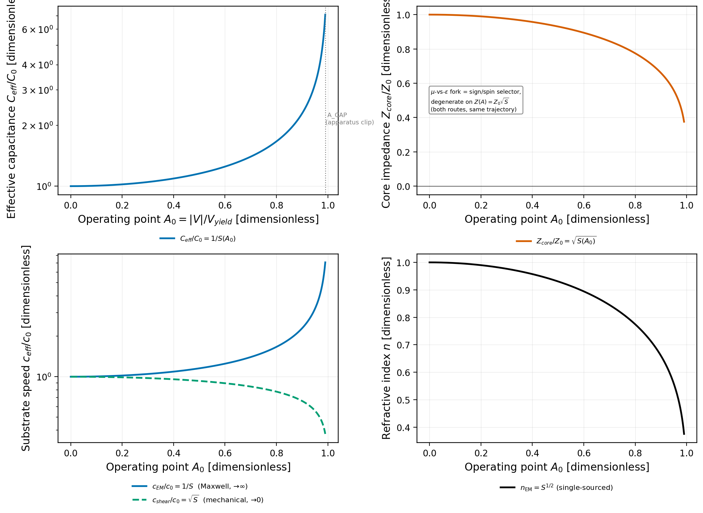

[↑ Ch.1 Vacuum Circuit Analysis](index.md)

<!-- kb-frontmatter
kind: leaf
no-claim: "Consolidation / translation leaf (consistency-vs-emergence: CONSISTENCY, not emergence). The computed DC characteristic (C-V / Z / c vs operating point A0) of the vacuum varactor whose constitutive law is derived in nonlinear-vacuum-capacitance.md (clm-... varactor) + INVARIANT-S2 (Axiom 4). Adds the load-line + electron operating point as the worked datasheet DC view; carries the master_equation_fdtd.py:165 exponent defect (n=S^0.5 physical vs S^0.25 as-coded). Originates no new derivation."
-->

# CVR DC Operating Point — the Vacuum Varactor C-V Characteristic

The DC (large-signal) characterization of the substrate cell: how the effective capacitance, impedance, and the two wave speeds move as the operating-point bias $A_0 = |V|/V_{yield}$ is swept from the cold lattice ($A_0=0$) toward the saturation wall ($A_0\to1$). The constitutive law is the **vacuum varactor** $C_{eff}(A_0)=C_0/S(A_0)$ ([nonlinear-vacuum-capacitance.md](nonlinear-vacuum-capacitance.md); [translation-circuit.md](../../../common/translation-tables/translation-circuit.md):111-112, Axiom 4); this leaf is the computed DC sweep + load-line that sits at the head of the datasheet's DC chapter.

## §1 — Scope and classification

> **[Resultbox]** *Classification — consolidation / consistency (NOT emergence)*
>
> The C-V curve, the impedance, and the two speeds are EE projections of the canonical Axiom-4 kernel
> $S(A)=\sqrt{1-A^2}$ (INVARIANT-S2) — already derived. This leaf computes and plots the DC characteristic
> and adds the load-line construction; it originates no new claim (`no-claim:` frontmatter).

## §2 — The DC characteristic (computed View 1)

With $S(A_0)=\sqrt{1-A_0^2}$ (the dielectric specialization, $A_0=\Delta\phi/\alpha$ per-node):

| Quantity | Form | Limit as $A_0\to1$ | Sector |
|---|---|---|---|
| Effective capacitance | $C_{eff}/C_0 = 1/S(A_0)$ | $\to\infty$ (varactor diverges) | capacitive / E |
| Core impedance | $Z_{core}/Z_0 = \sqrt{S(A_0)}$ | $\to0$ ($\Gamma=-1$ wall) | magnetic / B (primary) |
| Maxwell phase velocity | $c_{EM}/c_0 = 1/S(A_0)$ | $\to\infty$ | E (enters $\alpha$) |
| Mechanical / group velocity | $c_{shear}/c_0 = \sqrt{S(A_0)}$ | $\to0$ (clock freeze) | shear (rest-mass) |

The two speeds are **not interchangeable** (INVARIANT-S2 Pitfall #5): $c_{EM}=c_0/S$ enters the fine-structure constant and all Maxwell-equation work; $c_{shear}=c_0\sqrt{S}$ is the energy-transport / Schwarzschild-reduction speed ([universal_operators.py:969](../../../../../src/ave/core/universal_operators.py)). Computed values: at $A_0=0.9$, $C_{eff}/C_0=2.29$, $Z_{core}/Z_0=0.66$ (`cvr_ee_sweep_metrics.json`).

## §3 — The exponent defect (carried, per `flag-don't-fix`)

> **[Resultbox]** *FLAG — refractive-index exponent defect (`master_equation_fdtd.py:165`)*
>
> The engine's `refractive_index()` returns $n = S^{0.25}$, but the in-code FLAG records that the same engine's
> `c_eff_squared` sets $c_{eff}^2 = c_0^2/S \Rightarrow c_{eff}=c_0/\sqrt{S} \Rightarrow n = c_0/c_{eff} = S^{0.5}$
> — the **physical** exponent. The as-coded $S^{0.25}$ **understates** wall depth: downstream $\Gamma=(n-1)/(n+1)$
> magnitudes are shallower than physical. The DC view plots BOTH (`fig1`, lower-right panel; max gap $0.237$),
> and the reflection leaf carries the consequence. This is a **physics-review item** (Grant/auditor), surfaced not fixed.

## §4 — Load-line and the electron operating point

The static compression that holds the cage sets the DC bias. The rest energy maps to the snap scale, $m_e c^2 = e\,V_{snap}$, $V_{snap}\approx511$ kV (`constants.py:496`); the saturation/yield onset is $V_{yield}=\sqrt{\alpha}\,V_{snap}\approx43.65$ kV (`constants.py:505`, INVARIANT-C1). The electron's reflective wall ($|\Gamma|^2=1-\alpha$, [cvr-reflection-smith.md](cvr-reflection-smith.md)) sits at a residual $A_\star$ where $\sqrt{S_\star}\approx\alpha/4$ — i.e. essentially at saturation ($A_\star\to1$) with a tiny non-zero residual impedance that IS the radiative leak. A load-line (source-impedance line through the device C-V curve) intersects the characteristic at the operating point; this is the illustrative EE construction of where on the varactor curve the cage rides.

## §5 — Computed figure

Re-runnable: `PYTHONPATH=$PWD/src python src/scripts/vol_9_device/cvr_ee_sweep/cvr_ee_sweep.py` (View 1). Panels: varactor $C_{eff}/C_0$ (log), $Z_{core}/Z_0\to0$, the two speeds, and the exponent-defect $n_{eng}$ vs $n_{phys}$ band. The apparatus clip $A_{CAP}=0.99$ + floor $S_{MIN}=0.05$ (graft-v2) are drawn — magnitudes below are bench-capped, not physical.

## §6 — Honest-status flags

- **Sector-attribution flag (FLAG-2 — RESOLVED, wall-fork H3 2026-06-15):** $C_{eff}\to\infty$ (capacitive, [resonant-lc-solitons.md](resonant-lc-solitons.md):29-39, clm-kezk9z) and $\mu_{eff}\to0$ (magnetic, [master-equation.md](../../../vol1/dynamics/ch4-continuum-electrodynamics/master-equation.md):84-85, clm-lv3uw1) BOTH give $Z=Z_0\sqrt{S}$; the DC curve is robust. The attribution is a **chirality-set SIGN** (which sector leads = the electron's spin), **not** a substrate-privileged branch — neither route is "primary" absent a chirality convention. The symmetric co-saturation limit is the impedance-matched **gravity** case ($Z=Z_0$, $\Gamma=0$); the $Z\to0$ wall requires the chirality-broken asymmetry. The prior "Magnetic is PRIMARY" was a handoff-mandated label, now scoped as the conventional sign for one chirality (μ-first→$\Gamma=-1$; ε-first→$\Gamma=+1$).
- **Exponent defect** (§3) and **$S_{MIN}/A_{CAP}$ clip** carried.
- The $C_{eff}=C_0/S$ ($C\uparrow$) vs $\varepsilon_{eff}=\varepsilon_0 S$ ($\varepsilon\downarrow$) pair is **NOT a convention** — it is a **sector distinction** (Q1 = (B), Grant-ratified 2026-06-15, INVARIANT-S2; `research/2026-06-15_ceff-epsilon-monotonicity_result.md`): $C_0/S$ is the **longitudinal-A1 bond compliance** ($1/k_a$), $\varepsilon_0 S$ the **transverse-T2 permittivity** — orthogonal reactances, not the same object. This **supersedes** the FLAG-2 chirality-sign scoping above *at the constitutive level* (cross-link, not contradiction): the wall-fork's "capacitive vs magnetic" routes are, deeper, the longitudinal-compliance ($Z_{tank}=\sqrt{L/C_{comp}}\to0$) vs transverse sectors; the chirality-sign axis (which sector *leads* = spin) and the sector-distinction axis (compliance ≠ permittivity) are independent and compatible. The $Z=Z_0\sqrt{S}$ trajectory remains convention-independent and unaffected.

## Cross-references

- **Owning constitutive law:** [nonlinear-vacuum-capacitance.md](nonlinear-vacuum-capacitance.md) (the vacuum varactor); INVARIANT-S2 (Axiom 4 kernel); [op14-local-clock-modulation.md](op14-local-clock-modulation.md) (operating-point detuning).
- **Companion sweep views:** [Transfer Function $H(s)$](cvr-transfer-function.md) · [Reflection / Smith](cvr-reflection-smith.md) · [Phasor / Reactance](cvr-phasor-reactance.md) · [Stability / Eigenmode](cvr-stability-eigenmode.md).
- **Constants:** `src/ave/core/constants.py` (`V_SNAP`:496, `V_YIELD`:505, `Z_0`:113).
- **Canonical script:** `src/scripts/vol_9_device/cvr_ee_sweep/cvr_ee_sweep.py` (+ `cvr_model.py`).

---
