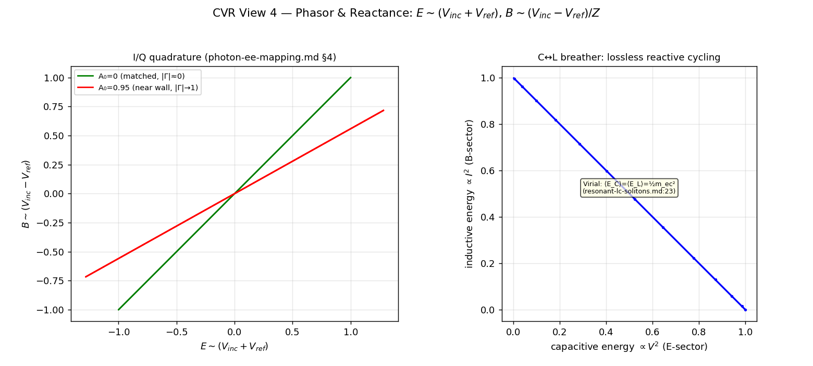

[↑ Ch.1 Vacuum Circuit Analysis](index.md)

<!-- kb-frontmatter
kind: leaf
no-claim: "Consolidation / translation leaf (consistency-vs-emergence: CONSISTENCY, not emergence). The phasor / reactance view: the photon's I/Q quadrature E~(V_inc+V_ref), B~(V_inc-V_ref)/Z (owned by photon-ee-mapping.md S4, clm-eemap1) and the C<->L breather (owned by breathing-soliton-v14-mode-i.md). Plotted in PHASE-SPACE (V_inc,V_ref) coordinates per phase-space-coordinate-check. Originates no new derivation."
-->

# CVR Phasor & Reactance — I/Q Quadrature and the C↔L Breather

The phasor view of the substrate cell: the incident/reflected voltage waves $(V_{inc}, V_{ref})$ as the photon's own in-phase/quadrature components, and the capacitive↔inductive energy exchange that IS the breathing soliton. This is the explicit phasor-axis companion to the $H(s)$ and Smith views, consolidating the I/Q quadrature row at [translation-circuit.md](../../../common/translation-tables/translation-circuit.md):178.

## §1 — Scope and classification

> **[Resultbox]** *Classification — consolidation / consistency (NOT emergence); PHASE-SPACE coordinates*
>
> The I/Q quadrature is owned by [photon-ee-mapping.md](../../../vol1/dynamics/ch4-continuum-electrodynamics/photon-ee-mapping.md) §4 (clm-eemap1); the C↔L breather by [breathing-soliton-v14-mode-i.md](../../../vol1/dynamics/ch4-continuum-electrodynamics/breathing-soliton-v14-mode-i.md). Per `phase-space-coordinate-check`, the trajectories here live in **phase-space $(V_{inc}, V_{ref})$ / (E,B) / (V,I) coordinates**, NOT real-space lattice-Cartesian — the figure plots the phasor/Lissajous loops, matching the corpus claim's coordinate system. `no-claim:` frontmatter.

## §2 — The I/Q quadrature: $E\sim(V_{inc}+V_{ref})$, $B\sim(V_{inc}-V_{ref})/Z$

On each transmission-line bond, the incident and reflected voltage waves ARE the photon's in-phase / quadrature components ([photon-ee-mapping.md](../../../vol1/dynamics/ch4-continuum-electrodynamics/photon-ee-mapping.md) §4, [translation-circuit.md](../../../common/translation-tables/translation-circuit.md):178):

$$
E \sim (V_{inc} + V_{ref}) \quad\text{(in-phase, capacitive)}, \qquad
B \sim \frac{V_{inc} - V_{ref}}{Z} \quad\text{(quadrature, inductive)}
$$

locked together by the line impedance $Z$. This is a **linear $E\leftrightarrow B$ internal to the K4 sector** — distinct from the parametric K4↔Cosserat pair-production bridge. Equivalently the $V\leftrightarrow\Phi_{link}$ linear LC slosh: capacitive voltage trades with inductive flux-linkage every cycle, a lossless reactive exchange at $Z_0$.

- **Matched ($A_0=0$, free photon):** $\Gamma\approx0$, the $(E,B)$ phasor is an open Lissajous ellipse — clean travelling-wave quadrature.
- **Near the wall ($A_0\to1$, electron):** $\Gamma\to-1$, the reflected wave phase-inverts and the loop collapses toward a standing-wave line — the trapped reactive energy of the shorted $\lambda/4$ resonator.

## §3 — The C↔L breather (Virial-balanced reactive cycling)

The trapped LC tank cycles its energy between the capacitive (E-sector, $\propto V^2$) and inductive (B-sector, $\propto I^2$) reservoirs, $90°$ out of phase — a closed Lissajous loop in the $(E_C, E_L)$ plane. The classical Virial theorem fixes the time-average split:

$$
\langle E_C \rangle = \langle E_L \rangle = \tfrac{1}{2} m_e c^2
$$

recovering $E_{total}=m_e c^2$ as the total stored reactive energy ([resonant-lc-solitons.md](resonant-lc-solitons.md):23). The breathing modulation of this exchange is the canonical v14 Mode-I breather ([breathing-soliton-v14-mode-i.md](../../../vol1/dynamics/ch4-continuum-electrodynamics/breathing-soliton-v14-mode-i.md)).

## §4 — Computed figure

Re-runnable: `PYTHONPATH=$PWD/src python src/scripts/vol_9_device/cvr_ee_sweep/cvr_ee_sweep.py` (View 4). Left: the $(E,B)$ quadrature at matched ($A_0=0$) vs near-wall ($A_0=0.95$) operating points. Right: the $C\leftrightarrow L$ breather Lissajous loop with the Virial balance annotated.

## §5 — Discrimination (ave-discrimination-check)

- **CONSISTENCY:** the I/Q quadrature and the C↔L breather are EE re-expressions of the canonical photon structure and the v14 breather — re-expressions, not new predictions. The Virial $E=m_ec^2$ recovery is the canonical LC-tank identity.
- **No AVE-distinct claim is made in this view** — the phasor/breather are descriptive packaging; the discriminating content lives in the reflection ($|\Gamma|^2=1-\alpha$) and transfer-function (chiral non-reciprocity) views.

## §6 — Honest-status flags

- **Phase-space coordinates** (not lattice-Cartesian) — the trajectories are phasor/Lissajous loops (§1).
- The **helical-photon** ($u\ne0$ AND $\omega\ne0$) dual-sector reading is RETRACTED ([photon-ee-mapping.md](../../../vol1/dynamics/ch4-continuum-electrodynamics/photon-ee-mapping.md):52); the canonical photon is single-sector $T_2$. The quadrature here is the intra-K4 linear $E\leftrightarrow B$, not a helical soliton.

## Cross-references

- **Owning canonical claims:** [photon-ee-mapping.md](../../../vol1/dynamics/ch4-continuum-electrodynamics/photon-ee-mapping.md) §4 (clm-eemap1, the I/Q quadrature); [breathing-soliton-v14-mode-i.md](../../../vol1/dynamics/ch4-continuum-electrodynamics/breathing-soliton-v14-mode-i.md) (the breather); [resonant-lc-solitons.md](resonant-lc-solitons.md):23 (Virial $E=m_ec^2$).
- **Companion sweep views:** [Transfer Function $H(s)$](cvr-transfer-function.md) · [DC Operating Point](cvr-dc-operating-point.md) · [Reflection / Smith](cvr-reflection-smith.md) · [Stability / Eigenmode](cvr-stability-eigenmode.md).
- **Tool-axis:** [translation-circuit.md](../../../common/translation-tables/translation-circuit.md):178 (I/Q quadrature row this leaf consolidates).
- **Canonical script:** `src/scripts/vol_9_device/cvr_ee_sweep/cvr_ee_sweep.py` (+ `cvr_model.py`).

---
