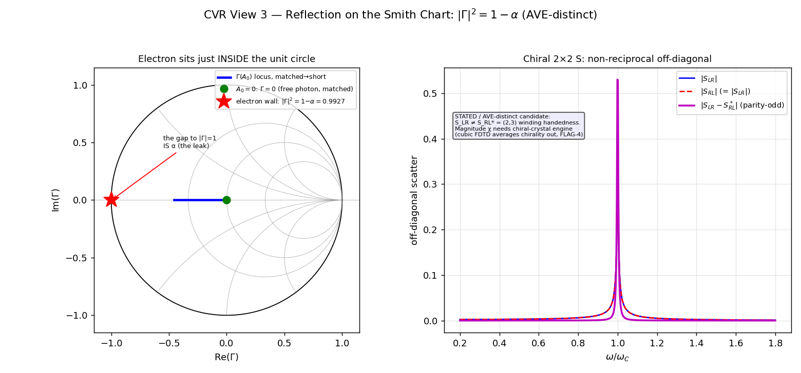

[↑ Ch.1 Vacuum Circuit Analysis](index.md)

<!-- kb-frontmatter
kind: leaf
no-claim: "Consolidation / translation leaf (consistency-vs-emergence: CONSISTENCY, not emergence). The reflection-coefficient view of the electron wall on the Smith chart, re-expressing the magnetic-branch Gamma=-1 (clm-lv3uw1) and the alpha=1/Q per-cycle leak (clm-rtdmsn) as |Gamma|^2=1-alpha. Fills the translation-circuit.md:181 Smith-chart gap. The |Gamma|^2=1-alpha relation is the AVE-DISTINCT consequence (the wall falls short of the unit circle by exactly alpha = the radiative leak). Originates no new derivation; the chiral 2x2 S off-diagonal magnitude is STATED."
-->

# CVR Reflection on the Smith Chart — $|\Gamma|^2 = 1-\alpha$

The reflection-coefficient view of the self-trapped electron: how $\Gamma$ moves on the Smith chart as the operating point sweeps from the cold matched lattice (the free photon, $\Gamma=0$) to the saturation wall (the short, $\Gamma\to-1$), and the **AVE-distinct** result that the wall is *not a perfect short* — it falls short of the unit circle by exactly $\alpha$. This fills the gap the [circuit translation table](../../../common/translation-tables/translation-circuit.md):181 flagged for the *Smith chart ($Z\leftrightarrow\Gamma$)* row (⚠ "implied by Op1 + Op3 composition; no explicit Smith-chart leaf").

## §1 — Scope and classification

> **[Resultbox]** *Classification — consolidation / consistency, with one AVE-distinct corollary*
>
> The $\Gamma(A_0)$ locus is the Op3 reflection ([operators.md](../../../common/operators.md):43) of the
> canonical $Z_{core}=Z_0\sqrt{S}$ trajectory. The matched→short sweep is CONSISTENCY (re-expression). The
> **$|\Gamma|^2 = 1-\alpha$ relation is AVE-DISTINCT** — the radiative leak made geometric. `no-claim:`
> frontmatter; the relation is owned by the $\alpha=1/Q$ leak (clm-rtdmsn).

## §2 — The $\Gamma(A_0)$ locus (Op3 of the magnetic-branch wall)

$$
\Gamma(A_0) = \frac{Z_{core}(A_0) - Z_0}{Z_{core}(A_0) + Z_0}, \qquad Z_{core}(A_0) = Z_0\sqrt{S(A_0)}
$$

> **🔴 MAGNETIC-BRANCH = SIGN-SELECTOR, NOT CAGE-MECHANISM (2026-06-18, Rule 12 / PR#260 B3-DEGENERATE — bullets below PRESERVED unedited; Grant-ratified).** The "magnetic branch $\mu_{eff}\to0$" labelling the $\Gamma\to-1$ wall below is the **chirality/spin SIGN-selector** (μ-first $\Rightarrow \Gamma=-1$ vs ε-first $\Rightarrow \Gamma=+1$ are spin-conjugate signs) and is **MUTE on the mass sector** — NOT the cage *mechanism*. The mass-cage is the **A1 longitudinal dilatation** ($Z_{bulk}\to0 \Rightarrow \Gamma_{bulk}=-1$); the μ-vs-ε fork is DEGENERATE on the equilibrium observables ($Z=Z_0\sqrt{S}$, $|\Gamma|=1$ both ways) — exactly the convention-independent locus this leaf already uses — the asymmetry chirality-set not substrate-forced. Wiring confinement into the magnetic/charge sector would break the two-"3"s orthogonality (A1 ⊥ T2, [`master-equation.md`](../../../vol1/dynamics/ch4-continuum-electrodynamics/master-equation.md):20). Body preserved per Rule-12.

- $A_0=0$ (cold lattice): $Z_{core}=Z_0$, $\Gamma=0$ — **matched, the free photon** ([photon-ee-mapping.md](../../../vol1/dynamics/ch4-continuum-electrodynamics/photon-ee-mapping.md) §2, $\Gamma=0$ at every bond, no core).
- $A_0\to1$ (saturation): $Z_{core}\to0$, $\Gamma\to-1$ — **the short-circuit TIR wall** (magnetic branch $\mu_{eff}\to0$, [master-equation.md](../../../vol1/dynamics/ch4-continuum-electrodynamics/master-equation.md):78-79, clm-lv3uw1; [resonant-lc-solitons.md](resonant-lc-solitons.md):42-46).

On the Smith chart the locus runs straight along the real axis from the centre ($\Gamma=0$) to the left rim ($\Gamma=-1$): a pure resistance collapse to the short.

## §3 — The AVE-distinct result: $|\Gamma|^2 = 1-\alpha$

> **[Resultbox]** *The wall is not a perfect short — it leaks exactly $\alpha$ per cycle*
>
> $$\boxed{\; |\Gamma|^2 = 1 - \alpha \;\approx\; 0.99270, \qquad |\Gamma| = \sqrt{1-\alpha} \approx 0.99635 \;}$$
>
> The electron's reflective boundary is a **high-but-not-perfect** short. Only a fraction $1/Q=\alpha$ of the
> stored energy leaks per cycle through the TIR boundary ([theorem-3-1-q-factor.md](theorem-3-1-q-factor.md):81),
> so the reflected power is $1-\alpha$ and $|\Gamma|$ sits just **inside** the unit circle. **The hair by which
> $\Gamma$ falls short of $|\Gamma|=1$ IS $\alpha$** — the fine-structure constant read directly off the Smith
> chart as the radiative gap to the unit circle. Equivalently, the wall sits at a residual amplitude $A_\star$
> where $\sqrt{S_\star}\approx\alpha/4$ — a tiny non-zero core impedance, not an ideal $0\,\Omega$ short.

This is the same $\alpha$ as the $H(s)$ pole's distance from the $j\omega$ axis ([cvr-transfer-function.md](cvr-transfer-function.md) §2): the radiative linewidth, the per-cycle leak, and the Smith-chart gap to the unit circle are three views of one number. Computed: `gamma_mag_sq_leak = 0.9927026 = 1-α` (`cvr_ee_sweep_metrics.json`).

## §4 — The chiral 2×2 on the reflection plane (the charge-"3", documented separately)

A scalar object would have a $1\times1$ $\Gamma$. The $(2,3)$ winding makes the **charge-"3"** a 2-port in the $(L,R)$ handedness basis with a **non-reciprocal** scattering matrix ($S_{LR}\ne S_{RL}^{*}$, parity-odd; computed peak $|S_{LR}-S_{RL}^*|=0.53$). This is **charge-"3" content** — orthogonal to the mass-dilatation reflection above — whose canonical home is the charge-"3" leaf; fig3 (right panel, §5) is the reflection-plane *view* of it.

> → Primary: [Window-Blind / Bounding-Plane — the Charge-Winding "3"](../../../common/window-blind-bounding-plane.md) §3.5 — the $(L,R)$ chiral 2×2 form, $S_{LR}\ne S_{RL}^*$, the STATED $\chi$ (needs the chiral-crystal engine; cubic FDTD averages chirality out). Never wired into the mass-"3" (no-phasor-wire rule, master-equation.md:20).

## §5 — Computed figure

Re-runnable: `PYTHONPATH=$PWD/src python src/scripts/vol_9_device/cvr_ee_sweep/cvr_ee_sweep.py` (View 3). Left: the $\Gamma(A_0)$ locus matched→short with the electron wall at $|\Gamma|^2=1-\alpha$ marked just inside the unit circle. Right: the non-reciprocal off-diagonal.

## §6 — Discrimination (ave-discrimination-check)

- **CONSISTENCY:** the matched→short locus is the Op3 re-expression of $Z_{core}=Z_0\sqrt{S}$; the $\Gamma=-1$ limit is the canonical TIR wall.
- **AVE-DISTINCT:** $|\Gamma|^2=1-\alpha$ — the wall's reflectivity falls short of unity by exactly the fine-structure constant. A perfect-conductor QED boundary would give $|\Gamma|=1$ identically; the AVE wall predicts a **measurable radiative leak = $\alpha$** built into the reflection. Plus the non-reciprocal $S_{LR}\ne S_{RL}^*$ (§4).

## §7 — Honest-status flags

- **Exponent defect (carried):** the engine computes $\Gamma$ from $n=S^{0.25}$, which **understates** wall depth vs the physical $n=S^{0.5}$ ([cvr-dc-operating-point.md](cvr-dc-operating-point.md) §3, `master_equation_fdtd.py:165`). The $|\Gamma|^2=1-\alpha$ relation here is anchored to the **per-cycle leak** ($\alpha=1/Q$, clm-rtdmsn), not to the defective $n$ — so it is unaffected; but any $\Gamma$-from-$n$ magnitude on the engine side is shallow. Physics-review item.
- **Sector vs gauge (FLAG-2 recontextualized, 2026-06-13):** the apparent $\mu_{eff}\to0$-vs-$C_{eff}\to\infty$ split is partly the two **gauge** sides of one wall ($Z\to0$ inside $\leftrightarrow$ $Z\to\infty$ outside, Möbius $Z\leftrightarrow1/Z$, $|\Gamma|=1$; [trampoline-framework.md](../../../common/trampoline-framework.md):641 §6.1) — **not** a physical branch. The physical, gauge-invariant axis is the **two-"3"s** (mass-dilatation $\perp$ charge-winding; [master-equation.md](../../../vol1/dynamics/ch4-continuum-electrodynamics/master-equation.md):20). This leaf's $Z_{core}=Z_0\sqrt{S}\to0$, $\Gamma=-1$ is the electron's **inside** reading (canonical, §6.1); the Smith locus is convention-independent.
- **Chiral $\chi$ magnitude STATED** (§4).
- **Dual-sector reading — one chart per sector (INVARIANT-S2 Q1=B, 2026-06-16):** this leaf plots **one** wall, the longitudinal/$\mu_{eff}\to0$ short ($Z_{core}=Z_0\sqrt{S}\to0$, $\Gamma\to-1$). The **transverse-T2** sector ($\varepsilon_{eff}=\varepsilon_0 S$, $Z\to\infty$, $\Gamma\to+1$ rupture) is a **distinct impedance** ($\sqrt{\mu/\varepsilon}$, *not* the tank $\sqrt{L/C_{comp}}$) belonging on its **own** Smith chart; putting both on one $Z(A_0)$ curve as if one $S$ drove one impedance is the **genesis-24 double-count** (`ave-kb/CLAUDE.md` INVARIANT-S2). The two walls are opposite rim points ($\Gamma=-1$ short vs $\Gamma=+1$ open); the matched bound mode is the centre ($\Gamma\to0$). **α-free caveat:** the $|\Gamma|^2=1-\alpha$ gap (§3) is a Class-B *value-level echo* ([theorem-3-1-q-factor.md](theorem-3-1-q-factor.md):19) — a consistency prediction, **not** an α-free emergence output; do not read the $1-\alpha$ rim-gap as an emergence readout.

## Cross-references

- **Owning canonical claims:** [master-equation.md](../../../vol1/dynamics/ch4-continuum-electrodynamics/master-equation.md):78-79 (clm-lv3uw1, magnetic $\Gamma=-1$); [theorem-3-1-q-factor.md](theorem-3-1-q-factor.md) (clm-rtdmsn, the $\alpha=1/Q$ leak); [resonant-lc-solitons.md](resonant-lc-solitons.md):42-46 (the $\Gamma=-1$ short).
- **Companion sweep views:** [Transfer Function $H(s)$](cvr-transfer-function.md) · [DC Operating Point](cvr-dc-operating-point.md) · [Phasor / Reactance](cvr-phasor-reactance.md) · [Stability / Eigenmode](cvr-stability-eigenmode.md).
- **Tool-axis:** [translation-circuit.md](../../../common/translation-tables/translation-circuit.md):181 (Smith-chart row this leaf consolidates); [operators.md](../../../common/operators.md):43 (Op3 $\Gamma$).
- **Canonical script:** `src/scripts/vol_9_device/cvr_ee_sweep/cvr_ee_sweep.py` (+ `cvr_model.py`).

---
