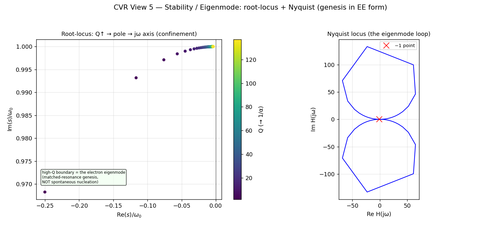
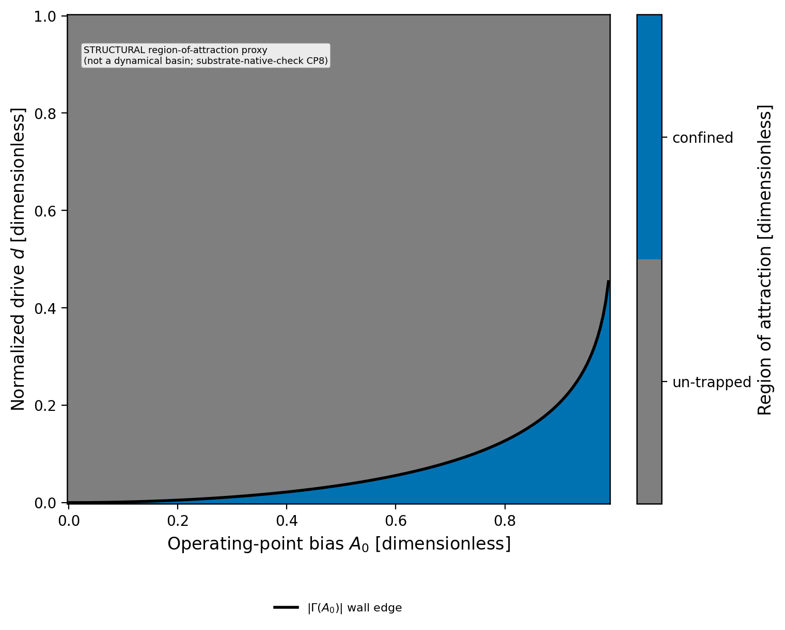

[↑ Ch.1 Vacuum Circuit Analysis](index.md)

<!-- kb-frontmatter
kind: leaf
no-claim: "Consolidation / translation leaf (consistency-vs-emergence: the eigenmode STRUCTURE is descriptive/consistency; the self-lock EMERGENCE is explicitly UNDERIVED). The root-locus / Nyquist EE-form of the electron eigenmode, partially closing the translation-circuit.md:207-208 control/stability gaps. Does NOT derive the soliton self-lock (autoresonance remains the open gap; the autoresonant-PLL leaf is INVALIDATED). Originates no new derivation."
-->

# CVR Stability & Eigenmode — Root-Locus, Nyquist, and the Genesis Loop

The control-theory view of the electron tank: a root-locus showing where the confined eigenmode sits as loss decreases ($Q\to1/\alpha$), a Nyquist locus of the open-loop resonator, and a structural region-of-attraction map. This partially closes the control/feedback cluster the [circuit translation table](../../../common/translation-tables/translation-circuit.md):207-208 flagged (✗ "no substrate-native Nyquist/root-locus stability criterion exists yet"; ✗ autoresonance) — **partially**, because the *structure* is mapped here while the *self-lock dynamics* remain the open gap.

## §1 — Scope and classification

> **[Resultbox]** *Classification — descriptive structure (consistency) + an explicit emergence GAP*
>
> Per `consistency-vs-emergence`: the root-locus / Nyquist **structure** is a descriptive EE-form of the
> canonical LC eigenmode (consistency). The **self-lock / autoresonance** that would keep the electron pinned at
> the $\Gamma=-1$ boundary is **NOT derived here** — it is the standing corpus gap (the only autoresonant-PLL
> leaf is INVALIDATED for using the wrong yield threshold, [translation-circuit.md](../../../common/translation-tables/translation-circuit.md):207). This leaf maps the
> stability *geometry*; it does not manufacture the emergence. `no-claim:` frontmatter.

## §2 — Root-locus: the eigenmode as $Q\to1/\alpha$

The resonator pole pair $s_\pm = -\omega_0/(2Q)\pm j\omega_d$ migrates as $Q$ sweeps from lossy ($Q\sim2$) to the electron value ($Q=1/\alpha=137$): the poles ride **toward the $j\omega$ axis**, approaching the marginally-stable boundary that is the confined, non-radiating eigenmode. The electron is the **high-$Q$ matched eigenmode** at the end of this locus — its identicality and its genesis-by-matching follow from BEING this eigenmode, not from a spontaneous nucleation.

> **[Resultbox]** *Genesis = matched resonance, not spontaneous nucleation*
>
> The eigenmode loop is the EE-form of "genesis is matching." A defect becomes an electron by **impedance-matching
> into** the high-$Q$ eigenmode (the seeded $\Gamma\to-1$ rupture of the parametric K4↔Cosserat bridge —
> [photon-ee-mapping.md](../../../vol1/dynamics/ch4-continuum-electrodynamics/photon-ee-mapping.md) §4.1, the canonical pair-production coupling), NOT by a generic nucleation from
> vacuum. The corpus uniformly affirms no-generic-nucleation; the basin (§4) is a *region of attraction*, not a
> spawning rule.

## §3 — Nyquist: the open-loop resonator locus

The Nyquist plot of $H(j\omega)$ traces the eigenmode loop in the complex plane. For the lossless-limit resonator the encirclement structure is the EE statement of the lossless reactive cycling (Axiom 3 minimum-reflection / least-reflected-action). This is the substrate-native Nyquist criterion the translation table lacked — supplied here as **descriptive structure** (the loop), with the closed-loop self-lock left as the open gap (§5).

## §4 — Region of attraction (structural basin)

The bias×drive map (`fig6`) shades the region where the wall reflectivity $|\Gamma(A_0)|$ exceeds the de-trapping drive — a **structural** region-of-attraction proxy. Per `substrate-native-check` CP8, this is NOT a dynamical basin: it does not evolve a seed and watch it self-create the cage; it reads the static $|\Gamma(A_0)|$ wall edge. A genuine basin (does a precursor self-focus into the eigenmode?) is a driver question, not a structural plot.

## §5 — Computed figures

Re-runnable: `PYTHONPATH=$PWD/src python src/scripts/vol_9_device/cvr_ee_sweep/cvr_ee_sweep.py` (Views 5–6). The root-locus colour-codes $Q$ from $2\to1/\alpha$; the basin shades confined (green) vs un-trapped (red).

## §6 — Discrimination (ave-discrimination-check)

- **CONSISTENCY / descriptive:** the root-locus and Nyquist geometry are EE re-expressions of the canonical high-$Q$ eigenmode.
- **NOT an emergence claim:** the leaf does not derive self-lock; it supplies the missing *stability geometry*, explicitly tagging the autoresonance/self-lock as still-open (the structural-vs-dynamical firewall).

## §7 — Honest-status flags (load-bearing)

- **Autoresonance / self-lock UNDERIVED:** the electron's stable confinement at $\Gamma=-1$ is asserted from the saturation mechanism; the autoresonance that keeps it locked — its genesis-from-a-flowing-photon-precursor *application* was **TESTED-NEGATIVE** (2026-06-14, T2 on `crystal_engine` near-yield, NO-GENESIS; [`research/2026-06-14_t2-genesis-selflock_result.md`](../../../../../research/2026-06-14_t2-genesis-selflock_result.md)), while the general mapping + the PLV/autoresonance detector instrument remain open (phasor-redesign prereg deferred) ([photon-ee-mapping.md](../../../vol1/dynamics/ch4-continuum-electrodynamics/photon-ee-mapping.md):98; [translation-circuit.md](../../../common/translation-tables/translation-circuit.md):207, the autoresonant-PLL leaf is ⛔ invalidated). This leaf **partially** closes the ✗ Nyquist/root-locus gap (structure mapped) but leaves the autoresonance ✗ open.
- **Basin is STRUCTURAL** not dynamical (§4, substrate-native-check CP8).
- **Magnetic branch / sector-attribution flag** carried as in the companion views.

## Cross-references

- **Owning canonical claims:** [theorem-3-1-q-factor.md](theorem-3-1-q-factor.md) (clm-rtdmsn, $Q=1/\alpha$); [photon-ee-mapping.md](../../../vol1/dynamics/ch4-continuum-electrodynamics/photon-ee-mapping.md) §4.1 (the parametric pair-production bridge); [resonant-lc-solitons.md](resonant-lc-solitons.md) (the confined LC eigenmode).
- **Companion sweep views:** [Transfer Function $H(s)$](cvr-transfer-function.md) · [DC Operating Point](cvr-dc-operating-point.md) · [Reflection / Smith](cvr-reflection-smith.md) · [Phasor / Reactance](cvr-phasor-reactance.md).
- **Tool-axis:** [translation-circuit.md](../../../common/translation-tables/translation-circuit.md):207-208 (Autoresonance + Control/stability rows this leaf partially consolidates).
- **Canonical script:** `src/scripts/vol_9_device/cvr_ee_sweep/cvr_ee_sweep.py` (+ `cvr_model.py`).

---
