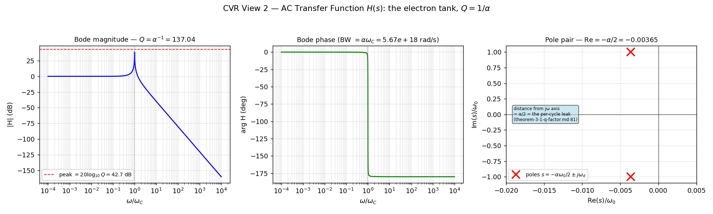

[↑ Ch.1 Vacuum Circuit Analysis](index.md)

<!-- kb-frontmatter
kind: leaf
no-claim: "Consolidation / translation leaf (consistency-vs-emergence: CONSISTENCY, not emergence). Re-expresses already-derived canon — the electron LC tank (clm-kezk9z/p5cf3t), alpha=1/Q (clm-rtdmsn), the magnetic-branch Gamma=-1 (clm-lv3uw1), the EE-circuit identity (clm-fy05jc/eemap1) — as the explicit substrate-native transfer function H(s). Fills the translation-circuit.md:189 H(s) gap (was: 'general H(s) pole-zero synthesis not mapped'). Originates no new derivation; the 2x2 chiral off-diagonal magnitude is STATED (needs the chiral-crystal engine)."
-->

# CVR Transfer Function $H(s)$ — the Electron Tank as a Chiral Resonator

This leaf consolidates the electron's mass-cage as an explicit **substrate-native transfer function** $H(s)$ — the AC small-signal response of the self-made nonlinear resonant LC cavity. It fills the one gap the [circuit translation table](../../../common/translation-tables/translation-circuit.md):189 flagged for the *Filter theory / transfer fn* row (⚠ "matched-$Z$ ($\Gamma=0$) case only; general $H(s)$ pole-zero synthesis not mapped"). The object is a **2×2 chiral $H(s)$** whose co-polarized pole pair sits at $s = -\alpha\omega_0/2 \pm j\omega_d$ — the pole's distance from the $j\omega$ axis IS the per-cycle radiative leak $\alpha = 1/Q$.

## §1 — Scope and classification

> **[Resultbox]** *Classification — consolidation / consistency (NOT emergence)*
>
> Per `consistency-vs-emergence`: every element here is an **EE re-expression of already-derived canon**.
> The 2nd-order pole structure is forced by the canonical LC tank (clm-kezk9z) + $\alpha=1/Q$ (clm-rtdmsn);
> the $\Gamma=-1$ short branch is the magnetic-branch saturation (clm-lv3uw1). This leaf carries `no-claim:`
> frontmatter and references its owning claims by cross-link. The **off-diagonal chiral coupling magnitude is
> STATED, not derived** (§3) — it needs the chiral-crystal engine.

The substrate is an LC network at minimal DOF (Axiom 1; [translation-circuit.md](../../../common/translation-tables/translation-circuit.md) §2). The electron is a topological defect locked into that network as a high-$Q$ resonant LC tank ([resonant-lc-solitons.md](resonant-lc-solitons.md):10). Its small-signal AC response around a DC operating point $A_0$ is a transfer function $H(s)$ — the object this leaf makes explicit.

## §2 — The co-polarized $H(s)$ (DERIVED from the LC tank + $Q=1/\alpha$)

A series-fed lossy LC resonator has the canonical 2nd-order transfer function

$$
H(s) \;=\; \frac{\omega_0^2}{s^2 + \dfrac{\omega_0}{Q}\,s + \omega_0^2}, \qquad
\omega_0 = \omega_{\text{local}}(A_0) = \omega_C\,S(A_0), \qquad Q = \frac{1}{\alpha}
$$

with $\omega_C = c_0/\ell_{node} \approx 7.76\times10^{20}$ rad/s the bond LC natural frequency (AC datasheet, $\omega_C$ derivation) and $S(A_0) = \sqrt{1-A_0^2}$ the Axiom-4 operating-point kernel (the varactor bias detunes the tank down — [op14-local-clock-modulation.md](op14-local-clock-modulation.md)). The pole pair:

$$
\boxed{\; s_{\pm} \;=\; -\frac{\omega_0}{2Q} \pm j\,\omega_0\sqrt{1-\frac{1}{4Q^2}}
\;=\; -\frac{\alpha\,\omega_0}{2} \pm j\,\omega_d \;}
$$

**The real part $-\alpha\omega_0/2$ is the radiative linewidth** — the pole sits a distance $\alpha/2$ (in units of $\omega_0$) to the left of the $j\omega$ axis, and that distance is exactly the per-cycle energy leak $1/Q = \alpha$ through the TIR boundary ([theorem-3-1-q-factor.md](theorem-3-1-q-factor.md):81, "only a fraction $1/Q=\alpha$ of the stored energy leaks per cycle"). The computed value matches to machine precision: `pole_real/ω₀ = −0.00364868 = −α/2` (`cvr_ee_sweep_metrics.json`).

| Quantity | Substrate-native form | Value | Provenance |
|---|---|---|---|
| Tank $Q$ | $1/\alpha$ | $137.036$ | DERIVED ([theorem-3-1-q-factor.md](theorem-3-1-q-factor.md):38, clm-rtdmsn) |
| Resonance $\omega_0$ | $\omega_C\,S(A_0)$ | $7.76\times10^{20}\,S(A_0)$ rad/s | DERIVED (Ax 1 primitives) |
| Pole real part | $-\alpha\omega_0/2$ | $-0.00365\,\omega_0$ | DERIVED (= the $1/Q$ leak) |
| $-3$ dB bandwidth | $\omega_0/Q = \alpha\omega_0$ | $5.67\times10^{18}$ rad/s | DERIVED |
| Peak $|H|$ | $20\log_{10}Q$ | $42.7$ dB | DERIVED |

## §3 — The 2×2 chiral structure (STATED — the winding handedness)

The electron is not a scalar resonator: its $(2,3)$ Clifford-torus winding ([translation-circuit.md](../../../common/translation-tables/translation-circuit.md):123) makes the cavity a **2-port in the circular-handedness $(L,R)$ basis**. The transfer matrix is

$$
\mathbf{H}(s) =
\begin{pmatrix} H_{\text{co}}(s) & \chi\,H_{\times}(s) \\[2pt] -\chi\,H_{\times}(s) & H_{\text{co}}(s) \end{pmatrix},
\qquad H_{\times}(s) = \frac{j\,\omega_0\,(\omega_0/Q)}{s^2 + (\omega_0/Q)s + \omega_0^2}
$$

The **skew (sign-flipped) off-diagonal** is the parity-odd signature: $S_{LR} \ne S_{RL}^{*}$, i.e. left→right conversion is **not reciprocal** with right→left. The computed non-reciprocity $|S_{LR}-S_{RL}^*|$ peaks at resonance (`nonreciprocity_peak = 0.53`, `cvr_ee_sweep_metrics.json`).

> **[Resultbox]** *Honest status of the chiral coupling*
>
> The **structure** (skew off-diagonal = non-reciprocal = parity-odd) is the AVE-distinct candidate signature of
> the winding handedness. The **coupling magnitude $\chi$ is STATED, not derived** — it is a structural placeholder.
> The cubic FDTD engine averages chirality out (Fd$\bar3$m achiral $\supset$ I4$_1$32 chiral); a quantitative $\chi$
> needs the **K4-TLM / chiral-crystal engine** (AUDITOR_STATE FLAG-4). Do not cite a $\chi$ value as derived.
>
> **No-wire rule (the two-"3"s).** The winding is the **charge-"3"** — a *separate* object, documented in
> [window-blind-bounding-plane.md](../../../common/window-blind-bounding-plane.md), orthogonal to this leaf's
> **mass-dilatation "3"** $H_{co}$. The off-diagonal here is the STATED *projection* of the winding's chiral
> scattering, **NOT** the winding wired into the breather's phasor $(V_{inc},V_{ref})$ — that wiring is the
> genesis-24 / $w_{pol}=0$ double-count ([master-equation.md](../../../vol1/dynamics/ch4-continuum-electrodynamics/master-equation.md):20). Keep the window-blind orthogonal; never merge it into $H_{co}$.

## §4 — Computed figure

Re-runnable: `PYTHONPATH=$PWD/src python src/scripts/vol_9_device/cvr_ee_sweep/cvr_ee_sweep.py` (View 2). The Bode magnitude peaks at $42.7$ dB $=20\log_{10}(1/\alpha)$ at $\omega/\omega_C=1$; the phase inverts $0°\to-180°$ (the short-circuit boundary); the pole pair sits at $\mathrm{Re}/\omega_0 = -\alpha/2$.

## §5 — Discrimination (ave-discrimination-check)

- **CONSISTENCY (not AVE-distinct):** the $Q=1/\alpha$ peak is $\alpha$ in its original Sommerfeld coupling-strength meaning ([theorem-3-1-q-factor.md](theorem-3-1-q-factor.md):81) re-expressed as a Bode peak — a re-expression, not a new prediction. The 2nd-order roll-off is generic resonator physics.
- **AVE-DISTINCT (candidate):** the **non-reciprocal off-diagonal** $S_{LR}\ne S_{RL}^*$ — a parity-odd 2-port response is not a property of any scalar QED propagator; it is the EE signature of the $(2,3)$ winding chirality. Magnitude pending the chiral engine (§3).

## §6 — Honest-status flags (carry verbatim per `ave-evidence-framing-discipline`)

- **Magnetic branch (PRIMARY):** the $\Gamma=-1$ short that closes the resonator is the **magnetic-branch** saturation $\mu_{eff}\to0 \Rightarrow Z\to0$ ([master-equation.md](../../../vol1/dynamics/ch4-continuum-electrodynamics/master-equation.md):78-79, clm-lv3uw1) — NOT the electric branch ($\varepsilon_{eff}\to0$, $Z\to\infty$, $\Gamma=+1$, open = dielectric rupture, a different object).
- **Sector-attribution flag (AUDITOR_STATE FLAG-2):** the same $Z\to0$ wall is reached in [resonant-lc-solitons.md](resonant-lc-solitons.md):29-39 via the **capacitive** route $C_{eff}\to\infty$ (clm-kezk9z). Both give the identical $Z=Z_0\sqrt{S}$ trajectory; they disagree only on which constitutive parameter moves, and no engine-validated trajectory distinguishes them. Carried, not silently resolved.
- **$\chi$ magnitude STATED** (§3); **exponent defect** ($n=S^{0.5}$ physical vs $S^{0.25}$ as-coded, `master_equation_fdtd.py:165`) affects $\Gamma$-from-$n$ magnitudes downstream — carried on the DC-operating-point and reflection leaves.

## Cross-references

- **Owning canonical claims:** [theorem-3-1-q-factor.md](theorem-3-1-q-factor.md) (clm-rtdmsn, $\alpha=1/Q$); [master-equation.md](../../../vol1/dynamics/ch4-continuum-electrodynamics/master-equation.md):78-79 (clm-lv3uw1, magnetic-branch $\Gamma=-1$); [resonant-lc-solitons.md](resonant-lc-solitons.md) (clm-kezk9z/p5cf3t, the LC tank).
- **Companion sweep views:** [DC Operating Point](cvr-dc-operating-point.md) · [Reflection / Smith](cvr-reflection-smith.md) · [Phasor / Reactance](cvr-phasor-reactance.md) · [Stability / Eigenmode](cvr-stability-eigenmode.md).
- **Tool-axis:** [translation-circuit.md](../../../common/translation-tables/translation-circuit.md):189 (§4.5(b) *Filter theory / transfer fn* row this leaf consolidates).
- **Canonical script:** `src/scripts/vol_9_device/cvr_ee_sweep/cvr_ee_sweep.py` (+ `cvr_model.py` spine).

---
