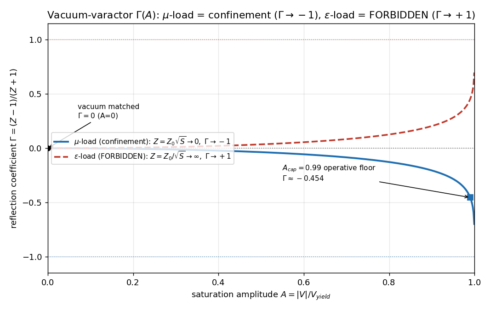
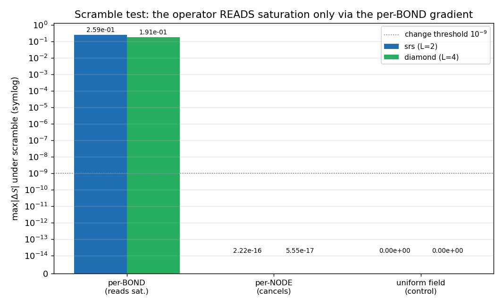
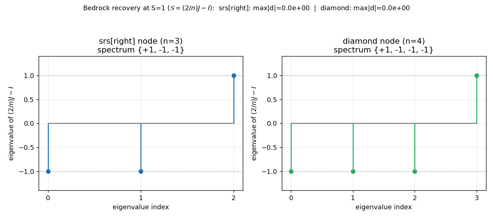
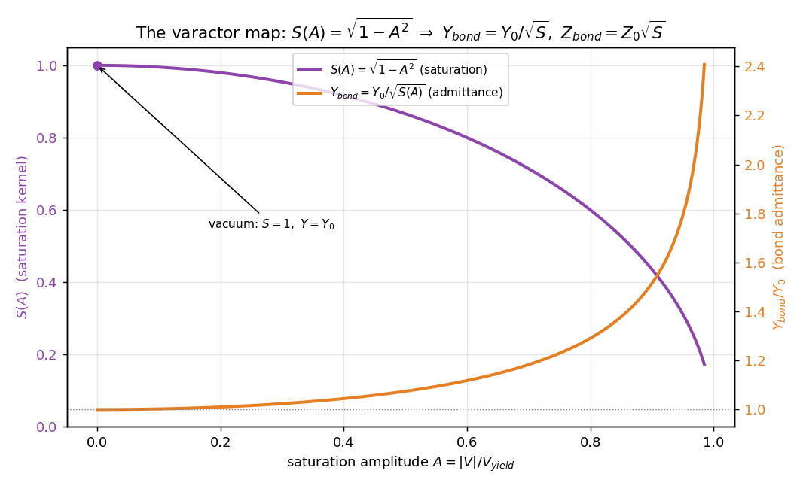

[↑ Ch.1 Vacuum Circuit Analysis](index.md)

<!-- kb-frontmatter
kind: leaf
no-claim: "New-operator / consistency re-expression leaf (consistency-vs-emergence: CONSISTENCY, Class-C). Documents the admittance-weighted scatter S_ij = 2 Y_j/(Σ_k Y_k) - δ_ij as the per-port-admittance generalization of the bedrock (2/n)J-I node scatter (node_scattering_multiplicity / node-scattering-multiplicity.md), wired to read the canonical Axiom-4 saturation S(A) via the varactor map Y_bond = Y0/√S(A). The operator READS saturation (scrambling per-bond S(A) changes it; per-node-uniform does not) and reproduces the bedrock at S=1 — both are CONSISTENCY (re-expression / validate-on-known), not emergence. It does NOT yet test confinement (the deferred Fork-B). Originates no new physics; the bedrock scatter, the Axiom-4 kernel, and the μ-load Z_eff=Z0√S sign are all PRE-EXISTING canonical content this leaf composes."
-->

# Vacuum-Varactor Scatter Operator — the $S(A)$-reading admittance scatter

The node-scatter operator that **reads the local saturation** $S(A)$. It generalizes
the bedrock equal-admittance node scatter $(2/n)J-I$ to a **per-port admittance**
scatter $S_{ij}=2Y_j/(\sum_k Y_k)-\delta_{ij}$, then wires in the canonical **Axiom-4
varactor map** $Y_{bond}=Y_0/\sqrt{S(A)}$ so that the assembled lattice operator
depends on the per-bond saturation field. This fixes the dead-code path where the
prior `scatter_matrix(n, z_local)` ignored its impedance argument and was
**saturation-blind**.

> **Module:** [`src/ave/solvers/vacuum_varactor_scatter.py`](../../../../../src/ave/solvers/vacuum_varactor_scatter.py)
> · **Tests:** [`src/tests/test_vacuum_varactor_scatter.py`](../../../../../src/tests/test_vacuum_varactor_scatter.py) (28 tests)
> · **Result doc:** `research/2026-06-20_vacuum-varactor-scatter_result.md`
> · **Figures:** [`src/scripts/vol_4_engineering/vacuum_varactor_scatter_figures.py`](../../../../../src/scripts/vol_4_engineering/vacuum_varactor_scatter_figures.py)

## §0 — Scope and classification

> **[Resultbox]** *Classification — new operator / consistency re-expression (Class-C)*
>
> This leaf documents an **operator**, not a new physical claim. Everything it composes
> is **pre-existing canonical content**: the bedrock $(2/n)J-I$ node scatter
> ([node-scattering-multiplicity.md](../../../vol9/ch3-pin-port-configuration/node-scattering-multiplicity.md),
> `node_scattering_multiplicity.py`), the Axiom-4 saturation kernel
> $S(V)=\sqrt{1-(V/V_{yield})^2}$ ([nonlinear-vacuum-capacitance.md](nonlinear-vacuum-capacitance.md):10,
> engine at `crystal_engine.py`:191), and the longitudinal $\mu$-load sign
> $Z_{eff}=Z_0\sqrt{S}\Rightarrow\Gamma\to-1$ (`crystal_engine.py`:463,477-478;
> [cvr-reflection-smith.md](cvr-reflection-smith.md)). The two empirical statements —
> *recovers the bedrock at $S=1$* and *its output depends on the per-bond saturation
> field* — are both **CONSISTENCY** (a validate-on-known reduction and a
> dependency demonstration), **not emergence**.

**What it delivers.** An $S(A)$-reading lattice scattering operator: a node scatter
whose matrix elements depend on the local saturation, so the assembled global operator
$\mathcal{S}(A)$ changes when the per-bond saturation field changes. Before this, the
trivalent node scatter ignored its impedance argument and was **saturation-blind**.

**What it does NOT do (the deferred Fork-B).** It does **not** test whether the
saturation tank *confines* the A1 mass, and it does **not** discriminate the
quarter-arc confinement shape. Those are the Fork-B confinement verdict — explicitly
**out of scope**. This operator is the *prerequisite* for any genuine saturation test:
an operator that actually reads $S(A)$, against which the confinement question can
later be posed.

## §1 — The admittance-weighted scatter (generalizing the bedrock)

The bedrock node scatter is the **equal-admittance** shunt-junction reduction
($V=(2/n)\sum_j V_j^{inc}$, the $n$-port trivalent KCL):

$$
S_{ij}^{\text{bedrock}} = \frac{2}{n} - \delta_{ij} \qquad\text{i.e.}\qquad \tfrac{2}{n}J - I .
$$

The varactor scatter retains the **per-port admittance** $Y_i$ instead of factoring it
out. From the *same* shunt-junction KCL with a common node voltage $V$:

$$
V_i = V_i^{inc} + V_i^{ref} = V \;(\text{shunt}), \qquad
\sum_i Y_i\,(V_i^{inc} - V_i^{ref}) = 0 \;(\text{KCL})
$$

$$
\Rightarrow\quad V = \frac{2\,\sum_j Y_j V_j^{inc}}{\sum_k Y_k}
\quad\Rightarrow\quad
\boxed{\; S_{ij} = \frac{2\,Y_j}{\sum_k Y_k} - \delta_{ij} \;}
$$

**Reduction to the bedrock.** Setting all $Y_j$ equal gives $2Y/(nY)-\delta_{ij} =
(2/n)-\delta_{ij}$ — the bedrock is the **uniform-admittance special case**. Each row
of $S$ sums to $+1$ (shunt-junction passivity). The assembled lattice operator is
$\mathcal{S}(A) = C\cdot\mathrm{blockdiag}(S_u)$, where $C$ is the lattice's own
directed-edge CONNECT permutation (`connect_index()`), exactly as in the bedrock
`assemble_global_scattering` — so this is a **drop-in generalization**, never a
Cartesian posit (K4-native).

> **Two senses of "exact" at the reduction.** At $S=1$ (the vacuum, $A=0$) the
> admittance is *literally* $Y_0\mathbb{1}$, so the result is **bit-level exact**
> (`np.array_equal`, identical float ops, $\max|d|=0$). For any *saturated-but-uniform*
> field the common factor $Y_0/\sqrt S$ cancels *algebraically* through a $\sum$ and a
> division, so the agreement is **exact-to-roundoff** (`np.allclose`, $\sim10^{-16}$),
> not bit-identical. The leaf keeps these two senses distinct throughout.

## §2 — The varactor map and the corrected sign

The saturation enters the scatter through the **Axiom-4 varactor map** on each directed
bond:

$$
Y_{bond} = \frac{Y_0}{\sqrt{S(A_{bond})}}, \qquad
Z_{bond} = Z_0\,\sqrt{S(A_{bond})}, \qquad
S(A) = \sqrt{1 - A^2}\ \ \text{(canonical Axiom-4 kernel)}
$$

with $A = |V|/V_{yield}$ the **dimensionless** per-bond saturation amplitude. The kernel
is **imported**, not hard-coded — it delegates to `CrystalEngine.saturation_kernel`
(`crystal_engine.py`:191; the same $S(V)$ documented at
[nonlinear-vacuum-capacitance.md](nonlinear-vacuum-capacitance.md):10).

> **[Resultbox]** *The corrected sign: $S\to0\Rightarrow Z\to0\Rightarrow\Gamma\to-1$ (the $\mu$-load SHORT)*
>
> $$\boxed{\; S\to0 \;\Rightarrow\; Z_{bond}=Z_0\sqrt{S}\to0 \;\Rightarrow\; \Gamma=\frac{Z-Z_0}{Z+Z_0}\to-1 \;}$$
>
> As the core **saturates**, the bond impedance collapses to a **SHORT** and the
> reflection goes to $\Gamma\to-1$ — the **mass-cage**, the longitudinal $\mu$-load.
> This is the corrected sign: the $\mu$-load $Z_{eff}=Z_0\sqrt{S}$ form
> (`crystal_engine.py`:463,477-478), **not** a $Z\to\infty$ bag.

**The forbidden $\varepsilon$-load mirror.** The reciprocal map $Y=Y_0\sqrt{S}$ (i.e.
$Z=Z_0/\sqrt{S}\to\infty$) would give $\Gamma\to+1$ — the **OPEN** anti-trap. That is
the **EPSILON-LOAD FORBID** scope assertion at `crystal_engine.py`:466-468 ("a future
$\varepsilon$-load import MUST NOT reuse this method's $Z_{eff}$ form"). The varactor
scatter implements the $\mu$-load only; the $\varepsilon$-load mirror is shown in
Fig. (a) purely to mark which branch is forbidden.

**Sector discipline (A1 $\perp$ T2).** The varactor reads the **A1 dilatation**
saturation $S(A)$ — the bulk / longitudinal sector. The Cosserat $(2,3)$ **winding**
(charge-"3") is **not** wired in; the winding is never wired into the breather's own
$(V_{inc},V_{ref})$ phasor
([master-equation.md](../../../vol1/dynamics/ch4-continuum-electrodynamics/master-equation.md):20,
the two-"3"s disambiguation). The $\mu$-vs-$\varepsilon$ fork is a **sign/spin
selector**, degenerate on the equilibrium observables and mute on the mass sector
(PR#260 B3-DEGENERATE; [cvr-reflection-smith.md](cvr-reflection-smith.md) §2).

## §3 — Per-BOND, not per-node — and "reads saturation"

This is the **load-bearing requirement**. A **per-NODE-uniform** admittance **cancels**
at the shunt junction: a common factor $Y$ in every $Y_j$ cancels in
$2Y_j/\sum_k Y_k$, reducing back to $(2/n)J-I$ *regardless of $S$*. So the saturation
must enter as **per-BOND (directed-edge)** admittances that **differ across ports** (the
$S$-gradient across the connect-map), or the operator stays $S$-blind.

| Load | result vs bedrock | $\max\lvert d\mathcal{S}\rvert$ |
|---|---|---|
| $A=0$ scalar (vacuum) | $==$ bedrock **bit-level** | $0.0$ |
| $A=0.9$ UNIFORM (deep, per-node) | $==$ bedrock (roundoff) | $\sim10^{-16}$ |
| per-NODE $(N,)$ varying, uniform-within-node | $==$ bedrock (roundoff) | $\sim10^{-16}$ |
| **per-BOND $(N,d)$ varying** | **DIFFERS** | $0.183$ (srs) / $0.149$ (dia) |

The third row is the sharp one: a saturation field that varies *across* nodes but is
*uniform within* each node still cancels. It is the **per-port gradient** the operator
reads.

> **[Resultbox]** *"Reads saturation" — the scramble demonstration (the Fork-B unblocker)*
>
> Take a per-bond saturation field $A$, then a **scrambled** $A'$ (the **same values**,
> permuted across directed bonds), and assemble both. The operator **changes**:
> $\max\lvert d\mathcal{S}\rvert = 0.259$ (srs $L{=}2$) / $0.156$ (diamond $L{=}4$),
> both $\gg 10^{-9}$. A **negative control** confirms the signal is the per-bond
> gradient and not assembly noise: scrambling a **uniform** field is a no-op
> ($\max\lvert d\rvert\sim10^{-14}$, and the result still equals the bedrock).

That $\max\lvert d\mathcal{S}\rvert>0$ under a per-bond scramble — and $\approx0$ under a
per-node or uniform scramble — **is** the property "the operator reads saturation," the
exact thing the prior dead-code path lacked. See Fig. (b).

## §4 — The four validate-on-known gates

The runner (`varactor_validate_on_known`) HALTs if any gate fails; all four PASS.

| Gate | Statement | Class | Result |
|---|---|---|---|
| 1 | $S=1$ everywhere $\to$ scatter $==(2/n)J-I$ **bit-level** | IDENTITY | $\max\lvert d\rvert=0.0$ (srs + dia) |
| 2 | per-port-distinct admittance $\to$ scatter $\neq(2/n)J-I$ | MANIFESTATION | $\max\lvert d\rvert=0.183$/$0.149$ |
| 3 | $\alpha$ never imported into the scatter path; $\alpha\to2\alpha$ is a no-op | CONSISTENCY / STRUCTURAL | $\lvert dQ/Q\rvert=0$ |
| 4 | structural radiative-$Q$ **floor** $Z_{RADIATION}\approx29.98$ reproduced | CONSISTENCY | $\Gamma_{bound}\approx-0.853$ |

**Gate 3 — $\alpha$-free is structural.** `ALPHA` / `Q_TANK` / `ELECTRON` are **never
reachable** in the scatter module's globals (import-guard `assert`s). The scatter reads
the *dimensionless* $A=|V|/V_{yield}$, so $V_{yield}$ — and hence $\alpha$, which lives
*only* in the dimensionful $V_{YIELD}=\sqrt{\alpha}\,V_{SNAP}$ (`constants.py`:427) —
**cancels** before the operator sees it. Under $\alpha\to2\alpha$ the operator is
bit-identical. This is the load-bearing frame-independent anchor.

> **Gate 4 — band-consistent, NOT an identity (DEC-5).** The structural radiative-$Q$
> floor $Z_{RADIATION}=Z_0/(4\pi)\approx29.98$ is reproduced *through* the admittance
> scatter (a node port loaded by the free-space radiation impedance sees
> $Y_{rad}/Y_0=Z_0/Z_{RADIATION}=4\pi$, and the reflection into the bound node is
> $\Gamma_{bound}=(1-4\pi)/(1+4\pi)\approx-0.853$). This floor is **band-consistent**
> with the dynamical cold-cage $Q_{ringdown}\approx30.8$ — **both** in the $[20,45]$
> radiative-$Q$ band — but they are **$\sim2.7\%$ apart and are NOT identical**. A
> pinned corpus anti-coincidence test guards that distinction:
> `test_graded_vacuum_network_isolation.py`:141-146
> (`test_anti_coincidence_Q_is_not_Z_radiation`, `assert abs(Q - 29.98) > 1.0`) —
> a silent $Q==Z_{RADIATION}$ would be a hard-coded-constant-masquerading-as-dynamics
> bug. The static scatter matrix does **not** produce a decay time, so it does not
> re-derive the $30.8$ ring-down (engine FDTD scope); it reproduces the **floor**, in
> the same **band**, **not** the identity.

The gate mix is intentional: gate 1 is an identity, gates 3-4 are
consistency/structural, and the **one manifestation-class result is gate 2 + the
scramble demo** (§3) — the operator's output *demonstrably depends on the saturation
field*. That dependence is the whole deliverable.

## §5 — The floor caveat (sign + trend are physics; depth is a parameter)

The deepest **reachable** reflection is capped by the canonical kernel clip. The cap is
set by the **amplitude clip $A_{cap}=0.99$**, **not** by the saturation floor
$S_{min}=0.05$. The kernel (`crystal_engine.py`:191) is
$S=\sqrt{\max(1-A^2,\,S_{min}^2)}$, and the $A_{cap}$ clip caps $A$ *first*:

$$
A \le A_{cap}=0.99 \;\Rightarrow\; 1-A_{cap}^2 = 0.0199 \;>\; S_{min}^2=0.0025
$$

so $A_{cap}$ is the **binding** constraint ($S_{min}$ never binds):

$$
S = \sqrt{1-0.99^2} = 0.1411,\quad Z=Z_0\sqrt{S}=0.3756,\quad
\Gamma=\frac{Z-1}{Z+1} = -0.454 .
$$

> **Caveat.** The reachable $\Gamma$ floor $\approx-0.45$ is set by $A_{cap}$, not
> $S_{min}$. (The $S_{min}$ path would give $Z=\sqrt{0.05}=0.224\Rightarrow\Gamma=-0.635$
> — a *different*, non-binding number.) The **sign** ($\Gamma<0$) and the
> **monotone-toward-$(-1)$ trend** are the physics; the achievable **depth** is a floor
> *parameter* ($A_{cap}$), not a result. Releasing the clips pushes $\Gamma\to-1$
> monotonically (at $A=0.999999$ with the clip released, $\Gamma<-0.9$). A regression
> test pins this: a per-bond field with **all** ports above $A_{cap}$ clips to a single
> uniform $S$ and returns the **bedrock** ($\max\lvert d\rvert=0$), so a future change
> that accidentally clips the *operative* range — and thereby kills the
> saturation-reading gradient — is caught
> (`test_all_ports_above_A_cap_clip_to_uniform_returns_bedrock`,
> `test_floor_caps_reachable_gamma_at_minus_0p45_via_A_cap`).

## §6 — Figures

All four figures are generated **from the actual operator** by
[`vacuum_varactor_scatter_figures.py`](../../../../../src/scripts/vol_4_engineering/vacuum_varactor_scatter_figures.py)
(deterministic; re-run to regenerate the PNGs).

**(a) $\Gamma$-vs-$A$ varactor curve.** $\Gamma(A)$ for the $\mu$-load
($Z=Z_0\sqrt{S(A)}\to0$, $\Gamma\to-1$ = mass-cage SHORT = confinement) with the
**FORBIDDEN** $\varepsilon$-load mirror ($Z=Z_0/\sqrt{S}\to\infty$, $\Gamma\to+1$). The
$A_{cap}=0.99$ operative floor ($\Gamma\approx-0.454$) and the vacuum-matched point
($\Gamma=0$ at $A=0$) are marked.

**(b) Scramble demonstration ("reads saturation").** $\max\lvert d\mathcal{S}\rvert$
under a **per-BOND** scramble ($\approx0.26$ srs / $\approx0.19$ diamond, well above the
$10^{-9}$ change threshold) vs a **per-NODE** scramble ($\sim10^{-16}$) vs a
**uniform-field** scramble ($0$, the negative control). The per-bond gradient is the
*only* channel that changes the operator.

**(c) Bedrock recovery + local spectra.** At $S=1$ the assembled operator equals the
bedrock $(2/n)J-I$ ($\max\lvert d\rvert=0$ for both nets); the local-node scatter
spectra are $\{+1,-1,-1\}$ (srs, degree 3) and $\{+1,-1,-1,-1\}$ (diamond, degree 4).

**(d) Saturation $\to$ admittance map.** The varactor mapping $S(A)=\sqrt{1-A^2}$
(falling) and $Y_{bond}=Y_0/\sqrt{S}$ (rising) vs $A$; the vacuum point
($S=1$, $Y=Y_0$) is marked.

## §7 — Cross-links

- **The bedrock node scatter** (the $(2/n)J-I$ equal-admittance special case this
  generalizes): [node-scattering-multiplicity.md](../../../vol9/ch3-pin-port-configuration/node-scattering-multiplicity.md)
  (`node_scattering_multiplicity.py`, `assemble_global_scattering`).
- **The Axiom-4 saturation kernel** $S(V)=\sqrt{1-(V/V_{yield})^2}$ this reads:
  [nonlinear-vacuum-capacitance.md](nonlinear-vacuum-capacitance.md):10 (the kernel's
  KB home in this chapter); engine implementation at `crystal_engine.py`:191. (Note:
  the project-instructions reference to the Axiom-4 kernel at `CLAUDE.md`:73 does **not**
  resolve in this repo — `CLAUDE.md`:73 is the pure-AVE-corpus rule; the canonical
  Axiom-4 kernel cite is the two above. Flagged per verify-before-cite.)
- **The DEC-5 anti-coincidence** that band-consistent-not-identity (§4) is reconciled
  against: `src/tests/test_graded_vacuum_network_isolation.py`:119-124.
- **The $\mu$-load $\Gamma\to-1$ sign + the $\mu$-vs-$\varepsilon$ sign-selector
  framing**: [cvr-reflection-smith.md](cvr-reflection-smith.md) (the $\Gamma(A_0)$
  matched$\to$short locus, $\lvert\Gamma\rvert^2=1-\alpha$).
- **Sector orthogonality (A1 $\perp$ T2)** — the winding is never wired into the
  breather's phasor:
  [master-equation.md](../../../vol1/dynamics/ch4-continuum-electrodynamics/master-equation.md):20
  (the two-"3"s disambiguation).

> **Deferred (Fork-B).** With an operator that reads $S(A)$, the next step can pose the
> confinement question (does the saturation tank confine the A1 mass?) and the
> quarter-arc shape discriminator — both **out of scope here**.
