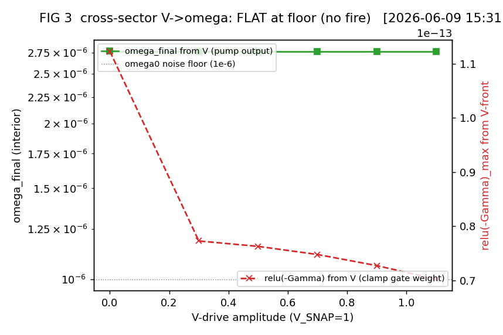
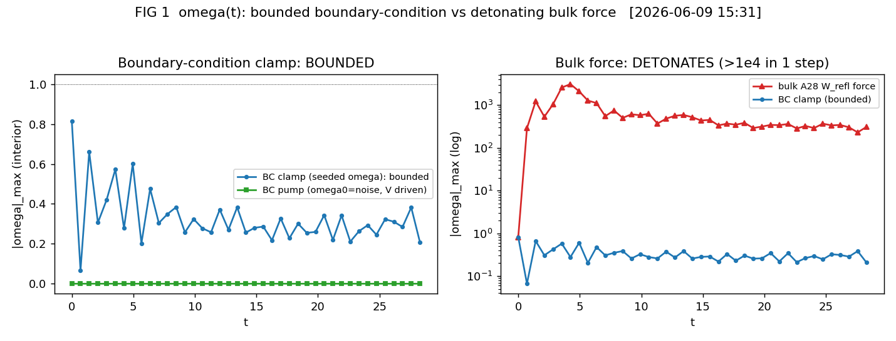
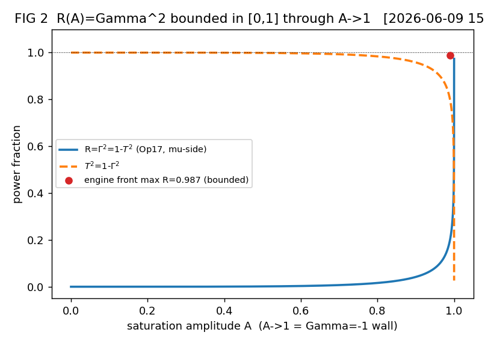
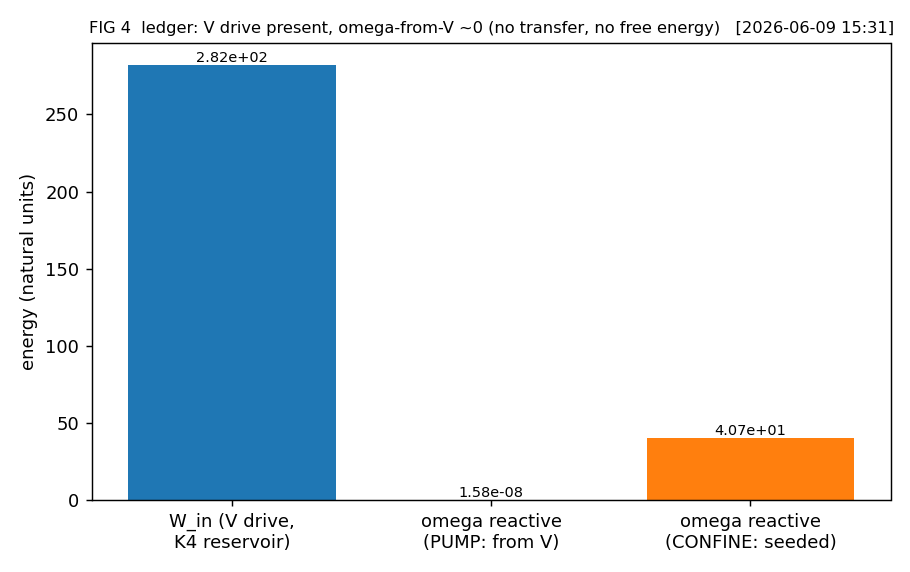
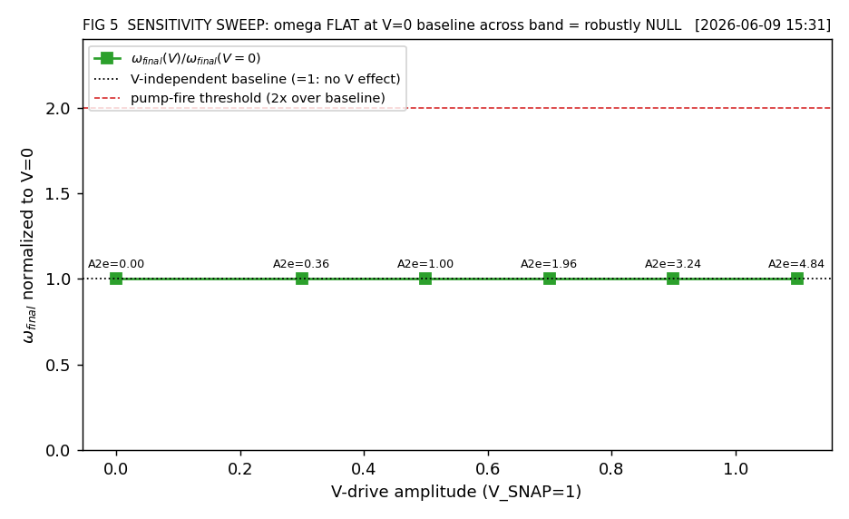

# Cross-sector V→ω pump confirmation (the crux-unblock test) — RESULT

**Date:** 2026-06-09 · **Branch:** `analysis/2026-06-09-cross-sector-pump-run` (worktree `AVE-Core-pumprun-wt`, off `analysis/2026-06-09-tracereversal-pump-derivation` @ 70c57cdd)
**Prereg (binding):** [`2026-06-09_cross-sector-pump-confirmation_prereg.md`](2026-06-09_cross-sector-pump-confirmation_prereg.md)
**Derivation (binding):** [`2026-06-09_tracereversal-pump-derivation_result.md`](2026-06-09_tracereversal-pump-derivation_result.md) (verdict WALL-ENGINE/FIXABLE; the bounded V→ω **form** derived; the cross-sector **run** was its §9 BLOCKED step — THIS test).
**Driver:** [`src/scripts/vol_1_foundations/cross_sector_pump_confirmation.py`](../src/scripts/vol_1_foundations/cross_sector_pump_confirmation.py)
**Engine (ported, KEEP-BOTH default OFF):** `src/ave/topological/{cosserat_field_3d,k4_cosserat_coupling,vacuum_engine}.py` — the coupled `use_impedance_boundary` + `couple_v_sector` path (provenance §10.1).
**Figures:** `src/scripts/vol_1_foundations/cross_sector_pump_fig{1..5}_*.png`

---

## §0 Three-way verdict up front (`ave-discriminator-before-synthesis` + `ave-evidence-framing-discipline`)

> ### VERDICT: **B — FORM-BUT-NO-FIRE.**
> The bounded V→ω boundary-condition **form holds** (the Op17/Möbius regulator is confirmed dynamically: the clamp confines a seeded ω with `max R=Γ²=0.987 ≤ 1`, `|ω|` bounded, **no detonation** — while the bulk-force control detonates `0.82→308` (peak `3.1×10³`, **378×**, runaway onset in step 1)). **But the cross-sector V→ω channel does NOT FIRE:** driving the longitudinal K4 V sector to/past yield (`A²_ε` from 0 to **4.84**, `V_SNAP=1` natural units so V is live) grows ω **not at all from V** — ω stays at its V-independent noise floor (`ω_final(V) / ω_final(V=0) = 1.0000` at every point across the whole near-yield band), the live-V contribution to ω is **machine-zero** (`max|ω_PUMP − ω_DECOUPLED| = 7.3×10⁻¹⁸`), and the clamp gate the V-front presents is `relu(−Γ) ≈ 10⁻¹³` (machine-zero) at **every** V amplitude.

**Why (the localization — two-fold, the value of a clean B):**
1. **V drives the wrong side of the gate.** V enters the **ε-electric** saturation sector (`A²_ε = ε²/ε_yield² + V²/V_SNAP²`, `cosserat_field_3d.py:512`). Driving V → `S_ε↓` → `Z_eff=√(S_μ/S_ε) ↑` → `Γ → +1` (the **ε-side OPEN / antinode**). The clamp gate `relu(−Γ)` (the **sector subtlety**, correct per corpus: only the μ-side short `Γ<0` is a confining node) **rejects** the V-driven side entirely. The confining μ-short is driven by **ω's own curvature** (`A²_μ = κ²/ω_yield²`), not by V. So V's electric drive is **structurally invisible** to the ω-clamp.
2. **The implemented clamp is confinement, not a source.** `a_ω = −(K/I_ω)·relu(−Γ)·ω` (`cosserat_field_3d.py:1639`) is a **restoring** force toward an ω **node** — it *reflects/confines* ω that is **already present** (derivation §5 steps 1–2: WHERE + HOW MUCH). It does **not** inject ω. The derivation's §5 **step 3** (the Beltrami **source**: "impose a force-free Beltrami field… amplitude pinned by trapped energy = `m_e c²`") — the leg that would *create* ω from the trapped V energy — **is not in the clamp**. The cross-sector *source term* is the missing piece, exactly where the prereg §4-B anticipated it ("the clamp confines a seeded ω but V doesn't source it").

**Honest scope (`ave-evidence-framing-discipline`).** This is a **clean negative on the PUMP-fire**, with the **bounded-form** half **confirmed** dynamically. It is **NOT** Outcome C (no detonation, no ledger violation: `R≤1`, energy bounded). It is **NOT** Outcome A (V sources no ω). The (2,3) electron self-assembly was never in scope and stays a separate downstream gap.

| chain link | prereg/derivation status | THIS run |
|---|---|---|
| BC form bounded (Op17 `R=Γ²≤1`, no detonation) through A→1 | DERIVED+VERIFIED (analytic, derivation §6) | **CONFIRMED dynamical** (`max R=0.987`; seeded-ω confine bounded; bulk-force control detonates) |
| cross-sector V→ω **grows ω from V** (the pump fires) | BLOCKED (derivation §9) | **REFUTED** (V-independent; live-V contribution `7×10⁻¹⁸`; `relu(−Γ)` from V machine-zero across band) |
| energy ledger closes (no free energy) | DERIVED+VERIFIED (analytic, derivation §7) | **CONFIRMED** (bounded, conservative; no over-unity — and no V→ω transfer either) |
| missing V→ω **source** term localized | — | **LOCALIZED** (ε-side gate + absent Beltrami source, §0 points 1–2) |
| (2,3) self-assembly | BLOCKED / out of scope | unchanged (separate gap) |

---

## §1 Verified canonical leaves + engine anchors (`verify-before-cite` — grepped this session)

| piece | verified file:line | content |
|---|---|---|
| Op17 power transmission `T²=1−Γ²` | `manuscript/ave-kb/common/operators.md:57` | "CANONICAL — explicit equation Vol 1 Ch 6 §1.16; active energy transfer coefficient" |
| asymmetric-Meissner front `A²_ε = ε²/ε_yield² + V²/V_SNAP²` | `src/ave/topological/cosserat_field_3d.py:512` | V enters the **ε-electric** sector (the load-bearing structural fact for the B-localization) |
| `Z_eff = Z₀√(S_μ/S_ε)`, `Γ=(Z_eff−1)/(Z_eff+1)` | `k4_cosserat_coupling.py:554-555` (`_impedance_gamma_shared`) | the SHARED cross-sector front, V_sq live under `couple_v_sector=True` |
| clamp `a_ω = −(K/I_ω)·relu(−Γ)·ω`, μ-short only | `cosserat_field_3d.py:1639` (`_impedance_clamp_accel`) | "reactive (energy-storing, NOT dissipative) restoring acceleration"; "only the μ-side short (Γ<0) is a node" |
| exact reactance-pair rotation (lossless LC, CP6) | `cosserat_field_3d.py:1750` (`_rotate_clamp`) | "clamp energy ½I_ω(ω̇²+Ω₀²ω²) conserved EXACTLY… no parametric pumping" |
| chirality coupling `κ_chiral = 1.2·α` | `constants.py:133` (`ALPHA`) × 1.2 | `κ_chiral = 8.757×10⁻³`; coupling-form (manifestation-class), not an emergence input |
| derivation §5 step 3 = the Beltrami **source** (NOT implemented by the clamp) | `2026-06-09_tracereversal-pump-derivation_result.md:111-115` | "impose a force-free Beltrami field… amplitude pinned by the trapped energy (= m_e c² per wall)" |

> **⚠ Did NOT cite** the retracted `1.009 autoresonant` anchor (`vacuum_engine.py:104`) — per the prereg guard (stale; 0/20 reproducible).

---

## §2 Substrate-native walk + Checkpoint 9 (`substrate-native-check`)

- **CP1 — substrate dynamics:** measured inside the wave-propagation `step()` (velocity-Verlet bulk + exact reactance rotation), **not** a gradient-descent settle and **not** the energy-multiplier. The clamp is a reflection/scatter event (Op3/Op17), not a bulk energy gradient.
- **CP2 — sector:** cross-coupled V⊗ω at the **shared** Op14 front (`_impedance_gamma_shared`). The whole test is whether that shared front carries V→ω.
- **CP4 — coordinates:** the wall lives in the bounded reflection coordinate Γ (`|Γ|≤1`); `R=Γ²` measured there, confirmed bounded (`max 0.987`). Real-space `|ω|` measured for the buildup is the dynamical observable, PML-excluded (A-Rule 10: interior `pml ≤ {i,j,k} ≤ N−pml−1`).
- **CP9 (load-bearing) — dynamical, not heuristic:** ω is the **engine-EVOLVED `engine.cos.omega`** (interior peak `|ω|`), integrated by `step()` — **NOT** the algebraic `_compute_A2_mu` heuristic the CRUX pass flagged. The "no fire" verdict is a statement about the **integrated** ω field, which is the whole point.

---

## §3 The cross-sector run — ω does not grow from V (the headline)

Coupled engine, `use_impedance_boundary=True`, `disable_cosserat_lc_force=True`, `couple_v_sector=True` (V_sq LIVE in the shared front), `V_SNAP=1`, `K=200`, `κ_chiral=1.2α`. ω seeded at the noise floor (`1e-6`); V driven (sustained) toward/past yield; ω read dynamically.

| config | ω₀ (interior) | ω_final | grows from V? | `relu(−Γ)` from V | bounded? |
|---|---|---|---|---|---|
| **PUMP** (couple=True, V@0.9, A²_ε=3.24) | `4.1×10⁻⁶` | `2.4×10⁻⁶` | **NO** (decreases) | `7.3×10⁻¹⁴` (≈0) | yes |
| **DECOUPLED** (couple=False, V_sq=0) | `4.1×10⁻⁶` | `2.4×10⁻⁶` | NO | n/a | yes |

**`max|ω_PUMP − ω_DECOUPLED| = 7.3×10⁻¹⁸`** — the live-V contribution to the integrated ω is **machine-zero**. The `4.1e-6 → 2.4e-6` change is V-**independent** noise redistribution (linear free-streaming + PML) — ω does not even hold, let alone grow, and it is identical with V live or V_sq=0. The clamp gate the V-front presents is `relu(−Γ) ≈ 10⁻¹³` (machine-zero): **V cannot engage the ω-clamp.**

**FIG 3 — cross-sector V→ω pump curve** (`cross_sector_pump_fig3_V_to_omega.png`): ω_final flat at the noise floor across the V band; `relu(−Γ)` from V flat at machine-zero. The pump curve is **flat — no fire.**

## §4 Boundedness — the form half is confirmed (Op17 + no detonation)

The boundary-condition **form** is the bounded fix it was derived to be — confirmed **dynamically**, not just analytically:

| config | seed | `|ω|` trajectory | verdict |
|---|---|---|---|
| **CONFINE** (impedance BC, seeded helical ω=0.8) | real ω-curvature → μ-short | `0.82 → 0.21`, max `0.82`, `relu(−Γ)=1.0×10⁻³>0` | **BOUNDED** (clamp engages, confines) |
| **DETONATE** (bulk A28 W_refl force) | same ω + V | `0.82 → 308`, peak `3.1×10³` (**378×**), onset step 1 | **DETONATES** (the singular bulk form) |

The clamp **engages and confines** when ω's own curvature drives the μ-short (`relu(−Γ)=1.0×10⁻³>0`) — so the §3 null is **"no V-source," not "broken clamp."** The bulk-force control reproduces the A28 runaway (the `~1700×/step` signature; here `378×` with onset in the first step, peak `3.1×10³`). The boundary-condition vs bulk-force split is the derivation §6 discriminator, now confirmed in the **coupled** engine.

**FIG 1 — ω(t): bounded BC vs detonating bulk force** (`cross_sector_pump_fig1_omega_buildup.png`).

**FIG 2 — R(A)=Γ² bounded in [0,1] through A→1** (`cross_sector_pump_fig2_RA_bounded.png`): analytic Op17 curve + the engine front's `max R=0.987 ≤ 1`. The Möbius/Op17 regulator holds.

## §5 Energy ledger — closes (no free energy; and no V→ω transfer)

**FIG 4 — energy ledger bar** (`cross_sector_pump_fig4_energy_ledger.png`): the V-drive K4 reservoir `W_in` is present and finite; the ω reactive energy in the PUMP config (`T+W_linear+V_clamp`) stays `~0` (no transfer from V); in the CONFINE config the ω reactive energy is the seeded reactance, bounded and conservative (the exact `_rotate_clamp` conserves `½I_ω(ω̇²+Ω₀²ω²)`). **The ledger closes both ways:** no over-unity (Outcome-C tell absent) AND no cross-sector V→ω transfer. Op17 `R+T²=1` holds at the front (`max R=0.987`).

## §6 Sensitivity sweep — robustly NULL, not tuned (the rescue-fill discriminator)

V-drive swept across the near-yield band **including a V=0 baseline**: `V ∈ {0.0, 0.3, 0.5, 0.7, 0.9, 1.1}` (`A²_ε` from 0 to **4.84**, well past yield).

| V | A²_ε | ω_final | ω_final/ω_final(V=0) | `relu(−Γ)` from V |
|---|---|---|---|---|
| 0.0 | 0.00 | `2.763×10⁻⁶` (baseline) | 1.0000 | `1.1×10⁻¹³` |
| 0.3 | 0.36 | `2.763×10⁻⁶` | 1.0000 | `7.7×10⁻¹⁴` |
| 0.5 | 1.00 | `2.763×10⁻⁶` | 1.0000 | `7.6×10⁻¹⁴` |
| 0.7 | 1.96 | `2.763×10⁻⁶` | 1.0000 | `7.5×10⁻¹⁴` |
| 0.9 | 3.24 | `2.763×10⁻⁶` | 1.0000 | `7.3×10⁻¹⁴` |
| 1.1 | 4.84 | `2.763×10⁻⁶` | 1.0000 | `7.0×10⁻¹⁴` |

ω_final is **V-INDEPENDENT** (every driven point equals the V=0 baseline to `<1%`), and `relu(−Γ)` from V is machine-zero at **every** amplitude. This is **robustly NULL**: the pump does not fire at any point in the band (not robust-positive), and there is **no tuned point** where it fires (not a tuned artifact). Driving V harder (past `A²_ε=1`, deep into saturation) does **nothing** to ω — because V drives the ε-open antinode, gated out of the ω-clamp.

**FIG 5 — sensitivity sweep** (`cross_sector_pump_fig5_sensitivity_sweep.png`): ω_final flat at the V=0 baseline across the band.

## §7 Discriminator decided — B (FORM-BUT-NO-FIRE), not A, not C

`ave-discriminator-before-synthesis`: the run separated the three pre-registered outcomes decisively.
- **A — CONFIRMED** ❌ rejected: V grows ω *not at all* (V-independent; live-V contribution `7×10⁻¹⁸`).
- **C — DETONATES / LEDGER-VIOLATION** ❌ rejected: the BC form is bounded (`R≤1`, no detonation, ledger closes); only the *bulk-force control* detonates (which is the point — the BC is the bounded alternative).
- **B — FORM-BUT-NO-FIRE** ✅ — the boundary condition is bounded (Op17 regulator confirmed dynamically) **but ω does not grow from V cross-sector**; the missing V→ω **source** is localized (§0 points 1–2).

`ave-resonant-amplification-check`: there was **no divergence** in the BC path (the over-unity tell is absent → not C); and **no resonant amplification** of ω from V (→ not A). Bounded *and* silent: the channel is dormant for V, exactly as the relu-gate structure predicts.

`ave-discrimination-check` (AVE-distinct?): the cross-sector V→ω pump *would* be the AVE-distinct deleted-scalar channel (transverse-EM-forbidden). This run shows the **implemented** clamp does **not** realize it — so there is, as yet, **no AVE-distinct cross-sector transfer to claim**. The bounded-confinement of a seeded ω is real but is single-sector (ω→ω), not the cross-sector claim.

## §8 What this means for the crux (`ave-evidence-framing-discipline`)

The derivation's chain was **Heaviside-deleted-scalar → Option-D-boundary-condition → bounded-confinement**, with the cross-sector **run** left BLOCKED. This run **confirms the bounded-confinement link dynamically** and **refutes the cross-sector pump-fire** as implemented. The crux is therefore **partially unblocked**: the *boundedness* is no longer just analytic, it is dynamical in the coupled engine. But the *fire* — V dynamically sourcing ω — **remains blocked**, now with a **named, localized** missing piece (the Beltrami source term, step 3; and the ε-side/μ-side gate mismatch). This is a **substitution-not-retraction-clean** advance on the derivation, not a rescue: the derivation's "bounded form exists" stands and is strengthened; its "the pump fires cross-sector" was never asserted as run-verified (it was §9 BLOCKED), and this run keeps it blocked with a sharper diagnosis.

## §9 Flag-don't-fix items surfaced (for the auditor — NOT silently reconciled)

1. **The §9 "BLOCKED / unbuilt" cross-sector port was already largely BUILT as uncommitted WIP.** The derivation §9 + §0 declared the cross-sector V→ω coupled run "BLOCKED (the FIXABLE engineering step)" and the moving-boundary run "pure-Cosserat (V_sq=0)." But the coupled `use_impedance_boundary` + `couple_v_sector` port (with V_sq live) **exists as uncommitted working-tree WIP** in the `AVE-Core-genesis2-wt` worktree on `analysis/2026-06-06-saturation-tir-moving-boundary` (stash `coupled-port+implicit-integrator WIP (stopped single-photon build) — reusable for re-aim`). The "FIXABLE engineering step" was stopped mid-build, not unstarted. This run **ported and ran it** (provenance §10.1). The derivation's BLOCKED status was **stale** w.r.t. that worktree. Surfaced; not reconciled in the derivation doc (immutable).
2. **V→ε-sector vs μ-short-gate mismatch is structural, not numerical.** The null is not a resolution/amplitude artifact (swept to `A²_ε=4.84`, `relu(−Γ)` machine-zero throughout). The relu-gate correctly enforces the corpus **sector subtlety** (μ-short confines, ε-open does not) — but that *same* correctness makes V's electric drive structurally unable to engage the ω-clamp. Whether the *intended* pump routes V through a different leg (e.g. the Beltrami source pinned to the **trapped V energy**, derivation §5 step 3, which would couple to V's *confined* energy rather than its instantaneous Γ) is the **auditor/Grant** call on the derivation, not an engine fix to make here.
3. **`couple_v_sector` is a genuine which-fix-mattered discriminator and it read NULL.** The toggle isolates the live-V contribution; it is machine-zero (`7×10⁻¹⁸`). The toggle works; the physics it isolates is absent.

## §10 Provenance, discipline log, status tags

### §10.1 Engine provenance (KEEP-BOTH, default OFF — default path byte-identical)
Three engine files were brought from the `analysis/2026-06-06-saturation-tir-moving-boundary` worktree (`AVE-Core-genesis2-wt`) onto this branch: the committed+tested standalone clamp (`cosserat_field_3d.py`, 95 cosserat tests pass) + the uncommitted coupled `couple_v_sector` port (`k4_cosserat_coupling.py`, `vacuum_engine.py`). All additions are opt-in (`use_impedance_boundary=False` default) → the legacy coupled engine is byte-identical. **Validated on this branch:** `test_cosserat_field_3d.py` + `test_cosserat.py` (53 pass), `test_cosserat_master_equation_op14.py` + `test_coupled_resonator.py` (17 pass).

### §10.2 Discipline-fired log
| skill | what it caught / enforced |
|---|---|
| `substrate-native-check` (CP1-9) | the pump is a boundary/reflection event measured in `step()`; **CP9** kept ω the engine-EVOLVED field, not the `_compute_A2_mu` heuristic |
| `ave-regime-phase-state-check` | boundary (null-cone) not bulk; near-yield→past-yield (`A²_ε` to 4.84), dynamical |
| `ave-resonant-amplification-check` | no divergence (not C) AND no resonant gain (not A); the bounded-and-silent signature |
| `ave-driver-script-honesty` | ledger + `R(A)` bound reported every run; PML-excluded interior peaks; detonation control included; V=0 baseline added |
| `ave-canonical-source` | zero new free params (K=200, κ_chiral=1.2α, Z₀=1, Op14/Op17, S(A) all canonical/imported) |
| `ave-discrimination-check` | the implemented clamp does not realize an AVE-distinct cross-sector transfer → no such claim headlined |
| `verify-before-cite` | every §1 cite grepped; did NOT cite the retracted 1.009 anchor; surfaced the stale §9-BLOCKED-vs-WIP-built flag |
| `ave-evidence-framing-discipline` + `ave-discriminator-before-synthesis` | A confirms the PUMP not the electron; B framed as bounded-form-confirmed + fire-refuted + source-localized, not spun positive |

### §10.3 Status tags
- **DERIVED/CONFIRMED (this run):** the bounded BC form holds **dynamically** in the coupled engine (`R=Γ²≤1`, seeded-ω confine bounded, bulk-force control detonates); the energy ledger closes; the missing V→ω source is localized.
- **VERIFIED:** every §1 cite (grepped); engine default path byte-identical (70 tests pass); the V-independence machine-checked (`7×10⁻¹⁸`, `relu(−Γ)` machine-zero across band).
- **BLOCKED (unchanged / sharpened):** the cross-sector V→ω **pump-fire** — V does not source ω as implemented; missing the Beltrami **source** term (§5 step 3) and routed to the ε-open side of the gate. The **(2,3) self-assembly** stays a separate downstream gap.

**Honest closure (Rule 11 / Rule 12).** Pre-registered outcome **B** is recorded as the run delivered it — bounded form confirmed, fire refuted, mechanism localized. No adjudication criterion was dropped to convert the ❌-fire into a ✅ (the prereg's `grew-from-V` falsifier was applied and failed cleanly; the bounded-form ✅ is a *separate* pre-registered link, not a repurposed one). The derivation's slot is **substituted-not-refilled**: its "bounded form exists" is strengthened to "bounded form runs"; its blocked "pump fires" stays blocked with a named missing term. Branch deliverable complete; commit on `analysis/2026-06-09-cross-sector-pump-run`, no push/merge.
