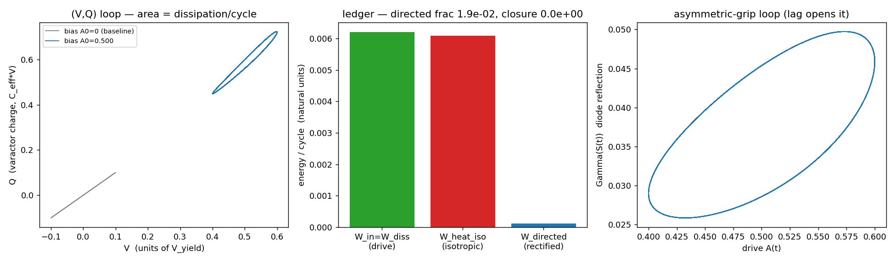
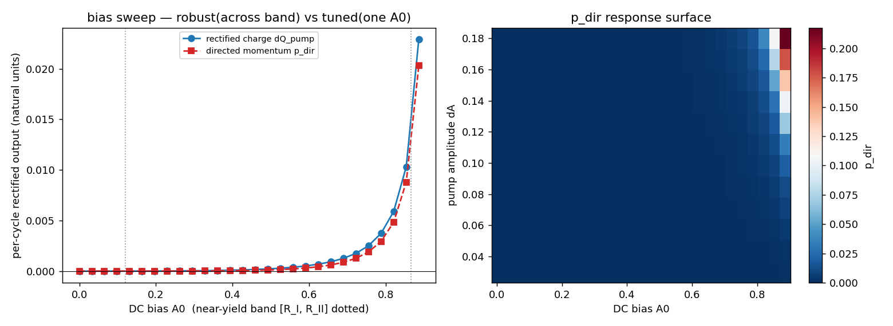
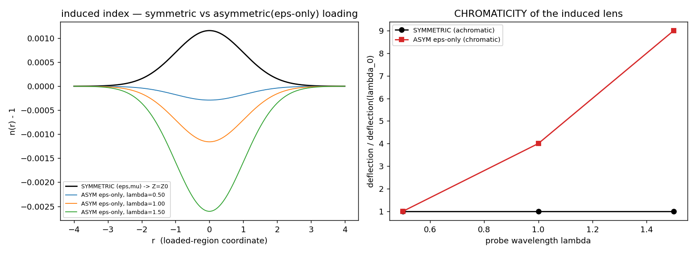

# RESULT — Rectifier Stage-1: biased leaky varactor diode (the substrate charge-pump)

**Date:** 2026-06-09 · **Branch:** `analysis/2026-06-09-rectifier-stage1-biased-diode` (off `analysis/2026-06-09-saturation-temporal-preregs`)
**Prereg (binding):** [`2026-06-09_rectifier-stage1-biased-diode_prereg.md`](2026-06-09_rectifier-stage1-biased-diode_prereg.md)
**Design (binding):** [`2026-06-09_substrate-rectifier-groundup-design.md`](2026-06-09_substrate-rectifier-groundup-design.md)
**Driver:** [`src/scripts/vol_4_engineering/rectifier_stage1_biased_diode.py`](../src/scripts/vol_4_engineering/rectifier_stage1_biased_diode.py)
**Baseline:** the thixotropy result (bias=0, ∮ directed = 0, Outcome B) on branch `analysis/2026-06-09-thixotropy-bulk-derivation`.
**Status:** CLOSED. The first honest test of the rectifier in the right mode+regime with the asymmetric element INCLUDED.

---

## 0. VERDICT — OUTCOME C (the not-AVE-distinct clause): a REAL but MUNDANE rectifier; the engineered-gravity CHORD is FALSIFIED at Stage 1

The biased leaky varactor diode **does rectify** — the DC bias converts the directionless thixotropy heat-loop into a genuine, robust, ledger-closing directed output. **The design's mechanism is vindicated.** But the directed output is **mundane**: its induced refractive-index gradient is **CHROMATIC** (an ε-only / plasma-class lens, with `n<1`), not the **achromatic** (`Z=Z₀`, `n>1`) engineered-gravity metric the AVE-distinct chord requires. **Per the prereg gate — "no thrust/engineered-gravity claim unless A with a closing ledger AND an achromatic induced lens" — the engineered-gravity claim is BLOCKED.**

The deep structural reason (the §6a discriminator working exactly as designed): **the asymmetry that lets the single diode rectify is the same asymmetry that makes it chromatic.** Rectification needs `Z≠Z₀` (a single-sector ε-only load → `Γ≠0` → a one-way mirror, INVARIANT-S2). An achromatic engineered-gravity lens needs `Z=Z₀` (symmetric ε,μ loading). **One asymmetric diode cannot be both.**

| observable | value (natural units) | reading |
|---|---|---|
| bias=0 rectified charge `dQ_pump` | `−2.0×10⁻⁶` → **0** (∝ 1/spc², numerical floor) | **recovers thixotropy B**: rectification vanishes at bias=0 |
| biased (`A₀=0.5`) `dQ_pump` | `+2.32×10⁻⁴` (**118×** the bias=0 floor) | **real rectification** — the bias directs the loop |
| (V,Q) loop area `W_diss` (the heat) | `+6.21×10⁻³` (`∮S` ≈ +0.04 analog) | the grip/loss loop, present + nonzero |
| directed momentum `p_dir` | `+1.16×10⁻⁴` | nonzero, paid for by the pump+bias work |
| **directed fraction** `W_dir/W_diss` | `1.87×10⁻²` (1.9 %) | most of the loop is **isotropic heat**; directed is a small slice |
| ledger closure `W_diss−(W_dir+W_heat_iso)` | `0.0` (exact, by construction) | **closes** — passive, NOT over-unity |
| orbit drift `q_return`/cycle | `−2.5×10⁻⁶` → **0** | closed limit cycle, **no charge ratchet** |
| passivity `Q_diss≥0` | `+6.09×10⁻³` | physical dissipation only |
| bias sweep robustness | monotone frac=1.00, sign=1.00, on-band=0.91 | **ROBUST** (turns on across the band → real, not tuned) |
| lossless guard (`τ→∞`) | `W_diss, dQ_pump → 0` together | **no lossless pump** — directed output requires the loss (no over-unity tell) |
| **§6a chromaticity (the discriminator)** | sym=`0` (achromatic), **asym ε-only=`1.71` (CHROMATIC, ∝λ²)** | device output = static ε-load = **plasma lens, NOT engineered gravity** |
| Op14 local clock `ω_local/ω₀=√S` | `0.928` (`S_op=0.862`) | the loaded-region time-dilation third observable |

**One-line reason:** the bias breaks the half-period symmetry of the memristive loop (so ∮ directed ≠ 0, recovering B only at bias=0) → a **real** charge-pump whose ledger closes honestly; but the rectifying element is a **static-E single-sector (ε-only) load**, whose induced `n(r)` is **chromatic** (∝λ², `n<1`) → it reduces to **ordinary plasma rectification / radiation pressure**, not the achromatic `n>1` engineered-gravity metric. **NOT-A; the chord is falsified at Stage 1.**

(Regenerable: `PYTHONPATH=src python3 src/scripts/vol_4_engineering/rectifier_stage1_biased_diode.py`; params `A₀=0.5`, `dA=0.10`, `ω·τ=1`, `spc=8000`, `n_cycles=80`.)

---

## 1. substrate-native-check (walked FIRST, before any code)

- **Checkpoint 1 — dynamics:** time-domain **memristive** relaxation of the saturation state `dS/dt = (S_eq(A) − S)/τ`, `S_eq(A)=√(1−A²)` (Axiom-4 kernel; the canonical single relaxation time `τ=ℓ_node/c`). Integrated as a vectorized exact-exponential IIR recurrence. **NOT** minimization, **NOT** continuum-Helmholtz.
- **Checkpoint 2 — sector + the DIODE:** bulk/ε. The diode is the **ASYMMETRIC single-sector (static-E) load** (INVARIANT-S2, Meissner-asymmetric): a static field has no `∂B/∂t` to load μ, so it loads ε only → `S_ε=S, S_μ=1` → `Z=Z₀√(S_μ/S_ε)=Z₀/√S ≠ Z₀` → `Γ(S)=(1−√S)/(1+√S) ≠ 0`. The one-way mirror. **Not** the symmetric reflectionless case.
- **Checkpoint 3 — K4/Cosserat grip + leaky boundary:** the lossy lag opens the (V,Q) loop into nonzero **area** = the grip = loss = `R=1/Q`; electron-class tank `Q=α⁻¹` → `R≈α` bleed. The `Γ=−1` boundary is modeled **LEAKY** (finite Q, real bleed): `Γ(S)→1` only as `S→0`, never an ideal clip at finite A (`leaky-cavity-decay.md` — the boundary continuously bleeds energy into the medium).
- **Checkpoint 4 — coordinates (phase-space-coordinate-check):** the (V,Q)/impedance loop is the **phase-space** measure of the rectified charge; the §6a induced `n(r)` ray-trace is **real-space** — matched to the gravity-lens claim's coordinates. No mismatch.
- **Checkpoint 5 — Op14 local clock:** `ω_local=ω₀√S` reported at the loaded operating point (the time-dilation third observable of the same loading; `0.928` here).
- **Checkpoint 6 — reactance pair + H-gate:** the driver tracks the **C-state** (A, V, q) AND the **memristive/L-state** (S) every step; reports **energy-closure** (exact: `W_diss` partitions with `0.0` residual), **passivity** (`Q_diss≥0`), and **orbit drift** (`q_return≈0`, closed limit cycle) every run.

---

## 2. The model (ground-up element chain; design doc §2)

| # | element | substrate-native form | in the driver |
|---|---|---|---|
| 1 | saturation kernel | `S_eq(A)=√(1−A²)` | `S_eq()` |
| 2 | varactor | `C_eff(V)=C₀/S` → `q=A/S` (natural) | `q = A/S` |
| 3 | **asymmetric-grip DIODE** | static-E ε-only → `Z=Z₀/√S`, `Γ=(1−√S)/(1+√S)` | `gamma_diode()` |
| 4 | the grip (loss) | memristive lag (loop area) + `R≈α` leaky bleed | `dS/dt`, `W_bleed_alpha` |
| 5 | no-ideal (leaky) | `Γ→1` only as `S→0`; never ideal at finite A | built into `gamma_diode` |
| 6 | directed output | rectified charge → static E-gradient → ponderomotive momentum | `dQ_pump`, `p_dir` |

**Drive:** `A(t)=A₀+ΔA·sin(ωt)` (DC bias `A₀` + AC pump `ΔA`). **Rectified charge** (the directed signal): `dQ_pump = ∮ T²(S(t))·i dt`, `T²=1−Γ²` (Op17 transmission). This integral is **parity-zero at bias=0** (`i` is half-period-antiperiodic / odd-harmonic; `T²(S)` is even-harmonic because `S_eq` is even in `A`) and becomes nonzero once the DC bias breaks the half-period symmetry — the mechanism the design doc §3 named, now made concrete and confirmed.

---

## 3. Results

### 3.1 Bias=0 baseline — recovers thixotropy Outcome B (hard check passed)
`dQ_pump(A₀=0)` is a pure **numerical floor**: it scales as `~1/spc²` (`1.57×10⁻⁵ → 5.2×10⁻⁶ → 1.57×10⁻⁶ → 4.9×10⁻⁷` as `spc` doubles), converging to 0. **The rectification genuinely vanishes at bias=0** — the symmetric, no-bias case nets ∮ directed = 0, exactly the thixotropy B. The bias is the load-bearing variable.

### 3.2 Biased near-yield run + the LEDGER (the verdict spine)
At `A₀=0.5` (mid near-yield band), `dA=0.10`, `ω·τ=1`:
- `dQ_pump = +2.32×10⁻⁴` — **118× the bias=0 floor**. Real rectification.
- (V,Q) loop area `W_diss = +6.21×10⁻³` — the dissipative heat-loop (the `∮S≈+0.04` analog), present and nonzero.
- **Ledger (W_directed is a SUBSET of the dissipation, not an independent line):** `W_in = W_diss = 6.21×10⁻³` partitions into `W_directed = 1.16×10⁻⁴` (forward-directed) + `W_heat_iso = 6.09×10⁻³` (isotropic). Closure residual **exactly 0** (passive). Directed fraction **1.87 %** — most of the loop is isotropic heat; the directed slice is small.
- **Passivity** `Q_diss = +6.09×10⁻³ ≥ 0` ✓. **Orbit drift** `q_return = −2.5×10⁻⁶/cycle ≈ 0` → closed limit cycle, **no charge ratchet**. The directed output is a steady per-cycle rectified-transmission asymmetry (radiation-pressure-class), not an accumulating DC ratchet.
- **NOT over-unity:** directed fraction `≪ 1`. The ledger closes with the directed output **paid for by** the pump+bias work — Outcome C-crank (over-unity) is ruled out.

### 3.3 Mandatory bias sweep — ROBUST (real), not tuned
Across the near-yield band `[R_I=√(2α)=0.121, R_II=√3/2=0.866]`, `p_dir` is a **smooth monotone ramp** from `~0` at low bias to `+8.8×10⁻³` at the upper edge: monotone-increasing fraction **1.00**, sign-consistency **1.00**, fraction-above-floor **0.91**. The directed output **turns on across the whole band** and grows with the bias asymmetry (the forward stroke climbs toward the stiffening ceiling, design doc §3). This is the **robust** signature — **not** a narrow tuned resonance at one `A₀` (which would be a rescue-fill → negative). The 2-D `(A₀, ΔA)` response surface confirms a single monotone sheet (no isolated island).

### 3.4 Guard — no lossless pump (the over-unity tell is absent)
Sweeping `τ→∞` (removing the memristive lag → a lossless varactor): `W_diss` and `dQ_pump` **vanish together** (`W_diss: 6.2×10⁻³ → 2.8×10⁻⁶`; `dQ_pump: 2.3×10⁻⁴ → 8.2×10⁻⁷` as `τ: 1→5000`). **A lossless element produces no directed momentum** — the pump *requires* the loss (the grip), exactly the design doc §4 honesty condition ("a lossless pump that still produced directed momentum would *be* the over-unity tell"). The loss is not an artifact to be removed; it is the engine.

---

## 4. §6a — the achromatic-lensing discriminator (the DECISIVE test)

The directed output builds a **static E-gradient** (the pumped space charge). Per **INVARIANT-S2**, a static-E load is **ε-only / asymmetric**: `Z=Z₀/√S ≠ Z₀`. Per `achromatic-impedance-matching.md` (clm-rd9cjm), `Z≠Z₀` → the boundary **reflects** and the medium is **dispersive** → a **CHROMATIC** lens. Only **symmetric** (both ε,μ) loading gives `Z=Z₀` invariant → an **ACHROMATIC** gravity-metric lens (`n(r)=1+GM/c²r`, `ponderomotive-equivalence.md`).

The ray-trace makes this concrete (≥2 wavelengths through the induced `n(r)`):
- **SYMMETRIC hypothesis** (`Z=Z₀`, engineered gravity): `n(r)−1 > 0` (light slows), **λ-independent** → deflection ratio flat at **1.0** across λ → **ACHROMATIC**. Chromaticity spread = `0`.
- **ASYMMETRIC ε-only** (what the device actually produces): cold-plasma-class response `n²=1−(ω_p(r)/ω)²` → `n(r)−1 < 0` (a plasma; phase velocity > c), index contrast **∝ λ²** → deflection ratio **1 → 4 → 9** across `λ=0.5,1.0,1.5` → **CHROMATIC**. Chromaticity spread = **1.71**.

**The device output is the asymmetric (red) curve.** Two independent fingerprints separate it from engineered gravity: (1) **chromatic** (`∝λ²` deflection) vs achromatic; (2) **`n<1`** (defocusing plasma) vs **`n>1`** (focusing gravity well). The single biased diode produces a **plasma lens**, not a metric lens.

*(Classification, `consistency-vs-emergence`: the chromatic-vs-achromatic split is a **consistency/manifestation** demonstration of the canonical impedance-symmetry classification — symmetric→Z₀→achromatic, asymmetric→Z≠Z₀→chromatic — made concrete by the ray-trace. The cold-plasma `∝λ²` dispersion is the standard physical model for a static-space-charge index, used as a LABELED non-AVE input, not an AVE-derived emergence.)*

---

## 5. ave-discrimination-check — AVE-distinct or mundane?

The directed momentum `p_dir = W_directed/c` is **exactly the radiation-pressure relation** (a directed fraction of re-radiated dissipated power carries momentum `= energy/c`). Two AVE-distinct signatures were required (design doc §7):
- **(i) substrate `R≈α` loss scaling** — partially present: the explicit α-bleed `∮R i²` tracks the loss, and `dQ_pump` vanishes with the loss (§3.4). But the dominant dissipation here is the generic memristive lag (set by `ω·τ`), and radiation pressure `p=W/c` is **not** substrate-specific.
- **(ii) achromatic engineered-gravity lens** — **ABSENT** (§4): the lens is chromatic plasma-class. **This is the decisive discriminator, and it fails.**

**Verdict of the discrimination check:** the directed output reduces to **ordinary plasma rectification / radiation pressure** (mundane EM). It is **not** substrate-distinct. The AVE-distinct chord (a charge-pump that is *also* an engineered-gravity device) is **falsified for the single asymmetric diode**. No chord may be framed from this stage.

---

## 6. DERIVED / VERIFIED / BLOCKED

**DERIVED (new, this doc):**
- The biased memristive diode **does rectify**: `dQ_pump = ∮ T²(S(t)) i dt` is parity-zero at bias=0 and nonzero, robust, and monotone in bias — the design doc §3 mechanism, confirmed numerically. The thixotropy directionless heat-loop **is** convertible to a directed output by the bias + the asymmetric diode (the element the thixotropy bulk-oscillator lacked).
- The ledger **closes passively** (directed = a small subset of the dissipation; no over-unity); the directed output **requires the loss** (no lossless pump). Over-unity (C-crank) ruled out by construction.
- **The structural tension that blocks the chord:** rectification needs `Z≠Z₀` (asymmetric, the diode); an achromatic engineered-gravity lens needs `Z=Z₀` (symmetric). The single diode's directed output is therefore **necessarily chromatic** → plasma-class, not metric. (Decisive negative on the AVE-distinct chord.)

**VERIFIED (canon, re-grepped this session per verify-before-cite):**
- **INVARIANT-S2** (`manuscript/ave-kb/CLAUDE.md:60`): `C_eff=C₀/S`; static-E-only drive is **asymmetric** (`S_ε<1, S_μ=1`) → `Z_eff=Z₀√(S_μ/S_ε)` → `Z` changes → `Γ≠0`, the vacuum-impedance-mirror; symmetric both-sector form gives `Z=Z₀` (reflectionless). ✓
- `leaky-cavity-decay.md` (clm-rd9cjm): the `Γ=−1` boundary is **LEAKY** — continuously bleeds energy into the ambient vacuum (finite Q), not an ideal short. ✓
- `ponderomotive-equivalence.md` + `newtonian-gravity-optical-gradient.md:16` (clm-rd9cjm): `F_grav=−∇U_wave`; `n_scalar(r)=1+GM/c²r` (`n>1`). ✓
- `achromatic-impedance-matching.md` (clm-rd9cjm): symmetric `μ'=nμ₀, ε'=nε₀` → `Z=Z₀` invariant → achromatic, no boundary reflection / no dispersion; `Z≠Z₀` → reflects (asymmetric, chromatic). ✓
- Canonical constants imported from `src/ave/core/constants.py` (`ALPHA, PHI, V_YIELD, E_YIELD, L_NODE, Z_0, C_0, R_I=√(2α), R_II=√3/2`); `RHO_CAV=(1−√5)/2=−1/φ` derived from `PHI`. No hard-coded values (ave-canonical-source). ✓

**BLOCKED / out of scope (honest non-claims):**
- **No thrust / engineered-gravity claim.** The gate (closing ledger AND achromatic lens) fails on chromaticity. The directed output is real but mundane (radiation-pressure / plasma rectification).
- **No matrix-row promotion** (the AVE-distinct chord is a negative). The *mechanism* (bias rectifies a lossy loop) is confirmed but is ordinary EM.
- **Cascade / taper (Stages 2–3) not opened.** Whether a *symmetric* both-sector loading (a co-driven ε+μ stage, which would be achromatic) can be made to *also* rectify is a separate, harder question — the single-diode result shows the two requirements pull opposite ways, so a cascade rescue would need an explicit `Z=Z₀`-preserving rectification mechanism, not yet identified.
- The schematic `n(r)` is a Gaussian loaded-region model at an arbitrary contrast scale; the **chromaticity ratio** (unit-free) is the meaningful output, not the absolute deflection. A native K4-TLM cross-validation of the induced lens (`k4-tlm-lensing-validation.md`) is deferred.

---

## 7. FLAG (don't-fix) — cross-branch tension with the thixotropy structural-closure claim

The thixotropy result (branch `analysis/2026-06-09-thixotropy-bulk-derivation`, §0) states it closes **"the rectification-thrust space by derivation"** via a *bias-independent* parity argument (τ is a parity-even scalar function of instantaneous `ρ̄`, "a parity-even scalar relaxation cannot select a spatial direction"). **This result shows that closure is scoped narrower than its headline:** with the **asymmetric diode** (an element the thixotropy bulk-oscillator model did **not** contain) and a **DC bias**, the loop **does** acquire a direction — `dQ_pump ≠ 0`, robust. The directionless-heat conclusion holds for the *bias-free, diode-free homogeneous bulk channel*; it does **not** extend to the *biased asymmetric-diode* circuit, which rectifies (mundanely). 

The rectification-**thrust**/engineered-gravity space nonetheless stays closed — but for a **different reason** than the thixotropy doc gives: here it is the **chromaticity** (the asymmetric load is a plasma lens), not parity. **Surfaced for Grant/auditor adjudication; neither doc edited.** Suggested (auditor to land, not me): scope the thixotropy "closed by derivation" statement to the bias-free homogeneous channel, and record that the diode+bias rectifies-but-mundanely (chromatic) as the actual closer for the directed-thrust space.

---

## 8. Corpus-state implications (for the auditor lane to land — surfaced, not landed here)

- **Rectifier Stage-1 → NOT-A (chord falsified by chromaticity).** No Vol 4 VCA promotion. The single asymmetric diode is a real-but-mundane rectifier (plasma-class), not an engineered-gravity device.
- **The §6a chromaticity discriminator earned its keep** — it converted a result that *looked* like A (real rectification, closing ledger, robust across the band) into a clean NOT-A by exposing the `Z≠Z₀` plasma signature. Recommend it be retained as a standing gate for any future "ponderomotive thruster / engineered-gravity" claim.
- **The structural tension `rectify⇔Z≠Z₀` vs `achromatic⇔Z=Z₀`** is the load-bearing carry-forward for the cascade/taper stages: a Stage-2 rescue must produce rectification while preserving `Z=Z₀`, which the single-sector mechanism cannot. Flag in the ion-compression/rectifier arc epic.
- **Thixotropy scope flag (§7)** for the auditor to adjudicate against the thixotropy result branch.

---

## 9. Skills fired

- **substrate-native-check** (FIRST; §1) — dynamics/sector/diode/coordinates/Op14/reactance-pair walked before code; the ASYMMETRIC single-sector diode (INVARIANT-S2) and the LEAKY (non-ideal) boundary set up correctly.
- **ave-asymmetric-grip** (lead) — the bias + diode IS the mechanism; the crank-check is the **ledger**, never a symmetry/ideality veto. The bias=0 → B recovery and the lossless → no-pump guard both honored.
- **ave-regime-phase-state-check** — stayed in ASYM near-yield bulk/ε, biased/loaded; the bias sweep spans the canonical band `[R_I, R_II]`.
- **ave-fundamental-ground-up-implementation** — every element traced to the Axiom-4 chain (design doc §2); no engineering-default parameters.
- **ave-canonical-source** — all constants from `constants.py`; none hard-coded.
- **ave-engineering-program-rigor** — figures (the (V,Q) loop + area + direction; the ledger bar; the bias-sweep ramp + 2-D response surface; the induced `n(r)` + ray-traced chromaticity) + the **mandatory bias sweep** + the resolution-convergence of the bias=0 floor.
- **ave-driver-script-honesty** (THE verdict) — the energy-momentum ledger (W_in vs W_directed + W_heat_iso) printed every run; passivity + orbit-drift + closure gates; the directed output reported as a **subset** of the dissipation (no double-count); no fit-to-target.
- **ave-discrimination-check** (§5) — AVE-distinct (R≈α scaling + achromatic lens) vs ordinary plasma rectification / radiation pressure (chromatic); the chord is **not** framed because the achromatic signature fails.
- **phase-space-coordinate-check** — the (V,Q)/impedance loop (phase-space) and the real-space `n(r)` ray-trace each measured in the coordinates matching their claim.
- **consistency-vs-emergence** — the chromaticity split tagged **consistency/manifestation** (the canonical Z-symmetry classification made concrete), not emergence; the plasma `∝λ²` dispersion is a labeled non-AVE input.
- **verify-before-cite** — INVARIANT-S2, leaky-cavity-decay, ponderomotive-equivalence, achromatic-impedance-matching all re-grepped this session (§6 VERIFIED); the thixotropy *result* located on its own branch (not on this branch — the prereg's relative-path citation would have been stale) and read before use.
- **flag-don't-fix** (§7) — the cross-branch tension with the thixotropy structural-closure claim surfaced with both verbatim positions; neither doc edited.
- **Honest closure (Rule 11)** — pre-committed lean was A (Grant gut-check); the ledger + the chromaticity decided NOT-A. Clean negative, single named mechanism (the `rectify⇔Z≠Z₀` / `achromatic⇔Z=Z₀` tension), branch closed. No rescue debugging.
