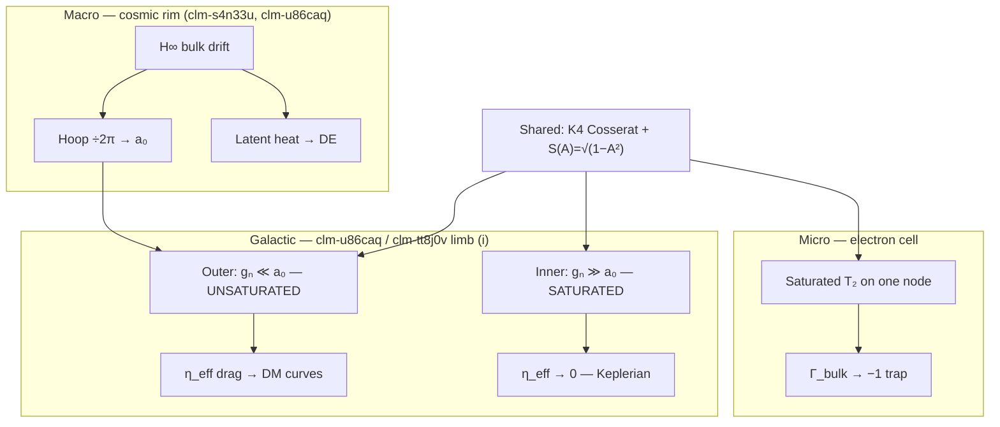

# Scale spectrum — saturation drag vs confinement (DM ↔ electron ↔ cosmic rim)

**Date:** 2026-06-12  
**Status:** CONTEXT SYNTHESIS — corpus-aligned routing doc; **no new derived numbers**  
**Lane:** orchestration / physics framing (Grant session 2026-06-12)  
**Companion:** `research/2026-06-12_three-lane-genesis-context.md` (three lanes); engine test **v15** (Lane A)

---

## §0 — Executive summary (Grant framing, corpus precision)

Grant's scale-ladder intuition:

> Dark matter at galactic scale is the **same wave/network family** that entrains the electron on one cell — galaxy at the massive end, electron at the micro end, universe perimeter at the macro end.

**Corpus-aligned restatement (not stronger):**

One **K4 Cosserat LC lattice** with one **Axiom-4 saturation kernel** $S(A)=\sqrt{1-A^2}$ (A-034) hosts **transverse $T_2$ sector** physics from ℓ_node to $R_H$. The **readout branch** depends on local saturation:

| Rung | Scale | Saturation branch | Observable read | Corpus status |
|:---|:---|:---|:---|:---|
| **Micro** | ℓ_node / Compton | **Saturated** ($A^2\to A_{\mathrm{yield}}^2=2\alpha$) | Electron trap — bulk $\Gamma_{\mathrm{bulk}}\to-1$, shorted λ/4 resonator | **Consistency-class** mechanism; discrete engine **v13 LOCALIZATION-LANDED** (OP-2 container only) |
| **Galactic (outer)** | $r\gg 5$ kpc, $g_N\ll a_0$ | **Unsaturated** (Regime I) | Mutual inductive **drag** $\eta_{\mathrm{eff}}\approx\eta_0$ → flat rotation curves | **Class C/E** — SPARC forward benchmark landed (`clm-u86caq`); mechanism consistency |
| **Galactic (inner)** | $g_N\gg a_0$ | **Saturated** (Regime IV) | $\eta_{\mathrm{eff}}\to 0$ → Keplerian | Same operator, opposite drag readout (`asymptotic-limits.md` L29) |
| **Cosmic rim** | $R_H$, $H_\infty$ | Bulk drift + crystallization | $a_0=cH_\infty/(2\pi)$; latent heat → DE (`clm-s4n33u`); CMB floor | **Class E** operating-point projection (joint with $G$, $\alpha$, $\Omega_{\mathrm{freeze}}$) |

**What this doc does NOT claim:** DM halo = scaled-up electron confinement wall; DM = DE; literal identity of entrainment modes at all scales; cross-scale "same mechanism" for the cosmic vs substrate $2\pi$ factors (walked back 2026-05-17).

---

## §1 — Skills fired

| Skill | Application |
|:---|:---|
| **consistency-vs-emergence** | Every section tagged in §2 ledger; no promotion of lens → emergence without engine/prereg |
| **ave-evidence-framing-discipline** | Strength language capped at corpus ceilings; SPARC "CONFIRMED" quoted only as corpus states it |
| **ave-discrimination-check** | DM/DE split; drag vs trap split; SM-counterfactual: generic LC network could show saturation-gated drag without AVE substrate |
| **ave-independence-check** | Hoop-stress $2\pi$ at cosmic vs substrate scales = **two instances, same projection form**, not one algebraic derivation chain |
| **substrate-native-check** | Electron = $\Gamma=-1$ magnetic branch; DM = $\eta_{\mathrm{eff}}$ kinematic network — same Ax4 kernel, different operator readout |
| **verify-before-cite** | Claim IDs and file paths grep-verified this session |
| **phase-space-coordinate-check** | $(2,3)$ winding = phase-space (genesis); galactic $g_N/a_0$ = continuum acceleration coordinate — do not conflate |

---

## §2 — Consistency-vs-emergence ledger

| § | Claim | Class | Basis |
|:---|:---|:---|:---|
| §3 | One substrate + one $S(A)$ kernel across scales | **B — axiom manifestation** | A-034 trampoline catalog; `saturated-lattice-mutual-inductance.md` |
| §4 | Outer-galaxy DM = Regime I unsaturated $\eta_{\mathrm{eff}}$ drag | **C — consistency** (+ **E** joint op-point for $a_0$) | `asymptotic-limits.md`; `clm-u86caq` |
| §4 | Inner galaxy drag OFF via same saturation operator as particle confinement | **B — axiom manifestation** | `asymptotic-limits.md` L29 verbatim linkage |
| §5 | Electron confinement = saturated $\Gamma=-1$ trap on $T_2$ | **C — consistency / translation** | `photon-ee-mapping.md`; `clm-lv3uw1`, `clm-3npynp` |
| §5 | DM drag ≠ electron confinement wrapper | **Discrimination / framing** | Opposite saturation branch; not carrier-wave envelope |
| §6 | Hoop-stress $2\pi$ rhyme: $a_0$ vs $\nu_{\mathrm{slew}}$ | **B — structural rhyme**; cosmic $2\pi$ rigor **OPEN** | `mond-hoop-stress.md` §4.5; `dm-mechanism-unification.md` walk-back |
| §7 | Universe perimeter = horizon hoop + latent heat | **C/E** | `clm-s4n33u`; generative cosmology leaves |
| §8 | Grant scale-ladder as **engineering hypothesis** for v15 Lane A | **Emergence candidate** (engine) | v15 prereg P15-N; not landed until v15b $V_{\mathrm{inc}}$ or Grant proxy ratification |

---

## §3 — Claim-ID routing table

| Topic | Claim ID(s) | Solidity / status (corpus) | This doc uses it for |
|:---|:---|:---|:---|
| MOND $a_0$, galactic drag, SPARC | **clm-u86caq** | Forward SPARC benchmark; $a_0$ derived 10.7% off empirical | Galactic rung; Regime I/IV table |
| DM three-limb unification | **clm-tt8j0v** | Substrate-shared, **operator-distinct** | Honest scope ceiling — NOT one wave identity |
| Cosmological constant / latent heat DE | **clm-s4n33u** | $\rho_\Lambda$ factor 1.54; not DM | Cosmic rim — separate operator |
| DAMA α-slew / atomic hoop | **clm-b27pnp** | 0.6% rate match (corpus) | Micro–meso bridge in hoop sub-family |
| δ_strain thermal running | **clm-hp7nlm** | Mechanism Class B; quant route NEGATIVE | Peripheral; not load-bearing here |
| Free vs trapped photon / $\Gamma$ | **clm-3npynp**, **clm-i4p11y**, **clm-fr3mos**, **clm-lv3uw1** | Translation / consistency | Electron micro rung |
| Saturation kernel catalog | **A-034** (not a claim row) | 26 instances, 21 OOM | Shared kernel language |
| Atom-scale $\Gamma=-1$ derivation | **Q-G43** (pending) | Not closed | Do **not** assert derived confinement from first principles |
| Lane A nucleation on engine | **v15 production** | **HEAL-CONFIRMED** (2026-06-12); prereg DRAFT | Emergence candidate — cosmic IC insufficient on srs |

---

## §4 — Shared substrate physics (substantiated)

### 4.1 One network, one kernel

- **Substrate:** K4 Cosserat micropolar lattice with per-node LC oscillators (`dm-mechanism-unification.md`, `clm-tt8j0v`).
- **Kernel:** $S(A)=\sqrt{1-A^2}$ — same operator cited for BCS $B_c(T)$, BH ring-down, galactic $\eta_{\mathrm{eff}}$, and particle yield (`saturated-lattice-mutual-inductance.md`, A-034).
- **Wave sector:** Transverse $T_2$ Cosserat microrotation — free photon below yield; electron = same sector at saturation (`photon-identification.md`, `photon-ee-mapping.md`).

### 4.2 The saturation branch switch (load-bearing)

From `asymptotic-limits.md` (claim **clm-u86caq**):

> In the outer galaxy where $g_N < a_0$, the vacuum lattice is in its linear (unsaturated) regime. Its mutual inductance $\eta_{eff} \approx \eta_0$ resists differential rotation… In the inner galaxy where $g_N > a_0$, **the same saturation operator that drives particle confinement** drives $\eta_{eff} \to 0$.

**Precision:** "Same operator" is corpus-canonical. "Same entrainment wave wrapping the electron" is **not** — electron confinement is **saturated trap**; outer-galaxy DM is **unsaturated drag**.

### 4.3 Dark matter ≠ dark energy

| | Dark matter (limb i) | Dark energy |
|:---|:---|:---|
| Operator | $\eta_{\mathrm{eff}}$ mutual inductive drag | Latent heat / crystallization pressure |
| Regime | Regime I (unsaturated) | Cosmic continuity source |
| Claim | **clm-u86caq** / **clm-tt8j0v** | **clm-s4n33u** |

Grant's pairing DM:galaxy :: DE:electron is **not** corpus-native. DE is not the electron's hoop stress scaled up.

---

## §5 — Micro rung: electron (one cell)

| Corpus read | Status |
|:---|:---|
| Same $T_2$ wave, saturation engages → $\Gamma=-1$ Local Bubble | **Consistency / translation** (`photon-ee-mapping.md`) |
| Confinement = bulk TIR wall ($\Gamma_{\mathrm{bulk}}=-1$), not carrier envelope | **Canonical EE mapping** |
| Carrier = $T_2$ oscillation; wrapper = boundary condition | Explicit split in `photon-ee-mapping.md` |
| Discrete srs v13 bulk-wall pocket | **Engine LOCALIZATION-LANDED** — container only; not full electron ontology |
| Autoresonance / self-lock at $\Gamma=-1$ | **GAP** per `photon-ee-mapping.md` — do not assert proved [2026-06-14 update: genesis self-lock now TESTED-NEGATIVE per research/2026-06-14_t2-genesis-selflock_result.md; general mapping + detector instrument still open] |

**Not proved:** Latent heat $= m_ec^2$; single-cell DM analog; electron precedes all photons globally (see three-lane doc).

---

## §6 — Galactic rung: dark matter as network drag

| Corpus read | Status |
|:---|:---|
| DM = unbroken kinematic mutual inductance (`vol1/ch4/index.md`) | **Consistency** |
| $g_{\mathrm{eff}}$ MOND formula from $\eta_{\mathrm{eff}}$ saturation | **clm-u86caq** |
| SPARC 135-galaxy benchmark | Corpus: forward-prediction confirmed at catalog scale (`dm-mechanism-unification.md` §2) — quote corpus wording, not "proves AVE over ΛCDM" |
| Bullet cluster | **Separate operator** (limb ii, ponderomotive halo) — not rotation-curve drag |

**Grant intuition preserved:** galaxy sits on the **massive end** of the **same LC network** that hosts the electron cell — **if** "same" means substrate + kernel, not identical mode.

---

## §7 — Macro rung: cosmic perimeter

| Quantity | Corpus anchor | Class |
|:---|:---|:---|
| $a_0 = cH_\infty/(2\pi)$ | `mond-hoop-stress.md` §4.5 | C/E |
| $H_\infty$, $\rho_{\mathrm{latent}}$, phantom DE | `clm-s4n33u`, generative cosmology | E (joint op-point) |
| CMB as thermal floor / attractor | Lane A IC | Consistency |

**Hoop-stress honesty (`clm-tt8j0v`, Tier-3 #10):**

- Substrate $2\pi$: **rigorous** via $0_1$ unknot ropelength (knot theory).
- Cosmic $2\pi$: derived via Unruh–Hawking projection — **cosmic-scale rigor OPEN**.
- Cross-scale "same mechanism" for the numeric $2\pi$: **WALKED BACK** — structural rhyme, not single derivation.

**Atomic bridge:** $\nu_{\mathrm{slew}}=(\alpha/2\pi)\omega_{\mathrm{Compton}}$ shares projection **form** with $a_0$ (`clm-b27pnp`, limb iii) — micro refresh vs cosmic floor, not DM drag.

---

## §8 — Scale ladder diagram (AVE-native)

---

## §9 — SM counterfactual (discrimination)

A generic **saturable LC network** with mutual inductance could exhibit:

- drag ON in linear regime;
- drag OFF when locally saturated;
- localized high-$A$ trap on one cell.

That pattern is **not AVE-distinct** without the substrate-specific content (K4 chirality, Cosserat $\omega$, hoop-stress $a_0$ derivation chain, SPARC zero-parameter benchmark, etc.). This doc classifies the scale ladder as **structural consistency routing**, not a new falsifier.

---

## §10 — Engine program linkage

| Rung | Engine test | Status |
|:---|:---|:---|
| Micro manufacture (Lane B) | v9–v14 photon-in | v13 **LOCALIZATION-LANDED**; v14 **CAVITY-BREAK** (metric issue on peak_retention) |
| Micro cosmic (Lane A) | **v15** native pair ramp + saturation seed, no photon | **HEAL-CONFIRMED** — $r_{\mathrm{yield}}^*\approx 0.36$ vs floor 1.34; v15a-ablation + v15b open |
| Galactic | SPARC drivers / MOND leaves | Corpus benchmark; not discrete srs |
| Macro | Cosmology continuity / $H_\infty$ chain | Class E; not srs genesis |

**v15 result (2026-06-12):** derived native latent ramp does not reach P15 floor on open srs; photon arm does — **HEAL-CONFIRMED** strengthens Lane B. See `research/2026-06-12_genesis-v15-nucleation-latent_result.md` and program ledger `research/2026-06-12_genesis-program-status.md`.

---

## §11 — Open items (honest)

1. **Q-G43** — atom-scale $\Gamma=-1$ from substrate primitives: pending.
2. **Cosmic $2\pi$ rigor** — Step 5 hoop-stress on de Sitter horizon: open.
3. **v14b** — pocket-frame peak metric for comoving transport.
4. **v15a-ablation** — latent-window dissipation (χ=0, snap-OFF) may explain 9.5 native deficit bleed.
5. **v15b** — $V_{\mathrm{inc}}$ on K4 TLM; prereg DRAFT not frozen.
6. **Cross-scale identity** — Grant ladder is **hypothesis-class routing** until v15b $V_{\mathrm{inc}}$ lands or Grant srs-proxy ratification.

---

## §12 — Cross-references

| Doc | Role |
|:---|:---|
| `manuscript/ave-kb/vol3/cosmology/ch05-dark-sector/asymptotic-limits.md` | Drag ON/OFF vs saturation |
| `manuscript/ave-kb/vol3/cosmology/ch05-dark-sector/dm-mechanism-unification.md` | **clm-tt8j0v** three limbs |
| `manuscript/ave-kb/vol3/cosmology/ch05-dark-sector/saturated-lattice-mutual-inductance.md` | A-034 galactic anchor |
| `manuscript/ave-kb/vol1/dynamics/ch4-continuum-electrodynamics/mond-hoop-stress.md` | $a_0$ hoop projection |
| `manuscript/ave-kb/vol1/dynamics/ch4-continuum-electrodynamics/photon-ee-mapping.md` | Carrier vs confinement |
| `manuscript/ave-kb/vol1/dynamics/ch4-continuum-electrodynamics/magnetic-saturation.md` | η→0 slipstream vs deep-space drag figure |
| `research/2026-06-12_three-lane-genesis-context.md` | Three lanes |
| `research/2026-06-12_genesis-program-status.md` | v9–v15 program ledger |
| `research/2026-06-12_genesis-v15-nucleation-latent_result.md` | v15 HEAL-CONFIRMED production |
| `manuscript/ave-kb/common/loop-gap-electron-resonator-closure-doctrine.md` §7–§7b | Routing |

---

**Routing:** `loop-gap-electron-resonator-closure-doctrine.md` §7b; `three-lane-genesis-context.md` §8.
