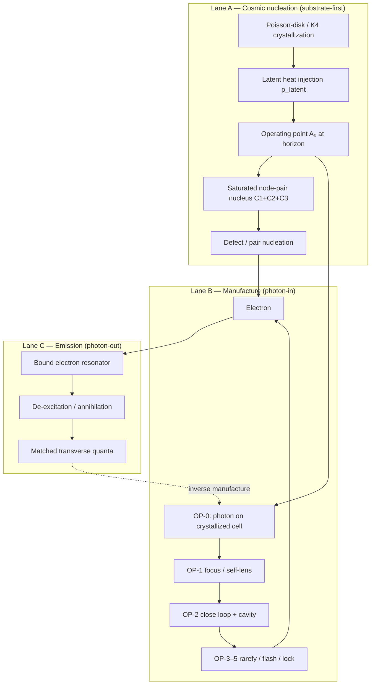

# Three-lane genesis context — substrate, manufacture, emission (2026-06-12)

**Status:** CONTEXT SYNTHESIS — consolidates Grant session 2026-06-12 reframe + corpus anchors; **no new derived numbers**  
**Triggers:** precursor-order question (electron vs photon fundamental?); atomic-line / resonant-cavity intuition; crystallography + latent heat + lattice genesis; v9–v14 program placement  
**Successor scope:** v15 nucleation-from-latent — `research/2026-06-12_genesis-v15-nucleation-from-latent_prereg_DRAFT.md`  
**Scale ladder:** `research/2026-06-12_scale-spectrum-saturation-drag-vs-confinement.md` (DM drag ↔ electron trap ↔ cosmic rim)  
**Routing:** `manuscript/ave-kb/common/loop-gap-electron-resonator-closure-doctrine.md` §7–§7b

---

## §0 — Executive summary

AVE does **not** posit a single linear genesis story. Three **orthogonal lanes** share the same substrate physics but differ in **initial condition** and **readout direction**:

| Lane | Time arrow | Initial condition | Canonical readout |
|:---|:---|:---|:---|
| **A — Cosmic / nucleation** | Lattice crystallizes → latent heat → defects | Saturated substrate at operating point; **no flying photon required** | Dark energy, CMB floor, pair nucleation at nodes |
| **B — Manufacture / traveler** | Photon in → trap → electron | Transverse photon on crystallized cell (OP-0) | v9–v14 discrete srs program; Vol 9 fab traveler |
| **C — Emission / annihilation** | Bound resonator → quanta out | Pre-existing electron (λ/4 shorted tank) | Spectral lines, Hawking–Nyquist analogy, e⁺e⁻ → 2γ |

**Not contradictions** — same OP-2 container, same Axiom-4 freeze kernel, same LOOP GAP ranks — different **boundary conditions**.

The v9–v14 stack correctly tests **Lane B** (photon-in manufacture). It does **not** test Lane A. **v15** scopes Lane A on the engine.

**Electrons are not AVE's ur-particle.** More fundamental: **K4 Cosserat substrate + topological defects**. Electrons are the **simplest stable defect** ($0_1$ unknot) and the **simplest manufacturing target**, not the entity from which lattices or photons are built.

---

## §1 — Grant session questions (verbatim intent)

1. Are we thinking about genesis **wrong** — are electrons fundamental **precursors** to transverse waves/photons (not the reverse)?
2. A photon's frequency relates to the **resonance of the orbital that emitted it** — energy-matched reflection off a **resonance cavity**.
3. Can **crystallography** or **latent heat** (universe genesis: lattice tension, energy reinjected) spawn electrons from **crystal lattice genesis**?
4. Are electrons the **fundamental building block of everything**?

**Corpus-aligned answers (short):**

| Question | Answer |
|:---|:---|
| Electron before photon? | **Cosmic lane (A):** substrate + latent heat precede stable defects. **Manufacture lane (B):** photon is raw material (OP-0). **Emission lane (C):** electron precedes emitted photon. All three hold. |
| Resonant cavity / atomic lines? | **Yes, Lane C.** Electron = shorted λ/4 resonator; emission = relaxation quanta. Hawking–Nyquist parallel in BH-orbitals leaves. |
| Latent heat + crystallography? | **Yes, Lane A** — generative cosmology, Poisson-disk genesis, water-style Axiom-4 crystallization class; **latent = mₑc² is hypothesis-class**. |
| Electrons build everything? | **No.** Substrate + defect taxonomy; proton, photon, quarks are peer defects/modes. |

---

## §2 — Three-lane diagram



---

## §3 — Lane A — Cosmic / nucleation (latent heat + crystallography)

### 3.1 Lattice genesis

| Concept | Corpus anchor | Class |
|:---|:---|:---|
| Poisson-disk crystallization | `manuscript/ave-kb/vol2/appendices/app-d-computational-graph/graph-architecture.md` | Consistency (genesis algorithm) |
| $H_\infty$ as crystallization rate | `vol3/cosmology/ch04-generative-cosmology/lattice-genesis-hubble-tension.md` | Class E operating-point |
| Latent heat → radiation bath | `cmb-thermal-attractor.md`: $\dot\rho_{rad}+4H\rho_{rad}=3H\rho_{latent}$ | Consistency |
| Dark energy as latent heat of genesis | `phantom-energy-equation-of-state.md`, generative cosmology index | Conceptual reframe |
| Ω_freeze cosmic grain | `omega-freeze-cosmic-grain-cascade.md` (cited in dilution scope) | IC / consistency |

### 3.2 Matter as condensed phase (not flying-wave precursor)

| Concept | Corpus anchor | Class |
|:---|:---|:---|
| Electron = condensed transverse content | `photon-identification.md` R1 annotation | Ratified framing |
| A1 standing-V = order parameter of freeze | `matter-as-vapor-locked-pump_framing.md` §11.1–11.2 | Ratified framing |
| (2,3) winding ⊥ A1 mass | `master-equation.md:20` | Ratified |
| Latent heat **=** $m_ec^2$ | framing §11.2 / N6 | **Hypothesis-class** |
| FLASH vs LOCK at cavitation floor | `cavitation-core-probe_result.md` | **Measured:** LOCK not FLASH in bare EOS |
| Nucleation barrier: free space heals | genesis-23 `max|V_inc|=0`; `the-abandoned-interior.md` §93 | **Measured** (genesis-23) |
| C1+C2+C3 at node pair → e⁺e⁻ pair | `pair-production-axiom-derivation.md` | Mechanism (asserted-partial) |
| Water-style freeze-in analogy | `entrainment-vortex-trapping-deep-dive.md` §8 | Consistency lens |

### 3.3 What Lane A is **not**

- Not "electrons spawn the lattice" — lattice is **Axiom 1 hardware**; defects nucleate **on** it.
- Not derived $m_e$ from latent heat yet — number is open (U2 in manufacturing traveler).
- Not a substitute for Lane B tests — different falsifier surface.

---

## §4 — Lane B — Manufacture (v9–v14 + Vol 9 traveler)

### 4.1 Fab traveler (OP-0 → OP-6)

**Source:** `research/2026-06-10_electron-manufacturing-process-flow.md`

| OP | Name | Status (2026-06-12) |
|:---|:---|:---|
| 0 | Raw material: cell + **photon** | Open: partner/pair (NAMED UNKNOWN #2) |
| 1 | Focus / self-lens | Reproduces |
| 2 | Close-the-loop | **NAMED UNKNOWN #1**; genesis-23 $V\equiv0$ |
| 3 | Rarefy / drive | Floor reached; pump paths falsified |
| 4 | Flash / latent heat | **LOCK not FLASH**; irreversibility open |
| 5 | Lock / BEMF | graft-v4 candidate; not in srs |
| 6 | Settle / QC | (2,3) does not self-assemble |

### 4.2 Discrete srs program (v9–v14)

| Version | Primary gate | Verdict (production) | Lane |
|:---|:---|:---|:---|
| v10 | P6 CVR-SET | Partial reactive trap; not remanence | B |
| v11 | P11 quiescence | OPEN (P11 FAIL at scale) | B rank 4 |
| v12 | P12 transport | ENGINE-GAP (open srs dispersion) | B |
| v13 | P13 bulk-wall cavity | **LOCALIZATION-LANDED** | B rank 1 (OP-2 analogue) |
| v14 | P14 dual gate | CAVITY-BREAK (peak metric); transport partial | B |

**Plumber ranks** (`loop-gap-electron-resonator-closure-doctrine.md`):

1. OP-2 container — **LANDED** (discrete srs ansatz, v13)
2. Compton ring-up — NOT TESTED
3. Energize-lock — OPEN
4. Remanence — OPEN

### 4.3 Trampoline / irrep picture (manufacture provenance)

`trampoline-framework.md`: **photon → electron via 2-fold trap** on propagating $T_2$ — this is **Lane B provenance**, not cosmic precedence.

---

## §5 — Lane C — Emission / resonator readout

### 5.1 Your atomic-line intuition (corpus match)

> Photon frequency = energy-matched readout of a **pre-existing** bound mode.

| EE / substrate read | Anchor |
|:---|:---|
| Electron core = shorted λ/4 resonator | `double-slit-ee-mapping.md` §2 |
| Trapped reactive energy = rest mass | same |
| Free photon = $T_2$, $\Gamma=0$; electron = same + $\Gamma=-1$ | `photon-identification.md` |
| Excited orbital → photon (Nyquist analogy) | `hawking-temperature-nyquist-noise.md` |
| Annihilation e⁺e⁻ → 2γ = latent returned | hypothesis-class; `annihilation-evaporation_prereg.md` |

**v14 figures support Lane C + B hybrid:** centroid surfs inside pocket (localized resonator translates); global peak collapses under roll — **pocket-frame amplitude** is the correct resonator observable (v14b metric fix).

### 5.2 Constructive vs destructive trap

`constructive-destructive-paradox.md`: electron = **constructive** trap (topology preserved); BH = destructive melt. Exterior standing-wave physics scale-invariant; interior not.

---

## §6 — Crystallography & Peierls–Nabarro (discrete lattice)

| Idea | AVE use | Program link |
|:---|:---|:---|
| Discrete crystal genesis | srs / diamond nets; Poisson-disk 3D | v9 platform |
| Dislocation / defect on lattice | Electron as $0_1$ defect; PN stress for charged motion | `peierls-nabarro-paradox.md` |
| Over-braced lattice | Global prestress (Ω_freeze); **not** local B–H remanence | doctrine fool mode #7 |
| Seeded vs free nucleation | Free heals; seeded vents / pairs | **v15 primary** |

---

## §7 — Program placement: what we were / weren't wrong about

### 7.1 Wrong **only if** Lane B is the whole story

Testing photon-in → cavity → transport → remanence is **correct for the Vol 9 traveler** and for proving OP-2/OP-4/OP-5 gates on a **propagating precursor**.

### 7.2 Incomplete **without** Lane A

Cosmic / constitutive picture says:

- Phase change needs a **nucleus** (pair-production canon).
- **Latent heat** may be the energy budget of freeze (hypothesis).
- **Longitudinal / A1 channel** may carry order parameter (not populated in genesis-23 transverse-only runs).

v13/v14 **do not falsify** Lane A — they **enable** it (container exists; transport rail partial).

### 7.3 v15 tests Lane A (HEAL-CONFIRMED — 2026-06-12)

**v15 — nucleation-from-latent:** initial condition = **derived native pair ramp** + saturated node-pair seed, **no** `plant_23` photon packet.

**Production verdict:** **HEAL-CONFIRMED** — cosmic IC arm does not reach P15 floor on open srs ($r_{\mathrm{yield}}^*\approx 0.36$); photon arm reaches $r_{\mathrm{yield}}^*\approx 2.9$ without latent. Strengthens Lane B manufacture program; does **not** falsify Lane A ontology (scatter during latent window + v15b $V_{\mathrm{inc}}$ still open).

**Next forks:** v15a-ablation (latent-phase dissipation), v15b K4 longitudinal read. See `research/2026-06-12_genesis-program-status.md` §5.

---

## §8 — Open contentions (held across all lanes)

| ID | Tension | Owner |
|:---|:---|:---|
| T1 | Latent heat = $m_ec^2$ vs measured LOCK | Grant + OP-4 mechanism |
| T2 | Single electron vs e⁺e⁻ pair (C1+C2+C3) | Pair-production canon |
| T3 | Bulk $\Gamma_{\mathrm{bulk}}$ vs EM $\Gamma_{\mathrm{EM}}$ | Channel tagging (doctrine §3) |
| T4 | FLASH mechanism absent in bare EOS | Below-floor rupture / hardened wall |
| T5 | srs transverse-only vs $V_{\mathrm{inc}}$ bulk | v15b on K4 TLM / coupled engine |
| T6 | Peak metric vs pocket-frame amplitude (v14) | v14b gate revision |
| T7 | Latent-window dissipation eats native budget (v15) | v15a-ablation: χ=0, snap-OFF during latent only |

---

## §9 — Cross-reference index

| Doc | Role |
|:---|:---|
| `loop-gap-electron-resonator-closure-doctrine.md` | Plumber ranks, fool modes, v9–v15 directions |
| `2026-06-12_loop-gap-electron-resonator-synthesis.md` | Implementation audit matrix |
| `2026-06-10_electron-manufacturing-process-flow.md` | Lane B traveler |
| `2026-06-10_matter-as-vapor-locked-pump_framing.md` | Lane A condensation ontology |
| `the-abandoned-interior.md` | Nucleation barrier + constitutive obligations |
| `pair-production-axiom-derivation.md` | C1+C2+C3 node-pair nucleation |
| `2026-06-12_genesis-v13-eigen-cavity_result.md` | OP-2 landed (discrete srs) |
| `2026-06-12_genesis-v14-cavity-transport_result.md` | Dual gate + figures |
| `2026-06-12_genesis-v15-nucleation-from-latent_prereg_DRAFT.md` | Lane A scope |
| `2026-06-12_genesis-v15-nucleation-latent_result.md` | v15 production HEAL-CONFIRMED |
| `2026-06-12_genesis-program-status.md` | v9–v15 program ledger |
| `2026-06-12_genesis-parameter-provenance-audit.md` | Vacuum native unit parameter discipline |
| `2026-06-12_scale-spectrum-saturation-drag-vs-confinement.md` | DM drag ↔ electron trap ↔ cosmic rim |
| `_orchestration/2026-06-12_loop-gap-v15-charter.md` | v15 charter (Phase 1 complete) |

---

## §10 — Commands (context + v15 when implemented)

```bash
# Lane B reproduction
python src/scripts/vol_1_foundations/chiral_lattice_v13_genesis.py
python src/scripts/vol_1_foundations/chiral_lattice_v14_genesis.py
python src/scripts/vol_1_foundations/chiral_lattice_v14_figures.py

# Lane A (v15)
python src/scripts/vol_1_foundations/chiral_lattice_v15_genesis.py --smoke
python src/scripts/vol_1_foundations/chiral_lattice_v15_genesis.py
```
