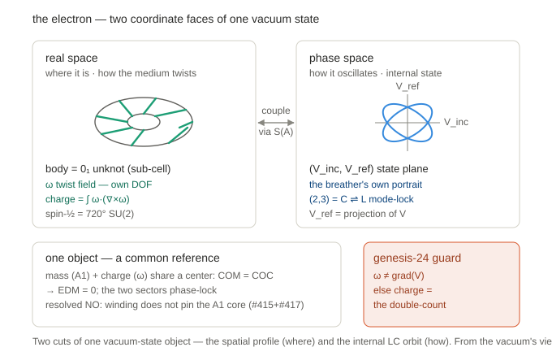

# The electron as a pattern in the vacuum's state — two coordinate faces, the composition lock, and the phase-space ontology

**Class:** research / WORKING-MODEL synthesis (conceptual). **NOT a chord** — this records the substrate-native *interpretation* that the session's groundings converged on; the AVE-distinct, falsifiable content lives in forward predictions (a separate register), not here.
**Date:** 2026-06-24
**Provenance:** AVE-Core @ `origin/main 1d4eae9c` (post S1 merge, PR#407). Synthesizes this session's grounded threads (electron-localization → coupling-geometry → engine-reroute → S1 PASS) + Grant's foundational questions (gravity-as-frequency-modulation; the vacuum-phase-space reframe).
**Scope-lock:** documents the **settled** conceptual mapping. The **mutual-pinning** mechanism is flagged OPEN (S2/S3 are testing it). KB-promotion of the settled parts (→ `l3-electron-soliton`) is gated on Grant review + an adversarial verify pass.
**Figure:** 

---

> 🔴 **STALE — mutual-pinning hypothesis tested NEGATIVE (Rule 12 status header, 2026-06-24).** This doc was written *before* the S3 falsification and the phase-space coupling-winding BREAK that close its central open item. The **mutual-pinning** hypothesis (the (2,3) charge winding pins the dispersing A1 core — flagged OPEN at §0 Scope-lock and at lines below in §3 / §6) is now tested **NEGATIVE in BOTH internal dynamical loci**:
> - **real-space eigensolve (DISPERSE / DOES-NOT-EXIST, #415):** the coupled A1+winding eigensolve binds a confined lossless A1 mass cage but the (2,3) winding **bleeds out** (gate-d FAIL, `bw_on_torus≈0.0001`); and S3 cavity-pinning is **DISPERSE-FALSIFIED** — winding + H_couple + the Γ=−1 cavity does **NOT** pin the dispersing A1 core (centroid spread grows ON and OFF). See `research/2026-06-24_engine-coupled-eigensolve_result.md` + `research/2026-06-24_engine-s3-cavity-pinning_result.md`.
> - **phase-space coupling (BREAK, #417):** the dynamical orbit reads a (1,1)-class **carrier ratio** (winding tracks ω_b:ω_s under detuning), **not** the topological (2,3) — a topology-protected charge could not do this. See `research/2026-06-24_engine-phase-space-winding_result.md`.
>
> **Net:** the localizer is the **cavity eigenmode**, NOT the winding; charge is **static topology** (`charge = Link(∂Ω, F) ∈ ℤ`), which **STANDS** un-walked-back and is touched by neither negative. `mass = A1` (PR#260) is **untouched**; the A1 mass cavity EXISTS (fork-b). The conclusion is **CONSISTENCY-class** — the AVE-distinct chord lives ONLY in forward predictions, and the Q=137 slot stays EMPTY. Per substitution-not-retraction (A47 v11b) the falsified slot is **not** refilled here; the new framing carries its own verification chain in the epic summary (`research/2026-06-24_engine-reroute-epic-summary.md`). The body below is preserved for the audit trail.

---

## 1. What is an electron (the framing)

The Standard Model posits an electron: a point with three labels — mass, charge, spin — taken as inputs. AVE's bet is the inverse: the electron is **the simplest self-consistent standing resonance the vacuum can hold without leaking**, and its labels are *consequences* of the medium + topology, not inputs.

- it exists because the medium's nonlinearity (Axiom-4 saturation) permits a localized, lossless, topologically-protected bound mode;
- **mass** = the stored energy of the longitudinal `A1` dilatation breather;
- **charge** = a trapped topological twist of the Cosserat micro-rotation `ω` (S1, below);
- **spin-½** = the 720° SU(2) double-cover the medium's orientation structure forces.

So "what is an electron" stops being "what point-thing is it" and becomes "what is the minimal knot of vacuum that holds itself together losslessly." It is not a thing *in* space; it is a self-sustaining *pattern of the medium's state*.

**Honest scope (the framework meta-finding, `vol1/ch8`):** AVE is **FORM-deriving and VALUE-importing**. It earns the *forms* (a bound resonance; integer charge; spin-½; zero EDM) but imports the *values* (the specific mass, α) as calibration echoes. So AVE answers "what kind of object" far better than SM (a topological bound resonance with a mechanism behind each label) but does not yet answer "why *this* mass" — and neither does SM.

## 2. The two coordinate faces

The electron has two genuinely different descriptions, and conflating them is the A46 / two-"2"s trap.

**Real space (x, y, z — the lattice).** Literal physical space. The body here is a `0₁` unknot, sub-cell (smaller than `ℓ_node = ℏ/m_e c`). The Cosserat micro-rotation `ω(x)` is the actual in-place twist of each node — a genuine independent field with its own momentum `I_ω·ω̇` (`cosserat_field_3d.py:948`). Charge, in this face, is the Beltrami helicity `∫ ω·(∇×ω)` (`master-equation.md:20`). Spin-½ is the 720° SU(2) double-cover of the body's orientation. This face answers **where** the electron is and **how the medium is twisted**.

**Phase space (the LC tank's internal state).** Not physical space — the internal state plane `(V_inc, V_ref)` of the oscillator (equivalently charge-on-C / flux-on-L). As the resonator rings, this state traces a closed orbit; two coupled internal cycles make a torus. The `(2,3)` here is an internal mode-lock ratio (a Lissajous orbit), not a shape in 3D. This face answers **how it oscillates**. Note `V_ref` is a read-only projection of `V` (`master-equation.md:20`) — so this torus is the **breather's own portrait**, not an independent DOF.

**How they couple.** The soliton ansatz `θ(x) = 2φ + 3ψ` ties the internal oscillation phase to the real-space toroidal/poloidal angles of the body — the map "real-space position → internal phase" *is* the coupling. Physically, the breather and the twist share the same nodes and trade energy through the saturation front `S(A)` (a parametric, reactive exchange — §4). The genesis-24 guard: this must be a genuine exchange between two *independent* DOFs, never a definition (`ω := grad(V)` collapses the two spaces into one and double-counts the "3").

## 3. The composition lock — "one object, not three"

The mass, the charge, and the spin are not three particles glued together; they are excitations of the same nodes sharing a **common reference**:

- **the common reference = COM = COC** (center of mass coincides with center of charge), symmetry-forced (the charge sector is P-odd/T-even, with no T-odd dynamical channel at rest), which is also why the electron's **EDM = 0** (an echo: AVE 0, SM ~1e-38, both ≪ the JILA bound — but structurally *earned* by the same topological-CPT mechanism as θ_QCD=0). The shared center is what lets the sectors phase-lock instead of drifting apart.
- **mutual-pinning hypothesis (🔴 RESOLVED NEGATIVE — see stale header; S3 + #415 + #417 all negative).** Stage-2 falsified the bulk self-trap: the `A1` mass *alone* disperses on the native lattice (`research/2026-06-24_engine-stage2-native-cage_result.md`). The post-Stage-2 hypothesis was that the **charge topology pins the dispersing A1 core** — a `(2,3)` twist can only live on a saturated core, and the twist can't unwind, so it holds the core the bare `A1` would let disperse; and the core is what the twist needs to exist on. *This hypothesis is now tested NEGATIVE in both loci* (real-space DISPERSE/eigensolve gate-d FAIL; phase-space BREAK — the orbit carries the carrier ratio, not the (2,3)). The surviving picture: the localizer is the **cavity eigenmode**, not the winding; `mass = A1` binds independently and charge is **static topology** (`Link`). The original S2/S3 framing is preserved below for the audit trail.
- **spin-½ rides along but stays separate** — a third structure (real-space SU(2)) on the same object, sharing the center but not part of the mass↔charge lock (the coordinate-category rule).

**S1 result (merged, PR#407):** the charge winding `ω` *is* a separately-conserved dynamical DOF (scoped to the real-space ω director-phase, single-knot) — "A1-sustains-rotation" graduated from asserted-class to derived-real. That is the first ingredient of the pinning hypothesis confirmed.

## 4. Gravity = the `S(A)` frequency-modulation gradient

A mass sets the local saturation operating point `A` of the surrounding LC tanks. `S(A)` then modulates the local tank parameters (`ε_eff=ε₀S`, `C_eff=C₀/S`, the local clock rate, the wave speed) — the **same varactor-bias mechanism producing refractive-index gradients across all scales** (`ave-kb/CLAUDE.md:75`). Crucially, **only the spatial *gradient* of `A` is observable**, not the absolute per-node value — so the gravitational *field* literally *is* the gradient of the local frequency/clock modulation. A test object refracts down the index gradient (`n(r) = 1 + 2GM/c²r`, `refractive-index-of-gravity.md:11`); it does not get pushed.

Precision (the two temporal quantities, `temporal-spatial-lattice-decomposition.md:28`): the **local clock rate / redshift** is slope-1 (`√S ≈ 1 − GM/rc²`, `z = GM/rc²`); the **bulk propagation index** is slope-2 (`n = 1 + 2GM/rc²`, Shapiro); bridge `z = (n−1)/2`. "Frequency modulation" = the local clock rate; gravity = its spatial gradient.

Honest scope: at leading order this is **mathematically identical to GR** (the Gordon optical metric, `refractive-index-of-gravity.md:14`) — solar deflection, perihelion, redshift are all consistency-class (`claim-quality-closure-roadmap.md:205`); the only AVE-distinct piece is the trans-Planckian discrete-lattice `(qℓ_node)⁴ ~10⁻²²` dispersion. The *mechanism* is AVE-native; the *leading prediction* reproduces GR. Canonical source: `research/2026-06-05_gravity-sign-frequency-modulation-result.md`.

**Why this sits next to the coupling lock:** gravity is `S(A)` frequency-modulation with a *static spatial gradient*; the S2 `A1↔ω` coupling is the same `S(A)` modulation in its *dynamical cross-grade* form (the breather's amplitude detuning the twist's reactance). So a coupling-induced frequency shift is not a defect — it is the local seed of the very thing that, given a spatial gradient, *is* gravity. (This is why S2's independence criterion forbids slaving + non-conservation, **not** frequency splitting.)

## 5. The vacuum-phase-space ontology (Grant 2026-06-24)

From the vacuum's own standpoint, what *we* call "reality" is not the 3D scaffold — it is the vacuum's **state configuration**. Three levels:

1. **the scaffold** — the K4 lattice's node positions, `ℓ_node`. AVE keeps this real 3D, but **relational**: only spatial gradients of the node state are observable; absolute per-node values are gauge (`ave-kb/CLAUDE.md:75`).
2. **each node's internal state** — the LC tank `(V_inc, V_ref)`, the saturation `A`, the `ω` twist: the vacuum's actual dynamical variables (its phase/state).
3. **the whole configuration** — all nodes' states together = the vacuum's phase space.

What we perceive as physical reality — particles, fields, forces — lives in (2)/(3), not (1). An electron is a localized pattern in the vacuum's state; gravity is a gradient in that state (`A`); light is a propagating state-disturbance. So **our 3D space is the base/index over which the vacuum's state is defined, and "objects moving in space" is the shadow that phase-state dynamics cast on that base.**

Consequence for §2 (an observer-centrism corrected): labelling the body "real space" and the winding "phase space" privileges the spatial cut. From the vacuum's view **both are cuts of its one state** — the body is the *spatial profile* (state indexed by 3D position), the winding is the *internal-amplitude structure*. The A46 two-"2"s stay distinct *structures*; the reframe just stops calling one cut "more real." It does **not** change any build: S1/S2 reads are well-defined on the declared cut regardless of ontological label.

**Honest caveat / open question:** it is not literally "3D space = the phase space" — AVE still commits to a real lattice base (`ℓ_node` is a real length). Whether the *scaffold itself* is emergent from deeper phase relations (fully relational spacetime — distances built from state-correlations) is an open question this doc does not settle; AVE leans "real lattice," with the gauge-relational hint cutting toward emergence.

## 6. Settled vs open

| Item | Status |
|---|---|
| electron = sub-cell topological bound resonance (not a point, not a bulk lump) | SETTLED (Stage-2 falsified bulk self-trap) |
| mass = `A1` dilatation breather | SETTLED (PR#260) |
| charge = `(2,3)` Cosserat winding, a separately-conserved DOF | SETTLED (S1 PASS, PR#407; scoped real-space ω, single-knot) |
| spin-½ = real-space 720° SU(2), distinct from the `(2,3)` | SETTLED (A46) |
| EDM = 0 (COM=COC) | SETTLED (echo; structurally earned) |
| gravity = `S(A)` frequency-modulation gradient | SETTLED mechanism (consistency-class at leading order; = GR/Gordon metric) |
| ontology: reality = vacuum state-config; 3D = the index | SETTLED as interpretation (label-independent for builds) |
| **mutual-pinning** (charge topology pins the dispersing A1 core) | 🔴 **RESOLVED NEGATIVE** — tested in BOTH loci: real-space eigensolve gate-d FAIL + S3 DISPERSE (#415) and phase-space BREAK (#417). Localizer = cavity eigenmode, not winding; charge = static Link. See stale header. |
| the α-free **chord** | OPEN — lives at S4 / forward predictions, NOT here; Q=137 slot stays EMPTY |
| is the lattice scaffold itself emergent? | OPEN (deeper foundational question) |

## 7. Provenance

Built from: the S1 result (`research/2026-06-24_engine-s1-winding-dof_result.md`), the Stage-2 falsification (`research/2026-06-24_engine-stage2-native-cage_result.md`), the gravity-frequency-modulation result (`research/2026-06-05_gravity-sign-frequency-modulation-result.md`), the saturation kernel (`src/ave/axioms/saturation.py`, reactive — no internal sink), `master-equation.md:20` (mass=A1 carrying the (2,3) winding; V_ref a projection), `ave-kb/CLAUDE.md:75` (the `S(A)` varactor knob across scales; gauge-relative state), and this session's coupling-geometry + ontology groundings. The figure is a research-draft (white, research-SVG convention); a manuscript version would be rebuilt via `ave.viz.style` at promotion.
