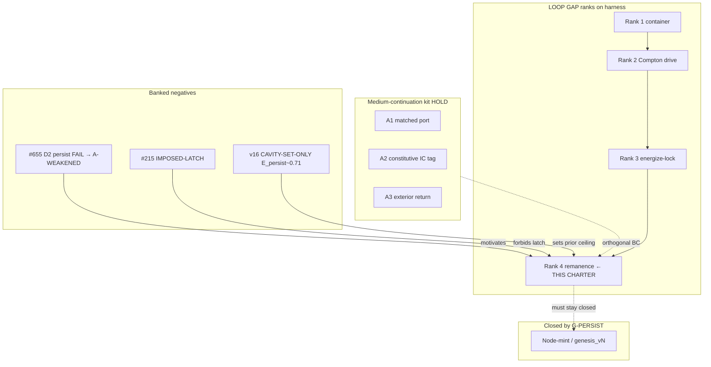

# Remanence R10 on fixed \(N\) — CHARTER (physical picture · circuit · map · analysis)

**Date:** 2026-07-12  
**Authorization:** ★RULED G-PERSIST (`_orchestration/2026-07-12_ave-native-rulings_g-persist_x-ledger.md`) — constitutive remanence **before** node-mint; KEEP-BOTH; no `genesis_v{N}`.  
**Frozen discriminator prereg:** [`2026-07-12_remanence-r10-fixed-n_prereg_FROZEN.md`](2026-07-12_remanence-r10-fixed-n_prereg_FROZEN.md)  
**Register:** AVE substrate + EE (impedance, saturation, dilatation, loop). **Not** SM ferromagnetism-as-ontology, **not** QED pair production, **not** “create a particle.”

**Class:** Architecture / constitutive-DOF discriminator — FIREABLE instrumentation toward LOOP GAP closure. Refuse EMERGENCE-as-mass until P11 lands with ablations.

---

## 0 · One-paragraph charter

Banked genesis D2 (#655 bin ii) showed a fixed-\(N\) pattern on today’s **anhysteretic** engines does not **keep** after drive-off. G-PERSIST says that is a **medium memory** question first: the Level-1 kernel \(S_{\rm eq}(A)=\sqrt{1-A^2}\) has **zero enclosed loop area**, so reactive storage under drive is not mass. Mass, in the plumber register, is the ferrite analogue — **\(B_r\) at \(H=0\)**: nonzero remanence after the drive is removed, with \(\oint H\,dB>0\). This charter freezes a **fixed-\(N\) remanence discriminator** on the existing Rule-14 carrier `loop_gap_harness` rank 4 (VacuumEngine3D + memristive saturation profile), with P11 zero-drive persistence as primary falsifier, mandatory memristive-OFF / latch-ban ablations, and node-mint **closed**.

---

## 1 · Physical picture (substrate)

### 1.1 What the medium is doing

The vacuum is a saturable Cosserat–LC lattice. Local strain amplitude \(A\) softens the constitutive reactance through
\[
S_{\rm eq}(A)=\sqrt{1-A^2}.
\]
That map is **instantaneous and reversible** (Level 1): ramp \(A\) up and down on the same path and the trajectory in \((A,S)\) encloses **no area**. Energy parked in \(L\)/\(C\) under a continuing drive can look “trapped,” but when the drive is removed the envelope should relax — unless a **Level-2 dynamical memory** exists.

Level 2 is the memristive lag of the saturation state itself:
\[
\frac{\mathrm{d}S}{\mathrm{d}t}=\frac{S_{\rm eq}(A)-S}{\tau_{\rm relax}}.
\]
Crossing yield at finite rate can enclose a loop \(\oint S\,\mathrm{d}(\cdot)\). That loop is the substrate’s thixotropic / memristive hysteresis — the candidate **constitutive remanence** DOF (R10).

### 1.2 What “lasting localization” means here

An electron-class object in AVE is a **lasting dilatation / topological structure** on the medium (A1 mass sector), not a QED excitation. For it to be **mass-like**, some internal state must remain after the precursor / pump is gone — zero-drive persistence — analogous to ferrite \(B_r\) when \(H\to 0\).

What has been tried and is **not** remanence (doctrine fool modes):

| Mechanism | Why it is not remanence |
|---|---|
| CVR-SET while drive is on | Reactive \(Q\) under load ≠ \(B_r\) |
| \(\Omega_{\rm freeze}\) IC | Ablatable initial-data memory |
| Snap ledger alone | Dissipation bookkeeping without drive-off isolation |
| `#215` \(S=\min(S,S_{\rm latched})\) | **Imposed latch** — install tautology |
| Pure \(\tau_{\rm relax}\) pinch with \(B_r\to 0\) | Loop may pinch through origin with no remanence |

### 1.3 Why fixed \(N\) (G-PERSIST)

Node birth (\(N\to N+1\)) might eventually matter, but D3 found no leaf that **derives** Compton-scale mint as necessary, and the capability-map build order puts **loop before node-creation**. If remanence never appears on fixed \(N\), that is a fireable negative for (A); it still does not auto-authorize (B).

### 1.4 Channel tag (do not conflate)

| Channel | Role |
|---|---|
| Bulk-longitudinal \(\Gamma_{\rm bulk}\to-1\) | Confinement wall for \(O_1\) dilatation pocket |
| EM-transverse \(Z_0\) | Photon / \(S_{11}\) — not the mass remanence channel |
| µ-sector R2 ferrite bench | EE consistency anchor for B–H language — **parallel**, not identical to bulk-TIR electron channel |

This discriminator is **bulk / harness rank-4** tagged. R2 bench remains optional parallel µ-anchor (not required for PASS).

---

## 2 · Circuit picture (EE mapping)

### 2.1 Five-beat intuition summary (`ave-ee-intuition-summary`)

1. **Substrate:** The Level-1 saturation kernel is a memoryless varactor curve — no \(B_r\). Lasting mass needs a Level-2 dynamical state that remains when drive \(H\) (analogue) is zero.

2. **EE mapping:** Ferrite B–H loop: drive magnetizing field, remove it, measure remanent flux density \(B_r\). Vacuum analogue: drive a localized dilatation / Cosserat structure, remove precursor, measure retained energy / order parameter after quiescence \(t\gg\tau_{\rm relax}\). Translation-circuit: saturable reactor + memristive lag; mass ↔ remanence, not reactive \(Q\).

3. **Prediction & why the number:** P11 floors already frozen in corpus: \(E_{\rm persist}\ge 0.85\), \(\phi_{\rm persist}\ge 0.80\) after pinned quiet window (`P11_E_PERSIST_MIN`, `P11_A_PERSIST_MIN`). These are **certification floors**, not CODATA-injected α. Prior best on cavity-set-only paths: \(E_{\rm persist}\approx 0.71\) — **below** floor (honest fail). Expectation for this charter: **default negative** unless an emergent loop appears; do not install a latch to clear the floor.

4. **Discriminator:**  
   - *form-shared?* Ordinary damped resonator also “persists” briefly — so the discriminator is **survival after \(t\gg\tau_{\rm relax}\)** + **memristive-OFF ablation** (persistence must collapse when Level-2 lag is disabled) + **latch-ban** (no `min(S,S_latched)`).  
   - *already constrained?* Corpus already knows REMANENCE-LANDED never landed — this is a **forward re-fire under G-PERSIST**, not a new SM claim.  
   - *injected?* Floors are prior P11 constants; α must not enter the verdict path.

5. **Intuition hook:** **It’s a ferrite core, not a charged capacitor.** A capacitor holds \(Q\) only while the circuit is arranged to keep voltage; a ferrite keeps \(B_r\) with \(H=0\). Anhysteretic \(S(A)\) is the capacitor curve; remanence is the ferrite leftover.

### 2.2 Circuit schematic (plumber)

```mermaid
flowchart LR
  subgraph drive ["Drive phase"]
    PRE[Precursor / Compton drive]
    VAR[Saturable reactor S_eq(A)]
    PRE -->|energize| VAR
  end

  subgraph level2 ["Level-2 memory candidate"]
    MEM["Memristive lag dS/dt = (S_eq - S)/τ_relax"]
    VAR --> MEM
    LOOP["Enclosed loop ∮ ≠ 0?"]
    MEM --> LOOP
  end

  subgraph quiet ["Quiescence H→0 analogue"]
    OFF[Drive OFF]
    MEM --> OFF
    BR["Retained state ≈ B_r\nE_persist, φ_persist"]
    OFF --> BR
  end

  subgraph falsifiers ["Ablations"]
    MOFF[Memristive OFF]
    LATCH[Ban imposed latch]
    OMEGA[Ω_freeze OFF]
    MOFF -.->|must kill remanence claim| BR
    LATCH -.->|must not fake B_r| BR
    OMEGA -.->|IC ≠ constitutive| BR
  end
```

### 2.3 What the circuit is *not*

- Not an SM ferromagnet model of vacuum.  
- Not a software `S = min(S, S_latched)` clamp (#215 IMPOSED-LATCH).  
- Not “Q ≈ 1/α means remanence” (fool mode #3).  
- Not A2’s projected \(\Omega_{\rm freeze}\) tag (IC heritage ≠ constitutive loop).

---

## 3 · Map (where this sits in the program)



| Neighbor | Relation |
|---|---|
| A1–A3 | Orthogonal: honest **cut of the medium** vs **memory inside the cut** |
| L5×A1 | Deconvolves pad-\(R\) from impedance leak — does not supply \(B_r\) |
| Mass-sector×A1 | Representation limit for close Mode-I pairs — not remanence |
| X-LEDGER | Mass *ledger* functionals in gravity solver — different axis |
| R2 ferrite prereg | Parallel µ-bench; optional; not this discriminator’s PASS criterion |

---

## 4 · Analysis (what would discriminate; what would fake)

### 4.1 Fireable content vs entailed content

| Item | Class |
|---|---|
| Fixed mesh cardinality \(N^3\) invariant | Partly **ENTAILED** (install) — do not bank as remanence |
| \(E_{\rm persist}\), \(\phi_{\rm persist}\) after quiet | **FIREABLE** |
| Rank-4 pass with memristive ON | **FIREABLE** |
| Same battery with memristive OFF → persist collapse | **FIREABLE ablation** (proves Level-2 dependence) |
| Persistence with explicit latch clamp | **DEMONSTRATES install** — bin IMPOSED-LATCH, not remanence |
| Persistence only with \(\Omega_{\rm freeze}\) ON | **IC fool** — not constitutive |

### 4.2 Prior numeric landscape

| Source | \(E_{\rm persist}\) | Verdict |
|---|---:|---|
| P11 floor | \(\ge 0.85\) | Pass bar |
| v16 / cavity-set-only best | \(\sim 0.71\) | FAIL |
| #655 D2 smoke (harness) | \(\sim 0.82\), \(\phi=0\) | FAIL → A-WEAKENED |
| REMANENCE-LANDED | — | **Never landed** |

**Analytic expectation for this charter’s first fire:** bin **OPERATOR-SET-ONLY** or **PERSIST-FAIL** unless a genuine Level-2 mechanism appears. A sudden PASS without ablation survival is a red flag for latch smuggling.

### 4.3 Thin Rule-14 carrier (no fourth engine)

| Piece | Choice |
|---|---|
| Engine | `VacuumEngine3D` via `loop_gap_harness` |
| Rank | `rank_target=4` (`remanence`) |
| Profile | `use_memristive_saturation=True` on PASS path |
| Seeds | Existing `loop_gap_seeds` / photon_lock + bulk density as declared in prereg |
| Doctrine | Advance **ranks**, not `genesis_v{N}` / srs v18+ |
| Platform freeze | srs chiral frozen; harness on K4⊗Cosserat |

### 4.4 Consistency-vs-emergence

- Clearing P11 with a hardcoded ratchet = **CERTIFICATION of the ratchet**, not emergence of mass.  
- Clearing P11 with memristive dynamics + ablation isolation = **candidate emergence** of constitutive remanence — still not automatic “electron manufactured.”  
- Refuse ClaimClass.EMERGENCE for “we have an electron” from this discriminator alone.

### 4.5 Discrimination-check summary

Genuine discriminating legs: **zero-drive long quiet**, **memristive-OFF kill**, **latch-ban**, **Ω-free still allowed only as ablation not as PASS requirement**. Non-discriminating: short ringdown \(Q\), CVR-SET under drive, pad energy loss, IC bias.

---

## 5 · Deliverables and sequencing

| Step | Artifact | Status |
|---|---|---|
| 0 | G-PERSIST ruling | ★RULED (#661 HOLD) |
| 1 | This CHARTER | This file |
| 2 | FROZEN prereg (bins) | Sibling file — freeze-by-push **before any driver** |
| 3 | Driver on `loop_gap_harness` rank 4 | **Not in this commit** |
| 4 | Result + HOLD PR | After driver |

---

## 6 · References (grep-verified anchors)

- `manuscript/ave-kb/common/loop-gap-electron-resonator-closure-doctrine.md` §1–§6  
- `manuscript/ave-kb/common/substrate-hysteresis-index.md` §5b  
- `manuscript/ave-kb/common/engine-capability-map.md` constitutive loop OPEN  
- `src/ave/core/loop_gap_harness.py` rank 4 / P11  
- `research/2026-06-13_spice-cvr-constitutive-loop_result.md` IMPOSED-LATCH  
- `_orchestration/2026-07-12_ave-native-rulings_g-persist_x-ledger.md` G-PERSIST  
- Genesis banked (ii): `research/2026-07-12_genesis-node-birth-discriminator_prereg_FROZEN.md`
