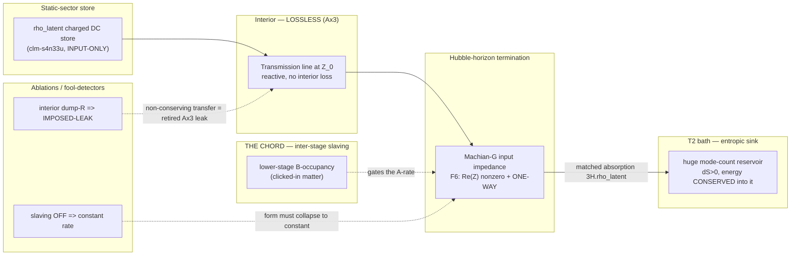

# F6 tier-1 — global two-reservoir ODE ledger (ρ_latent ↔ T2) — CHARTER

**Date:** 2026-07-13
**Class:** charter (draft the discriminator BEFORE any driver) — modeled on the #662 remanence-charter pattern (`research/2026-07-12_remanence-r10-fixed-n_CHARTER.md`: charter doc + frozen bins + fireable-vs-entailed + fool-modes + Ax3 carve). **Charter first; PR DO-NOT-MERGE; driver only after charter review.**
**Grant GO (Q4):** 2026-07-13 — ρ_latent parameterization licensed as INPUT-ONLY at `clm-s4n33u` solidity 0.45.
**Frozen prereg:** downstream sibling file (`research/2026-07-13_f6-tier1-two-reservoir-ledger_prereg_FROZEN.md`) — **not created in this commit**; freeze-by-push BEFORE any driver, gated on this charter's review.

**Sector header (mandatory).** MODE: global bookkeeping **ODE ledger, NOT a field solve** — no `a(t)` evolver exists in the engine; `solve_backreaction` is static-elliptic; the engine has local first-law only, no global ΔE_cryst state object (`manuscript/ave-kb/common/engine-capability-map.md:155`). REGIME: the top-stage cascade port (Machian-horizon termination), at/near the cosmic operating point. PHASE-STATE: a held static store (ρ_latent) draining one-way into the T2 bath across the off-line↔on-line boundary. SECTOR: this is the **A-class (continuous drainage)** behavior of the **local top port** — a static-sector store transferring into a thermal reservoir; it is **NOT** the A1 dilatation-mass sector and **NOT** a Cosserat-winding claim.

**Register:** AVE substrate + EE (two-reservoir exchange, entropic sink, matched-termination absorption, Ax3-lossless interior). **Not** ΛCDM DE-as-fundamental-Λ, **not** QED zero-point energy, **not** a friction/dissipation loss.

---

## 0 · One-paragraph charter

F6 is the **irreversible ε→T2 depletion** primitive — the **DE-tracks-matter chord**, the one ΛCDM-distinct thing AVE could carry and the make-or-break the corpus has never built (`manuscript/ave-kb/vol3/cosmology/ch04-generative-cosmology/dark-energy-latent-heat-definition.md:139,144,146`: F6 = the one ΛCDM-distinct chord, UNBUILT; the `reading-i dQ/dt∝n_matter` chord is ABSENT-INVENTED at `:128`; the one attempt `photon_deplete=True` detonates). **Tier 1 is a GLOBAL TWO-RESERVOIR ODE LEDGER** (ρ_latent ↔ T2 bath): does a one-way, Ax3-legal, conservation-respecting transfer whose rate is **slaved to lower-stage occupancy** produce a DE component that **tracks matter in FORM** — and is that form distinguishable from a bare cosmological constant in the ledger's own observable? **No `a(t)` field solve** — tier 1 books reservoir exchange, nothing more. The scope is **existence + FORM only** (no magnitude matching; the naive ρ_latent value is ~120 OOM over ρ_Λ and that path is rejected canon). **TIER-2** (one X40-class discrete-click demo) is a **separate follow-on gated on this charter's review.**

---

## 1 · Physical picture (substrate)

### 1.1 What the medium is doing — the two reservoirs

The vacuum is a saturable Cosserat–LC lattice that is **continuously crystallizing** at the cosmic frontier. Crystallization has a **latent heat**: finishing a region of substrate into ordered matter releases a held store, ρ_latent — the static sector's fuel (`dark-energy-latent-heat-definition.md:64`: "DE free-store / latent heat | ε | the 'fuel'; consumed at the frontier"). Two reservoirs bracket the process:

- **ρ_latent** — the **source**: the static sector's held store (the latent heat of ongoing crystallization). Numerically SYMBOLIC-ONLY / ABSENT in the corpus; enters here as a Grant-GO'd **input parameter** at `clm-s4n33u` solidity 0.45, build_status "input-only, don't build deeper" (`dark-energy-latent-heat-definition.md:122,136`).
- **the T2 bath** — the **destination**: the huge thermal reservoir (the CMB photon gas is its entropic sink, `dark-energy-latent-heat-definition.md:67`). **Irreversibility comes from its mode-count, not from a nonlinearity** — the reconvergence probability into the source is effectively zero, so an energy-conserving transfer INTO T2 has `dS>0` and is Ax3-COMPLIANT (`dark-energy-latent-heat-definition.md:84-86`, verbatim: "an **energy-conserving one-way TRANSFER** into the huge T2 reservoir ($dS>0$), NOT a friction loss, so it is Ax3-COMPLIANT").

Tier-1 books **exactly this exchange and nothing else**. There is no `a(t)`, no field, no spatial solve: two scalars ρ_latent(t) and E_T2(t), a transfer rate Γ, and a conservation ledger `ρ_latent + E_T2 = const`.

### 1.2 What "DE-tracks-matter" means here

ΛCDM's Λ is a constant: the dark-energy density does not know how much matter exists. **AVE's F6 chord is that the drainage rate is slaved to how much matter has clicked in** — `reading-i`, `dQ/dt ∝ n_matter`, which the corpus tags **ABSENT-INVENTED** (`dark-energy-latent-heat-definition.md:128`). The *frontier* form (`reading-ii`, `Γ = 3H·ρ_latent`) is the corpus default and is FORCED-in-form / ASSERTED-in-rate (`:121,142`); it is **not** the chord. The chord is specifically the **inter-stage slaving**: lower-stage matter occupancy setting the top-port drainage rate, a coupling **no canon site derives** (the Machian integral is spatial, produces G, and moves no energy).

Tier-1's question is deliberately narrow: **does a matter-slaved, Ax3-legal, conservation-respecting drainage produce a DE component whose FORM tracks matter, and is that form distinguishable from a constant in the ledger's own observable?** Nothing about magnitude.

### 1.3 The walked architecture (ruling-grade inputs — Grant-walked 2026-07-13)

These four elements are recorded as **ruling-grade inputs** (the walked map), not canon derivations:

| Element | Identity |
|---|---|
| **Source** | **ρ_latent** — the static sector's held store (latent heat of ongoing crystallization). |
| **Destination** | **the T2 bath** — the huge thermal reservoir; irreversibility from its mode-count, not a nonlinearity. |
| **Transducer / locus** | **the mass envelope** — where the transfer is physically effected. |
| **Door** | **the off-line ↔ on-line boundary** — the gate the transfer passes through. |

### 1.4 Cascade address ★QUARANTINE — Grant-walked RULING-GRADE INPUT, not canon

> **★QUARANTINE TAG.** The following cascade address is a **Grant-walked ruling-grade INPUT (2026-07-13)**, NOT a canon-derived result. It is the physical picture the tier-1 ledger is built to test; it must not be cited elsewhere as established corpus physics. Treat every clause below as premise-under-test.

**F6 = the A-class (continuous drainage) behavior of the LOCAL top port** — the Machian-horizon termination. Canon already prices that port as a **distributed transmission-line input impedance at the Hubble-horizon termination** (`manuscript/ave-kb/common/translation-tables/translation-circuit.md:126`, Machian-G ↔ TL-input-impedance row; re-confirmed at `:335,:410`). **F6 is the claim that the Re(Z) at that termination is nonzero and one-way** — the port has a real, irreversible drainage channel, not a purely reactive/lossless one.

- **The FRW `3H·ρ_latent` rate reads as the matched termination's absorption rate** — the top-stage loaded Q ~ O(1) (matched), which is exactly where the cascade's far end already sits.
- **DE-TRACKS-MATTER = the top port's A-rate slaved to the lower stages' B-occupancy** — how much clicked-in matter loads the envelope sets the top port's drainage rate. **That inter-stage slaving IS the chord**, and it is **precisely what no canon site derives** (the Machian integral is spatial, produces G, and moves no energy; no inter-stage energy coupling exists in canon).

### 1.5 Channel tag (do not conflate)

| Channel | Role |
|---|---|
| Static-sector store ρ_latent → T2 (A-class drainage, LOCAL top port) | **THIS ledger's transfer axis** |
| A1 dilatation-mass tank | Owns rest-mass; **NOT** the F6 drainage source (SECTOR⊥). A finished electron is a LOSSLESS tank, paid latent heat ONCE (`dark-energy-latent-heat-definition.md:65`) — it must not appear as a drain in the ledger (see `electron-no-drain` detector, §4.2). |
| Cosserat-winding (2,3) charge | Owns charge/spin; **NOT** an energy source for the top port. |

This discriminator is **static-sector / top-port** tagged. The A1 and Cosserat sectors appear only as **constraints** (the three hard detectors, §4.2), never as the transfer source.

---

## Ax3 reconciliation (mandatory carve)

*(This carve governs the whole discriminator. The transfer must be **entropic / event-gated, NEVER dissipative**. All cites below re-verified at this PR's base d0037d8f with LaTeX-aware greps.)*

### (i) The Ax3 constraint + the licensed class

Sub-yield, the substrate is **lossless / reactive** (Axiom 3). A legitimate F6 transfer is therefore **not free to be a friction loss**. It must be **either**:

- **(a) an entropic one-way transfer** made irreversible by the T2 reservoir's mode-count — energy conserved, `dS>0`, NOT a friction loss (`dark-energy-latent-heat-definition.md:84-86`, verbatim above). Irreversibility from **reservoir mode-count, not nonlinearity**; **OR**
- **(b) an event-gated discrete minting** — one-way at a click, energy-conserving, X40-class (`research/2026-07-10_x40-ring-closure-transient_result.md:18-20,161`: `f_E=1/10` trapped, flux linkage Λ banks WHOLE, drift `2.2e-16`, minted only at the discrete ring-completion event).

Both are Ax3-COMPLIANT **precisely because neither imports sub-yield dissipation.** The tier-1 ledger's transfer term Γ must be one of these two; any continuous sub-yield loss term is the retired Ax3 leak (§(ii)–(iii)).

### (ii) The amorphous-retirement precedent (address it explicitly)

The **plastic / STZ sub-yield dissipation route FAILED Ax3 and stays RETIRED.** Verbatim, `manuscript/ave-kb/common/substrate-native-terminology.md:62`:

> "✗ 'thixotropic STZ / liquefies / plastic' *as the load-bearing mechanism* — in the lossless sub-yield regime that imports dissipation, which would radiate, contradicting the result."

F6's drainage must **not reconstruct that retired leak under a cosmological name.** Any tier-1 ledger term that is a **continuous sub-yield loss** is the retired Ax3 leak re-imported — regardless of the label "dark energy" pasted on it. (The corpus's own loop taxonomy is the reason: the enclosed hysteresis loop `∮S dr` is **dissipated energy per cycle** and lives at/above yield as a Level-2 memristive channel, `manuscript/ave-kb/common/substrate-hysteresis-index.md:24-25`; sub-yield it must be lossless.)

### (iii) ★NEW FOOL-MODE — the re-imported Ax3 leak

A **LEDGER-CONSISTENT PASS achieved via a continuous sub-yield dissipative transfer** = the retired leak re-imported. It must be classed **IMPOSED-LEAK, not F6-CANDIDATE.**

**Detector — Ax3-legality audit on the transfer term.** For a legitimate PASS, the transfer Γ must be provably (a) entropic-into-T2 (the destination reservoir's energy rises by exactly what the source loses, to ledger tolerance — a **conservation** condition, not a loss) or (b) event-gated (nonzero only at discrete clicks). A transfer term that removes energy from ρ_latent **without depositing the equal amount into E_T2** — i.e. a term proportional to a friction/damping coefficient rather than a reservoir-exchange rate — is a **smuggled sub-yield R**. Verdict: **bin IMPOSED-LEAK.** This detector composes with the FORM tests below: an IMPOSED-LEAK can fake tracking, so the ledger's conservation residual and the transfer's destination-accounting are checked **before** the FORM verdict is read.

### (iv) The DIODE / RECTIFIER class is DEAD — four deaths (do not resurrect a valve)

A one-way *valve* (ideal diode / rectifier / ratchet) is the intuitive way to get irreversibility. It is **dead four ways** in the corpus. The tier-1 ledger must get its arrow from **where the energy goes** (reservoir mode-count) or **a click** (X40), **never** from a valve:

1. **The Ax4 kernel is even-in-A and cannot rectify.** `S(A)=√(1−A²)` is instantaneous, even, memoryless — identical 2nd-order momentum for symmetric and asymmetric drive (`research/2026-06-08_rrad-l-rectification_result.md:67-73`). **⚠ HONESTY SCOPE:** the *direct RUN* null there is **regime-scoped** by the doc's own Rule-12 header (sub-yield-linear shear = a regime where the effect cannot exist, a wrong-regime artifact, `:14,:18`); the mechanism finding (even-in-A ⇒ no rectification) stands as a fact about the kernel, and the **regime-independent** bulk-channel closure ("no `sign(dρ̄/dt)` memory ⇒ cannot rectify a symmetric cyclic drive") is **dead-by-derivation on UNMERGED branch `5969bda1`** (cited by branch+commit, not a HEAD path). Carry both: the kernel cannot rectify, and the load-bearing bulk closure is off-main.

2. **Any true rectifying loop is Level-2 memristive = dissipative.** `manuscript/ave-kb/common/substrate-hysteresis-index.md:96`: "**any** rectification / latching / path-memory requires the **Level-2 (memristive)** dynamics, which the smooth √(1−A²) kernel does not implement on its own"; the enclosed loop `∮S dr` is dissipated energy per cycle (`:24-25`). So "lossless + rectifier" is a **contradiction in the corpus's own loop taxonomy** — a rectifier is exactly the retired Ax3 leak of §(ii).

3. **The diode threshold V_f is FREE, not forced.** `research/2026-07-08_p4-forward-voltage-threshold_RESULT.md:19,26,52-56`: "V_f is FREE — no canonical scale forces a forward-voltage dead zone"; the Ax4 kernel is analytic at the origin and loads `∝½A²` continuously (`:26`), the lattice dispersion is gapless (`:30-33`), and **no candidate row satisfies the FORCED bin** (`:52-56`). A diode's defining feature — a forward-voltage dead zone — has no substrate scale.

4. **Chirality-ratchet-as-arrow is REFUTED — do not reopen.** `dark-energy-latent-heat-definition.md:89-90,99-100`, verbatim: "Chirality is a PARITY selector, not the arrow — and 'chirality-ratchet as arrow' is REFUTED"; "**No future reader should re-introduce the chirality-ratchet as the cosmological arrow.**" An ideal-diode / directed-ratchet framing of the drainage risks re-opening this retracted slot.

### (v) The v4 detonation (do not repeat it)

Any **continuous trilinear-potential transfer is the v4 detonation.** `src/ave/core/crystal_graft_v4.py:159-167` (verbatim comment; **⚠ line-drift flag:** the brief cited `:160-166`, the verbatim block spans **:159-167** at this HEAD): the full trilinear `H=κ̃∫gV[w·∇×ω]` is "an **INDEFINITE Hamiltonian** (linear in each field, unbounded below) so the discrete dynamics **PUMP / DETONATE**." The **v5 spec** is the antidote: **bounded, norm-preserving, source-depletion-NOT-reaction** (`research/2026-06-10_bemf-feedback-smoke_result.md:92-94`, §8, verbatim: "The missing primitive is SOURCE DEPLETION, not reaction … a **norm-preserving (bounded) photon→ω helicity-transfer** coupling — an orthogonal field-space rotation … rather than a trilinear potential"). **Tier-1's ledger must not smuggle a trilinear pump back in through the ODE** — the transfer term must be a bounded reservoir-exchange rate, never a product of three growing amplitudes.

### (vi) Licensed mechanisms only (use ONE of these three)

1. **Entropic mode-count transfer** (arrow-of-time class) — energy-conserving one-way transfer into T2, `dS>0`, Ax3-compliant (`dark-energy-latent-heat-definition.md:84-86`). Irreversibility from reservoir mode-count.
2. **X40-class discrete topological minting** — one-way at the click, energy-conserving, consistency-class (`research/2026-07-10_x40-ring-closure-transient_result.md:18-20,161`; Λ banked whole, drift `2.2e-16`).
3. **The skew-Hermitian circulator** — orthogonal field-space rotation, conserves + transfers, but **magnitude imposed** (`src/ave/core/cross_sector_coupling.py:137-141`: "one-way circulation needs the 3-port loop, magnitude imposed"; PR #321). *Use only with the imposed-magnitude caveat explicit — an imposed magnitude is an echo, not a chord.*

---

## 2 · Circuit picture (EE mapping)

### 2.1 Five-beat intuition summary

1. **Substrate:** The crystallization frontier releases latent heat ρ_latent. It must go somewhere; the only Ax3-legal destination is an **entropic transfer into T2's modes** (`dS>0`, conserved, not friction). The interior stays lossless; the arrow lives at the reservoir.

2. **EE mapping:** A charged **DC store** (ρ_latent) feeds a **lossless transmission line** (the interior, at `Z_0`) that is **terminated at the Hubble horizon**. Canon prices that termination as the **Machian-G input impedance** (`translation-circuit.md:126`). **F6 = the claim that `Re(Z)` at that termination is nonzero and one-way** — a *matched termination into a huge cold bath*, not a lossy element in the pipe. The drainage rate is a **controlled source gated by lower-stage matter occupancy** — the slaving is the chord.

3. **Prediction & why the form:** The observable is the **FORM** of the DE component: does `ρ_DE(t)` track `n_matter(t)` (chord, `reading-i` `dQ/dt∝n_matter`, ABSENT-INVENTED `dark-energy-latent-heat-definition.md:128`) or the frontier/expansion geometry (default `reading-ii` `Γ=3H·ρ_latent`, matched-absorption rate, `:121,142`)? **No magnitude** — the naive ρ_latent value is ~120 OOM over ρ_Λ and that path is rejected canon (`cosmological-constant-closure.md:8,58-62`: naive mode-count "still gives a too-large naive answer"; DE reframed as latent heat, not zero-point energy).

4. **Discriminator:**
   - *form-shared?* A bare cosmological constant **also** yields a DE component — so the discriminator is the **slaving-OFF ablation** (the drainage rate goes constant ⇒ the DE form must collapse to a constant) **plus** a ledger observable that separates tracking from constant. If the form is degenerate even with slaving ON, that is bin (iii) FORM-DEGENERATE.
   - *already constrained?* The corpus already tags `reading-i` **ABSENT-INVENTED** — this is a **forward existence-of-FORM test**, not a new realized-result claim.
   - *injected?* ρ_latent is **input-only** (`clm-s4n33u`, solidity 0.45); it must **not** be tuned to hit ρ_Λ. The verdict path reads FORM, never magnitude.

5. **Intuition hook:** **It's a matched termination into a huge cold bath, not a resistor burning power in the pipe.** A dump resistor inside the line would be the retired STZ leak (IMPOSED-LEAK); a matched termination transfers the power *out* into the reservoir's mode-count, and the pipe stays lossless (Ax3). And the drainage isn't a **diode** (dead four ways) — it's a **controlled source keyed on how much matter has clicked in**. Take that control away and the bath still absorbs at a constant matched rate — indistinguishable from Λ.

### 2.2 Circuit schematic (plumber)



### 2.3 What the circuit is *not*

- **Not a lossy interior resistor.** A dump-R inside the line is the retired STZ/plastic sub-yield leak (`substrate-native-terminology.md:62`) → bin IMPOSED-LEAK.
- **Not a diode / rectifier valve.** Dead four ways (§(iv)); the arrow comes from mode-count or a click, never a valve.
- **Not a trilinear pump.** `H=κ̃∫gV[w·∇×ω]` detonates (`crystal_graft_v4.py:159-167`); the transfer term is a bounded reservoir-exchange rate, not a product of three growing amplitudes.
- **Not an `a(t)` Friedmann field solve.** No field, no scale factor — two scalars and a conservation ledger (`engine-capability-map.md:155`: `solve_backreaction` static-elliptic, no `a(t)`).
- **Not a magnitude match to ρ_Λ.** The 10^122 path is rejected canon (`cosmological-constant-closure.md:8,58-62`).

---

## 3 · Map (where this sits in the program)

```mermaid
flowchart TB
  subgraph landed ["LANDED (reversible sibling)"]
    BR["#86 two-way back-reaction<br/>solve_backreaction, static-elliptic<br/>REVERSIBLE self-gravitation"]
  end

  subgraph proofs ["Existence proofs the ledger reuses"]
    X40["X40 ring-closure<br/>one-way at click + Lambda conserved (2.2e-16)"]
    ARROW["arrow-of-time T2 sink<br/>entropic one-way transfer dS>0"]
  end

  subgraph graves ["Closed / dead (do not resurrect)"]
    V4["v4 trilinear = DETONATION"]
    DIODE["diode/rectifier class<br/>dead 4 ways"]
    STZ["plastic/STZ sub-yield loss<br/>RETIRED (fails Ax3)"]
    RATCHET["chirality-ratchet arrow<br/>REFUTED, do-not-reopen"]
  end

  subgraph this ["THIS CHARTER — F6 tier-1"]
    T1["two-reservoir ODE ledger<br/>rho_latent <-> T2, slaved rate<br/>EXISTENCE + FORM only"]
  end

  subgraph next ["Gated follow-ons"]
    PREREG["FROZEN prereg (bins+tol)<br/>freeze-by-push before driver"]
    DRIVER["tier-1 driver (ODE ledger)"]
    T2DEMO["TIER-2: one X40-class<br/>discrete-click demo"]
  end

  BR -->|F6 = the IRREVERSIBLE sibling| T1
  X40 -->|licensed mechanism (b)| T1
  ARROW -->|licensed mechanism (a)| T1
  V4 -.->|must not smuggle in| T1
  DIODE -.->|must not resurrect| T1
  STZ -.->|IMPOSED-LEAK fool-mode| T1
  RATCHET -.->|risks reopening| T1
  T1 --> PREREG --> DRIVER --> T2DEMO
```

| Neighbor | Relation |
|---|---|
| **#86 two-way back-reaction** (LANDED 2026-06-29) | The **reversible** self-gravitation loop; F6 is its **irreversible** sibling — the DE-tracks-matter chord (`engine-capability-map.md:152,155`). |
| **X40 ring-closure minting** | Existence proof that one-way-at-an-event coexists with exact conservation (Λ drift `2.2e-16`) — licensed mechanism (b); the tier-2 demo carrier. |
| **arrow-of-time T2 sink** | The entropic one-way transfer (`dS>0`) — licensed mechanism (a); the tier-1 default. |
| **DE lifecycle leaf** (`dark-energy-latent-heat-definition.md`) | Home leaf: `reading-i` (chord, ABSENT-INVENTED) vs `reading-ii` (frontier, default). This charter does **not** edit it (KB-leaf edits gated). |
| **v4/v5 graft** | Detonation vs bounded spec — the fork the ledger's transfer term must land on the v5 side of. |
| **TIER-2 (X40 demo)** | Separate follow-on, gated on this charter's review — not in scope here. |

---

## 3 · Map (where this sits in the program)

<!-- SECTION-3 -->

---

## 4 · Analysis (what would discriminate; what would fake)

### 4.1 Fireable content vs entailed content

| Content | Class |
|---|---|
| Reservoir conservation (`ρ_latent + E_T2` invariant to machine precision) | Partly **ENTAILED** (ledger construction) — **do not bank as the chord** |
| The top-port A-rate **slaved to lower-stage B-occupancy** | **FIREABLE** — *this is the chord* |
| DE-component **FORM** vs a bare cosmological constant in the ledger observable | **FIREABLE** |
| Ablation: slaving OFF → DE form collapses to constant | **FIREABLE ablation** (isolates the inter-stage coupling from the frontier form) |
| ρ_latent magnitude vs ρ_Λ | **OUT OF SCOPE** — not measured, not fit (§4.4) |

### 4.2 Hard constraints — three named detectors

Each of the three Grant-walked hard constraints fires on a **specific computed quantity** in the ledger. All three are checked **before** the FORM verdict is read.

- **`bias_invariance` detector — (bias ≠ release).** The R-A operating-point **bias must be untouched by the release mechanism**; the drainage cannot move the bias point. **Computed quantity:** the operating-point bias parameter recorded with the release channel **ON vs OFF**; `|Δbias|/bias` must be `≤ tol_bias`. A nonzero shift ⇒ the drainage is riding the bias, not a clean top-port A-channel ⇒ **FAIL**.
- **`electron_store_conservation` detector — (electron-no-drain).** The port **must not drain its own transducer** (electron stability). **Computed quantity:** the A1-tank energy time-series `E_A1(t)` while top-port drainage is active — it must be flat (`|dE_A1/dt| ≤ tol_A1`, `Q→∞` preserved). A finished electron paid its latent heat ONCE and is a lossless tank (`dark-energy-latent-heat-definition.md:65`); if `E_A1` decays, the ledger is draining the electron ⇒ **FAIL**.
- **`muon_channel_separability` detector — (muon fence).** The muon **loads T2 but does not decay by that channel**. **Computed quantity:** the muon's booked decay rate with the T2-loading term **ON vs OFF** — it must be invariant (`|Δτ_μ⁻¹| ≤ tol_μ`). If loading the bath changes the muon lifetime in the ledger, the T2-loading channel and the decay channel are cross-wired ⇒ **FAIL**. (T2 loading is separable from the muon's actual decay route.)

### 4.3 Fool-modes — each with a named detector

| Fool-mode | What it fakes | Named detector (computed quantity that fires it) |
|---|---|---|
| **IMPOSED-LEAK** (§iii) | tracking via a continuous sub-yield dissipative transfer | **Ax3-legality / destination audit** — `ρ_latent` loss must equal `E_T2` gain to `tol_cons`; a friction/damping term removes energy without depositing it ⇒ IMPOSED-LEAK, not F6. |
| **TRILINEAR-PUMP** (v4) | transfer via an indefinite-Hamiltonian pump | **Bounded-norm audit** — total ledger energy must not show an unbounded/monotone runaway excursion (the `H_bel`/`H_photon` detonation signature, `crystal_graft_v4.py:159-167`); the transfer term must be a bounded reservoir-exchange rate, never a product of three co-growing amplitudes. |
| **MAGNITUDE-TUNE** (10^122 trap) | a "match" to ρ_Λ | **Input-provenance audit** — the `ρ_latent` value in the run must be **byte-identical** to the frozen input (`clm-s4n33u`); any adjustment toward ρ_Λ in the verdict path fires. The 10^122 path is rejected canon (`cosmological-constant-closure.md:8,58-62`). |
| **SLAVING-DEGENERACY** (→ bin iii) | tracking that is really a time-parametrization artifact | **Slaving-OFF ablation** — `H(t)` and `n_matter(t)` are both monotone in cosmic time, so the pure frontier form `Γ=3H·ρ_latent` (no inter-stage coupling) can *look* like it tracks matter. Set the B-occupancy coupling to zero; if the DE-form observable is **indistinguishable** ON vs OFF within `tol_form`, the apparent chord is degeneracy ⇒ **bin FORM-DEGENERATE**. |
| **DIODE-RESURRECTION** | one-way-ness via a valve | **Mechanism-class audit** — the transfer term must be one of the three licensed mechanisms (§vi); any `V_f`-like dead-zone threshold, rectifying nonlinearity, or `sign(rate)`-dependent asymmetry fires (dead four ways, §(iv)). |

### 4.4 Scope lock (CC-honest, binding)

- **Existence + FORM of DE-tracks-matter ONLY.** Tier-1 asks whether a matter-slaved, Ax3-legal, conservation-respecting drainage produces a DE component whose **form** tracks matter — nothing about its **magnitude**.
- **NO magnitude matching.** The naive `ρ_latent` value is ~120 OOM over ρ_Λ; the **10^122 trap is rejected canon** (`cosmological-constant-closure.md:8,58-62`). The charter must **not** attempt to match the ρ_latent magnitude to ρ_Λ.
- **ρ_latent = Grant-GO'd 2026-07-13, INPUT-ONLY.** It enters at `clm-s4n33u`, solidity 0.45, build_status "input-only, don't build deeper" (`dark-energy-latent-heat-definition.md:122,136`). Use it as an input parameter; do **not** deepen the ρ_latent / ΔE_cryst derivation.
- **Consistency-vs-emergence class = CONSISTENCY (ceiling).** Tier-1's DE-tracks-matter FORM, *if it exists*, is at best a **CONSISTENCY / MANIFESTATION**-class demonstration — the ledger is *constructed* to book the transfer, so a form appearing is not EMERGENCE. Per the home leaf's own tag (`dark-energy-latent-heat-definition.md:113`), the AVE-distinct content is the DEFINITION / MECHANISM; the ρ_Λ value is ECHO / CONSISTENCY. The chord only becomes fireable-real if the slaving coupling `k` + response are **derived from `{ℓ_node, α, G}`** (F6 gate 3, `:156`) — which tier-1 does **NOT** do (ρ_latent is input-only). **Refuse any EMERGENCE headline from tier-1.**
- **ave-canonical-source discipline.** Any numerical constant the downstream driver references (`H`, `G`, tolerances) **imports from `src/ave/core/constants.py` semantics** or is declared an engineering-choice in the FROZEN prereg — **no hardcoded value is presented as canonical in this charter.** The only physics numbers named here are cited to their canonical source (`ρ_latent` SYMBOLIC-ONLY input; `Γ=3H·ρ_latent` form; `10^122` framing at `cosmological-constant-closure.md:8`).

### 4.5 Frozen bins (tier-1) — freeze PRE-RUN, by push, before any driver

- **(i) LEDGER-CONSISTENT.** The two-reservoir ledger conserves (`ρ_latent + E_T2` invariant to `tol_cons`), the transfer is Ax3-legal (entropic/event-gated, passes the §4.3 IMPOSED-LEAK / TRILINEAR-PUMP / DIODE-RESURRECTION detectors), all three §4.2 hard detectors pass, and the DE component's **form tracks matter distinguishably from a constant** (survives the slaving-OFF ablation) — **the DE-tracks-matter FORM exists.**
- **(ii) LEDGER-VIOLATES-CONSERVATION.** The ledger fails to conserve (`ρ_latent + E_T2` total drifts beyond `tol_cons`), **or** the only transfer that produces tracking is dissipative — **FAIL** (and if dissipative, it is the §(iii) / §4.3 **IMPOSED-LEAK** fool-mode, not F6).
- **(iii) FORM-DEGENERATE.** The ledger runs and conserves, but **DE-tracks-matter is indistinguishable from a cosmological constant in the ledger's observable** (the slaving-OFF ablation does not change the DE-form observable within `tol_form`) — the form is degenerate; F6's chord does not resolve at tier-1. **★This is a LEGITIMATE outcome that CLOSES the interior program — a real negative on the FORM question, NOT an instrument gap and NOT a failure to be rescued.** Per Rule 11 honest closure: if the ledger lands here, record the falsification, name the degeneracy mechanism (`H(t)` and `n_matter(t)` co-monotone in cosmic time), and close the tier-1 interior branch — the chord, if it lives anywhere, then lives only in the tier-2 discrete demo or the forward observable (DESI/Euclid DE-vs-matter cross-correlation, `dark-energy-latent-heat-definition.md:159`), not in the interior ledger.

### 4.6 Freeze discipline statement

- **Bins frozen PRE-RUN by push** in the downstream FROZEN prereg — before any driver exists.
- **No dropped criteria post-hoc.** The three bins + the five §4.3 detectors + the three §4.2 hard detectors are the complete adjudication set; none is dropped to convert a ❌ to a ✅ (Rule 11).
- **Slaving-OFF ablation is the primary discriminator** for the chord vs bin (iii); it must run in every battery.
- **No debug-toward-rescue.** If the ledger lands in bin (ii) or (iii), that is the discipline working at full strength: record the negative, name the mechanism, close the branch. A sudden bin (i) PASS that appears only after the transfer term is re-shaped is a red flag for a smuggled leak or pump — re-run the §4.3 detectors before banking.
- **Substitution-not-retraction (Rule 12).** If a later result falsifies a premise of this charter, the charter body is preserved and a dated 🔴 header is added; the slot is not silently refilled.

---

## 5 · Deliverables and sequencing

<!-- SECTION-5 -->

---

## 6 · References (grep-verified anchors — 2026-07-13, at base d0037d8f)

<!-- SECTION-6 -->
